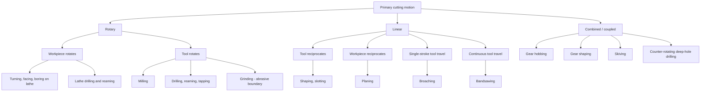
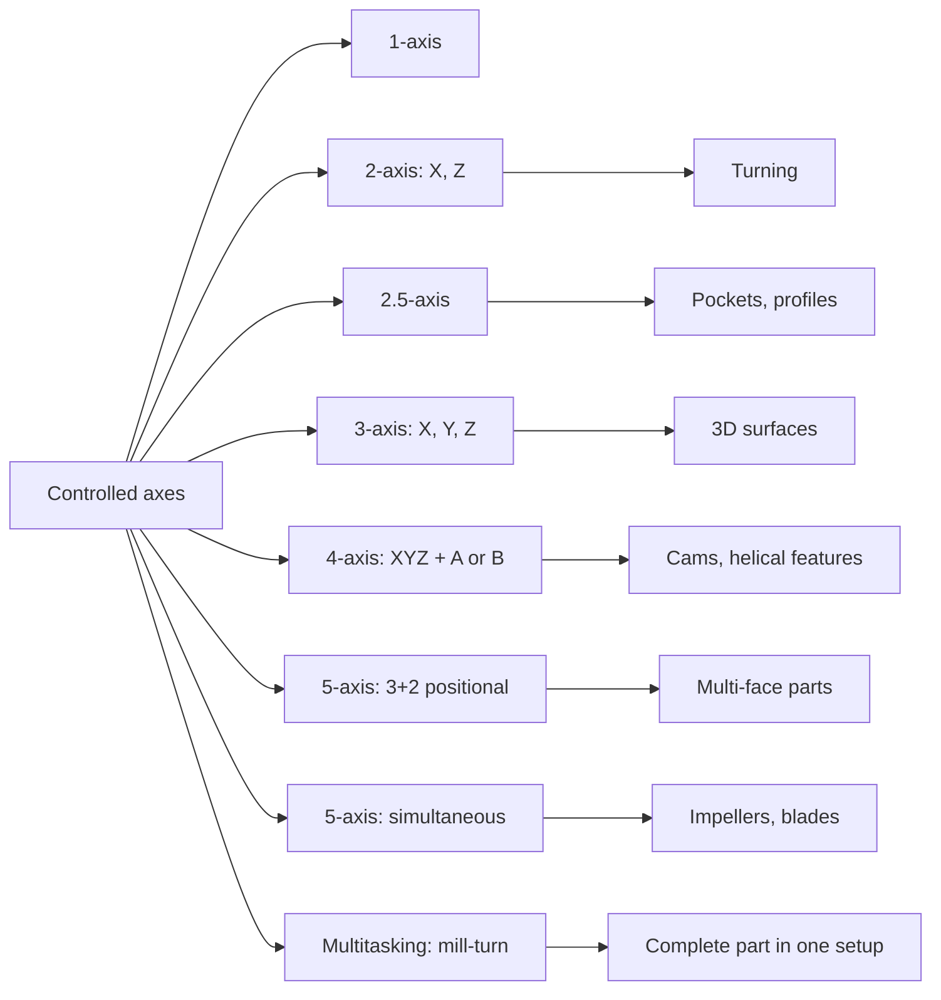
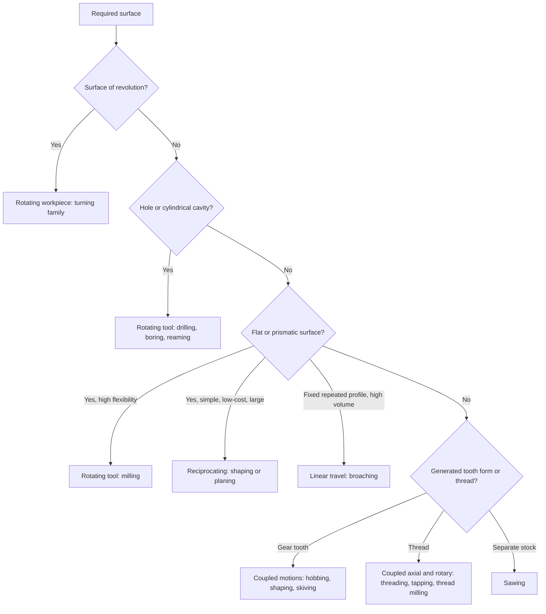

## Classification by Relative Tool-Workpiece Motion

### Overview

Every conventional machining process is produced by a **relative motion** between a cutting tool and a workpiece. That relative motion is decomposed into two fundamental components:

- **Primary (cutting) motion:** the motion that brings the cutting edge through the material and determines the **cutting speed** $v_c$. It consumes most of the power.
- **Secondary (feed) motion:** the motion that continually presents new material to the cutting edge so the cut is sustained across the surface. It determines the **feed** and, together with the primary motion, the **resultant cutting motion**.

Additional motions (positioning, indexing, depth-setting, and generating motions) support these two.

The kinematic classification asks: *Which body carries the primary motion, which carries the feed, what is the path of each (rotary, linear, or curvilinear), and how are they coordinated?* Because surface geometry is a direct consequence of these motions, this classification is the most fundamental way to organize conventional machining and explains why so many process families appear as variations of a small set of kinematic patterns.

**Key Points**

- The **generatrix** (the curve traced by the cutting edge or point) and the **directrix** (the path along which the generatrix moves) define the machined surface. Kinematics determines which of them is produced by tool geometry and which by machine motion.
- The **resultant cutting velocity** is the vector sum of the primary and feed velocities; because $v_f \ll v_c$ in most processes, the resultant is close to $v_c$ in magnitude but differs in direction by the **feed motion angle** $\eta$.
- Two motions are *independent* when they are separately controlled, and *coupled (dependent)* when a fixed ratio is kept between them (threading, gear generating, helical milling).
- Modern CNC machines blur the boundary by creating arbitrary tool paths, but the underlying kinematic categories still apply to each individual operation.

### Fundamental Kinematic Vectors

The velocity of the cutting point relative to the workpiece is

$$\vec{v}_e = \vec{v}_c + \vec{v}_f$$

with magnitude and direction

$$v_e = \sqrt{v_c^{2} + v_f^{2} + 2\, v_c\, v_f \cos\varphi}, \qquad \tan\eta = \frac{v_f \sin\varphi}{v_c + v_f \cos\varphi}$$

where $\varphi$ is the angle between the cutting-speed and feed-speed directions (the **feed motion angle** is the angle between the cutting direction and the resultant direction). Cases:

| Process | Angle $\varphi$ between $\vec{v}_c$ and $\vec{v}_f$ | Consequence |
| --- | --- | --- |
| Longitudinal turning | 90° | $v_e = \sqrt{v_c^2 + v_f^2}$; $\eta$ is very small |
| Facing | 90° | Same relation; $v_c$ falls as diameter falls |
| Drilling | 90° | Feed axial, cutting tangential |
| Shaping/planing (cutting stroke) | 90° | Feed is intermittent, between strokes |
| Broaching | Feed built into tool rise | $v_f$ effectively zero as a machine motion |
| Milling (varies) | Angle varies with tooth position | Chip thickness varies within an engagement |

**Example**

Longitudinal turning at $v_c = 150\ \text{m/min}$ with $f = 0.25\ \text{mm/rev}$ at $n = 600\ \text{rev/min}$ on a 40 mm diameter:

$$v_f = f\, n = 0.25 \times 600 = 150\ \text{mm/min} = 0.15\ \text{m/min}$$

$$v_e = \sqrt{150^2 + 0.15^2} \approx 150.00005\ \text{m/min}$$

$$\eta = \arctan\!\left(\frac{0.15}{150}\right) = 0.057^\circ$$

This confirms that the feed motion has negligible effect on the resultant speed for typical turning, though it matters for clearance geometry at very high feeds or with small work diameters (for example, threading and coarse-feed turning), where the working clearance angle is reduced by $\eta$.

### Classification by Primary Motion

The primary motion can be carried by the workpiece, by the tool, or split between them.

| Primary motion | Carrier | Path type | Typical processes |
| --- | --- | --- | --- |
| Rotation of workpiece | Workpiece | Rotary | Turning, boring on a lathe, facing, threading on a lathe, drilling on a lathe |
| Rotation of tool | Tool | Rotary | Milling, drilling, reaming, tapping, boring (rotating spindle), grinding |
| Reciprocation (linear) of tool | Tool | Linear, alternating | Shaping, slotting, hacksawing |
| Reciprocation (linear) of workpiece | Workpiece | Linear, alternating | Planing |
| Linear travel of tool (single stroke) | Tool | Linear | Broaching (push or pull) |
| Continuous linear tool travel | Tool | Linear, continuous | Bandsawing |
| Combined rotations (tool and workpiece) | Both | Rotary, coupled | Gear hobbing, gear skiving, counter-rotation gun drilling |

### Classification by Feed Motion

The feed motion also has a carrier, a path, and a relationship to the primary motion.

| Feed characteristic | Categories | Examples |
| --- | --- | --- |
| Carrier | Tool feeds; workpiece feeds; both | Lathe carriage (tool); milling table (workpiece); gantry mills (tool); machining centers (mixed) |
| Direction relative to workpiece axis | Longitudinal, transverse (radial), oblique, contour | Straight turning, facing, taper turning, profile turning |
| Continuity | Continuous vs. intermittent | Turning, drilling (continuous); shaping, planing (intermittent, between strokes) |
| Source | Machine-generated vs. tool-built-in | Lathe leadscrew (machine); broach tooth rise (tool) |
| Coupling with primary motion | Independent vs. coupled | Plain turning (independent); threading (coupled, one lead per revolution) |
| Units | Per revolution ($f$), per stroke, per tooth ($f_z$), per time ($v_f$) | Turning mm/rev; milling mm/tooth; shaping mm/stroke |

Definitions for feed in different process families:

$$v_f = f\, n \quad \text{(turning, drilling)}$$

$$v_f = f_z\, z\, n \quad \text{(milling)}$$

$$f_{stroke} = \text{advance per cutting stroke} \quad \text{(shaping, planing)}$$

### Classification by Path Geometry (Generatrix and Directrix)

The machined surface is created as a **generatrix** (a generating curve) moves along a **directrix** (a guiding curve). Each can be produced in one of four ways.

| Method | Description | Example |
| --- | --- | --- |
| **Tracing** | Path produced by the point motion of the cutting edge | Turning a taper with the carriage path |
| **Forming** | Curve reproduced by the tool profile | Form turning, form milling |
| **Generating (enveloping)** | Curve created as the envelope of successive tool positions with coupled motions | Gear hobbing, gear shaping |
| **Following (copying)** | Path guided by a template or CNC program | Copy turning, CNC contouring |

Surface formation therefore combines two curves, and the classification of a process depends on how each is produced:

| Surface | Generatrix produced by | Directrix produced by | Process |
| --- | --- | --- | --- |
| Cylinder (external) | Tracing (tool point) | Rotation of workpiece | Straight turning |
| Plane (face turning) | Tracing | Radial feed | Facing |
| Plane (peripheral milling) | Forming or tracing (cutter periphery) | Linear table feed | Slab milling |
| Gear tooth flank | Generating (enveloping) | Coupled rotations | Hobbing |
| Hole | Forming (drill point and lips) | Axial feed | Drilling |
| Screw thread | Forming (tool profile) | Helical, coupled rotation and translation | Thread cutting |

### Classification by Degree of Coordination

#### Independent Motions

The primary and feed motions are separately controlled with no fixed ratio; the operator or program sets each separately.

- Straight turning
- Peripheral and face milling (table feed independent of spindle speed, though the feed per tooth is derived from both)
- Drilling (feed per revolution is a selected parameter)

#### Coupled (Dependent) Motions

A fixed ratio is maintained between two or more motions. The coupling is done by a gear train, lead screw, cam, or an electronic gearing (CNC synchronization).

| Process | Coupling condition |
| --- | --- |
| Thread cutting on lathe | Axial travel per spindle revolution equals the lead $L_d = k\,P$ |
| Tapping | Axial feed per revolution equals the pitch $P$ |
| Gear hobbing | Blank rotation is a fixed fraction of hob rotation: $n_w = n_h\,k/N$ |
| Gear shaping | Cutter and blank rotate in a fixed ratio with a rolling motion |
| Thread and helical milling | Axial advance per orbital turn equals the pitch or helix pitch |
| Cam and helical flute milling | Workpiece rotation is coupled to linear travel |

**Example (Gear Hobbing Coupling)**

A single-start hob ($k = 1$) cuts a 36-tooth spur gear at $n_h = 180\ \text{rev/min}$:

$$n_w = \frac{180 \times 1}{36} = 5\ \text{rev/min}$$

The hob must also advance along the blank axis (axial feed) and, for helical gears, a differential motion is superimposed on the blank rotation to produce the helix. The required coupling can be realized mechanically with a change-gear train or electronically with a CNC axis relationship.

**Example (Thread Coupling)**

Cutting an M12 × 1.75 thread at 250 rev/min requires an axial feed

$$v_f = P\, n = 1.75 \times 250 = 437.5\ \text{mm/min}$$

If the coupling is lost by even a fraction of a revolution, the result is a scrapped thread (pitch or flank error).

### Classification by Motion Continuity

| Type | Definition | Processes | Effect |
| --- | --- | --- | --- |
| Continuous cutting | The edge remains in the cut | Turning, drilling, reaming, tapping | Steady forces, steady thermal load |
| Interrupted cutting (cyclic entry/exit) | Each edge enters and leaves the cut | Milling, sawing, hobbing | Impact loading and thermal cycling |
| Intermittent cutting (stroke-based) | Cutting on the working stroke only; idle return | Shaping, planing, slotting, hacksawing | Non-productive return time; shock at each stroke start |
| Single-pass (progressive) | The tool completes the cut in one traverse | Broaching | High productivity; large total force |

For **stroke-based processes**, the time efficiency is often expressed by the ratio of cutting to return speed. For a shaper with cutting speed $v_c$ and return speed $v_r$, the **quick-return ratio** is

$$Q = \frac{v_r}{v_c} = \frac{t_c}{t_r}$$

and the number of double strokes per minute $N_s$ relates to the average cutting speed via

$$v_{avg,c} = \frac{N_s\, L_s (1 + Q)}{1000} \quad [\text{m/min},\ L_s \text{ in mm}]$$

where $L_s$ is the stroke length (this form assumes the cycle time is divided as $t_c + t_r = 1/N_s$ and that the cutting stroke occupies the time fraction $Q/(1+Q)$; treat it as an idealized relation [Inference: real mechanisms have non-uniform velocity during a stroke]).

**Example**

A shaper with stroke length $L_s = 300\ \text{mm}$ and $N_s = 40$ double strokes per minute, with $Q = 2$ (the cutting stroke takes two thirds of the cycle... corrected below to a consistent definition).

Using the definition $Q = t_c/t_r = 2$: the cutting stroke takes $t_c = \tfrac{2}{3}\,(1/N_s)$ and the return takes $t_r = \tfrac{1}{3}\,(1/N_s)$. The mean cutting speed is

$$v_{avg,c} = \frac{L_s}{t_c} = \frac{0.300\ \text{m}}{\tfrac{2}{3} \times \tfrac{1}{40}\ \text{min}} = \frac{0.300}{0.016667} = 18\ \text{m/min}$$

The return stroke is faster by the ratio of times, giving a mean return speed of 36 m/min. Note that a quick-return mechanism usually gives $t_c > t_r$ (the cutting stroke is the slower one), so $Q > 1$ under this definition; the earlier general expression should be read with $Q$ defined consistently in any given text, because some sources define the ratio inversely.

### Classification by Number and Type of Controlled Axes

| Class | Description | Typical machines |
| --- | --- | --- |
| Single-axis | One controlled motion; feed by hand or fixed | Drill press, simple broaching machine |
| Two-axis | Two coordinated linear axes (X, Z) | CNC lathe |
| 2.5-axis | X and Y interpolated; Z stepped between layers | Simple machining center operations |
| Three-axis | X, Y, Z simultaneous | Machining center, 3-axis mill |
| Four-axis | Three linear plus one rotary (A or B) | Horizontal machining center with indexing table, cam milling |
| Five-axis (3+2 positional) | Two rotary axes indexed, then 3-axis cutting | Multi-face machining in one setup |
| Five-axis simultaneous | Three linear plus two rotary moving together | Impeller, blisk, turbine blade machining |
| Multi-tasking (mill-turn) | Spindle rotation (C axis), X, Y, Z, B, sub-spindle | Turn-mill centers |

Rotary axes are designated by convention around the linear axes: **A** about X, **B** about Y, **C** about Z.

### Process Families by Kinematic Signature

| Process | Primary motion | Feed motion | Coupled? | Cut type |
| --- | --- | --- | --- | --- |
| Turning | Workpiece rotation | Tool linear (axial or radial) | No (except threading) | Continuous |
| Facing | Workpiece rotation | Tool radial | No | Continuous |
| Threading (lathe) | Workpiece rotation | Tool axial at lead per revolution | Yes | Continuous |
| Boring | Workpiece rotation (lathe) or tool rotation | Tool axial | No | Continuous |
| Drilling | Tool rotation (or workpiece) | Tool axial | No | Continuous |
| Reaming | Tool rotation | Tool axial | No | Continuous |
| Tapping | Tool rotation | Axial at pitch per revolution | Yes | Continuous |
| Peripheral milling | Tool rotation | Workpiece linear | No | Interrupted |
| Face milling | Tool rotation | Workpiece linear | No | Interrupted |
| End milling | Tool rotation | Workpiece or tool multi-axis | No | Interrupted |
| Shaping | Tool reciprocation | Workpiece intermittent, between strokes | No | Intermittent |
| Planing | Workpiece reciprocation | Tool intermittent, between strokes | No | Intermittent |
| Slotting | Tool reciprocation (vertical) | Workpiece (table) | No | Intermittent |
| Broaching | Tool linear travel | Built into tool tooth rise | Built-in | Single pass |
| Sawing | Tool linear or rotary | Tool or workpiece feed | No | Continuous or interrupted |
| Gear hobbing | Hob rotation | Axial hob feed, coupled blank rotation | Yes | Interrupted |
| Gear shaping | Cutter reciprocation | Rotary (rolling) plus radial infeed | Yes | Intermittent |

### Orthogonal vs. Oblique Relationship of Motion to Cutting Edge

Kinematics also determines the geometry of chip formation through the relationship between the cutting edge and the resultant cutting velocity.

- **Orthogonal cutting (two-dimensional):** the cutting edge is perpendicular to the resultant velocity; chip flows in a plane. Represented by turning a thin tube end (tube-wall turning), broaching, and simplified planing.
- **Oblique cutting (three-dimensional):** the edge is inclined to the perpendicular by the **inclination angle** $\lambda_s$; the chip flows sideways at a chip flow angle $\eta_c$. Most real operations (turning with a nose radius, milling, drilling) are oblique.

The approximate relation for the chip flow angle from Stabler's rule (a widely used approximation) is

$$\eta_c \approx \lambda_s$$

[Inference: Stabler's rule is an empirical approximation; accuracy varies with conditions.]

**Key Points**

- Orthogonal geometry is used in cutting theory (such as Merchant's model) because it reduces the problem to two dimensions.
- Turning of a tube with a straight edge perpendicular to the axis and feed along the axis approximates orthogonal cutting when the wall thickness (feed) is small compared with the tube thickness.

### Classification by Support and Constraint Kinematics

The kinematic chain depends on how the workpiece is located, which affects accuracy of the generated surface.

| Setup | Effect on kinematics |
| --- | --- |
| Between centers | Rotation axis fixed by centers; accuracy depends on center alignment; used for long shafts |
| Chucked | Rotation axis fixed by chuck and spindle; overhang limits stiffness |
| Faceplate or fixture | Offsets and eccentric features possible; balancing needed |
| Clamped on table (milling) | Position set by fixture; feed by table motion |
| Rotary table or trunnion | Adds rotary feed or indexing motion |

Rotational **runout** and axis misalignment add unintended motions to the ideal kinematic pair, producing form errors such as taper, out-of-roundness, and non-flatness. These are treated as **error motions** in the machine tool's kinematic chain.

### Kinematic Chains in Machine Tools

A machine's **kinematic chain** (or kinematic structure) is the sequence of joints (linear or rotary) that connects the tool to the workpiece, through the machine frame. Notation such as W-X-Y-Z-C-T lists the chain from workpiece (W) through axes to tool (T).

| Chain (example) | Machine type |
| --- | --- |
| C-X-Z-T (workpiece rotates on C; tool on X, Z) | Lathe |
| W-X-Y-Z-T (workpiece on X and Y table; tool on Z spindle) | Vertical machining center with moving table |
| W-C-A... (workpiece on tilting rotary table; tool on XYZ) | 5-axis table-table machine |
| W-B / T-A... (rotary axes split between head and table) | 5-axis head-table machine |
| Parallel kinematic (hexapod) | Non-Cartesian machines, specialized cases |

**Key Points**

- The kinematic structure determines the machine's work envelope, stiffness distribution, thermal behavior, and which surfaces are reachable.
- Error sources (positioning, straightness, squareness, thermal drift) combine along the chain and appear as geometric errors on the part.

### Motion Selection and Its Effect on Process Characteristics

| Characteristic | Rotating workpiece (turning) | Rotating tool (milling) | Reciprocating (shaping, planing) | Broaching |
| --- | --- | --- | --- | --- |
| Typical geometry | Surfaces of revolution | Prismatic, free-form | Flat, simple profiles | Fixed profile, internal or external |
| Productivity | Moderate to high | High | Low (idle return stroke) | Very high |
| Flexibility | Moderate | Very high | Moderate | Low (dedicated tool) |
| Cutting action | Continuous | Interrupted | Intermittent | Progressive single pass |
| Machine cost | Moderate | Moderate to high | Low | High (dedicated) |
| Force pattern | Steady | Cyclic | Shock on each stroke start | High and steady |

### Process Selection Guide by Kinematics

### Worked Example: Comparing Kinematic Options for the Same Surface

Producing a flat surface 300 mm × 200 mm on a steel plate can be done by:

- **Face milling:** rotating tool (primary), table feed (secondary). Cutting is interrupted, productivity is high, and a large surface is produced in one or two passes.
- **Planing/shaping:** reciprocating motion. Productivity is lower because the return stroke is non-productive, but tooling is simple and cost is low.
- **Broaching (surface broach):** single linear pass with built-in feed. Highest productivity per part but only economical at high volume.
- **Turning (facing):** possible only if the surface is circular and the part rotates.

Time estimate for face milling with a 100 mm cutter at $v_f = 600\ \text{mm/min}$, single pass along the 300 mm length with cutter overtravel roughly equal to $D$, and two passes to cover the 200 mm width (using a cutter smaller than the width):

$$t_m = \frac{2\,(300 + 100)}{600} = 1.33\ \text{min}$$

This estimate excludes rapid positioning, tool approach, and step-over positioning time.

### Emerging and Hybrid Motion Categories

- **Mill-turn (multitasking):** the workpiece rotation can serve as either a primary cutting motion (turning) or a positioning and feed motion (C-axis milling), so a single machine changes its kinematic category by operation.
- **Orbital and interpolated drilling:** the tool rotation is superimposed on an orbital path, changing a hole-making operation from axial-feed to helical-feed kinematics.
- **Vibration-assisted machining:** an additional small-amplitude oscillation (often ultrasonic) is superimposed on the primary or feed motion. Benefits reported include reduced cutting force and improved surface finish for certain materials, but effectiveness depends on material, frequency, amplitude, and setup [Inference: benefits are application-specific and should be validated experimentally].
- **Power skiving:** a tool and workpiece with crossed axes rotate in a coupled relationship, combining the cutting motion of gear shaping with the continuous rotation of hobbing.
- **Trochoidal milling:** the tool follows a looping path that maintains near-constant engagement, altering the effective feed motion vector without changing the fundamental categories.

### Common Errors Related to Kinematic Set-Up

| Error | Kinematic cause | Effect | Mitigation |
| --- | --- | --- | --- |
| Taper in turned bar | Misaligned headstock/tailstock or carriage travel not parallel to spindle | Diameter varies along length | Align machine; use tailstock offset correction |
| Non-flat milled surface | Spindle not perpendicular to table (tram error) or cutter runout | Dishing or scallop pattern | Tram the head; reduce runout |
| Wrong thread pitch | Loss of coupling between spindle and axial feed | Pitch error or crossed thread | Verify synchronization; reduce speed; re-index thread start |
| Gear tooth errors | Incorrect blank-to-hob ratio or worn timing | Tooth spacing and profile errors | Verify ratio, gears, or electronic gearing |
| Cusps/scallops in 3D milling | Step-over too large for the tool path | Rough surface | Reduce step-over; use a constant-scallop path |
| Chatter | Force direction aligned with a flexible direction of the kinematic chain | Wavy surface | Change tool path, speeds, or engagement |
| Backlash reversal marks | Axis reversal in contouring | Step at quadrant changes | Backlash compensation; ball screws; use climb milling |

Behavior varies with machine rigidity, tooling, workpiece material, and process parameters.

**Conclusion**

Classifying conventional machining by relative tool-workpiece motion reduces a wide variety of processes to a small set of kinematic patterns: which body provides the primary cutting motion (rotary or linear), which provides the feed, whether those motions are independent or coupled, whether cutting is continuous, interrupted, or intermittent, and how many axes are controlled. The surface produced follows from how the generatrix and directrix are created (tracing, forming, generating, or following). This view links process names (turning, milling, drilling, shaping, broaching, hobbing) to their underlying kinematics, and supports machine selection, error diagnosis, and understanding of why hybrid and multitasking machines can perform several traditionally separate operations.

**Related Topics**

- Single-point cutting-tool process classification
- Multi-point cutting-tool process classification
- Turning-based, milling-based, and hole-making process classification
- Generatrix and directrix theory of surface formation
- Kinematic structure and error budgets of CNC machine tools
- Gear generation kinematics (hobbing, shaping, skiving)
- Orthogonal vs. oblique cutting models and chip flow
- 5-axis machining kinematics, RTCP, and post-processing
- Vibration-assisted and hybrid machining processes
- Machine tool geometric accuracy standards (ISO 230 series)
- CNC axis nomenclature and coordinate systems (ISO 841)