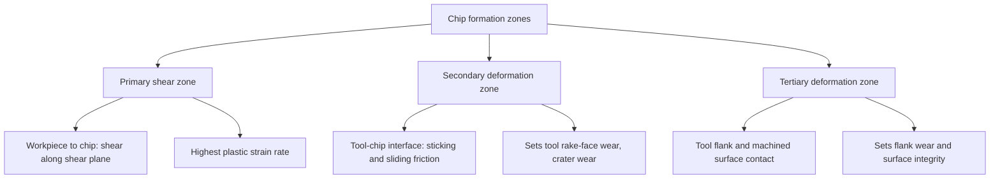
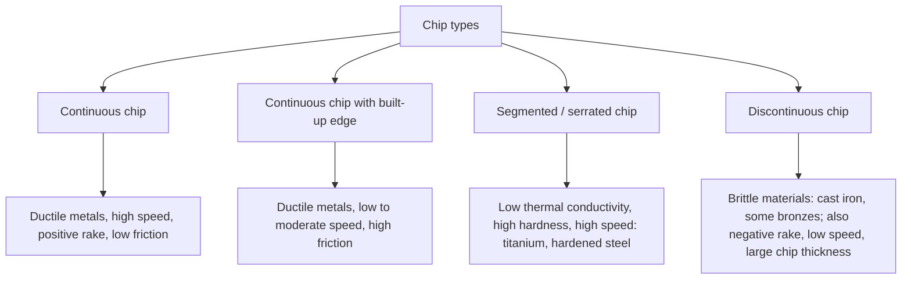
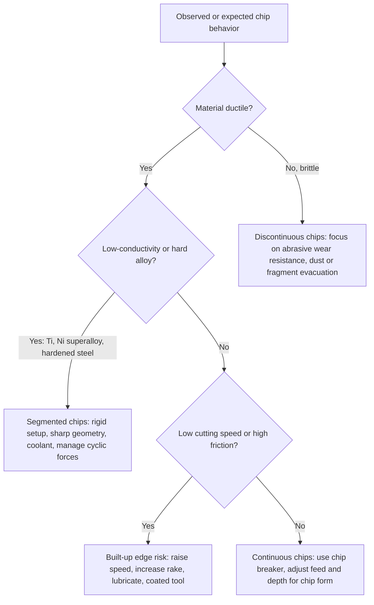

## Classification by Chip-Formation Mechanism

### Overview

Every conventional machining process removes material by forming a **chip**: a portion of the workpiece that is separated from the parent material by plastic deformation and fracture ahead of, and along, the cutting edge. The *mechanism* by which that separation occurs, the shape of the chip, and the way it moves off the rake face together define the chip-formation mechanism.

Chip formation is the physical core of machining. It controls cutting forces, power, heat generation, tool wear, surface integrity, and chip handling. Classifying processes and cutting conditions by chip-formation mechanism therefore complements the kinematic classification: kinematics tells you *how the tool and workpiece move*, while chip formation tells you *what the material does in response*.

Chip-formation classification works along several independent axes:

- The **deformation mode** in the primary zone (continuous shear, segmented shear, brittle fracture).
- The **chip morphology** that results (continuous, continuous with built-up edge, segmented/serrated, discontinuous).
- The **geometry of the cutting edge relative to the cutting velocity** (orthogonal, oblique).
- The **chip thickness pattern** in time (constant, cyclically varying, single-tooth intermittent).
- The **chip control** outcome (chip form and breakability).
- The **scale of the cut** (macro versus micro/nano machining, where size effects change the mechanism).

**Key Points**

- A chip forms by **severe plastic shear** concentrated in a narrow **primary shear zone** running from the cutting edge to the workpiece free surface; material also deforms in a **secondary zone** at the tool-chip interface and a **tertiary zone** near the flank.
- Whether the chip is continuous, segmented, or discontinuous depends mainly on **workpiece material properties** (ductility, thermal conductivity, work-hardening), **cutting speed**, **uncut chip thickness**, and **tool geometry**.
- The same process can change mechanism when conditions change: for example, turning a ductile steel gives continuous chips at moderate speed and can develop a built-up edge at low speed.
- Chip formation is a *thermomechanical* phenomenon, so behavior varies with machine, tooling, workpiece material, and cutting conditions; many published relationships are empirical.

### Deformation Zones in Chip Formation

| Zone | Location | Dominant phenomenon | Consequence |
| --- | --- | --- | --- |
| Primary | Shear plane from edge to free surface | Large plastic strain at very high strain rate | Most of the cutting power; chip formation itself |
| Secondary | Tool rake face, tool-chip interface | Friction: sticking near the edge, sliding farther away | Crater wear, chip curl, heat into tool |
| Tertiary | Tool flank and newly machined surface | Rubbing, elastic recovery | Flank wear, residual stress, surface finish |

### Cutting Geometry: Orthogonal vs. Oblique

The simplest chip-formation model is **orthogonal (two-dimensional) cutting**, where the cutting edge is perpendicular to the cutting velocity and the chip flows in a plane. Most real cuts are **oblique (three-dimensional)**, with an inclination angle $\lambda_s$ between the edge and the perpendicular to the cutting velocity.

| Feature | Orthogonal | Oblique |
| --- | --- | --- |
| Edge vs. velocity | Perpendicular | Inclined by $\lambda_s$ |
| Chip flow | In the plane of $v_c$ and the edge normal | Deviates by chip flow angle $\eta_c$ |
| Analytical convenience | High (2D models) | Low (3D vector treatment) |
| Real operations | Approximated by tube-wall turning, broaching, planing | Turning with nose radius, milling, drilling |

The **chip thickness ratio** (cutting ratio) is measured directly and gives access to the shear angle:

$$r = \frac{t_0}{t_c}$$

where $t_0$ is the uncut chip thickness and $t_c$ the deformed chip thickness. In orthogonal cutting with rake angle $\alpha$, the shear angle $\phi$ follows from

$$\tan\phi = \frac{r\cos\alpha}{1 - r\sin\alpha}$$

Shear strain in the primary zone is

$$\gamma = \frac{\cos\alpha}{\sin\phi\,\cos(\phi - \alpha)} = \cot\phi + \tan(\phi - \alpha)$$

**Example**

Orthogonal cutting with $t_0 = 0.25\ \text{mm}$, measured chip thickness $t_c = 0.60\ \text{mm}$, and rake angle $\alpha = 10^\circ$:

$$r = \frac{0.25}{0.60} = 0.4167$$

$$\tan\phi = \frac{0.4167\cos 10^\circ}{1 - 0.4167\sin 10^\circ} = \frac{0.4103}{0.9276} = 0.4424 \Rightarrow \phi \approx 23.9^\circ$$

$$\gamma = \cot(23.9^\circ) + \tan(23.9^\circ - 10^\circ) = 2.261 + 0.2475 \approx 2.51$$

A shear strain of about 2.5 is typical of the very high strains involved in chip formation, far above the strains encountered in ordinary forming processes [Inference: typical range depends on rake angle and material].

The shear plane force relationship and Merchant's criterion (an idealized minimum-energy result) give an estimate of the shear angle:

$$\phi = 45^\circ + \frac{\alpha}{2} - \frac{\beta}{2}$$

where $\beta$ is the friction angle at the tool-chip interface ($\tan\beta = \mu$). Merchant's relation is idealized, and measured shear angles often deviate from it [Inference: agreement varies with workpiece material and conditions].

### Classification by Chip Morphology

Chip form is the most practical classification. Four principal chip types are recognized.

#### Continuous Chip

- Forms a long, unbroken ribbon by steady shear in the primary zone.
- Associated with ductile metals (low-carbon steel, aluminum, copper), sharp edges, high rake angles, moderate to high cutting speeds, and effective lubrication.
- Advantages: stable forces, good surface finish, and steady tool wear.
- Drawbacks: long stringy chips can tangle around the tool and workpiece, cause safety hazards, damage the surface, and jam automation. **Chip breakers** or feed increases are used to fragment them.

#### Continuous Chip with Built-Up Edge (BUE)

- Layers of work material weld to the tool near the edge under high pressure and temperature at the tool-chip interface, forming a wedge that behaves as an extended, blunt cutting edge.
- BUE is unstable: it grows, then breaks off, carrying away fragments of the tool coating or edge or depositing particles on the machined surface.
- Occurs at low to moderate cutting speeds in ductile, work-hardening metals (some low-carbon steels, aluminum alloys, stainless steels), and is reduced at higher speeds where temperature rises enough to soften the adhering layer, or by higher rake angles, lubrication, and coated tools.
- Effects: poor surface finish, dimensional variation, and irregular tool wear, though a stable BUE can occasionally protect the edge [Inference: benefit is limited and unpredictable].

#### Segmented (Serrated) Chip

- Alternating zones of high and low strain: localized **adiabatic shear bands** form because thermal softening outweighs strain hardening, producing a saw-tooth chip that appears continuous but consists of segments joined by thin shear bands.
- Typical in titanium alloys, nickel-based superalloys, hardened steels, and other materials with low thermal conductivity, and at high cutting speeds where heat cannot dissipate from the shear zone.
- Consequences: cyclic variation in cutting force at the segmentation frequency, which can excite vibration and accelerate tool wear; requires rigid setups and suitable tool grades.

The segmentation frequency is approximately

$$f_{seg} = \frac{v_{chip}}{p_s}$$

where $v_{chip}$ is the chip velocity along the rake face and $p_s$ is the segment pitch. Chip velocity follows from the cutting ratio:

$$v_{chip} = r\, v_c$$

**Example**

Cutting a titanium alloy at $v_c = 60\ \text{m/min}$ ($1.0\ \text{m/s}$) with cutting ratio $r = 0.5$ and measured segment pitch $p_s = 0.1\ \text{mm}$:

$$v_{chip} = 0.5 \times 1.0 = 0.5\ \text{m/s}, \qquad f_{seg} = \frac{500\ \text{mm/s}}{0.1\ \text{mm}} = 5000\ \text{Hz}$$

Segmentation at several kilohertz is typical of this regime and can interact with structural dynamics [Inference: exact values depend on material, speed, and feed].

#### Discontinuous Chip

- Consists of separate, fragmented pieces formed by **brittle fracture** ahead of the tool, or by repeated fracture and reformation.
- Typical of brittle or low-ductility materials (gray cast iron, cast bronze, hard brass), and can also occur in ductile metals under low cutting speed, large chip thickness, negative rake, or poor lubrication, and with a strongly built-up or unstable cut.
- Effects: fluctuating forces, rougher surface, and short chips that are easy to evacuate.

| Chip type | Deformation mode | Typical materials | Force pattern | Surface finish | Chip handling |
| --- | --- | --- | --- | --- | --- |
| Continuous | Steady shear | Ductile steel, aluminum, copper | Steady | Good | Needs chip breaking |
| Continuous with BUE | Steady shear + adhesion | Ductile, work-hardening metals at low speed | Fluctuating | Poor | Moderate |
| Segmented (serrated) | Cyclic adiabatic shear bands | Titanium, superalloys, hard steels | Cyclic, high frequency | Variable | Easy to break |
| Discontinuous | Brittle fracture | Cast iron, brittle bronze | Highly fluctuating | Rough | Easy (short chips) |

### Factors that Determine Chip Type

| Factor | Effect on chip type |
| --- | --- |
| Workpiece ductility | Ductile → continuous; brittle → discontinuous |
| Thermal conductivity | Low conductivity promotes segmentation |
| Cutting speed | Higher speed reduces BUE; very high speeds in low-conductivity materials promote segmentation |
| Uncut chip thickness (feed) | Larger thickness tends toward discontinuous or segmented chips |
| Rake angle | Positive rake favors continuous chips; negative rake favors segmented or discontinuous |
| Friction at rake face | High friction promotes BUE and thick, more strongly deformed chips |
| Cutting fluid | Lubrication reduces friction and BUE; cooling can reduce thermal softening effects |
| Edge preparation (hone radius) | Larger hone increases ploughing and can shift the mechanism at small chip thickness |

### Classification by Chip Thickness Pattern (Process-Level)

The chip-formation *pattern in time* differs between processes because of their kinematics.

| Pattern | Description | Processes |
| --- | --- | --- |
| Constant chip thickness | Uncut thickness set by feed and lead angle; steady | Turning, drilling, broaching (per tooth) |
| Cyclic, tooth-by-tooth varying thickness | Thickness rises from zero, peaks, and returns to zero (or the reverse) within each tooth engagement | Milling, hobbing |
| Stroke-based single engagement | Chip formed on the cutting stroke, idle on return | Shaping, planing, slotting |
| Progressive stepwise thickness | Each tooth removes a small increment set by tooth rise | Broaching |
| Variable with diameter | Cutting speed and chip geometry vary radially | Facing, drilling (near axis), parting off |

For **milling**, uncut chip thickness as a function of the tooth angular position $\phi$ is

$$h(\phi) = f_z \sin\phi \quad \text{(peripheral, straight-tooth cutter)}$$

with **up milling** starting at $h = 0$ and reaching $h_{max}$ at exit, and **down (climb) milling** the reverse:

| Feature | Up milling | Down milling |
| --- | --- | --- |
| Entry chip thickness | Zero (rubbing/ploughing before cutting) | Maximum (immediate cutting) |
| Exit chip thickness | Maximum | Zero (chip thins to nothing) |
| Chip removal | Chip carried up and around, risk of re-cutting | Chip ejected behind the cutter |
| Effect on tool | Rubbing, work-hardening layer, more flank wear | Impact at entry, thermal shock; generally better finish |

**Example**

For $f_z = 0.1\ \text{mm}$ and a tooth at $\phi = 30^\circ$:

$$h(30^\circ) = 0.1 \times \sin 30^\circ = 0.05\ \text{mm}$$

At $\phi = 90^\circ$ (full radial engagement, slotting) the thickness peaks at $0.1\ \text{mm}$. This variation explains why the *same* cutter and material can show different chip types within a single tooth pass: near $h \to 0$ the mechanism is dominated by ploughing and elastic recovery rather than steady shear (see the size-effect section below).

### Classification by Chip Control (Chip Form)

Chip form (ISO 3685-style classification of chip shapes) describes the macro shape of the chip and how manageable it is. Common forms, from unfavorable to favorable:

| Form | Description | Assessment |
| --- | --- | --- |
| Ribbon (straight or tangled) | Long unbroken strand | Unfavorable; hazard, tangles, surface damage |
| Snarled/tangled | Mass of ribbon entangled | Unfavorable |
| Long helical (washer-type helical) | Long coils | Marginal to unfavorable |
| Short helical | Short coils | Acceptable |
| Spiral or tubular | Short spirals or tubes | Good |
| Arc-shaped (comma) | Short arcs that break naturally | Very good |
| Conical (spiral cone) | Short cones | Very good |
| Needle or granular (fragments) | Small fragments | Good for evacuation; may indicate brittle mechanism or excessive chip breaking |

#### Chip Breaking Mechanisms

- **Chip breaker grooves or obstructions** on the rake face force the chip to curl tightly until it fractures or hits the workpiece or tool flank.
- **Feed and depth-of-cut selection:** increasing feed thickens the chip, which breaks more readily.
- **Programmed dwell or peck** (CNC cycles) interrupts the cut to fragment chips in turning grooves and in drilling.
- **High-pressure coolant** deflects and fractures chips, widely used in superalloy turning and deep-hole work.

The curl radius of a chip against a breaker, together with chip thickness and material strain-to-fracture, determines whether it breaks. A rough criterion is that the bending strain

$$\varepsilon_b \approx \frac{t_c}{2R_c}$$

exceeds the fracture strain of the chip material, where $R_c$ is the chip curl radius [Inference: simplified model; real breaking depends on work-hardening, temperature, and contact with obstacles].

### Classification by Deformation Regime and Scale

#### Macro-Scale Machining (Shear-Dominated)

When uncut chip thickness is much larger than the cutting-edge radius, chip formation is dominated by shear in the primary zone and the classical models above apply.

#### Micro-Scale Machining (Size Effect and Ploughing)

When uncut chip thickness $h$ approaches or falls below the edge radius $r_n$, the tool no longer behaves as a sharp wedge. A **minimum chip thickness** exists below which material is ploughed (elastically and plastically displaced) rather than removed as a chip.

- Below the minimum chip thickness $h_{min}$ (commonly quoted as a fraction of the edge radius, often around 0.2 to 0.4 times $r_n$ [Inference: fraction depends on workpiece material and edge geometry]), chips do not form on every pass.
- Effective rake angle becomes strongly negative because the contact is on the rounded edge.
- Specific cutting energy rises as chip thickness falls (the **size effect**).

$$h_{min} \approx \kappa\, r_n, \qquad \kappa \approx 0.2 \text{ to } 0.4$$

**Example**

For an edge radius $r_n = 5\ \mu\text{m}$:

$$h_{min} \approx (0.2 \text{ to } 0.4) \times 5\ \mu\text{m} = 1 \text{ to } 2\ \mu\text{m}$$

Feed per tooth below this value in micro-milling would cause ploughing and rubbing rather than steady chip formation, which causes rapid wear, burr formation, and poor surface quality.

#### Brittle-Mode vs. Ductile-Mode Machining of Hard-Brittle Materials

For glass, ceramics, and silicon, cutting at small depths (nanometer scale) can occur in a **ductile regime** (plastic flow with no fracture) rather than the brittle-fracture regime, giving crack-free surfaces. The transition depth depends on material and tooling and is a key design parameter for diamond turning of optics [Inference: threshold values are material- and setup-specific].

### Chip Formation in Specific Conventional Processes

| Process | Chip-formation features |
| --- | --- |
| Turning | Steady, continuous chips; three-dimensional (oblique) flow; chip breaker and feed control chip form |
| Facing and parting | Cutting speed changes along the cut; chip shape changes; parting chips are constrained by the narrow groove |
| Milling | Interrupted, comma-shaped chips of varying thickness; entry/exit conditions dictate wear and burr |
| Drilling | Two simultaneous chip flows from the lips, confined by the flutes; chip packing is the dominant issue; chisel edge extrudes rather than cuts |
| Reaming | Thin chips due to small stock allowance; potential ploughing at small chip thickness |
| Tapping | Confined chip formation in the thread root; chip packing risk (cutting taps); no chip in forming taps |
| Broaching | Thin chips each tooth; **chip space** (gullet) must hold the chips of the whole cut length |
| Shaping and planing | Intermittent chip per stroke, impact at each engagement |
| Sawing | Very thin chips per tooth; chip clearance in tooth gullets; risk of clogging |

**Key Points**

- In **broaching** and **sawing**, the tooth gullet volume must accommodate the chip volume produced by one tooth over the cut length; if the packing ratio is exceeded, chips jam and the tool breaks. A common check compares chip volume to gullet volume:

$$\text{Chip volume per tooth} = h\, b\, L_c \times K_{swell} \le V_{gullet}$$

where $h$ is uncut chip thickness, $b$ chip width, $L_c$ the length of cut, and $K_{swell}$ the chip expansion (swell) factor greater than 1, often in the range of about 3 to 5 or higher for ductile materials [Inference: swell depends on chip form and material].

- In **drilling**, the flute cross-section and helix angle are designed for chip transport; insufficient evacuation causes packing and torque spikes.

### Thermal and Mechanical Consequences by Chip Type

| Chip type | Cutting force | Temperature | Typical wear pattern |
| --- | --- | --- | --- |
| Continuous | Steady, moderate | High at rake-face interface | Crater wear on rake face, flank wear |
| Continuous with BUE | Fluctuating | Moderate | Irregular wear, edge chipping when BUE breaks away |
| Segmented | Cyclic at $f_{seg}$ | Very high, localized | Notch wear, crater, thermal cracking, rapid wear |
| Discontinuous | Fluctuating, impact-like | Lower average | Abrasive flank wear, chipping |

The partition of heat between chip, tool, and workpiece depends strongly on the chip type and cutting speed. At higher speeds a greater share leaves with the chip, which is one reason high-speed machining of aluminum reduces workpiece thermal damage [Inference: exact partition depends on material, speed, and geometry].

### Chip-Formation Mechanism and Surface Integrity

- **Continuous chips** with steady shear give more consistent surface finish and residual stress patterns.
- **BUE** deposits fragments on the surface and causes torn or smeared texture.
- **Segmented chip formation** creates a periodic surface waviness synchronized with chip segmentation and can raise surface roughness.
- **Ploughing** in micro-cutting generates burrs and a work-hardened, smeared layer.
- Excess tool wear or a rounded edge increases the tertiary-zone contribution, giving compressive-to-tensile shifts in residual stress; the sign depends on conditions [Inference: varies with temperature and mechanical loading].

### Selection and Control Guide by Chip Mechanism

| Problem | Likely mechanism | Corrective action |
| --- | --- | --- |
| Long stringy chips | Continuous chip in ductile material | Chip breaker insert, higher feed, larger depth of cut, high-pressure coolant, programmed dwell |
| Rough surface with torn material | Built-up edge | Increase cutting speed, more positive rake, coated or polished tool, better lubrication |
| Periodic chatter and rapid tool wear in titanium | Segmented chip force cycles | Rigid tool holding, optimized speed, sharp positive geometry, high-pressure coolant |
| Burrs and rubbing at very small feed | Ploughing below minimum chip thickness | Increase feed per tooth above $h_{min}$, sharpen edge, reduce edge radius |
| Chip packing in drilling or tapping | Insufficient chip evacuation | Through-tool coolant, peck cycles, flute geometry, spiral-point tap |
| Chipped edge in cast iron | Discontinuous chip impact loading | Tougher grade, honed edge, reduced feed at entry |

Behavior varies with machine rigidity, tooling, workpiece material, and process parameters.

### Conclusion

Chip-formation classification ties machining processes to the physical response of the workpiece material. The main categories are continuous chips, continuous chips with a built-up edge, segmented (serrated) chips, and discontinuous chips, determined by material ductility and thermal properties, cutting speed, chip thickness, rake angle, and friction. Process kinematics then modulates this behavior: constant thickness in turning and drilling, cyclically varying thickness in milling, stroke-wise engagement in shaping, and progressive thin chips in broaching. At very small scales, ploughing and size effects change the mechanism entirely. Chip form and chip control add a practical dimension, since manageable chip shapes are a requirement for automation and safe, stable production. Understanding these mechanisms lets an engineer predict forces and wear, choose tool geometry and cutting conditions, and diagnose defects.

**Related Topics**

- Orthogonal cutting models (Merchant, Lee-Shaffer) and shear-angle theories
- Cutting force and specific cutting energy models
- Heat generation and temperature distribution in machining
- Tool wear mechanisms: abrasion, adhesion, diffusion, oxidation, fatigue
- Adiabatic shear banding and serrated chip modeling
- Chip breaker design and ISO chip-form classification
- Micro-cutting, minimum chip thickness, and size effect
- Ductile-regime machining of hard-brittle materials
- High-speed machining and chip-formation changes at very high speeds
- Surface integrity and residual stresses in machining
- Cutting fluids, high-pressure coolant, and minimum quantity lubrication