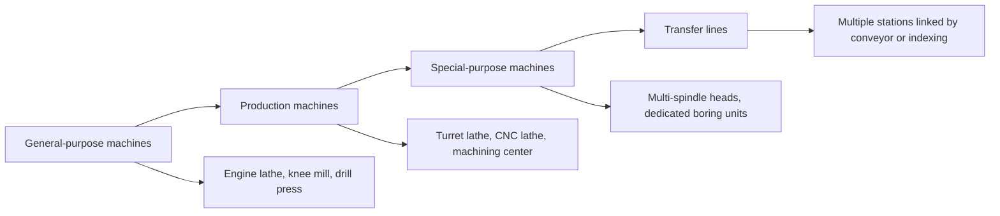
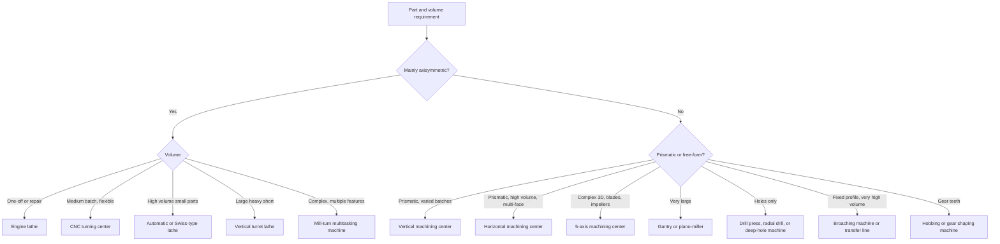

## Machine-Tool Classification by Process Family

### Overview

A **machine tool** is a power-driven, non-portable machine that shapes a workpiece by controlled relative motion between a cutting tool (or abrasive, or other tool) and the workpiece, guided by a rigid frame. Classifying machine tools by **process family** groups machines according to the *machining process they are designed to perform*: the cutting motions they provide, the tool types they hold, and the surfaces they generate.

This classification is the machine-side counterpart of the process classifications developed earlier (single-point, multi-point, turning, milling, hole making, kinematics, chip formation). Where those describe *what happens at the cutting edge*, this one describes *the machine architecture built to make it happen*: spindle arrangement, axis layout, work-holding, tool storage, and control.

Machine tools are grouped along several independent axes. Any real machine occupies a position on every axis: for example, a "5-axis vertical machining center" belongs to the milling family (process), has a vertical spindle (configuration), is CNC controlled (control), and uses an automatic tool changer (tool handling).

**Key Points**

- The primary grouping follows the **dominant cutting process**: turning, milling, drilling/boring, shaping/planing, broaching, sawing, gear cutting, and abrasive processes.
- Within each family, machines vary by **spindle orientation**, **axis count**, **size and capacity**, **degree of automation**, and **production orientation** (general-purpose vs. special-purpose).
- Modern **machining centers** and **multitasking (mill-turn) machines** blur family boundaries by combining several process families in one setup.
- The process family determines the fundamental machine structure: rotating workpiece machines (lathes) need a headstock and tailstock; rotating tool machines (mills) need a spindle and a table; linear-stroke machines (broaching, shaping) need a ram or slide with a stroke drive.

### Classification Criteria

| Criterion | Categories |
| --- | --- |
| Process family | Turning, milling, drilling and boring, shaping/planing/slotting, broaching, sawing, gear cutting, abrasive (grinding and finishing) |
| Spindle or main-motion orientation | Horizontal, vertical, inclined, universal |
| Degree of specialization | General-purpose, production, special-purpose, transfer |
| Degree of automation and control | Manual, semi-automatic, automatic (cam), NC/CNC, adaptive |
| Size and capacity | Bench, floor, heavy-duty, gantry |
| Number of spindles | Single-spindle, multi-spindle |
| Number of controlled axes | 1-axis to simultaneous 5-axis and beyond |
| Accuracy class | Standard, precision, ultra-precision |
| Tool handling | Manual change, turret, automatic tool changer (ATC), tool magazine |

### Master Classification Tree

```mermaid
flowchart TD
    A[Machine tools by process family] --> B[Turning machines]
    A --> C[Milling machines]
    A --> D[Drilling and boring machines]
    A --> E[Reciprocating machines]
    A --> F[Broaching machines]
    A --> G[Sawing machines]
    A --> H[Gear-cutting machines]
    A --> I[Abrasive machines]
    A --> J[Multifunction / hybrid machines]

    B --> B1[Engine lathe]
    B --> B2[Turret and capstan lathe]
    B --> B3[Automatic and Swiss-type lathe]
    B --> B4[CNC turning center]
    B --> B5[Vertical turret lathe]

    C --> C1[Knee-and-column]
    C --> C2[Bed-type]
    C --> C3[Planer-type]
    C --> C4[Machining centers VMC / HMC]
    C --> C5[Gantry and portal]

    D --> D1[Drill press, radial drill]
    D --> D2[Horizontal boring mill]
    D --> D3[Jig borer]
    D --> D4[Deep-hole drilling machine]

    E --> E1[Shaper]
    E --> E2[Planer]
    E --> E3[Slotter]

    F --> F1[Vertical broaching]
    F --> F2[Horizontal broaching]
    F --> F3[Continuous / rotary broaching]

    G --> G1[Hacksaw]
    G --> G2[Bandsaw]
    G --> G3[Circular saw]

    H --> H1[Hobbing machine]
    H --> H2[Gear shaper]
    H --> H3[Gear-milling machine]
    H --> H4[Skiving machine]

    I --> I1[Cylindrical grinder]
    I --> I2[Surface grinder]
    I --> I3[Centerless grinder]
    I --> I4[Honing and lapping machines]

    J --> J1[Mill-turn center]
    J --> J2[Multitasking machine]
```

### Turning Machines (Lathes)

The lathe family provides **workpiece rotation** as the primary motion and **tool linear feed** as the secondary motion. Main structural elements: bed, headstock (spindle), tailstock, carriage (saddle, cross slide, compound rest), and lead screw/feed rod.

| Machine | Distinguishing feature | Typical use |
| --- | --- | --- |
| Engine (center) lathe | Manual, versatile, lead screw for threading | One-offs, repair, toolroom, low volume |
| Bench lathe | Small engine lathe on a bench | Small precision parts |
| Toolroom lathe | Higher accuracy, wider speed/feed ranges | Tooling and gauges |
| Turret / capstan lathe | Indexing hexagonal turret with multiple tools | Medium-volume repeated sequences |
| Single-spindle automatic (cam-driven) | Cams control motions, bar feeder | High-volume small parts |
| Multi-spindle automatic | Several spindles machine parts simultaneously | Very high volume |
| Swiss-type (sliding headstock) | Bar guided in a bushing near the cutting point | Long, slender small-diameter parts, medical and watch parts |
| CNC turning center | X and Z axes under program control, turret with driven tools, optional C axis and sub-spindle | Flexible small to large batches |
| Vertical turret lathe (VTL) | Vertical spindle, horizontal table, gravity-assisted clamping | Large, heavy, short parts |
| Chucking lathe | Designed for chucked (not bar) work | Castings, forgings |

Machine size for lathes is specified by:

- **Swing over bed:** largest diameter that can rotate over the bed.
- **Swing over cross slide:** smaller value, limited by the carriage.
- **Distance between centers:** maximum workpiece length.
- Spindle bore, spindle power, and speed range.

**Example**

Cutting speed to spindle speed and power estimate for a lathe. For a 60 mm diameter steel bar at $v_c = 120\ \text{m/min}$:

$$n = \frac{1000\, v_c}{\pi D} = \frac{1000 \times 120}{\pi \times 60} \approx 637\ \text{rev/min}$$

With $f = 0.3\ \text{mm/rev}$, $a_p = 3\ \text{mm}$, and $k_c \approx 2000\ \text{N/mm}^2$ [Inference: representative value for medium-carbon steel]:

$$F_c = k_c f a_p = 2000 \times 0.3 \times 3 = 1800\ \text{N}$$

$$P_c = \frac{F_c v_c}{60{,}000} = \frac{1800 \times 120}{60{,}000} = 3.6\ \text{kW}$$

The spindle motor rating must exceed this figure divided by mechanical efficiency (commonly around 0.7 to 0.9 [Inference: efficiency varies by machine]).

### Milling Machines

Milling machines provide **tool rotation** and **workpiece (or tool) linear/multi-axis feed**.

#### By Structure

| Machine | Structure | Characteristics |
| --- | --- | --- |
| Knee-and-column | Table on a vertically adjustable knee | Versatile, manual or CNC; toolroom and light production; limited rigidity |
| Bed-type (fixed-bed) | Table on a fixed bed; spindle head moves vertically | Higher rigidity for production and heavier cuts |
| Planer-type (plano-miller) | Column-and-crossrail structure over a long table | Large parts; multiple heads possible |
| Gantry / portal | Bridge spanning the table; moving bridge or moving table | Very large parts, aerospace and die/mold |
| Machining centers | Enclosed CNC structure with ATC | Automated multi-operation machining |

#### By Spindle Orientation

| Orientation | Advantages | Typical use |
| --- | --- | --- |
| Horizontal | Chips fall away from cut; arbor support for gang milling; good for heavy cuts and deep pockets | Production milling, box parts |
| Vertical | Good visibility, easy setup; end and face milling | General-purpose, dies, molds, plates |
| Universal | Swiveling table or head allows helical and angular work | Toolroom, spiral and cam milling |
| Inclined / multi-axis head | Angled tool axis | Complex 5-axis work |

#### Machining Centers

**Machining centers** are CNC milling machines with an **automatic tool changer (ATC)**, tool magazine, and often an automatic pallet changer (APC). Major types:

- **Vertical machining center (VMC):** vertical spindle; the most common; efficient for plate-like and 3D-contoured work.
- **Horizontal machining center (HMC):** horizontal spindle; typically with a rotary table (B axis) and pallets; chips fall away, supporting high metal removal and multi-face machining of prismatic parts in one setup.
- **Universal / 5-axis machining center:** two rotary axes (table-table, head-table, or head-head configurations) for simultaneous 5-axis machining.
- **Gantry machining center:** large gantry structure for big parts.

| Feature | VMC | HMC |
| --- | --- | --- |
| Chip evacuation | Chips can accumulate on the part or fixture | Chips fall away by gravity |
| Fixturing | Simple, vises and plates | Tombstones, multi-face fixtures |
| Floor space | Smaller | Larger |
| Cost | Lower | Higher |
| Typical productivity | Good for varied parts | Higher for production of prismatic parts |

**Example**

Cycle-time estimate for a face-milling operation on a machining center. A plate $400\ \text{mm} \times 200\ \text{mm}$ is faced with a $D = 100\ \text{mm}$ cutter at $v_f = 900\ \text{mm/min}$, using two passes with overtravel equal to $D$ per pass:

$$t_{cut} = \frac{2\,(400 + 100)}{900} = 1.11\ \text{min}$$

Total cycle time additionally includes rapid moves, tool changes (commonly a few seconds per change, depending on machine), and part loading, so machine-selection decisions weigh non-cutting time as well as cutting time.

### Drilling and Boring Machines

| Machine | Description | Typical use |
| --- | --- | --- |
| Sensitive (bench) drill press | Light, hand feed | Small holes, small parts |
| Pillar (upright) drill press | Column-mounted, power feed | General drilling, tapping |
| Radial drilling machine | Swinging arm with a spindle head that moves along the arm | Large or heavy workpieces; hole patterns without moving the part |
| Gang drilling machine | Multiple spindle heads on a common table | Sequences of operations |
| Multi-spindle drilling machine | Several spindles driven together | Hole patterns at high production rates |
| Turret drilling machine | Turret of tools on a single spindle | Drilling, reaming, tapping sequence |
| Deep-hole drilling machine | Gun drill or BTA system with high-pressure coolant | Long, straight holes (barrels, shafts, hydraulic components) |
| Horizontal boring mill (table-type, floor-type, planer-type) | Horizontal spindle with a boring bar; movable table and column | Large housings, line boring, milling and drilling in one setup |
| Jig borer | Very high positional accuracy; precision measuring on axes | Toolroom work, precision hole patterns |
| Vertical boring mill | Vertical spindle, rotating table | Large-diameter short parts (overlaps with VTL) |

**Key Points**

- Machine size for drill presses is specified by the **swing** (twice the distance from column to spindle axis) and for radial drills by **column diameter and arm length**.
- Jig borers achieve positioning accuracy on the order of a few micrometers in temperature-controlled environments [Inference: value depends on machine class and environment].

### Reciprocating Machines (Shapers, Planers, Slotters)

These are **linear-stroke, single-point** machines with a working (cutting) stroke and a return stroke, so cutting is intermittent.

| Machine | Primary motion | Feed motion | Typical use |
| --- | --- | --- | --- |
| Shaper | Ram carrying the tool reciprocates horizontally | Table moves crosswise between strokes | Small flat surfaces, slots, keyways |
| Planer | Workpiece table reciprocates | Tool head feeds crosswise between strokes | Large flat surfaces, long guideways |
| Slotter (vertical shaper) | Ram reciprocates vertically | Table in two horizontal directions plus rotary | Internal keyways, splines, internal profiles |

Quick-return mechanisms (crank-and-slotted-link, Whitworth, hydraulic) shorten the return stroke, so that the time ratio between cutting and return is greater than one. The **cutting-to-return time ratio** and stroke length determine mean cutting speed:

$$v_{c,avg} = \frac{L_s}{t_c}$$

where $L_s$ is the stroke length and $t_c$ the cutting-stroke time. These machines have largely been replaced by milling and grinding for flat surfaces and by wire EDM and broaching for internal keyways in production, but remain in use for large guideways, maintenance work, and low-volume jobs [Inference: prevalence varies by industry and region].

### Broaching Machines

Broaching machines provide a **single linear stroke** of a multi-tooth tool; the tooth rise provides the feed, so the machine needs no feed mechanism.

| Machine | Configuration | Typical use |
| --- | --- | --- |
| Vertical pull-down / pull-up | Broach moves vertically, pulled through the workpiece | Internal keyways, splines, in a small footprint |
| Vertical push-type (broaching press) | Shorter broach pushed by an arbor press | Simple, low-volume internal broaching |
| Horizontal pull | Long stroke, horizontal | Long broaches, internal and external work |
| Surface broaching (vertical or horizontal) | Tool or workpiece moves over the surface | Slots, flats, contours (for example, engine block surfaces) |
| Continuous broaching | Workpieces move on a conveyor past a fixed broach | Very high volume automotive parts |
| Rotary broaching machine | Rotary broach on a standard machine with wobble/orbital motion | Polygonal and hex holes in a lathe or mill |

The drive is typically **hydraulic** (smooth, adjustable force, common) or **electromechanical** (precision, energy efficiency). The required machine force is the sum over the engaged teeth:

$$F_b = k_c\, b\, h_t\, N_{eng}$$

where $b$ is the width of cut per tooth, $h_t$ the tooth rise (uncut thickness), and $N_{eng}$ the number of teeth simultaneously engaged [Inference: simplified model neglecting friction and edge effects; real machine sizing uses handbook or supplier data].

### Sawing Machines

| Machine | Tool motion | Characteristics |
| --- | --- | --- |
| Power hacksaw | Reciprocating blade, cuts on forward stroke | Simple, low cost, slow |
| Horizontal bandsaw | Continuous loop blade | Most common cut-off machine for bar and structural stock |
| Vertical bandsaw | Continuous loop, vertical table | Contour cutting |
| Circular cold saw | Rotating toothed disc | High accuracy, good finish, cut-off of tube and bar |
| Abrasive cut-off saw | Bonded abrasive disc | Hard materials (boundary with abrasive family) |

### Gear-Cutting Machines

| Machine | Method | Principle |
| --- | --- | --- |
| Gear hobbing machine | Generating | Hob and blank rotate in a fixed ratio; hob feeds along axis |
| Gear shaping machine | Generating | Pinion or rack cutter reciprocates while rolling with the blank |
| Gear-milling machine | Form | Form-relieved cutter and indexing head |
| Gear broaching machine | Form | Broach cuts all tooth spaces (mostly internal gears) |
| Gear skiving machine | Generating | Cutter and workpiece axes crossed and rotating in synchrony |
| Bevel-gear generators | Generating | Cutter head and cradle mechanism for straight, spiral, and hypoid bevel gears |
| Gear finishing machines (shaving, grinding, honing) | Finishing | Improve accuracy after cutting and heat treatment |

Gear machines are characterized by **coupled motions** and by an extensive kinematic chain (gear train or electronic gearing) linking tool and blank rotations.

### Abrasive Machines (Boundary Family)

Grinding, honing, lapping, and superfinishing use abrasive tools with geometrically undefined cutting edges. They are typically classified separately from geometrically defined cutting families but are included here because they complete the machine-tool landscape and typically follow conventional cutting in a process chain.

| Machine | Description |
| --- | --- |
| Surface grinder | Reciprocating or rotary table; flat surfaces |
| Cylindrical grinder | External and internal cylindrical surfaces; between centers or chucked |
| Centerless grinder | Workpiece supported on a blade between a grinding wheel and a regulating wheel |
| Tool and cutter grinder | Sharpening and manufacturing of cutting tools |
| Honing machine | Abrasive stones expand in a bore with reciprocating and rotating motion |
| Lapping machine | Loose abrasive slurry between the workpiece and a lap plate |

### Multifunction and Hybrid Machines

| Machine | Description | Benefit |
| --- | --- | --- |
| Mill-turn center | Lathe with live tooling, C axis, and Y axis | Turning and milling in one setup |
| Turn-mill / multitasking machine | Adds B-axis milling spindle, sub-spindle, and sometimes a second turret | Complete machining of complex parts |
| Turret-type and Swiss-type multitasking | Multiple tool stations, guide-bushing options | Small complex parts |
| Machining center with turning table | Rotary table with turning capability | Rotational parts on a milling platform |
| Additive-subtractive hybrid | Directed-energy deposition plus milling in one machine | Near-net shaping plus finishing [Inference: emerging category; capabilities vary by vendor] |
| Transfer machine | Series of dedicated stations linked by a part-handling system | Very high-volume, dedicated products |

### Classification by Degree of Automation and Control

| Level | Description | Example |
| --- | --- | --- |
| Manual | Operator controls all motions | Engine lathe, knee mill, drill press |
| Semi-automatic | Some cycle elements automated | Turret lathe with stops and feed trips |
| Automatic (cam/mechanical) | Cams and mechanical programming control sequence | Screw machines, multi-spindle automatics |
| NC / CNC | Numerical program controls axes and functions | CNC lathe, machining center |
| DNC / FMS | Machines networked with material handling | Flexible manufacturing system |
| Adaptive / smart | Sensors adjust parameters in process | Force- or vibration-adaptive machining [Inference: adoption varies by industry] |

CNC axis conventions follow a right-handed Cartesian system, with **Z** along the spindle axis and rotary axes **A, B, C** about X, Y, Z respectively.

### Classification by Size, Accuracy, and Production Orientation

| Category | Feature | Typical example |
| --- | --- | --- |
| Bench / light-duty | Small footprint, low power | Bench lathe, sensitive drill |
| Standard / medium-duty | General industrial use | Toolroom lathe, VMC |
| Heavy-duty | High power and rigidity, large capacity | Plano-miller, VTL, floor-type boring mill |
| Precision | Tighter geometric and positioning accuracy | Jig borer, precision CNC lathe |
| Ultra-precision | Nanometer-level positioning, controlled environment | Diamond turning machine [Inference: exact specification is machine-specific] |
| General-purpose | Wide range of operations | Engine lathe, universal mill |
| Single-purpose / special | Dedicated to one part or operation | Transfer machine, crankshaft grinder |

### Key Machine-Tool Elements Common to All Families

| Element | Function |
| --- | --- |
| Structure (bed, column, frame) | Provides rigidity and damping; typically cast iron, welded steel, or polymer/mineral-cast composite |
| Guideways | Constrain linear motion: box ways (high damping), linear rolling guides (low friction, high speed), hydrostatic (very smooth) |
| Spindle and bearings | Carry the primary rotary motion; accuracy and stiffness determine finish and roundness |
| Drives | Main spindle motor and feed motors (servo); ball screws, rack-and-pinion, linear motors |
| Control system | Interprets program (CNC), coordinates axes, interpolates paths |
| Tool handling | Turrets, magazines, ATC, tool presetting |
| Work-holding | Chucks, collets, vises, fixtures, pallets |
| Coolant and chip systems | Coolant delivery and filtration, chip conveyors |
| Enclosure and safety | Guarding, interlocks |

Machine-tool **stiffness** is a key performance parameter; the compliance of series elements (spindle, tool holder, slide, frame) adds:

$$\frac{1}{k_{total}} = \sum_i \frac{1}{k_i}$$

so the least stiff element dominates the overall static stiffness.

**Example**

A spindle-tool system has component stiffnesses of $k_1 = 200\ \text{N/}\mu\text{m}$ (spindle), $k_2 = 80\ \text{N/}\mu\text{m}$ (holder and tool), and $k_3 = 400\ \text{N/}\mu\text{m}$ (frame):

$$\frac{1}{k_{total}} = \frac{1}{200} + \frac{1}{80} + \frac{1}{400} = 0.005 + 0.0125 + 0.0025 = 0.02$$

$$k_{total} = 50\ \text{N/}\mu\text{m}$$

Under a 500 N cutting force the tool-point deflection would be about $500/50 = 10\ \mu\text{m}$ (static, idealized). The holder-and-tool element is the weakest link, so improving it (shorter overhang, larger diameter) has the greatest effect.

### Machine Selection by Process Family

| Requirement | Recommended machine family |
| --- | --- |
| Shafts, bushings, flanges | Lathe family (CNC turning center for batches) |
| Housings, brackets, plates | Milling family (VMC or HMC) |
| Dies and molds | 3-axis or 5-axis vertical machining centers, sometimes high-speed |
| Large box castings with bores | Horizontal boring mill or large HMC |
| Long deep holes | Gun-drilling or BTA machine |
| Internal keyways/splines at volume | Broaching machine |
| Gears | Hobbing, shaping, skiving, and follow-up finishing machines |
| Cut-off of raw stock | Bandsaw or cold saw |
| Tight tolerance and fine finish after cutting | Grinding, honing, or lapping machines |

### Machine Capacity Parameters

| Family | Common size or capacity specification |
| --- | --- |
| Lathe | Swing, distance between centers, spindle bore, spindle power |
| Milling machine | Table size, axis travels (X, Y, Z), spindle taper and power, maximum spindle speed |
| Drilling machine | Swing, column/arm size, maximum drill diameter in steel |
| Boring mill | Spindle diameter, travels, table load capacity |
| Shaper/planer/slotter | Maximum stroke length, table size |
| Broaching machine | Rated pulling/pushing force, stroke length |
| Saw | Maximum cut size (round and rectangular), blade speed |
| Gear-cutting machine | Maximum workpiece diameter, module, face width |
| Grinding machine | Wheel size, maximum workpiece diameter and length, wheel power |

Rated spindle power and torque determine the practical process window:

$$T = \frac{9549\, P}{n}\ \ (\text{N·m};\ P\text{ in kW},\ n\text{ in rev/min})$$

**Example**

A spindle rated at $P = 15\ \text{kW}$ delivers at $n = 1000\ \text{rev/min}$ a torque of

$$T = \frac{9549 \times 15}{1000} \approx 143\ \text{N·m}$$

At $n = 6000\ \text{rev/min}$ the same power gives only about $23.9\ \text{N·m}$, so large-diameter face milling or heavy drilling (torque-limited) should be run at lower speeds, while small-diameter high-speed milling can use the higher-speed portion of the power range. Actual spindle torque-speed curves have a constant-torque region at low speed and a constant-power region at higher speed, so consult the manufacturer's curve.

### Common Selection and Application Errors

| Error | Cause | Consequence | Mitigation |
| --- | --- | --- | --- |
| Oversized machine for small parts | Choosing by maximum capacity only | Low utilization, poor accuracy at small scale | Match machine class to part size and tolerance |
| Undersized rigidity for heavy cuts | Ignoring stiffness and power | Chatter, deflection, poor finish | Check power, torque, and stiffness against the planned cut |
| Wrong spindle orientation | Ignoring chip evacuation and access | Chip packing, difficult fixturing | Prefer horizontal for deep pockets and production prismatic parts |
| Ignoring non-cutting time | Focusing on cutting speed only | Poor cycle-time and cost estimates | Include tool change, loading, and setup time |
| Using a general-purpose machine for high volume | Underestimating volume | High per-part cost | Consider automatics, multi-spindle, or transfer lines |
| Over-specifying axes | Choosing 5-axis for simple parts | Higher cost and programming burden | Use 3-axis or 3+2 unless simultaneous motion is required |
| Ignoring thermal effects | Long runs without warm-up or compensation | Dimensional drift | Warm-up cycles, thermal compensation, temperature control |

Behavior varies with machine rigidity, tooling, workpiece material, and process parameters.

### Emerging Trends

- **Multitasking and done-in-one machines** consolidate turning, milling, drilling, and sometimes grinding or gear machining in a single setup, reducing setups and handling errors.
- **Hybrid additive-subtractive machines** combine deposition and machining [Inference: an evolving category; capabilities vary by vendor].
- **Automation cells:** robot-loaded machining centers, pallet pools, and lights-out production.
- **Digital integration:** machine monitoring, digital twins, and connectivity standards (for example, MTConnect and OPC UA are commonly used for machine data exchange).
- **Power skiving** on multitasking machines is increasingly used for internal gears and splines.
- **Thermal and geometric compensation** using sensors and models to improve accuracy.

**Conclusion**

Classifying machine tools by process family maps each machine to the cutting process it was built to perform: lathes for workpiece rotation and turning, milling machines and machining centers for tool rotation and multi-axis surface generation, drilling and boring machines for holes, reciprocating machines for stroke-based flat work, broaching machines for single-pass profiles, saws for stock separation, gear-cutting machines for coupled generating motions, and abrasive machines for fine finishing. Within each family, machines are further distinguished by structure, spindle orientation, axis count, size, accuracy, and degree of automation. Modern multitasking machines cross traditional boundaries, but the underlying process-family logic remains the basis for machine selection: match the machine's kinematics, rigidity, capacity, and automation level to the geometry, tolerance, material, and volume of the parts.

**Related Topics**

- Single-point and multi-point cutting-tool process classification
- Turning-based, milling-based, and hole-making process classification
- Classification by relative tool-workpiece motion
- Machine-tool structures, guideways, spindles, and bearings
- CNC axis nomenclature, coordinate systems, and controllers
- Machine-tool accuracy, thermal behavior, and compensation (ISO 230 series)
- Machine-tool stiffness, damping, and chatter stability
- Tool-changing systems, tool holders, and tool presetting
- Work-holding devices and fixture design
- Flexible manufacturing systems and transfer lines
- Abrasive machining processes and machines
- Hybrid additive-subtractive manufacturing