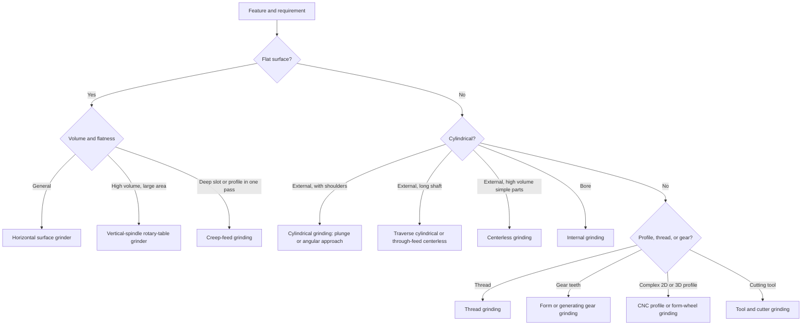

## Grinding Process Classification

### Overview

**Grinding** is an abrasive machining process in which material is removed by a large number of hard, irregularly shaped abrasive grains bonded into a wheel, belt, or segment that moves at high surface speed against the workpiece. Unlike the geometrically defined cutting edges of turning and milling tools, each grain has an **undefined geometry**: typically a highly negative effective rake angle, a small edge radius, and a random orientation. Chips are therefore very small, cutting energy per unit volume is high, and much of the energy leaves as heat.

Grinding is used where cutting processes cannot meet requirements: **hardened materials** (above roughly 45 to 50 HRC, where conventional tools wear rapidly [Inference: threshold varies by tool material and application]), **tight tolerances** (commonly IT5 to IT7), **fine surface finish** (roughly $R_a$ 0.1 to 1.6 μm), and **precision form generation**. Increasingly it is also used for **high-volume stock removal**, as in creep-feed and high-efficiency deep grinding.

Grinding processes are classified along several independent axes. A given operation occupies a position on every axis at once: for example, "plunge grinding a bearing journal on a CNC cylindrical grinder with a vitrified CBN wheel" is external cylindrical (surface generated), plunge (feed mode), form-generating by tracing (wheel geometry), and finishing (purpose).

**Key Points**

- The **surface generated** (flat, external cylindrical, internal cylindrical, form, thread, gear, tool) and the **way the workpiece is supported and moved** (between centers, chucked, or centerless) are the primary classification axes.
- **Feed mode** (traverse, plunge, creep-feed, oscillation) governs the contact length and chip formation, and hence heat, forces, and productivity.
- **Wheel motion relative to workpiece** (peripheral vs. face grinding, up vs. down grinding) affects contact geometry and cooling.
- Grinding is the dominant **finishing** process in a chain that typically passes through turning or milling, heat treatment, and then grinding, followed by honing, lapping, or superfinishing when required.
- The abrasive tool is **self-sharpening** only to a degree: grains fracture (micro-fracture) or the bond wears to release dull grains, and **dressing** and **truing** are needed to restore geometry and sharpness.

### Classification Criteria

| Criterion | Categories |
| --- | --- |
| Surface generated | Flat (surface), external cylindrical, internal cylindrical, form and profile, thread, gear, tool and cutter, spline, cam |
| Workpiece support and location | Between centers, chucked, centerless, magnetic chuck, fixture |
| Wheel contact mode | Peripheral (wheel periphery cuts), face (wheel side or face cuts), cup or segment |
| Feed mode | Traverse (reciprocating), plunge, creep-feed, oscillation, angular-approach |
| Direction relative to workpiece | Up (conventional) grinding, down (climb) grinding |
| Purpose or stage | Rough (stock removal), semi-finish, finish, spark-out |
| Stock-removal intensity | Conventional, creep-feed (deep), high-efficiency deep grinding (HEDG), high-speed |
| Precision level | General, precision, ultra-precision |
| Wheel type and speed | Conventional vitrified, superabrasive (CBN, diamond), high-speed wheels (above about 45 m/s [Inference: threshold conventions vary]) |
| Coolant strategy | Wet (flood), dry, minimum quantity lubrication (MQL), cryogenic |
| Control | Manual, hydraulic, CNC |

### Master Classification Tree

```mermaid
flowchart TD
    A[Grinding processes] --> B[Surface grinding]
    A --> C[Cylindrical grinding]
    A --> D[Centerless grinding]
    A --> E[Internal grinding]
    A --> F[Form and profile grinding]
    A --> G[Special-purpose grinding]
    A --> H[Non-precision grinding]

    B --> B1[Horizontal spindle, reciprocating table]
    B --> B2[Horizontal spindle, rotary table]
    B --> B3[Vertical spindle, reciprocating table]
    B --> B4[Vertical spindle, rotary table]
    B --> B5[Creep-feed grinding]

    C --> C1[Traverse grinding]
    C --> C2[Plunge grinding]
    C --> C3[Angular-approach grinding]
    C --> C4[Taper grinding]
    C --> C5[Non-round: cam, crankshaft]

    D --> D1[Through-feed]
    D --> D2[In-feed / plunge]
    D --> D3[End-feed]
    D --> D4[Internal centerless]

    E --> E1[Chucking-type bore grinding]
    E --> E2[Planetary]
    E --> E3[Centerless internal]

    F --> F1[Profile / form wheel]
    F --> F2[Thread grinding]
    F --> F3[Gear grinding: form and generating]
    F --> F4[Jig and optical profile grinding]

    G --> G1[Tool and cutter grinding]
    G --> G2[Spline and cam grinding]
    G --> G3[Roll grinding]
    G --> G4[Belt grinding]
    G --> G5[Ultrasonic-assisted grinding]

    H --> H1[Snagging]
    H --> H2[Offhand and bench grinding]
    H --> H3[Cut-off / abrasive sawing]
```

### Fundamental Kinematics and Process Variables

The grinding wheel provides the **primary cutting motion** through rotation. Additional motions come from the workpiece or wheel head: work speed, table traverse, and infeed.

Wheel (cutting) speed:

$$v_s = \frac{\pi\, d_s\, n_s}{60 \times 1000}\ \ (\text{m/s};\ d_s\text{ in mm},\ n_s\text{ in rev/min})$$

Workpiece speed $v_w$ and feed rate $v_f$ complete the kinematic set. The **speed ratio** is

$$q = \frac{v_s}{v_w}$$

and is typically large (commonly on the order of 60 to 200 in conventional grinding [Inference: range varies by process]), reflecting that the wheel is far faster than the workpiece.

**Material removal rate** and its normalized form:

$$Q_w = a_e\, v_w\, b_w \ \ (\text{mm}^3/\text{s}) \qquad Q'_w = \frac{Q_w}{b_w} = a_e\, v_w\ \ (\text{mm}^3/\text{s per mm width})$$

where $a_e$ is the working engagement (depth of cut) and $b_w$ the width of cut. The specific removal rate $Q'_w$ is the standard measure of productivity.

**Equivalent chip thickness** describes the average thickness of material carried per unit of wheel surface and correlates with force, surface finish, and wheel wear:

$$h_{eq} = \frac{Q'_w}{v_s} = \frac{a_e\, v_w}{v_s}$$

**Contact length** (geometric) between wheel and workpiece for an external contact of wheel diameter $d_s$ and workpiece diameter $d_w$ (with $d_w \to \infty$ for a flat surface):

$$l_g = \sqrt{a_e\, d_{eq}}, \qquad d_{eq} = \frac{d_s d_w}{d_s \pm d_w}$$

using the plus sign for external contact (cylindrical outer) and the minus sign for internal grinding, where the workpiece bore is larger than the wheel.

**Example**

Surface grinding a steel block with $d_s = 300\ \text{mm}$ at $n_s = 1800\ \text{rev/min}$, table speed $v_w = 0.2\ \text{m/s}$, $a_e = 0.02\ \text{mm}$, and width $b_w = 25\ \text{mm}$.

$$v_s = \frac{\pi \times 300 \times 1800}{60 \times 1000} \approx 28.3\ \text{m/s}$$

$$Q'_w = a_e\, v_w = 0.02 \times 200\ \text{mm/s} = 4\ \text{mm}^3/\text{s per mm}$$

$$h_{eq} = \frac{Q'_w}{v_s} = \frac{4}{28{,}300\ \text{mm/s}} \approx 1.4 \times 10^{-4}\ \text{mm} = 0.14\ \mu\text{m}$$

$$l_g = \sqrt{a_e\, d_s} = \sqrt{0.02 \times 300} = 2.45\ \text{mm}$$

The very small equivalent chip thickness shows why grinding gives fine finish, and why individual grain chips are only micrometer-scale [Inference: real grain-level chip thickness depends on grain density and protrusion and is smaller still].

### Surface Grinding

Surface grinding produces flat (and simple profiled) surfaces. The wheel spindle may be horizontal or vertical, and the worktable may reciprocate or rotate.

| Configuration | Wheel contact | Table motion | Characteristics |
| --- | --- | --- | --- |
| Horizontal spindle, reciprocating table | Periphery of a straight wheel | Linear reciprocation plus cross-feed | Most common; good finish and accuracy; small contact area; easy coolant access |
| Horizontal spindle, rotary table | Periphery | Rotating circular table | Continuous cutting; suited to rings and washers |
| Vertical spindle, reciprocating table | Face of a cup or segment wheel | Linear reciprocation | Large contact area; high removal rate; higher heat |
| Vertical spindle, rotary table | Face of wheel | Rotating table | High-volume flat parts (Blanchard-type grinding), continuous |

**Key Points**

- **Peripheral** grinding has a small, line-like contact zone: good finish and control, lower removal rate.
- **Face (segment or cup wheel)** grinding has a large contact zone: higher removal rate, but higher heat, greater risk of burn, and greater dependence on coolant delivery.
- Workholding is commonly a **magnetic chuck** for ferrous parts; non-magnetic parts use vacuum chucks, vises, or fixtures.

#### Creep-Feed Grinding

Creep-feed grinding uses a very large depth of cut (often several millimeters, up to tens of millimeters in some cases) with a very slow workpiece speed, so a profile or slot can be produced in **one or a few passes**. It is applied to turbine blade roots, slots, and profiles in hard, heat-resistant alloys.

- Large contact length increases heat and the demand on coolant; high-pressure, high-volume coolant delivery (often with shaped nozzles) is critical.
- Wheel wear is controlled through continuous dressing (CD), in which a rotary dresser trues the wheel while grinding proceeds.
- Compared with conventional reciprocating grinding, the total process time can decrease because roughing and finishing are combined [Inference: benefit depends on part geometry and material].

**Example**

Comparing conventional and creep-feed removal rates for a 25 mm wide part:

| Mode | $a_e$ | $v_w$ | $Q'_w = a_e v_w$ |
| --- | --- | --- | --- |
| Conventional | 0.02 mm | 200 mm/s | 4 mm³/(s·mm) |
| Creep-feed | 5 mm | 1 mm/s | 5 mm³/(s·mm) |

The removal rates are similar, but the contact length in creep-feed grinding is far larger ($l_g = \sqrt{5 \times 300} \approx 38.7\ \text{mm}$ versus $2.45\ \text{mm}$), and per-grain chip thickness is much smaller, favoring surface quality while increasing thermal load.

### Cylindrical Grinding (External)

Cylindrical grinding finishes the outside of round workpieces, held **between centers** or in a **chuck**, with the workpiece rotating against a wheel whose axis is parallel to (or slightly inclined to) the workpiece axis.

| Mode | Description | Applications |
| --- | --- | --- |
| **Traverse (through) grinding** | The workpiece or wheel head traverses axially along the length | Long shafts, straight cylinders |
| **Plunge grinding** | The wheel is fed radially into the workpiece with no axial traverse; wheel width equals or exceeds the ground length | Short journals, shoulders, form-wheel work |
| **Angular-approach (shoulder) grinding** | Wheel head set at an angle; grinds diameter and shoulder face in one setup | Stepped shafts with shoulders |
| **Taper grinding** | Table or wheel head swiveled, or CNC interpolation | Tapered shafts, mandrels |
| **Non-round grinding** | Wheel head follows a controlled radial profile synchronized with rotation | Cams, crankshaft pins, polygon shapes |
| **Roll grinding** | Large diameter rolls (steel mills, paper); often with crowning | Rolling mill rolls |

Machine types by wheelhead and table arrangement:

- **Plain cylindrical grinders:** wheelhead fixed in swivel angle; table carries the workpiece.
- **Universal cylindrical grinders:** swiveling wheelhead, headstock, and table, allowing tapers and internal attachments.
- **CNC cylindrical grinders:** programmable X and Z axes, optional B-axis wheelhead swivel and multiple wheels.

The rotational-work relationship in cylindrical grinding, with workpiece diameter reduction rate:

$$\frac{d\,d_w}{dt} = 2\, v_{f,r}$$

where $v_{f,r}$ is the radial infeed rate. For plunge grinding, the specific removal rate is $Q'_w = \pi d_w v_{f,r}$.

**Example**

Plunge grinding a journal of $d_w = 50\ \text{mm}$ at radial infeed $v_{f,r} = 0.5\ \text{mm/min}$ ($0.00833\ \text{mm/s}$):

$$Q'_w = \pi \times 50 \times 0.00833 \approx 1.31\ \text{mm}^3/\text{s per mm}$$

To remove $0.15\ \text{mm}$ radial stock at this rate takes $0.15/0.5 = 0.3\ \text{min}$ (18 s), plus spark-out time for dimensional accuracy and finish.

### Centerless Grinding

In centerless grinding the workpiece is **not held between centers or in a chuck**; it rests on a **work rest blade** between a **grinding wheel** and a **regulating (control) wheel**. The regulating wheel, usually rubber-bonded and rotating slowly, controls the workpiece rotation and (when tilted) its axial travel.

| Mode | Description | Typical use |
| --- | --- | --- |
| **Through-feed** | Regulating wheel is tilted by a small angle (commonly 0.5° to 5° [Inference: typical range]), so the workpiece is driven axially through the gap | Long bars, pins, rollers, cylindrical parts without shoulders |
| **In-feed (plunge)** | Workpiece is placed on the rest, the regulating wheel advances (or the wheel retracts) to finish diameter; no axial travel | Parts with shoulders, forms, tapers |
| **End-feed** | The workpiece is fed axially until it reaches a stop; used for tapered or headed parts | Tapered pins, valve stems |
| **Internal centerless** | Workpiece supported by rolls (regulating roll, support roll, pressure roll) while a small wheel grinds the bore | Bores concentric with the outside (e.g. bearing races) |

Through-feed axial speed depends on regulating wheel speed $v_r$ and tilt angle $\alpha_r$:

$$v_{axial} \approx v_r \sin\alpha_r$$

(neglecting slip between the workpiece and the regulating wheel; real values are lower due to slip [Inference: slip depends on surface condition and coolant]).

**Advantages:**

- Very high productivity for through-feed of simple round parts.
- No center holes or chucking needed, so loading and unloading can be automated.
- Part support along its whole length reduces deflection for slender parts.
- Excellent size consistency.

**Limitations:**

- Setup is sensitive: work-rest height above the wheel-regulating wheel centerline controls **roundness** (the workpiece center is normally set above the line of wheel centers, commonly by an amount related to workpiece diameter, so that lobing and out-of-roundness are corrected; exact values depend on the workpiece and setup).
- Parts with keyways or flats can ride poorly; concentricity to other features is not guaranteed because there is no fixed datum.

### Internal Grinding

Internal grinding finishes bores, using a small-diameter wheel on a high-speed spindle.

| Type | Workpiece and wheel motion | Use |
| --- | --- | --- |
| **Chucking-type** | Workpiece rotates in a chuck; wheel rotates and reciprocates in the bore | Bores in bearings, gear blanks, bushings |
| **Planetary** | Workpiece is stationary; the wheel spindle orbits within the bore in addition to rotating | Large or heavy parts that cannot easily rotate |
| **Centerless internal** | Workpiece supported by rolls | High-volume rings with concentric ID and OD |

Constraints specific to internal grinding:

- **Small wheels and long overhang** limit stiffness; deflection of the spindle and quill reduces accuracy (bell-mouth or taper errors).
- **High spindle speeds** (tens of thousands of rev/min) are needed to keep wheel surface speed reasonable with small diameters; wheel speed is

$$n_s = \frac{60\,000\, v_s}{\pi d_s}$$

(with $n_s$ in rev/min, $v_s$ in m/s, $d_s$ in mm).

- **Large contact length** relative to wheel size (the wheel is nearly as large as the bore) increases heat and coolant delivery difficulty.
- **Wheel wear** changes bore diameter faster than in external grinding, so in-process gauging is commonly used.

**Example**

For a 20 mm diameter internal wheel at $v_s = 25\ \text{m/s}$:

$$n_s = \frac{60{,}000 \times 25}{\pi \times 20} \approx 23{,}873\ \text{rev/min}$$

Such spindle speeds require high-frequency motorized spindles and careful balancing.

### Form and Profile Grinding

| Method | Description | Examples |
| --- | --- | --- |
| **Form-wheel (plunge form) grinding** | The wheel is dressed to the negative of the desired profile and plunged into the workpiece | Thread forms, gear tooth spaces, turbine blade roots, cutter profiles |
| **CNC profile / contour grinding** | The wheel follows a programmed path, sometimes with a corner-radius or small-profile wheel | Complex 2D and 3D shapes |
| **Optical / jig grinding** | Precision positioning and small wheels for hardened tooling | Punches, dies, jig plates |
| **Thread grinding** | Single-rib or multi-rib wheel with workpiece rotation synchronized to axial feed | Precision screws, taps, gauges, ball screws |
| **Gear grinding (form)** | Wheel profile matches the tooth space; indexed between teeth | Hardened gear finishing |
| **Gear grinding (generating)** | Worm (continuous generating) wheel or cup/disk wheels with rolling motion | High-accuracy hardened gears in production |

Form retention is controlled by **dressing**: the wheel is trued with a diamond form roll, or CNC dressing of a rotating tool, so that the profile is maintained with high accuracy. For thread grinding with a single-rib wheel, the axial feed per workpiece revolution equals the thread lead.

### Tool and Cutter Grinding

Specialized grinders sharpen and manufacture cutting tools (drills, end mills, reamers, broaches, hobs, saw blades).

- **Universal tool and cutter grinders:** multi-axis, manual or CNC, for regrinding a wide range of tools.
- **CNC tool grinders:** 5-axis machines producing solid carbide end mills and drills from blanks, with multiple wheel packs and automatic wheel changers.
- **Surface and profile-type sharpening machines:** for planer knives, saw blades, and insert grinding.

Superabrasive wheels (diamond for carbide, CBN for HSS) are typical.

### Abrasive Tool Classification (Wheel Types Relevant to Grinding Process)

The wheel is part of the process definition, so wheel classification complements process classification.

| Aspect | Options |
| --- | --- |
| Abrasive | Aluminum oxide (Al₂O₃, several grades), silicon carbide (SiC), cubic boron nitride (CBN), diamond; sintered/seeded gel (SG) alumina |
| Bond | Vitrified, resinoid (resin), rubber, metal (sintered or electroplated), shellac |
| Structure | Open to dense; determines chip clearance and porosity |
| Grit size | Coarse (about 10 to 24) to fine (about 220 to 600 and above); coarse for stock removal, fine for finish |
| Grade (hardness) | Soft to hard: resistance of the bond to grain release |
| Shape | Straight, cup, dish, cylinder, segment, mounted point, belt |

Typical abrasive-material pairing (general guidance; consult supplier data):

| Workpiece | Common abrasive |
| --- | --- |
| Plain and alloy steels | Aluminum oxide (or CBN for hardened steels) |
| Hardened tool steels, HSS | CBN or aluminum oxide |
| Cast iron, non-ferrous metals | Silicon carbide |
| Cemented carbide, ceramics, glass | Diamond |

**Key Points**

- **CBN is preferred for ferrous materials** because diamond dissolves carbon into iron at grinding temperatures and wears rapidly on steels, whereas **diamond is preferred for non-ferrous, carbide, and ceramic materials** [Inference: widely reported behavior; actual performance depends on conditions].
- Wheel **grade** and **structure** interact with the process: creep-feed grinding uses softer, more open wheels to accommodate large contact lengths and heat.
- Wheel speed limits are set by the bond and wheel construction and are marked on the wheel; wheels must never be operated above their rated maximum speed.

### Wheel Conditioning: Truing and Dressing

| Operation | Purpose |
| --- | --- |
| **Truing** | Restore geometric accuracy (roundness, profile) of the wheel |
| **Dressing** | Restore sharpness and open the wheel surface by removing dulled grains and clogged material |

Methods include single-point diamond dressers, multi-point and form dressers, rotary diamond rolls (for form and CNC dressing), crush dressing, and for superabrasive wheels, brake-controlled truing followed by conditioning with a dressing stick (to expose the grains).

Dressing parameters strongly influence surface roughness through the **overlap ratio**:

$$U_d = \frac{b_d}{f_{ad}}$$

where $b_d$ is the effective dresser width and $f_{ad}$ the dressing feed per wheel revolution. Higher overlap gives a smoother wheel and a finer surface finish but a less aggressive wheel [Inference: relation is qualitative; magnitude depends on abrasive and dressing tool].

### Up vs. Down Grinding and Wheel Contact Direction

| Feature | Up (conventional) grinding | Down (climb) grinding |
| --- | --- | --- |
| Wheel and workpiece surface velocity at contact | Opposed | Same direction |
| Chip thickness | Grows from zero to maximum | Starts at maximum and falls to zero |
| Coolant access | Coolant can be applied at the entry area | More difficult |
| Forces | Tends to lift the workpiece | Tends to press the workpiece down |
| Surface finish | Often better with proper setup | Depends on machine stiffness and dressing |
| Use | General grinding | Cases requiring reduced heat at entry with rigid, backlash-free machines [Inference: practice varies] |

### Grinding Forces, Power, and Specific Energy

Tangential and normal grinding force components:

$$F_t' = \frac{F_t}{b_w}, \qquad F_n' = \frac{F_n}{b_w}$$

Grinding power:

$$P_c = F_t\, v_s$$

**Specific grinding energy** (energy per unit volume removed):

$$e_c = \frac{P_c}{Q_w} = \frac{F_t\, v_s}{Q_w}$$

Grinding specific energy is much higher than in turning or milling (values on the order of 10 to 60 J/mm³ or more for conventional steel grinding, with a marked increase as chip thickness decreases, a manifestation of the **size effect** [Inference: values are indicative; measured values depend on material and conditions]).

**Example**

Suppose $F_t = 60\ \text{N}$, $v_s = 30\ \text{m/s}$, and $Q_w = 100\ \text{mm}^3/\text{s}$:

$$P_c = 60 \times 30 = 1800\ \text{W} = 1.8\ \text{kW}$$

$$e_c = \frac{1800\ \text{W}}{100\ \text{mm}^3/\text{s}} = 18\ \text{J/mm}^3$$

Nearly all of this energy converts to heat. It divides between the chip, the wheel, the coolant, and the workpiece; the workpiece share can be substantial in grinding (often on the order of tens of percent, and higher in creep-feed with poor coolant [Inference: partition depends on wheel type, speed, and coolant]), which is why grinding damage is a major concern.

### Thermal Damage and Its Classification

Excessive grinding temperature produces defects that are integral to process control.

| Defect | Description | Cause | Mitigation |
| --- | --- | --- | --- |
| **Grinding burn** | Discoloration and metallurgical change (temper or re-hardening) | High temperature at the contact zone | Reduce $a_e$ or $v_w$, sharper wheel, better coolant, dress more often |
| **Residual tensile stress** | Tensile layer at the surface | Thermal expansion and plastic flow | Softer wheel, lower heat input, spark-out, stress relief |
| **Grinding cracks** | Cracks perpendicular to grinding direction | High thermal stress in hardened or brittle materials | Lower heat input, proper wheel grade, coolant |
| **Softening (over-tempering)** | Local hardness drop | Temperature above tempering temperature | Control power, use CBN, effective cooling |
| **Rehardening (white layer)** | Untempered martensite on the surface | Temperature above austenitizing followed by quench | Same as above |

Inspection methods include nital etch (temper etch) inspection, Barkhausen noise measurement, and X-ray diffraction residual-stress analysis.

### Coolant and Lubrication Strategies

| Strategy | Notes |
| --- | --- |
| Flood coolant (emulsion or straight oil) | Most common; cooling and lubrication; must overcome the **air barrier** (boundary layer carried by the fast wheel) using properly shaped nozzles matched to wheel speed |
| High-pressure/through-wheel coolant | Delivers fluid into the contact zone; essential for creep-feed and CBN |
| Straight oils | Better lubrication, especially with CBN and for thread and gear grinding; fire and mist hazards |
| MQL | Very small quantity of lubricant; reduces fluid use; limited cooling |
| Dry grinding | Rare; requires very low heat input or special wheels |
| Cryogenic | Emerging; benefits depend on material and setup [Inference] |

Coolant supply requires filtration, since fine swarf and grit degrade surface finish and can damage the wheel.

### Process Chain Position and Tolerance Capability

| Process | Typical tolerance grade | Typical $R_a$ (μm) |
| --- | --- | --- |
| Rough grinding | IT8 to IT9 | 1.6 to 3.2 |
| Finish grinding | IT5 to IT7 | 0.2 to 0.8 |
| Precision (fine) grinding | IT4 to IT5 | 0.05 to 0.2 |
| Centerless through-feed | IT5 to IT7 (roundness depends on setup) | 0.2 to 0.8 |

[Inference: values are typical handbook ranges; actual capability depends on machine, wheel, dressing, fixturing, and environment.]

### High-Speed and High-Efficiency Grinding

- **High-speed grinding:** wheel speeds above about 45 m/s and reaching 80 to 200+ m/s with CBN wheels on steel-core or electroplated bodies [Inference: speed classes vary by source]. Increasing $v_s$ reduces equivalent chip thickness at constant $Q'_w$, lowering forces and improving finish, or enabling higher removal rates.
- **High-efficiency deep grinding (HEDG):** combines high wheel speed, large depth of cut, and high workpiece feed with CBN wheels, often removing volumes comparable with milling while achieving grinding-level quality.
- **Continuous-dress creep-feed grinding (CDCF):** the wheel is continuously dressed during grinding; used on turbine components.

### Non-Precision and Special Grinding Processes

| Process | Description | Typical use |
| --- | --- | --- |
| **Snagging** | Heavy-duty rough grinding to remove excess material or flash | Castings, weld dressing |
| **Offhand and bench grinding** | Manual holding against a wheel | Tool sharpening, deburring |
| **Belt grinding** | Coated abrasive belt over contact wheel, platen, or free run | Stock removal, finishing, complex contours (e.g., turbine blades) |
| **Abrasive cut-off** | Thin bonded abrasive wheel for parting | Cutting hard bar, tube, extrusions |
| **Ultrasonic-assisted grinding** | High-frequency vibration superimposed on the wheel or workpiece | Hard-brittle materials, ceramics [Inference: benefits are application-specific] |
| **ELID (electrolytic in-process dressing) grinding** | Electrolytic dressing of a metal-bonded wheel during grinding | Ultra-fine finishing of hard-brittle materials [Inference: specialized technique] |

### Grinding Process Selection Guide

### Common Defects and Their Causes

| Defect | Likely cause | Mitigation |
| --- | --- | --- |
| Chatter marks (regular waviness) | Wheel imbalance, machine resonance, loaded or uneven wheel | Balance wheel, dress, adjust speeds, improve stiffness or damping |
| Out-of-round (lobing) in centerless grinding | Improper work-rest height, unfavorable geometry | Adjust workrest height and blade angle |
| Taper on ground shaft | Deflection, misaligned centers or table | Reduce infeed, use steady rest, align machine, spark-out |
| Bell-mouthed bore | Wheel or quill deflection at bore entry | Shorter overhang, stiffer quill, reduce infeed |
| Loaded (clogged) wheel | Soft or ductile workpiece, insufficient coolant, dense wheel structure | Open-structure wheel, coarser grit, better coolant, dress |
| Glazed wheel (dull grains, no self-sharpening) | Wheel too hard, low force per grain | Softer grade, more frequent dressing, adjust parameters |
| Burn and cracks | Excess heat | See thermal damage table |
| Poor size control | Wheel wear, thermal drift | In-process gauging, compensation, temperature control |
| Feed lines, spiral marks | Dresser lead or wheel edge geometry | Adjust dressing lead, chamfer wheel edges |

Behavior varies with machine rigidity, wheel, dressing, coolant, workpiece material, and process parameters.

### Safety Considerations

- Wheels must be **inspected (ring test), correctly mounted with proper flanges and blotters**, and never exceed the marked maximum operating speed.
- Wheel guards, work rests (bench grinding rest gaps kept small), and eye and respiratory protection are standard requirements.
- Grinding swarf and coolant mist require extraction and filtration; fine metal dust (especially aluminum, magnesium, and titanium) can be a fire or explosion hazard.

**Conclusion**

Grinding processes are classified first by the **surface generated and the way the workpiece is located** (surface, external cylindrical, internal, centerless, form and profile, and special-purpose grinding), then by **feed mode** (traverse, plunge, creep-feed), **wheel contact and direction** (peripheral or face; up or down), **purpose** (rough to finish), and **intensity** (conventional, high-speed, high-efficiency deep). The abrasive wheel's composition, conditioning, and coolant delivery are integral to each process because grinding depends on undefined-geometry grains, small chips, and high specific energy, which makes thermal management and wheel condition the central control issues. Together these classifications guide machine and wheel selection, parameter setting, and defect diagnosis, and position grinding within the process chain as the principal precision-finishing step for hardened and high-accuracy parts.

**Related Topics**

- Abrasive wheel specification: abrasive, grit, grade, structure, and bond (ISO/ANSI marking systems)
- Wheel dressing and truing methods, CNC dressing, and continuous dressing
- Superabrasive (CBN and diamond) grinding technology
- Grinding mechanics: chip formation, ploughing, rubbing, and the size effect
- Grinding temperature models and thermal damage
- Grinding fluids, nozzle design, and filtration
- Honing, lapping, and superfinishing
- Centerless grinding geometry and setup theory
- Gear and thread grinding technology
- High-efficiency deep grinding and creep-feed grinding
- Grinding of ceramics, carbides, and other hard-brittle materials
- Surface integrity and residual stresses in ground components