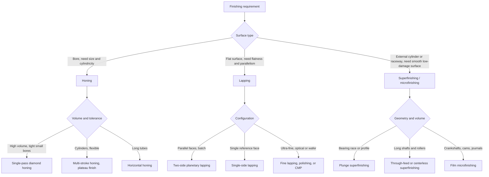

## Honing, Lapping, and Superfinishing Classification

### Overview

**Honing**, **lapping**, and **superfinishing** are fine abrasive finishing processes that follow grinding (or precision cutting) in a manufacturing chain. They remove very small amounts of material, commonly from a fraction of a micrometer to a few tens of micrometers per operation, in order to improve **dimensional accuracy**, **geometric form** (roundness, cylindricity, flatness), and **surface texture**, and to create surfaces with specific functional characteristics such as oil-retaining cross-hatch patterns.

All three use abrasive grains, but they differ from grinding in three ways:

- **Low speeds and low pressures:** cutting speeds are typically far below grinding wheel speeds, and contact pressures are small, so heat generation is low and thermal damage (burn, tensile residual stress) is largely avoided.
- **Large contact area and compliant or self-adjusting tooling:** the abrasive tool conforms to, or averages over, the workpiece surface, so the process corrects form errors progressively rather than reproducing the machine's motion errors.
- **Complex, non-repeating motion paths:** overlapping or crossing tool paths distribute wear evenly and produce characteristic lay patterns.

The three families are classified along several independent axes. A given operation occupies a position on every axis at once: for example, "two-side lapping of hardened steel washers on a planetary carrier machine with a bonded-abrasive slurry" is lapping (family), two-side flat (surface generated), free-abrasive (abrasive condition), and batch (workholding).

**Key Points**

- **Honing** uses **bonded abrasive stones** in a combined **rotation and reciprocation** motion to finish **bores** (and, less commonly, external cylinders and flat surfaces), producing a **cross-hatch** pattern.
- **Lapping** uses **loose abrasive grains in a carrier fluid (slurry or paste)** carried between the workpiece and a **lap plate**, producing very flat, very smooth, geometrically accurate surfaces with a random, non-directional texture. **Fixed-abrasive** (bonded or embedded) lapping variants also exist.
- **Superfinishing (microfinishing)** uses a **bonded abrasive stone** under light, constant pressure with a **short-stroke oscillation** superimposed on workpiece rotation, removing the damaged surface layer and leaving a very smooth surface with a plateau-like profile.
- Material removal in all three is driven by **many grains taking very small chips**, and the process is **self-limiting** in the sense that as the surface approaches the target geometry the removal rate falls.
- Typical positions in the process chain: **hone** after boring or grinding for bore size and cylindricity; **lap** after grinding for flatness and sealing surfaces; **superfinish** after grinding for bearing and sliding surfaces.

### Classification Criteria

| Criterion | Categories |
| --- | --- |
| Process family | Honing, lapping, superfinishing (and related microfinishing) |
| Surface generated | Internal cylindrical (bore), external cylindrical, flat, spherical, conical, gear flank, profile |
| Abrasive condition | Bonded (stone, film, or bonded lap) vs. free (loose slurry or paste) |
| Tool motion | Rotation plus reciprocation (honing), planetary or figure-eight (lapping), oscillation plus rotation (superfinishing) |
| Number of sides finished | One-side vs. two-side (simultaneous) |
| Workholding | Fixed in fixture, free in carrier (batch), through-feed |
| Stock-removal intensity | Rough (coarse), semi-finish, finish (fine), polishing-level |
| Tool expansion | Fixed-size tool vs. expanding (radially fed) tool |
| Feed control | Constant pressure (force-controlled) vs. constant feed (rate-controlled) |
| Control | Manual, semi-automatic, CNC with in-process gauging |
| Environment | Standard vs. controlled (temperature-stable and clean-room for ultra-precision) |

### Master Classification Tree

```mermaid
flowchart TD
    A[Fine abrasive finishing] --> B[Honing]
    A --> C[Lapping]
    A --> D[Superfinishing / microfinishing]

    B --> B1[Bore honing]
    B --> B2[External honing]
    B --> B3[Flat honing]
    B --> B4[Specialty honing]

    B1 --> B1a[Single-pass honing]
    B1 --> B1b[Multi-stroke honing]
    B1 --> B1c[Plateau / multi-stage honing]
    B1 --> B1d[Vertical and horizontal machines]

    B4 --> B4a[Diamond and CBN honing]
    B4 --> B4b[Rotary-hone / flex-hone / brush hone]
    B4 --> B4c[Electrochemical honing]
    B4 --> B4d[Gear honing]

    C --> C1[Free-abrasive lapping]
    C --> C2[Fixed-abrasive lapping]
    C --> C3[Flat lapping]
    C --> C4[Cylindrical lapping]
    C --> C5[Special lapping]

    C3 --> C3a[Single-side]
    C3 --> C3b[Two-side, planetary]
    C3 --> C3c[Chemical-mechanical: CMP]

    C5 --> C5a[Spherical lapping]
    C5 --> C5b[Valve and seat lapping]
    C5 --> C5c[Gear lapping]
    C5 --> C5d[Hand lapping]

    D --> D1[Cylindrical superfinishing]
    D --> D2[Through-feed centerless superfinishing]
    D --> D3[Plunge / in-feed superfinishing]
    D --> D4[Flat and profile superfinishing]
    D --> D5[Film / tape microfinishing]
    D --> D6[Belt microfinishing]
```

### Fundamental Comparison

| Feature | Honing | Lapping | Superfinishing |
| --- | --- | --- | --- |
| Abrasive | Bonded stones (sticks) | Loose grains in fluid (or bonded/embedded) | Bonded stone |
| Tool | Expanding hone head with stones | Lap plate (cast iron, copper, tin alloy, glass, polymer) | Fine-grit stone in holder |
| Tool motion | Rotation + reciprocation | Random / planetary relative motion | Oscillation (short stroke) + workpiece rotation |
| Contact pressure | Low to moderate, controlled | Low, from lap load | Very low, constant |
| Cutting speed | Typically about 0.5 to 3 m/s [Inference: range varies by application] | Low, typically a few m/s at most | Low to moderate; workpiece surface speed roughly 0.1 to 1 m/s [Inference] |
| Typical surface | Cross-hatch, controlled angle | Non-directional, matte to bright | Plateau-like, low $R_a$ |
| Principal purpose | Bore size, cylindricity, cross-hatch texture | Flatness, parallelism, surface finish, sealing | Surface finish, removal of damaged layer, bearing surfaces |
| Typical stock removal | About 5 to 100 μm [Inference] | Sub-micron to tens of μm | About 1 to 10 μm [Inference] |
| Form correction | Strong (roundness, straightness, taper) | Strong (flatness, parallelism) | Limited (surface texture; mostly not form) |
| Thermal damage | Very low | Very low | Very low |

[Inference: ranges are typical handbook orders of magnitude and vary by material, machine, and abrasive.]

### Honing

Honing is a **low-velocity, low-pressure** abrasive process that combines **rotation and reciprocating (axial) stroking** of a tool carrying bonded abrasive stones inside a bore. The stones are pressed radially outward against the bore wall by an expanding mechanism, and the combined motion generates a **cross-hatch** lay.

#### Kinematics and Cross-Hatch Angle

The resultant path of each grain is a helix whose angle relative to the bore axis depends on the ratio of rotational to reciprocating speeds. With rotational surface speed $v_r$ and axial stroking speed $v_a$, the cross-hatch angle $\theta$ (the included angle between the crossing lay lines is $2\theta$) satisfies

$$\tan\theta = \frac{v_r}{v_a}$$

Rotational surface speed:

$$v_r = \frac{\pi d\, n}{1000 \times 60}\ \ (\text{m/s};\ d\text{ in mm},\ n\text{ in rev/min})$$

**Example**

For a bore of $d = 100\ \text{mm}$ honed at $n = 120\ \text{rev/min}$ with a reciprocation speed $v_a = 0.4\ \text{m/s}$:

$$v_r = \frac{\pi \times 100 \times 120}{60{,}000} = 0.628\ \text{m/s}$$

$$\theta = \arctan\!\left(\frac{0.628}{0.4}\right) \approx 57.5^\circ$$

so the crossing lay lines meet at an included angle of about $115^\circ$. Automotive cylinder bores are often specified with cross-hatch angles in a range of roughly 40° to 60° included angle [Inference: specifications vary by engine and manufacturer], obtained by adjusting the speed ratio. A larger included angle tends to give smoother sliding but less oil retention, and a smaller angle the opposite, so the angle is a functional design parameter.

#### Classification of Honing

**By surface generated**

| Type | Description | Typical use |
| --- | --- | --- |
| Bore (internal) honing | Expanding hone in a cylindrical bore | Engine cylinders, hydraulic cylinders, gear bores, fuel-injection components, bearing bores |
| External honing | Stones or a honing ring around an outer cylinder | Pins, plungers, spool valves |
| Flat honing | Abrasive tool or plate on a flat surface; often two-side | Piston rings, thrust washers, sealing surfaces |
| Gear honing | A honing tool of a gear-like form meshes with hardened gear teeth | Improve gear noise and finish [Inference: specialized use] |

**By process control**

- **Single-pass honing:** an expanding tool is passed through the bore once, with a fixed diameter set by tool size; **precision, high-volume** for small bores (for example, fuel-injection and hydraulic valve bores) with very tight tolerances; often a diamond tool with a plated or sintered abrasive layer.
- **Multi-stroke (conventional) honing:** the tool expands during repeated strokes until the target size is reached; flexible, widely used for cylinders and larger bores.
- **Plateau (multi-stage) honing:** a rough hone stage sets size and cross-hatch depth, followed by a fine hone stage that removes the tops of the roughness peaks to create a **plateau surface** with deep oil-retention valleys and a smooth bearing area. Typical of engine cylinder finishing.
- **Vertical vs. horizontal honing machines:** vertical machines suit short, medium-length bores, whereas horizontal machines suit long bores (hydraulic and pneumatic cylinder tubes), since the tool is supported by both ends or a long bar.

**By tool and abrasive**

| Tool type | Characteristics |
| --- | --- |
| Conventional abrasive stones (Al₂O₃, SiC) | Lower cost; rapid wear; used for general work and softer materials |
| Diamond honing stones (metal or resin bond) | Long life, consistent size; standard for cast iron, ceramics, carbide, and high-volume production |
| CBN honing stones | Preferred for hardened steels [Inference: widely reported; depends on application] |
| Flexible-brush honing / flex-hone (ball hone) | Abrasive globules on flexible filaments; light deburring and surface refinement; cross-hatch generation on small bores |
| Diamond-plated single-pass tools | For very tight tolerances in high-volume small bores |
| Electrochemical honing | Combines electrochemical dissolution with mechanical honing for hard or difficult materials [Inference: niche process] |

**By size control**

- **Fixed-size or size-controlled tools:** the expansion is limited by an internal mechanical stop, so the final diameter follows the tool size.
- **Force- or pressure-controlled expansion:** constant radial force during cutting; better suited to correcting form errors.
- **Feed-controlled expansion (constant feed):** faster and more predictable stock removal.
- **In-process gauging (air gauging or electronic):** measures the bore during honing and terminates the cycle at the target diameter.

#### Stock Removal and Cycle Time

Radial stock removal rate depends on radial stone pressure, stone grade, and speeds. A simple planning relation for bore honing time is

$$t_h = \frac{S}{\dot{S}}$$

where $S$ is the total diametral stock removal and $\dot{S}$ the diametral removal rate obtained from process trials or supplier data [Inference: removal rate is empirical and must be established for each material and stone].

**Example**

To hone a cast-iron cylinder bore with $S = 0.06\ \text{mm}$ diametral stock at $\dot{S} = 0.02\ \text{mm/min}$ diametral removal rate:

$$t_h = \frac{0.06}{0.02} = 3\ \text{min}$$

plus a finishing (plateau) stage. Cycle time also includes tool changeover and gauging time, so the achievable rate differs between rough and finish stages.

#### Geometric Correction in Honing

Honing corrects form errors because the stones are long relative to the bore and average over the surface: high spots see more pressure and are removed faster, while low spots are contacted less. The correction depends on:

- **Stone length relative to bore length** (a common practice is a stone length of roughly 50% to 100% of the bore length, and **overtravel** past the ends of the bore of roughly one third of the stone length [Inference: commonly cited rules of thumb; actual practice is set empirically]). Too little overtravel gives bell-mouthing at the ends, and too much gives barrel shape or taper.
- **Rigid vs. floating tool mounting:** floating (self-aligning) mounting via a universal joint or flexible drive lets the hone follow the existing bore axis, which is good for size and roundness but does not correct bore axis position. A rigid spindle can correct axis errors to a degree but requires an accurate machine.

**Key Points**

- Honing **does not correct bore position or axis alignment** when the tool is floating; it corrects **size, roundness, straightness, and cylindricity**.
- **Thermal effects** on bore diameter can be significant relative to honing tolerances, so workpiece temperature and coolant control matter.
- **Honing oil or fluid** flushes swarf and carries away heat, and cleaning of the finished part matters because embedded abrasive is undesirable.

### Lapping

Lapping is an abrasive process in which the workpiece is rubbed against a **lap** (a plate or block of a softer or comparable material) with an **abrasive** held between the two surfaces. The lap is often softer than the workpiece so that abrasive grains **embed in the lap** and roll or slide across the surface, producing very fine, isotropic scratches.

#### Mechanisms

- **Three-body (rolling grain) abrasion:** loose grains roll between the two surfaces, producing small indentations and micro-chips; typical of loose-abrasive lapping with a hard lap and a fluid carrier; yields a matte surface with no directional lay.
- **Two-body (embedded grain) abrasion:** grains are embedded in a soft lap (cast iron, copper, lead-tin) and cut by sliding; gives a more directional cutting action and typically a higher removal rate.
- **Chemical-mechanical action:** in chemical-mechanical planarization (CMP), chemical reaction softens or modifies the surface layer, which is then removed by abrasive rubbing; used for silicon wafers and optics.

#### Removal Rate: Preston's Relation

A widely used empirical relationship for lapping and polishing removal rate is **Preston's equation**:

$$\frac{dh}{dt} = K_p\, p\, v_{rel}$$

where $h$ is the removed thickness, $p$ the contact pressure, $v_{rel}$ the relative sliding speed, and $K_p$ the Preston coefficient (dependent on abrasive, slurry, lap, and workpiece material). Preston's relation is empirical and not universal; deviations occur at low speeds or pressures and with certain slurries [Inference].

**Example**

Given $K_p = 1 \times 10^{-13}\ \text{m}^2/\text{N}$ (an illustrative value [Inference: real coefficients vary widely]), pressure $p = 20\ \text{kPa}$, and relative velocity $v_{rel} = 1\ \text{m/s}$:

$$\frac{dh}{dt} = 10^{-13} \times 2\times 10^{4} \times 1 = 2\times 10^{-9}\ \text{m/s} = 2\ \text{nm/s} = 0.12\ \mu\text{m/min}$$

which shows the very low removal rates typical of fine lapping and polishing. Removing $6\ \mu\text{m}$ would take about $50\ \text{min}$ at this rate, so coarse lapping stages use coarser abrasive and higher pressure to remove stock faster.

#### Classification of Lapping

**By surface generated**

| Type | Description | Typical use |
| --- | --- | --- |
| Flat lapping | Workpieces on a flat lap plate; single- or two-side | Gauge blocks, seals, bearing washers, valve plates, silicon wafers, optical flats |
| Cylindrical lapping | Ring-type or split-lap around an external cylinder; or rod-type lap in a bore | Gauge pins, precision bores |
| Spherical lapping | Concave or convex spherical laps | Ball bearing balls, ball-valve elements, optical lenses |
| Conical/valve-seat lapping | Lapping a valve to its seat with abrasive paste | Valves and seats |
| Gear lapping | Gear and mating lapping gear under load with abrasive | Bevel gear sets for noise reduction [Inference: specialized] |

**By abrasive condition**

| Type | Description | Comments |
| --- | --- | --- |
| **Free-abrasive (loose) lapping** | Abrasive slurry or paste applied between the workpiece and lap | Traditional; extremely flexible; requires slurry management and cleaning |
| **Fixed-abrasive lapping** | Abrasive bonded in a pad, plate, film, or embedded in a lap | Cleaner, more stable process, faster in some cases; diamond pellets on a metal plate are common |
| **Lapping with bonded-abrasive wheels (grinding-lapping or "fine grinding")** | Planetary-type machine with grinding-like abrasive plates | Highly productive flat finishing; borders on grinding |

**By configuration**

- **Single-side lapping:** one surface is lapped at a time against a plate, with the workpiece held in a conditioning ring; the ring is typically used to keep the lap flat by wearing evenly.
- **Two-side (double-side) lapping:** workpieces sit in **carriers** with planetary motion between an upper and a lower lap plate; both faces are lapped simultaneously and become flat and parallel; the standard method for washers, wafers, and precision plates.
- **Hand lapping:** manual lapping on a flat plate or lap; used in toolrooms, gauge making, and repair.
- **Chemical-mechanical polishing (CMP):** a polishing pad and chemically active slurry; ultrafine finishing of semiconductor wafers, optics, and hard disk substrates [Inference: often classified with polishing rather than lapping].

**Machine motion (two-side planetary lapping)**

Carriers with external gear teeth mesh with an inner (sun) pin ring and an outer pin ring; as the rings turn at different speeds, each carrier both rotates about its own axis and orbits, so each workpiece follows a **hypocycloidal or epicycloidal** path that crosses itself repeatedly. This yields uniform removal and non-directional finish.

#### Lap Plate Materials and Abrasives

| Lap material | Typical use |
| --- | --- |
| Fine-grained cast iron | General-purpose lapping of steels and cast iron; widely used |
| Copper and brass | Softer lap; embeds diamond well; used for hard materials |
| Tin, lead alloys | Very soft; fine finishes on softer or delicate materials |
| Glass | Optical flats and very fine finishing |
| Polymer, cloth, or polyurethane pads | Polishing and CMP |
| Ceramic and composite plates | Special uses; dimensional stability |

| Abrasive | Typical use |
| --- | --- |
| Aluminum oxide | General lapping of steel and non-ferrous metals |
| Silicon carbide | Cast iron, carbides, brittle materials, non-ferrous |
| Boron carbide | Hard materials (hard, expensive) |
| Diamond (paste, slurry, or bonded) | Carbide, ceramics, hardened steels, and very fine finishes |
| Cerium oxide | Glass and optics polishing |
| Colloidal silica | Silicon wafer polishing, CMP |

Grit sizes range from coarse (about 100 to 200 mesh for rapid lapping) to extremely fine (sub-micron for final finishing) [Inference: ranges vary by source].

**Key Points**

- Lapping is typically the **highest-accuracy conventional finishing method for flatness**: flatness of a fraction of a micrometer over large areas is attainable in controlled conditions, and optical-grade surfaces are attainable with further polishing [Inference: capability depends on lap quality, environment, and process control].
- Lap flatness governs workpiece flatness, so laps must be **reconditioned** (re-trued) regularly; conditioning rings and a conditioning plate procedure maintain lap geometry.
- **Cleanliness** is critical: coarse abrasive contamination at a fine stage causes deep scratches.
- **Embedded abrasive** in the workpiece surface is a known drawback for soft materials.

### Superfinishing (Microfinishing)

Superfinishing removes the **thin, damaged (smeared, work-hardened) surface layer** left by grinding, using a **fine-grit bonded stone** under **light, constant pressure**, with a **short-stroke, high-frequency oscillation** superimposed on the workpiece rotation. It produces a very smooth surface with a low roughness and a **plateau-like** bearing profile.

#### Kinematics and Lay Pattern

The workpiece rotates at surface speed $v_w$ while the stone oscillates along the axial direction with frequency $f_o$ and amplitude (half-stroke) $a_o$. The peak axial velocity of the stone is

$$v_{o,max} = 2\pi f_o a_o$$

The resulting grain path is a sinusoid on the surface, with a **cross-hatch or crossing lay at a shallow angle**. The instantaneous path angle $\psi$ (relative to the circumferential direction) satisfies

$$\tan\psi = \frac{v_{o,max}}{v_w}\cos(2\pi f_o t)$$

so the paths cross at varying angles that average out grain marks and generate a fine, non-repeating pattern.

**Example**

A journal of $d = 40\ \text{mm}$ rotating at $n = 600\ \text{rev/min}$ has surface speed

$$v_w = \frac{\pi \times 40 \times 600}{60{,}000} = 1.26\ \text{m/s}$$

With oscillation frequency $f_o = 25\ \text{Hz}$ and half-stroke $a_o = 1.5\ \text{mm}$:

$$v_{o,max} = 2\pi \times 25 \times 0.0015 = 0.236\ \text{m/s}$$

The maximum path angle is $\arctan(0.236/1.26) \approx 10.6^\circ$, so the path is a shallow sinusoid about the circumference, and grains cross previous scratches many times per revolution.

#### Stages and Self-Limiting Behavior

Superfinishing typically proceeds in two effective stages:

1. **Initial cutting stage:** the stone contacts the rough peaks; the actual contact area is small, so local pressure is high and material removal is relatively fast. Stone grains break down and self-sharpen.
2. **Finishing (polishing) stage:** as peaks are removed, the contact area grows, local pressure falls, and cutting slows; eventually a lubricating layer (superfinishing oil or kerosene-based fluid) supports the stone hydrodynamically and cutting ceases. The process is therefore **self-limiting**, which ensures consistency without precise timing [Inference: behavior is idealized; practical cycle times are still set empirically].

Typical practice uses a **low-viscosity cutting fluid (often kerosene-based)** to flush chips and carry heat.

#### Classification of Superfinishing

| Type | Description | Typical use |
| --- | --- | --- |
| **Plunge (in-feed) superfinishing** | Stone (often shaped to the profile) presses against the rotating workpiece with oscillation; no axial traverse | Bearing races (raceway profiles), journals, cams, rollers |
| **Through-feed superfinishing** | Workpieces rotate on rolls while passing under oscillating stones | Cylindrical rollers, pins, shafts |
| **Centerless superfinishing** | Workpiece supported by rolls and blade; continuous through-feed | High-volume simple cylinders |
| **Flat and profile superfinishing** | Oscillating stone on a flat or profiled surface | Flat sealing faces, form surfaces |
| **Film (tape) microfinishing** | Abrasive coated film pressed by a contact roller or shoe against a rotating workpiece, with oscillation | Crankshaft journals, camshafts, bearing surfaces, hydraulic rods |
| **Belt microfinishing** | Coated abrasive belt for larger parts | Rolls, large shafts |
| **Superfinishing of bores** | Small stone or film on an expanding arbor | Bearing and hydraulic bores, limited use [Inference] |

Film microfinishing has become widespread in automotive powertrain production because it is fast, has low tooling cost, and gives repeatable results using indexed film.

#### Typical Outcomes and Functional Benefits

- **Low roughness** ($R_a$ commonly about 0.02 to 0.2 μm, depending on material and process [Inference]).
- **Improved bearing area (high $R_{mr}$ or low $R_{pk}$)**: the surface has flat plateaus and remaining valleys, which raise the load-bearing fraction and retain lubricant.
- **Removal of the amorphous or damaged layer** from grinding, improving fatigue performance, wear resistance, and rolling-contact life.
- **Reduced run-in wear** in bearings and sliding components.
- **Limited form correction:** superfinishing improves waviness and, slightly, roundness, but is not a substitute for grinding accuracy.

**Key Points**

- Superfinishing is **light, low-heat, and low-stress**; it does not introduce thermal damage and can improve residual stress state by removing a thermally damaged layer.
- The **stone grade and grit** control aggressiveness: for example, a fine grit yields a low $R_a$ but a low removal rate. Ordinary stones are aluminum oxide or silicon carbide; CBN and diamond are used for hard materials in specialized cases.
- **Coolant cleanliness** and filtration are essential to prevent scratches.

### Related and Boundary Processes

| Process | Relationship |
| --- | --- |
| **Polishing** | Even finer abrasive action with compliant tool (cloth, felt, pad); goal is optical-quality smoothness, often with chemical assistance |
| **Chemical-mechanical planarization (CMP)** | Wafer and thin-film planarization; overlaps with lapping and polishing |
| **Roller burnishing** | Plastic deformation, not abrasive removal; used as an alternative finishing for bores and shafts |
| **Abrasive flow machining (AFM)** | Abrasive-laden viscoelastic media extruded through passages; finishes internal channels |
| **Magnetic abrasive finishing and vibratory/barrel finishing** | Mass finishing methods for edges and surfaces; less form control |
| **Fine grinding and micro-grinding** | Bonded wheels on lapping-type machines; borders on grinding |
| **Ultrasonic lapping and polishing** | Adds ultrasonic vibration for hard-brittle materials [Inference: specialized] |

### Roughness Metrics and Functional Parameters

The finishing family is often specified by surface-texture parameters beyond $R_a$.

| Parameter | Meaning |
| --- | --- |
| $R_a$ | Arithmetic mean roughness |
| $R_z$ | Mean peak-to-valley height |
| $R_{pk}$ | Reduced peak height (peaks removed first in run-in) |
| $R_k$ | Core roughness depth (bearing region) |
| $R_{vk}$ | Reduced valley depth (oil-retention capacity) |
| $R_{mr}$ | Material ratio at a given depth (bearing-area fraction) |

Plateau honing and superfinishing are frequently specified using the **$R_k$ family (Abbott-Firestone curve) parameters**: low $R_{pk}$, moderate $R_k$, and sufficient $R_{vk}$ for oil retention.

Approximate outcome ranges (indicative only):

| Process | Typical $R_a$ (μm) | Typical geometric capability |
| --- | --- | --- |
| Honing (plateau, cylinder bore) | 0.1 to 0.8 | Cylindricity to a few micrometers or better on precision bores |
| Lapping (flat) | 0.02 to 0.4 | Flatness to sub-micrometer on suitable parts |
| Superfinishing | 0.02 to 0.2 | Waviness and surface texture improvement |
| Polishing / CMP | Below 0.02, down to nanometer level | Optical-quality surfaces |

[Inference: values are typical handbook ranges; actual capability depends on machine, tooling, workpiece material, and environment.]

### Process Selection Guide

| Requirement | Suggested process |
| --- | --- |
| Correct bore size, roundness, straightness, and create oil-retaining cross-hatch | Honing (multi-stroke or plateau) |
| Very tight-tolerance small bore in production | Single-pass diamond honing |
| Flat, parallel, sealing-quality faces | Lapping (two-side for parallelism) |
| Optical or semiconductor-grade flatness | Fine lapping followed by polishing or CMP |
| Remove grinding-damaged layer, low friction bearing surface | Superfinishing |
| High-volume crank and cam journals | Film microfinishing |
| Very hard or brittle materials (ceramic, carbide) | Diamond honing or diamond lapping |

### Process Variables and Their Effects

| Variable | Effect |
| --- | --- |
| Abrasive grit size | Coarse: higher removal, rougher finish; fine: slower, smoother |
| Abrasive type and hardness relative to work | Determines cutting vs. rubbing and tool wear |
| Bond hardness (stones) | Soft bond releases grains faster (self-sharpening); hard bond retains grains, good for shape retention |
| Contact pressure | Higher pressure raises removal rate but increases roughness, temperature, and risk of glazing or scratches |
| Relative speed | Raises removal rate (per Preston's relation) but raises heat and may change mechanism |
| Fluid (coolant, honing oil, slurry) | Flushes swarf, controls temperature, lubricates; viscosity affects cutting and hydrodynamic lift |
| Stroke length and overtravel (honing) | Controls end shape (bell mouth, barrel, taper) |
| Speed ratio | Controls cross-hatch angle (honing) and path crossing (lapping, superfinishing) |
| Lap or stone condition | Flatness or geometry retention; requires conditioning |
| Temperature | Thermal expansion affects size control; stabilize workpiece and coolant temperature |

### Common Defects and Their Causes

| Defect | Likely cause | Mitigation |
| --- | --- | --- |
| Bell-mouth or barrel bore (honing) | Incorrect overtravel or stone length, uneven wear | Adjust stroke, stone length, and overtravel |
| Taper in bore | Uneven pressure, worn stone, misalignment | Dress or replace stones, verify tool alignment |
| Out-of-round (honing) | Worn or unevenly loaded stones, thermal effects | Balance loading, control temperature, update stones |
| Scratches (lapping) | Contaminated slurry, oversized grains, debris | Filter and separate abrasive, clean workstation between stages |
| Non-flat parts (lapping) | Non-flat lap, uneven wear | Recondition lap with a conditioning ring, correct pressure distribution |
| Rounded edges (lapping) | Excess pressure or time, edge loading | Reduce load, shorten cycle, use edge-supporting carriers |
| Chatter or feed lines (superfinishing) | Stone dull or glazed, wrong pressure, vibration | Dress or change stone, adjust oscillation and pressure |
| Insufficient finish improvement | Stone too hard or too coarse, insufficient cycle time | Softer grade, finer grit, adjust process time |
| Embedded abrasive | Soft workpiece and free abrasive | Use bonded abrasive, harder laps, or thorough cleaning |
| Stone loading or glazing | Wrong stone grade, insufficient fluid | Open-structure or softer stone, higher fluid flow, filtering |

Behavior varies with machine rigidity, tooling, abrasive, fluid, workpiece material, and process parameters.

### Metrology and Process Control

- **Bore gauging:** air gauges (pneumatic), electronic plug gauges, and in-process gauging for honing size control.
- **Form measurement:** roundness and cylindricity instruments for bores and journals; optical flats and interferometers for flatness of lapped surfaces.
- **Surface texture:** stylus profilometers and optical profilers for $R_a$, $R_z$, and $R_k$ family parameters.
- **Process monitoring:** honing force or power monitoring, lap plate flatness checks, and slurry concentration monitoring.
- **Environment:** temperature control, filtered fluids, and cleanliness standards, particularly for lapping of precision components.

### Practical Summary

**Conclusion**

Honing, lapping, and superfinishing are the principal fine-finishing families in abrasive process classification. Honing finishes bores using bonded stones with combined rotation and reciprocation, correcting size and cylindricity and generating a functional cross-hatch. Lapping uses loose (or fixed) abrasive between a workpiece and a lap plate to produce extremely flat, parallel, and smooth surfaces with non-directional texture. Superfinishing applies a fine stone under light pressure with short-stroke oscillation to remove the damaged layer left by grinding and produce a low-roughness, plateau-like bearing surface. Each is further classified by surface generated, abrasive condition (bonded vs. free), tool motion, configuration (single-side vs. two-side, plunge vs. through-feed), and level of process control. Because all three operate at low speeds, low pressures, and low thermal load, they are the preferred final steps where form accuracy, surface integrity, and tribological performance are the governing requirements.

**Related Topics**

- Grinding process classification
- Abrasive wheel and stone specification (abrasive, grit, bond, structure)
- Polishing and chemical-mechanical planarization (CMP)
- Surface texture parameters and the Abbott-Firestone curve
- Plateau honing for engine cylinders and tribological design
- Diamond and CBN superabrasive tooling for finishing
- Preston's equation and material-removal modeling in lapping
- Film and belt microfinishing for crankshafts and camshafts
- Abrasive flow machining, magnetic abrasive finishing, and mass finishing
- Roller burnishing as a non-abrasive finishing alternative
- Gauging and in-process measurement for bore and flat finishing
- Surface integrity and residual stress after finishing