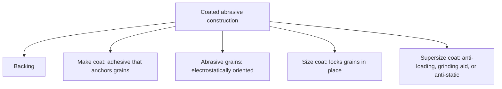
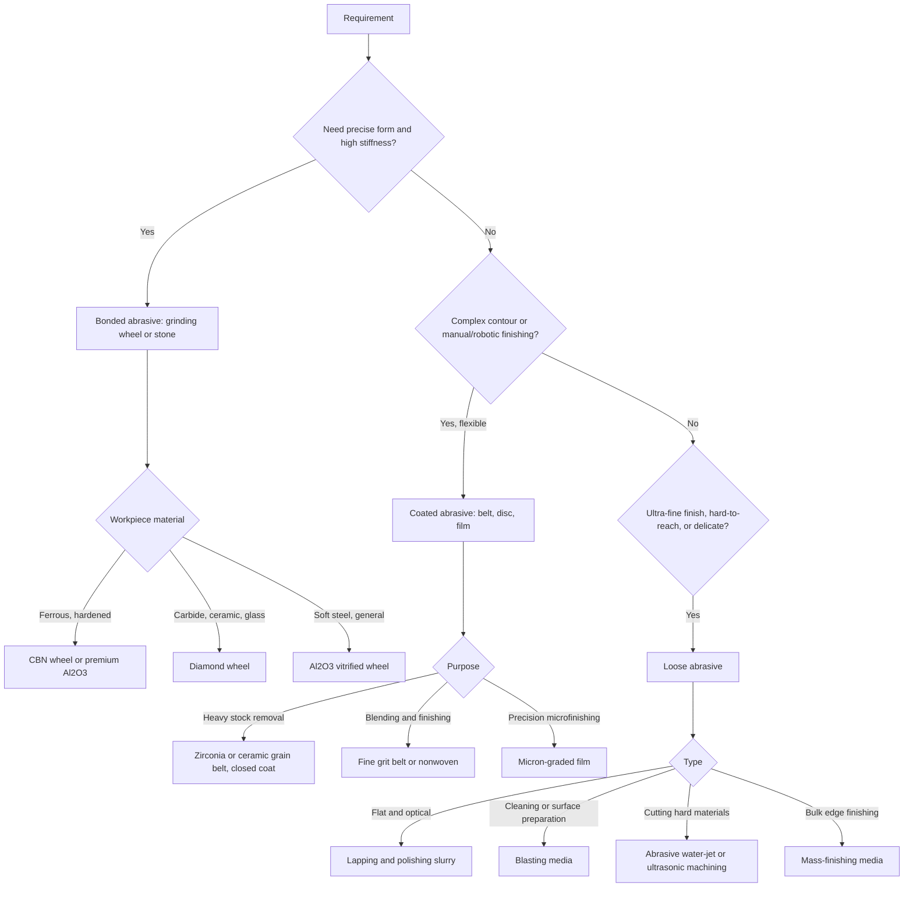

## Bonded, Coated, and Loose-Abrasive Classification

### Overview

Abrasive processes remove material with hard grains, and the way those grains are **held and presented** to the workpiece is one of the most fundamental classification axes. Three primary categories result:

- **Bonded abrasives:** grains held throughout a three-dimensional solid body by a **bond** matrix (grinding wheels, honing stones, segments, mounted points, cut-off wheels).
- **Coated abrasives:** grains adhered in a **single (or shallow) layer** onto a flexible **backing** using adhesive layers (sanding belts, discs, sheets, flap wheels, microfinishing film).
- **Loose (free) abrasives:** grains **not fixed** in any body, but delivered as **powders, slurries, pastes, or streams** (lapping and polishing slurries, abrasive blasting, abrasive jet, ultrasonic machining slurry, mass-finishing media).

A fourth, intermediate group of **semi-bonded and structured systems** (nonwoven abrasives, structured abrasives with engineered micro-replicated shapes, abrasive-filled brushes, and viscoelastic abrasive media) sits between these classes.

The classification determines the *mechanics of material removal*: how grains are supported, how they wear, how chips and heat are cleared, how the tool is conditioned, and what accuracy and finish are achievable. A given operation occupies a position on several axes at once. For example, "belt grinding of a turbine blade with a ceramic-grain coated belt over a contact wheel" is coated (grain presentation), fixed-abrasive (three-body vs. two-body), compliant (support), and flexible-form (geometry).

**Key Points**

- **Bonded** abrasives are **rigid, thick, and dressable**: they can be trued and re-sharpened, so they hold **geometric accuracy** and are the basis of precision grinding.
- **Coated** abrasives are **thin and flexible**, consumed by wear (not dressed), with a **single active layer of grains**, well suited to **conforming to complex shapes**, and to **low-cost, flexible stock removal and finishing**.
- **Loose** abrasives allow **very fine, low-damage finishing** and **hard-to-reach or delicate geometries**, but with **less predictable, more process-sensitive** removal.
- The grain material (Al₂O₃, SiC, CBN, diamond) is largely independent of the classification; each grain type can appear in bonded, coated, or loose form.
- Grain **retention** (bond strength), **grain exposure** (protrusion), and **chip space** (porosity or open coat) are the three design levers shared by all forms.

### Classification Criteria

| Criterion | Categories |
| --- | --- |
| Grain holding | Bonded (3D matrix), coated (single layer on backing), loose (unbonded), semi-fixed (nonwoven, brush, viscoelastic media) |
| Tool body rigidity | Rigid (wheels, stones), flexible (belts, discs, film), none (slurry, jet) |
| Removal mechanism | Two-body (grains fixed in one surface), three-body (grains free between two surfaces), erosive (grains carried by fluid/gas stream) |
| Conditioning | Dressed and trued (bonded), replaced or indexed (coated), replenished (loose) |
| Grain type | Al₂O₃, SiC, CBN, diamond, ceramic and seeded-gel alumina, garnet, emery, others |
| Bond or adhesive | Vitrified, resin, rubber, metal (sintered or electroplated), shellac; resin-over-resin, glue; none |
| Backing (coated) | Paper, cloth, polyester film, fiber, foam, combination |
| Coat density (coated) | Closed coat vs. open coat |
| Form of loose abrasive | Dry powder, slurry, paste, compound bar, blasting media, water-jet garnet, mass-finishing media |
| Typical accuracy role | Form-generating (bonded), conforming/finishing (coated), fine finishing or shaping (loose) |

### Master Classification Tree

```mermaid
flowchart TD
    A[Abrasive systems by grain holding] --> B[Bonded abrasives]
    A --> C[Coated abrasives]
    A --> D[Loose abrasives]
    A --> E[Semi-fixed and structured systems]

    B --> B1[Grinding wheels]
    B --> B2[Honing and superfinishing stones]
    B --> B3[Segments, mounted points, cut-off wheels]
    B --> B4[Superabrasive tools]

    B1 --> B1a[Vitrified bond]
    B1 --> B1b[Resinoid bond]
    B1 --> B1c[Rubber bond]
    B1 --> B1d[Shellac / other organic]

    B4 --> B4a[Metal-bond sintered]
    B4 --> B4b[Electroplated single layer]
    B4 --> B4c[Vitrified CBN and diamond]
    B4 --> B4d[Resin-bond diamond and CBN]

    C --> C1[Belts]
    C --> C2[Discs and sheets]
    C --> C3[Flap discs and wheels]
    C --> C4[Microfinishing film and tape]
    C --> C5[Rolls and specialty shapes]

    D --> D1[Lapping and polishing slurries]
    D --> D2[Compounds and pastes]
    D --> D3[Abrasive blasting]
    D --> D4[Abrasive water-jet / jet machining]
    D --> D5[Ultrasonic machining slurry]
    D --> D6[Mass-finishing media]

    E --> E1[Nonwoven abrasive pads and wheels]
    E --> E2[Structured micro-replicated abrasives]
    E --> E3[Abrasive brushes and filaments]
    E --> E4[Abrasive flow media / magnetic abrasives]
```

### Fundamental Comparison

| Feature | Bonded | Coated | Loose |
| --- | --- | --- | --- |
| Grain distribution | Three-dimensional through the body | Single layer (sometimes shallow multi-layer structured) | Free, in a carrier or stream |
| Tool body | Rigid, thick | Flexible backing | None or a lap/pad/nozzle |
| Wear mode | Grain fracture, bond wear; wheel diameter shrinks | Grain wear and pull-out; belt loses cut and is discarded | Grains fracture and break down; slurry is consumed |
| Conditioning | Truing and dressing | Replacement, indexing (film), or belt change | Replenish and filter |
| Form accuracy | High, form retained | Moderate; depends on contact wheel or platen | Depends on lap or nozzle geometry; low for jets |
| Chip clearance | Pores and bond porosity | Open space between grains; coat density | Fluid carrier |
| Heat generation | High at high speeds (grinding) | Moderate; often cooler in dry belt use | Low in lapping; local in blasting |
| Typical surface speed | Tens of m/s in grinding (often 20 to 60+; higher with CBN) | Belts often 10 to 40 m/s [Inference: varies by application] | Low in lapping (about 1 m/s scale); jets 100+ m/s |
| Removal rate | Very high (production grinding, creep-feed) | High to moderate (belt grinding stock removal), lower in finishing | Low (lapping, polishing) to variable (blasting) |
| Flexibility of shape | Limited to wheel shapes and dressing | High: conforms to contours | Very high: reaches complex features |
| Cost structure | Higher tool cost; long life | Low tool cost per unit; frequent replacement | Low material cost; process management cost |
| Typical role | Precision form-generating grinding | Stock removal, blending, deburring, finishing | Ultra-fine finishing, cleaning, shaping of hard-brittle materials |

### Bonded Abrasives

A bonded abrasive body consists of **abrasive grains**, a **bond**, and **pores** (voids). The relative proportions define the wheel **structure**, and the bond defines the **grade** (effective hardness).

#### Volume Fractions

$$V_g + V_b + V_p = 1$$

where $V_g$ is the grain volume fraction, $V_b$ the bond volume fraction, and $V_p$ the porosity fraction. A common numerical description of structure is the grain volume fraction; typical conventional wheels have $V_g$ in a range around 0.3 to 0.5 [Inference: typical range; varies by structure number and manufacturer], with the rest divided between bond and pore space. Superabrasive wheels use much lower grain volume, expressed as **concentration**, where a concentration of 100 corresponds to $4.4\ \text{carats/cm}^3$ of abrasive [Inference: standard convention for diamond and CBN concentration].

**Example**

For a conventional wheel with a grain fraction $V_g = 0.44$ and bond fraction $V_b = 0.10$:

$$V_p = 1 - 0.44 - 0.10 = 0.46$$

Nearly half the wheel volume is pore space, which serves as **chip clearance** and **coolant carrier**. A dense structure (low $V_p$) gives form retention and finish but risks loading; an open structure (high $V_p$) gives clearance for large contact lengths (creep-feed) and soft materials [Inference: qualitative rule].

#### Bond Types

| Bond | Characteristics | Typical use |
| --- | --- | --- |
| **Vitrified** | Ceramic/glass bond fired at high temperature; rigid, porous, stable, dressable, holds form well; brittle | Most precision grinding; conventional and vitrified CBN/diamond |
| **Resinoid (resin)** | Phenolic or other synthetic resin; more elastic, higher-speed capable, cooler cutting; lower form retention | Cut-off wheels, snagging, high-speed grinding, tool grinding (diamond) |
| **Rubber** | Elastic; good finish and cutting action; used for thin cut-off wheels and regulating wheels | Centerless regulating wheels, thin cut-off, fine finishing |
| **Shellac** | Elastic organic bond; fine finish | Cam and roll finishing (historical/limited) |
| **Metal (sintered)** | Bronze, cobalt, nickel, or iron powder metal matrix; very high wear resistance, retains grains, hard to dress | Diamond wheels for glass, ceramics, stone; core drills |
| **Electroplated (single layer)** | Nickel matrix plated around a single layer of superabrasive on a steel body; high grain protrusion, free-cutting, no dressing, profile fixed | Form tools, small profile wheels, high-speed CBN grinding |
| **Brazed (single layer)** | Grains brazed to a core; high protrusion and chip space | Aggressive stock removal, hard materials [Inference: emerging/specialty] |

#### Wheel Marking and Specification

Bonded abrasive wheels carry a standardized marking (for example, the ANSI/ISO-style sequence) that encodes abrasive type, grit size, grade, structure, and bond:

| Position | Meaning | Typical values |
| --- | --- | --- |
| Abrasive type | Al₂O₃ (A), SiC (C), others by manufacturer letter | A, C, plus manufacturer prefixes |
| Grit size | Mesh number; coarse to fine | About 10 to 24 coarse; 30 to 60 medium; 70 to 180 fine; 220 to 600+ very fine |
| Grade | Hardness letter, soft to hard | A (soft) to Z (hard) |
| Structure | Number indicating grain spacing | Dense (low numbers) to open (high numbers) |
| Bond | Letter | V (vitrified), B (resinoid), R (rubber), E (shellac), M (metal) |

**Key Points**

- **Grade** is the strength of grain retention, not the hardness of the grain itself: a **hard-grade** wheel retains grains longer (good for form retention, low pressure), while a **soft-grade** wheel releases dulled grains sooner (better for hard workpieces and high pressure, self-sharpening).
- The **grinding-wheel wear cycle** involves attritious wear (flattening of grains), grain fracture (self-sharpening micro-fracture), and bond fracture (grain pull-out); balance among these determines the **G-ratio** (volume of material removed to volume of wheel wear):

$$G = \frac{V_w}{V_s}$$

where $V_w$ is the volume of workpiece material removed and $V_s$ the volume of wheel worn. Conventional wheels typically achieve moderate G-ratios, whereas CBN and diamond wheels can achieve very high values [Inference: numerical ranges depend heavily on workpiece and conditions].

- **Safety:** bonded wheels store rotational energy and can burst if run above their rated speed; maximum operating speed is marked on the wheel and enforced by guards and testing (spin testing at an overspeed factor is a standard manufacturing check).

**Example**

Grinding removes $V_w = 12{,}000\ \text{mm}^3$ while the wheel wears by $V_s = 8\ \text{mm}^3$:

$$G = \frac{12{,}000}{8} = 1500$$

A G-ratio of this order could be seen with a CBN wheel on hardened steel, whereas conventional alumina wheels under similar conditions might be in the range of tens to a few hundred [Inference: illustrative; measured values vary widely].

#### Bonded Abrasive Forms

- **Grinding wheels:** straight, cylinder, cup, dish, saucer, and segments.
- **Cut-off (parting) wheels:** thin resinoid or rubber wheels reinforced with fiberglass.
- **Honing and superfinishing stones (sticks):** vitrified, resinoid, or metal-bonded; used in honing and superfinishing.
- **Mounted wheels and points:** small wheels on a shank for die grinding and deburring.
- **Segments and blocks:** for face grinding on vertical-spindle machines.
- **Diamond and CBN tools:** wheels with a thin abrasive rim bonded to a metal or resin core.

### Coated Abrasives

A coated abrasive has a **backing** onto which grains are attached by a **make coat**, then anchored by a **size coat**, and sometimes covered by a functional **supersize coat**.

#### Construction Elements

| Element | Function | Options |
| --- | --- | --- |
| **Backing** | Carries the grains; provides strength, flexibility, and support | Paper (A to F weights), cloth (cotton, polyester, rayon; X- and Y-weight), vulcanized fiber, polyester film, foam, combination or laminate |
| **Make coat** | Bonds grains to the backing | Hide glue, phenolic or urea-formaldehyde resin, or other resin systems |
| **Abrasive grains** | Perform cutting | Aluminum oxide, zirconia alumina, ceramic alumina (seeded gel), silicon carbide, garnet, emery, diamond, CBN |
| **Size coat** | Locks grains, adds heat and load resistance | Resin or glue |
| **Supersize coat** | Reduces loading, heat, and static; improves life | Stearates, cryolite or other grinding aids, anti-static, anti-loading coatings [Inference: proprietary chemistries vary] |

**Grain deposition and orientation:** grains are usually deposited by **electrostatic projection** (electrostatic coating, "e-coat"), which orients the grains upright with their long axes normal to the backing, so that cutting points face the workpiece and more grain edges are exposed than in **drop coating** (gravity deposition). Electrostatic coating gives a more aggressive, faster-cutting product.

#### Coat Density

| Coat | Description | Application |
| --- | --- | --- |
| **Closed coat** | Grains cover about 100% of the surface | Hard materials, high removal rate, good on metals; risk of loading on soft materials |
| **Open coat** | Grains cover roughly 50% to 70% of the surface [Inference: typical range] | Soft, gummy, or resinous materials (wood, paint, aluminum); reduces loading |

#### Grit Designations

Two common systems apply: **FEPA "P"** grades (European, coated abrasives) and **CAMI (US)** grades. These grit numbers do not map perfectly between systems, but in both, a **higher number indicates finer grit**. Coated-abrasive fine finishing extends to **micron-graded** grits (for example 30 μm down to 0.3 μm) for **microfinishing film**.

**Example**

A P120 belt is used for blending and moderate stock removal; P400 for pre-finishing before polishing; a 9 μm film for finishing a crankshaft journal. Progressing through successive grits, each stage should remove the scratch pattern of the prior stage, and skipping too many grit steps leaves deep scratches that finer grits cannot efficiently remove [Inference: general practice; step size depends on material].

#### Coated Abrasive Forms

| Form | Description | Typical use |
| --- | --- | --- |
| **Belts** | Endless loop, spliced; run over contact wheel, platen, or free-span | Belt grinding, stock removal, deburring, weld blending, contour finishing (blades, faucets, cutlery, tools) |
| **Discs** | Round; attached with adhesive (PSA) or hook-and-loop, or fiber discs on backing pads | Angle grinders, orbital sanders, surface preparation |
| **Sheets and rolls** | Cut to size or continuous rolls | Hand sanding, polishing, shoeshine-style finishing |
| **Flap discs and flap wheels** | Overlapping abrasive flaps | Blend and finish, weld dressing, curved surfaces |
| **Microfinishing film and tape** | Polyester film with uniform micro-grain coating (micron grades) | Crankshaft and camshaft journals, hydraulic rods, bearing surfaces |
| **Lapping film** | Film with precise micron grade | Fiber-optic connector polishing, precision finishing |
| **Structured abrasives** | Micro-replicated pyramid or other shapes made of grain-in-binder composite | Consistent cut, longer life, controlled finish [Inference: proprietary engineered products] |

#### Coated Abrasive Contact Mechanics

The **contact wheel** or platen behind a belt determines the process: a hard, serrated contact wheel gives aggressive stock removal, a softer rubber wheel conforms to the workpiece for blending, and a free-span or platen is used for flat finishing. **Contact-wheel hardness** (Shore A durometer) and **serration ratio** affect cutting rate and finish.

Belt (surface) speed:

$$v_b = \frac{\pi\, d_w\, n_w}{60 \times 1000}\ \ (\text{m/s};\ d_w\text{ mm},\ n_w\text{ rev/min})$$

for a belt driven by a contact wheel of diameter $d_w$. Material removal in belt grinding is often expressed as a function of contact force $F_n$ and belt speed, similar to Preston-type relations:

$$\dot{V} = K_b\, F_n\, v_b$$

where $K_b$ is an empirical coefficient depending on belt, workpiece, and conditions [Inference: empirical model; coefficient must be measured for a given belt-workpiece pair].

**Example**

A belt driven by a 200 mm contact wheel at $n_w = 2000\ \text{rev/min}$:

$$v_b = \frac{\pi \times 200 \times 2000}{60{,}000} \approx 20.9\ \text{m/s}$$

Belt life is finite: as grains dull and are shed, cut rate falls off, and belt change intervals are determined by acceptable cycle time and finish, often via monitoring of removal rate or force.

**Key Points**

- **No dressing:** coated abrasives are not trued, so form accuracy depends on the **backing support** (contact wheel, platen, or fixed geometry) and the machine's control of contact force and path, as in **robotic belt grinding**.
- **Cool cutting:** a large share of coated-abrasive cutting is done dry or with light coolant; the flexible backing and open grain exposure limit heat buildup, though heavy stock removal can still cause burning.
- **Loading** (clogging with swarf) is a main failure mode for soft or gummy materials; anti-loading supersize coatings and open coats reduce it.
- **Heat-resistant** ceramic grain and cloth-backed belts are designed for aggressive stock removal on stainless steel and titanium.

### Loose Abrasives

In loose-abrasive processes the grains are **not attached** to a tool body. They may be suspended in a liquid (slurry), mixed into a paste, or propelled by air, water, or vibration.

#### Removal Mechanisms

| Mechanism | Description | Processes |
| --- | --- | --- |
| **Three-body abrasion** | Grains roll or slide between two surfaces (workpiece and lap), forming micro-indentations and chips | Lapping, polishing |
| **Two-body abrasion with embedded grains** | Grains partly embed in a soft lap and act like a fixed tool | Lapping with soft laps |
| **Erosion (impact)** | Grains carried at high velocity strike the surface, removing material by micro-cutting or brittle fracture | Abrasive blasting, abrasive jet machining, abrasive water-jet cutting |
| **Impact hammering by tool** | Vibrating tool drives grains into a brittle workpiece | Ultrasonic machining |
| **Mass-finishing (tumbling, vibration)** | Media and parts move relative to each other | Barrel, vibratory, and centrifugal finishing |
| **Chemical-mechanical** | Chemistry softens the surface, abrasive removes it | CMP, chemical-assisted polishing |

#### Forms and Processes

| Form | Description | Typical use |
| --- | --- | --- |
| **Lapping slurry** | Grains (Al₂O₃, SiC, diamond, cerium oxide, colloidal silica) suspended in water, oil, or glycol | Flat and spherical lapping, wafer polishing, optical polishing |
| **Lapping paste / compound** | Grains in a wax or grease carrier; charged onto a lap | Hand lapping, valve lapping, buffing compounds |
| **Buffing and polishing compounds** | Fine abrasive in bar (tallow or wax) form applied to cloth wheels | Polishing metals, jewelry, and hardware |
| **Abrasive blasting (sand, grit, bead, soda, dry-ice)** | Compressed air or wheel-throw propels media | Cleaning, descaling, surface preparation, peening (with round shot), matte finishing |
| **Abrasive jet machining (AJM)** | Fine abrasive powder in a gas jet through a small nozzle | Micro-cutting, deburring, and frosting of hard brittle materials |
| **Abrasive water-jet (AWJ) cutting** | High-pressure water (commonly hundreds of MPa) with garnet abrasive | Cutting metals, stone, composites, glass |
| **Ultrasonic machining slurry** | Abrasive slurry between a vibrating tool and workpiece | Drilling and shaping ceramics, glass, and hard materials |
| **Mass-finishing media** | Ceramic, plastic, steel, or natural media with compounds | Deburring, edge radiusing, burnishing, surface improvement |
| **Abrasive flow machining (AFM)** | Viscoelastic polymer laden with abrasive extruded through passages | Internal channels and edges in complex parts |
| **Magnetic abrasive finishing (MAF)** | Ferromagnetic particles with abrasive held by magnetic field | Finishing tubes, hard-to-reach features |

**Example (Abrasive Water-Jet, Simplified)**

For AWJ cutting, the jet velocity from pressure $p$ (Bernoulli, ideal, neglecting losses) is approximately

$$v_j = C_d \sqrt{\frac{2p}{\rho_w}}$$

For $p = 300\ \text{MPa}$, $\rho_w = 1000\ \text{kg/m}^3$, and a discharge coefficient $C_d \approx 0.7$ [Inference: typical order]:

$$v_j \approx 0.7 \sqrt{\frac{2 \times 3\times10^{8}}{1000}} = 0.7 \times 774.6 \approx 542\ \text{m/s}$$

The abrasive particles are accelerated in the mixing tube to a fraction of this speed, and cutting speed depends on material, thickness, abrasive flow rate, and nozzle geometry [Inference: real AWJ performance is measured and modeled empirically].

**Key Points**

- Lapping with loose abrasive is **highly flexible** (any surface, any material) but **requires careful slurry management**: concentration, grain size distribution, and cleanliness govern results.
- **Abrasive grain breakdown:** as loose grains fracture during use, the slurry's effective size distribution and cutting ability change; mixing new abrasive and filtering are standard control methods.
- **Blasting and jets** are **erosive** and macroscopically **non-contact** (no rigid tool), so they can process delicate or complex parts but with limited dimensional precision compared with bonded processes.
- **Cleanliness:** loose abrasive can embed in soft workpieces and must be cleaned off; cross-contamination between coarse and fine stages causes scratches.

### Semi-Fixed and Structured Abrasive Systems

| System | Description | Typical use |
| --- | --- | --- |
| **Nonwoven abrasives** | Open three-dimensional web of synthetic fibers impregnated with abrasive and resin, forming pads, wheels, belts, and discs | Blending, cleaning, finishing, brushing; conforms to surface without gouging |
| **Abrasive brushes / filament tools** | Nylon or other filaments impregnated with abrasive grains | Deburring, edge radiusing, cleaning in bores and complex shapes |
| **Structured / micro-replicated abrasives** | Grain-in-binder composite shaped into precise micro-structures on a backing | Controlled cut, longer life, consistent finish |
| **Abrasive flow media / magnetic abrasive** | Carrier holding abrasive in a semi-solid form | Internal finishing and deburring |
| **Impregnated (resin-bonded) foams and sponges** | Compliant carrier with abrasive | Hand and light machine finishing |

### Grain Materials Across the Three Classes

The grain material cuts across the bonded, coated, and loose classification.

| Grain | Relative hardness | Key characteristics | Typical uses across forms |
| --- | --- | --- | --- |
| **Aluminum oxide (Al₂O₃)** | Hard, tough | General-purpose for steels; several grades (regular brown, white, pink/ruby, seeded-gel/ceramic) | Wheels, belts, discs, lapping powder |
| **Zirconia alumina** | Tough, self-sharpening | Heavy stock removal on steel and stainless | Coated belts, snagging wheels |
| **Ceramic (seeded-gel) alumina** | Very tough, micro-fracturing | Cool, aggressive cutting | Premium belts and discs, precision grinding wheels |
| **Silicon carbide (SiC)** | Harder, more friable | Non-ferrous metals, cast iron, glass, stone, ceramics | Wheels, papers, lapping powder |
| **CBN (cubic boron nitride)** | Very hard (second only to diamond) | Excellent for hardened ferrous materials; thermally stable in air to high temperatures | Vitrified, resin, plated wheels; honing stones |
| **Diamond** | Hardest | Non-ferrous, carbide, ceramics, glass, stone; reacts chemically with iron at high temperature, so not generally used for steels | Metal, resin, and plated wheels; lapping slurries; microfinishing film |
| **Garnet, emery, flint** | Lower hardness | Natural abrasives for wood and soft metals | Sanding papers, cloths |
| **Cerium oxide, colloidal silica, iron oxide (rouge)** | Soft, chemically active | Polishing glass, optics, silicon, soft metals | Polishing slurries and compounds |

### Grit Size Scales and Correlation

Grit size follows several standards (FEPA "F" for bonded, "P" for coated, ANSI/CAMI, JIS). In general, the **mesh number is inversely related to average grain diameter**, and a rough approximation for average particle size in micrometers is:

$$d_g \approx \frac{15{,}000}{\text{mesh}}\ \ (\mu\text{m})$$

[Inference: approximate rule of thumb only; actual designations follow standardized tables and vary between systems.]

**Example**

- 60 mesh: $d_g \approx 250\ \mu\text{m}$
- 220 mesh: $d_g \approx 68\ \mu\text{m}$
- 600 mesh: $d_g \approx 25\ \mu\text{m}$

For grains below about 40 μm, size is typically stated directly in micrometers.

The **theoretical roughness** left by a grain scales with grain size and cutting depth, so finer grits produce finer finishes, but they also reduce removal rate and are more prone to loading. Progressive finishing with successively finer grit is the standard approach.

### Selection Guide

| Requirement | Suggested abrasive class |
| --- | --- |
| Hardened steel shaft to tight tolerance | Bonded (vitrified CBN or alumina wheel) |
| Reprofiling or blending a cast or welded surface | Coated belt or flap disc |
| Crankshaft journal finish | Coated microfinishing film |
| Optical flat or silicon wafer | Loose lapping and polishing slurry (CMP) |
| Cutting thick stone or composite | Abrasive water-jet or bonded diamond saw |
| Deburring many small parts in bulk | Mass-finishing (loose media) |
| Cleaning or descaling a casting | Abrasive blasting |
| Grinding carbide inserts | Bonded diamond wheel |
| Brushing or blending a delicate part without gouging | Nonwoven or abrasive brush |
| Very high-volume, form-accurate production grinding | Bonded wheel with CNC dressing |

### Conditioning and Life Management

| Class | Conditioning method | Life indicator |
| --- | --- | --- |
| Bonded | Truing (geometry) and dressing (sharpness), including continuous dressing, crush dressing, and stick dressing for superabrasives | Wheel wear (G-ratio), power rise, finish deterioration, form loss |
| Coated | No dressing; replace or index the belt or film; sometimes belt "break-in" | Cut rate decline, finish change, loading, belt tears or splice failure |
| Loose | Replenish, filter, and monitor concentration and particle size; recondition lap plates | Removal-rate drift, scratches, slurry contamination, plate flatness |

### Common Problems and Their Causes

| Problem | Class | Cause | Mitigation |
| --- | --- | --- | --- |
| Burn and thermal damage | Bonded, coated | Excess heat from dull grains, high pressure, poor cooling | Dress or replace, reduce pressure, improve coolant, choose softer grade or open coat |
| Loading (clogging) | Bonded, coated | Soft or gummy workpiece, dense structure, insufficient coolant | Open structure or coat, coarser grit, anti-loading coatings, more coolant |
| Glazing | Bonded | Wheel too hard for the operation, grains do not fracture | Softer grade, more frequent dressing, adjust parameters |
| Wheel breakage | Bonded | Overspeed, impact, improper mounting | Follow marked speed, inspect (ring test), proper flanges and guards |
| Belt or film scratches inconsistent | Coated | Coarse grain contamination, uneven loading, worn contact wheel | Clean environment, change belt on schedule, service contact wheel |
| Belt breakage or splice failure | Coated | Excess tension, poor tracking, overheating | Proper tension and tracking, correct belt speed |
| Scratches in lapped surface | Loose | Oversize grains, contamination, slurry agglomeration | Filter and classify, clean between stages, control slurry |
| Uneven lapped surface | Loose | Non-flat lap, poor slurry distribution | Recondition lap, control feed of slurry |
| Embedded abrasive | Loose, sometimes coated | Soft workpiece and free grains | Use bonded abrasive, thorough cleaning, harder laps |
| Erosion of nozzle | Loose (jets) | Abrasive abrasion of nozzle | Wear-resistant nozzle material, scheduled replacement |
| Poor dimensional control | Coated, loose | No stiff tool reference | Use fixtures, force or position control, or select bonded abrasives for tight tolerance |

Behavior varies with machine rigidity, abrasive, bond or backing, fluid, workpiece material, and process parameters.

### Safety and Environmental Considerations

- **Bonded wheels:** inspect, mount with correct flanges and blotters, never exceed marked maximum speed, and use guards; ring-test vitrified wheels before mounting.
- **Coated abrasives:** guard belts and pinch points, control dust; belts may fail in service, so guarding is required.
- **Loose abrasives:** manage respirable dust (silica-containing media is a health hazard; alternatives are used where possible), and control noise and rebound in blasting.
- **Dust and swarf:** fine metallic dust, especially aluminum, magnesium, and titanium, presents fire and explosion hazards; extraction and wet collection are typical controls.
- **Fluid and slurry disposal:** spent slurries and coolants contain abrasive and metal fines and require appropriate treatment.

### Emerging Trends

- **Engineered (structured) abrasives** with precisely shaped, controlled-orientation grains for consistent cutting and longer life [Inference: rapidly evolving product area].
- **Superabrasive (CBN and diamond) adoption** in bonded and coated formats for hardened steels, composites, and hard-brittle materials.
- **Robotic belt grinding and polishing** with force control for consistent finishing of complex parts.
- **Fixed-abrasive lapping and polishing pads** replacing loose slurries in some applications for cleanliness and process stability.
- **Sustainable abrasive systems:** dry-grinding-friendly coated abrasives, recycling of slurries, and reduced-crystalline-silica blasting media.

**Conclusion**

Abrasive processes are classified by how the abrasive grains are held and presented. **Bonded abrasives** embed grains in a rigid, dressable matrix (vitrified, resin, rubber, metal, or electroplated bonds) and are the foundation of precision, form-generating grinding and honing. **Coated abrasives** attach a single layer of grains to a flexible backing, giving low-cost, conforming, and consumable tooling for stock removal, blending, and microfinishing. **Loose abrasives** are free grains in slurries, pastes, or jets, enabling ultra-fine finishing (lapping, polishing, CMP), delicate or hard-to-reach work, and erosive cutting and cleaning. Semi-fixed and structured systems bridge these classes. Grain material (alumina, silicon carbide, CBN, diamond) is selected independently of the holding class and matched to the workpiece. The choice among classes balances form accuracy, removal rate, surface integrity, geometric flexibility, conditioning effort, and cost.

**Related Topics**

- Grinding process classification
- Honing, lapping, and superfinishing classification
- Grinding wheel specification, marking systems, and selection
- Superabrasive (CBN and diamond) tooling and bond technology
- Wheel dressing and truing methods
- Belt grinding, robotic finishing, and force-controlled polishing
- Chemical-mechanical planarization (CMP) and slurry chemistry
- Abrasive water-jet and abrasive jet machining
- Ultrasonic machining of hard-brittle materials
- Mass finishing, abrasive flow machining, and magnetic abrasive finishing
- Abrasive grain manufacturing and grit sizing standards
- Abrasive safety standards, dust control, and wheel testing