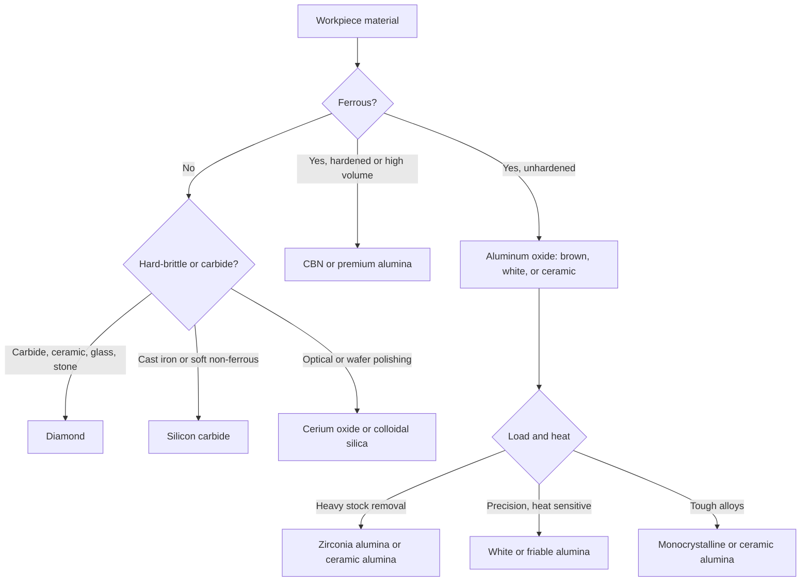

## Classification by Abrasive Material and Grain Characteristics

### Overview

An **abrasive** is a hard material used to remove material from a workpiece by cutting, micro-fracturing, plowing, or rubbing. In abrasive processes, the identity of the grain (what it is made of), its **physical characteristics** (size, shape, toughness, friability, hardness), and its **engineered features** (coatings, agglomeration, orientation) together determine cutting ability, wear behavior, heat generation, surface integrity, and cost.

This classification is orthogonal to the classification by grain *holding* (bonded, coated, loose) and to the process classification (grinding, honing, lapping, and so on): every process and every holding form can use several grain families. A given abrasive selection occupies a position on every axis at once. For example, "F60 white fused alumina grain, blocky, in a vitrified wheel for surface grinding of hardened tool steel" is defined by material (aluminum oxide, white), grit size (F60), shape (blocky), and holding form (vitrified bonded).

**Key Points**

- Abrasives divide into **conventional abrasives** (aluminum oxide, silicon carbide, and natural minerals) and **superabrasives** (cubic boron nitride and diamond).
- Material selection is governed mainly by **workpiece chemistry and hardness**: alumina for most steels, silicon carbide for cast iron, non-ferrous metals, and brittle materials, CBN for hardened ferrous alloys, and diamond for carbides, ceramics, glass, and composites.
- Grain **hardness**, **toughness** (resistance to fracture), and **friability** (tendency to micro-fracture and self-sharpen) must be balanced: a grain that is too tough dulls and glazes, while one that is too friable wears out quickly.
- **Grain size** controls the trade-off between removal rate and surface finish; **grain shape** controls cutting-point sharpness, packing density, and chip clearance.
- Grain **concentration**, **coating**, and **grain distribution** matter in superabrasive tools, where the abrasive is expensive and used at low volume fractions.

### Classification Criteria

| Criterion | Categories |
| --- | --- |
| Origin | Natural, synthetic (manufactured) |
| Chemical family | Oxides (alumina, zirconia-alumina, ceria, silica), carbides (SiC, B₄C), nitrides (cubic boron nitride), carbon (diamond), silicates (garnet), others |
| Hardness class | Conventional (soft to hard), superabrasive (CBN, diamond) |
| Crystal structure | Monocrystalline, polycrystalline, microcrystalline, sintered/seeded-gel |
| Grain toughness / friability | Tough, semi-friable, friable, micro-fracturing |
| Grain size | Macrogrit (about 4 to 220 mesh), microgrit (finer than about 220 mesh), nanoscale |
| Grain size distribution | Narrow (tight-graded) vs. broad; standard ranges per FEPA, ANSI, JIS |
| Grain shape | Blocky, angular (sharp), elongated (needle), platelet, spherical, irregular |
| Grain surface treatment | Uncoated, metal-coated (nickel, copper, titanium), ceramic-coated, silane or resin-coated |
| Grain form | Single grain, agglomerated/aggregate, engineered shaped grains, sintered rods |
| Purpose or application | Rough stock removal, precision grinding, finishing, polishing, blasting |

### Master Classification Tree

```mermaid
flowchart TD
    A[Abrasive materials] --> B[Conventional abrasives]
    A --> C[Superabrasives]
    A --> D[Soft and polishing abrasives]
    A --> E[Natural abrasives]

    B --> B1[Aluminum oxide family]
    B --> B2[Silicon carbide family]
    B --> B3[Zirconia alumina]
    B --> B4[Ceramic / seeded-gel alumina]
    B --> B5[Boron carbide and others]

    B1 --> B1a[Brown / regular]
    B1 --> B1b[White / fused]
    B1 --> B1c[Pink / ruby / chromium-doped]
    B1 --> B1d[Monocrystalline / semi-friable]
    B1 --> B1e[Blends and specialty alumina]

    B2 --> B2a[Black SiC]
    B2 --> B2b[Green SiC]

    C --> C1[Cubic boron nitride]
    C --> C2[Diamond]

    C1 --> C1a[Monocrystalline CBN]
    C1 --> C1b[Microcrystalline / polycrystalline CBN]
    C1 --> C1c[Coated CBN]

    C2 --> C2a[Natural diamond]
    C2 --> C2b[Synthetic monocrystalline]
    C2 --> C2c[Polycrystalline / PCD, CVD, and coated]

    D --> D1[Cerium oxide]
    D --> D2[Colloidal silica]
    D --> D3[Iron oxide / rouge]
    D --> D4[Chromium oxide, magnesium oxide, tin oxide]

    E --> E1[Garnet]
    E --> E2[Emery and corundum]
    E --> E3[Flint, quartz, pumice, tripoli]
```

### Fundamental Property Comparison

The most widely cited comparison uses Knoop or Vickers hardness. Values vary by source, grade, and test method, so the numbers below are indicative.

| Material | Approx. Knoop hardness (kg/mm²) | Density (g/cm³) | Toughness / friability | Thermal stability |
| --- | --- | --- | --- | --- |
| Aluminum oxide (Al₂O₃) | About 2000 to 2200 | About 3.9 to 4.0 | Tough (varies by grade) | Stable in air to high temperature |
| Zirconia alumina | About 1600 to 1900 | About 4.5 to 4.6 | Very tough | Good |
| Ceramic (seeded-gel) alumina | About 2000 to 2200 [Inference] | About 3.9 | Tough, controlled micro-fracture | Good |
| Silicon carbide (SiC) | About 2400 to 2800 | About 3.2 | Hard but brittle (friable) | Reacts with iron at high temperature |
| Boron carbide (B₄C) | About 2800 to 3000 [Inference] | About 2.5 | Hard, brittle | Oxidizes at high temperature |
| Cubic boron nitride (CBN) | About 4500 [Inference: often quoted near 4500 to 4700] | About 3.5 | Tough to friable by type | Stable in air to roughly 1200 to 1400 °C [Inference]; chemically stable with ferrous metals |
| Diamond | About 7000 to 8000+ | About 3.5 | Tough (single crystal) but anisotropic | Graphitizes in air above about 700 to 800 °C [Inference]; dissolves in iron at grinding temperatures |
| Garnet | About 1300 to 1400 [Inference] | About 3.9 to 4.2 | Moderate | Lower |
| Cerium oxide | Softer (polishing) | About 7.1 | Not a cutting grain | Chemically active |

[Inference: hardness and thermal values are typical published ranges and vary with grade, purity, and measurement method.]

**Key Points**

- Hardness alone does not determine performance. A grain must be harder than the workpiece, but **chemical compatibility**, **toughness**, and **thermal stability** decide whether a grain is practical.
- **Diamond** is the hardest but **chemically reacts with iron, cobalt, and nickel** at grinding temperatures (carbon diffuses into the ferrous material), so it is generally avoided for grinding steels. **CBN** is chemically stable against ferrous metals and is the standard superabrasive for hardened steels.
- **Silicon carbide** is harder than alumina but reacts with iron at elevated temperatures and is therefore not preferred for steel grinding; it excels on cast iron, non-ferrous metals, and non-metallics.

### Conventional Abrasives

#### Aluminum Oxide (Al₂O₃, Alumina)

The workhorse family for grinding most steels and ferrous alloys. Produced by fusing bauxite or purified alumina in an electric arc furnace (fused alumina) or by sol-gel/sintering routes (ceramic alumina).

| Variety | Composition and character | Typical application |
| --- | --- | --- |
| **Brown (regular) fused alumina** | About 94% to 97% Al₂O₃ with titania and impurities; tough, blocky | Rough grinding, snagging, general purpose steels, cut-off wheels |
| **White fused alumina** | About 99%+ Al₂O₃; friable, sharp, cool cutting | Precision grinding of hardened steels, tool steels, HSS; heat-sensitive work |
| **Pink / ruby alumina** | Alumina with a small amount of chromium oxide; between white and brown in toughness and friability | Precision tool room grinding, tool and cutter work |
| **Monocrystalline (semi-friable) alumina** | Grains that are single crystals; tough yet sharp; micro-fractures along crystal planes | Difficult steels, high-alloy tool steels, higher pressure grinding |
| **Blended alumina** | Mixtures of grain types | Balance of properties for specific operations |
| **Sintered / seeded-gel (ceramic) alumina** | Microcrystalline, made by sol-gel with seed crystals; extreme micro-fracture; very sharp continuously | Precision and heavy-duty grinding; premium coated abrasives and wheels |
| **Zirconia alumina** | Fused alumina with zirconia; very tough, self-sharpening under high pressure | Heavy stock removal, snagging, coated belts and fiber discs |

**Key Points**

- Seeded-gel alumina grains are **microcrystalline**: each grain consists of submicron crystallites, so as the grain wears, it **micro-fractures** at the crystallite scale, exposing new sharp edges continuously. This gives a cool, long-lasting cut.
- **White alumina** is more friable than brown alumina; friability aids self-sharpening but lowers grain life under heavy loads.

#### Silicon Carbide (SiC)

Produced by the Acheson process (reaction of silica sand and carbon in an electric resistance furnace).

| Variety | Character | Typical application |
| --- | --- | --- |
| **Black silicon carbide** | Slightly tougher, contains some free carbon and impurities | Cast iron, non-ferrous metals, rubber, ceramics; resin-bonded wheels |
| **Green silicon carbide** | Higher purity, harder and more friable | Cemented carbide, hard non-ferrous work, precision grinding of brittle materials |

SiC is very hard but **more brittle than alumina**, so it is used where the workpiece is soft, brittle, or non-ferrous, and where load per grain is moderate. It is not generally used for steels because of its **chemical affinity** with iron at grinding temperatures.

#### Boron Carbide and Other Hard Ceramics

- **Boron carbide (B₄C):** extremely hard, used in lapping powders, wear parts, and some blasting nozzles; expensive.
- **Others:** tungsten carbide grit in specialty applications, titanium carbide, and mixed ceramics for special-purpose abrasives.

### Superabrasives

Superabrasives are defined by hardness far above conventional grains, high thermal conductivity (particularly diamond), and high cost, so they are used in **thin abrasive layers** with metal, resin, vitrified, or electroplated bonds.

#### Cubic Boron Nitride (CBN)

Synthesized under high pressure and high temperature (HPHT) from hexagonal boron nitride with catalysts.

| Type | Description | Typical use |
| --- | --- | --- |
| **Monocrystalline CBN** | Single crystals, blocky to angular, tough, high strength | Metal-bonded and electroplated tools, high-pressure grinding |
| **Friable / microcrystalline CBN** | Polycrystalline aggregates of fine crystallites; controlled micro-fracture | Vitrified and resin-bond precision grinding wheels (steels) |
| **Coated CBN** | Nickel, copper, or titanium coating on grains | Improves retention in resin bonds, heat conduction, and grain holding |

Properties and advantages:

- **Chemical stability with iron, nickel, and cobalt alloys**, so it is the leading abrasive for **hardened steels, HSS, tool steels, cast iron, and nickel superalloys**.
- **High thermal conductivity** compared with alumina, so grinding heat leaves the workpiece more effectively; wheels run cooler, giving low thermal damage.
- **Very high G-ratio**: wheel wear is low, so profile retention and dimensional stability are excellent [Inference: benefit depends on conditions and coolant].
- Coolant selection matters: straight oil is often preferred for vitrified CBN, as water-based fluids can accelerate chemical wear at high temperatures in some conditions [Inference: reported behavior varies by fluid and application].

#### Diamond

| Type | Description | Typical use |
| --- | --- | --- |
| **Natural diamond** | Single crystals, irregular shape, varied quality | Dressing tools, cutting and drilling tools, specialty wheels |
| **Synthetic monocrystalline diamond** | HPHT synthesized; controllable shape (blocky to elongated), friability, and size | Wheels for carbide, ceramics, glass, stone; lapping powders |
| **Polycrystalline diamond (PCD)** | Sintered mass of fine diamond crystals | Cutting tools; dressing tools; some abrasive grits |
| **CVD diamond** | Chemical vapor deposition films or bulk | Dressers, coatings, specialized tools |
| **Metal-coated diamond** | Nickel, copper, or titanium coatings | Retention in resin and metal bonds; heat dissipation |

Properties and limitations:

- **Hardest known material**, thermally very conductive.
- **Not suitable for grinding steels** (carbon diffuses into the iron at high temperature, causing rapid chemical wear).
- Graphitizes in air at elevated temperatures, so temperature control matters.
- Ideal for **cemented carbide, ceramics, glass, silicon, stone, concrete, composites, and non-ferrous metals**.

#### Concentration in Superabrasive Tools

Diamond and CBN tools specify **concentration** by convention, where concentration 100 corresponds to $4.4\ \text{carats/cm}^3$ of abrasive (1 carat = 0.2 g), equal to about $25\%$ of the abrasive layer volume [Inference: widely used convention].

The abrasive volume fraction from concentration $C$:

$$V_g = \frac{C}{100} \times 0.25$$

**Example**

A metal-bonded diamond wheel of concentration 75:

$$V_g = 0.75 \times 0.25 = 0.1875 \approx 18.75\%$$

The abrasive mass per unit volume is $0.75 \times 4.4 = 3.3\ \text{carats/cm}^3 = 0.66\ \text{g/cm}^3$.

Higher concentration gives more cutting points and longer life but less chip clearance and a higher tool cost; lower concentration gives freer cutting. Selection depends on process and workpiece.

### Soft and Polishing Abrasives

These grains are generally softer and act largely by **chemical-mechanical** interaction rather than by pure mechanical cutting.

| Abrasive | Character | Typical use |
| --- | --- | --- |
| **Cerium oxide (ceria)** | Chemically active with silica glass; fast, high-quality polishing | Optical glass, lenses, mirrors, display glass |
| **Colloidal silica** | Nano-sized amorphous silica in alkaline suspension | Silicon wafer polishing, CMP |
| **Iron oxide (jeweler's rouge)** | Fine, soft | Polishing precious metals, optics (historical) |
| **Chromium oxide (green rouge)** | Hard fine polishing compound | Stainless steel, hardened steel polishing |
| **Alumina (fine, calcined)** | Polishing in slurry or compound | Metallography, precision polishing |
| **Magnesium oxide, tin oxide** | Soft polishing agents | Specialty polishing |

### Natural Abrasives

| Abrasive | Description | Typical use |
| --- | --- | --- |
| **Garnet** | Silicate mineral; hard, fractures to sharp edges | Coated abrasives for wood, blasting, water-jet cutting media |
| **Emery** | Natural mix of corundum and iron oxides | Metal polishing, some coated abrasives (largely replaced) |
| **Corundum** | Natural Al₂O₃ | Historical grinding |
| **Flint, quartz sand** | Silica minerals | Sanding, blasting (silica sand blasting has health restrictions) |
| **Pumice, tripoli, diatomaceous earth** | Soft volcanic or sedimentary abrasives | Polishing, buffing compounds, cleaners |

### Grain Size Classification

Grain size systems distinguish **macrogrits** (coarse to fine), **microgrits**, and **superfine** grades.

#### Standards

| Standard | Region | Designation |
| --- | --- | --- |
| FEPA "F" | Europe | F4 to F220 (bonded abrasives, macrogrits); F230 to F2000 (microgrits) |
| FEPA "P" | Europe | P12 to P2500 (coated abrasives) |
| ANSI (B74.12) / CAMI | USA | Mesh numbers; coated abrasives on CAMI scale |
| JIS | Japan | # numbers |
| Superabrasive | International | US mesh ranges (for example, 170/200) or micrometer ranges |

In all systems, a **higher number means a finer grit**. For coarse grains, the designation is a **mesh number** related to the sieve opening used to grade the grain:

$$d_g \approx \frac{15{,}000}{\text{mesh}}\ \ (\mu\text{m})$$

[Inference: rough rule only; standardized tables give exact ranges and vary between systems.]

**Example**

| Mesh | Approx. $d_g$ (μm) | Application |
| --- | --- | --- |
| 24 | About 625 | Heavy stock removal, snagging |
| 60 | About 250 | General grinding |
| 120 | About 125 | Semi-finishing |
| 220 | About 68 | Finishing |
| 600 | About 25 | Fine finishing |
| 1200 | About 12 | Lapping, polishing |

#### Effect of Grain Size

Finer grains produce smaller chip cross-sections and finer scratches; coarser grains remove more material per pass but leave deeper scratches. The theoretical maximum undeformed chip thickness for a single grain in grinding is

$$h_{max} = \left[\frac{4}{C_s\, r\, \tan\theta}\,\frac{v_w}{v_s}\sqrt{\frac{a_e}{d_{eq}}}\right]^{1/2}$$

where $C_s$ is the number of active grains per unit area, $r$ is the ratio of chip width to chip thickness, $\theta$ is the half-included angle of the grain cone, $v_w$ and $v_s$ are the workpiece and wheel speeds, $a_e$ is the depth of cut, and $d_{eq}$ is the equivalent wheel diameter. This classical expression is an idealized model, and actual chip thickness varies with grain distribution and wear [Inference: model relies on simplifying assumptions].

The dependence shows that **more active grains per unit area** (finer grit, closer spacing) **and higher wheel speed** reduce the maximum chip thickness and therefore the roughness and force per grain.

**Example**

Suppose $C_s = 4\ \text{grains/mm}^2$, $r = 10$, $\theta = 60^\circ$ (so $\tan\theta = 1.732$), $v_w/v_s = 0.005$, $a_e = 0.02\ \text{mm}$, and $d_{eq} = 200\ \text{mm}$:

$$\frac{4}{C_s r \tan\theta} = \frac{4}{4 \times 10 \times 1.732} = 0.05774\ \text{mm}$$

$$\sqrt{\frac{a_e}{d_{eq}}} = \sqrt{0.0001} = 0.01$$

$$h_{max} = \left[0.05774 \times 0.005 \times 0.01\right]^{1/2} = \left[2.887 \times 10^{-6}\right]^{1/2} \approx 1.70 \times 10^{-3}\ \text{mm} = 1.7\ \mu\text{m}$$

Doubling the number of active grains ($C_s = 8$) reduces $h_{max}$ by a factor of $\sqrt{2}$ to about $1.2\ \mu\text{m}$, showing how finer or more densely spaced grains reduce chip thickness.

#### Grain Size Distribution

Grains are graded by sieving (macrogrits) or by sedimentation, laser diffraction, or electrical-sensing-zone methods (microgrits). Standards specify percentage retained on defined sieve sizes. **Tight distribution** improves finish and predictability, especially in lapping, polishing, and fine finishing where a few oversize grains cause deep scratches. Coarse grit contamination at a fine stage is a common cause of defects.

### Grain Shape and Morphology

| Shape | Description | Effect |
| --- | --- | --- |
| **Blocky** | Equant, compact, roughly cubic | Strong, tough; good for high-pressure grinding; efficient packing |
| **Angular (sharp)** | Numerous sharp edges and points | Aggressive cutting; more friable; good for lower force, cool cutting |
| **Elongated (needle-like)** | Long, thin | Good in coated abrasives (orient upright in electrostatic coating); weaker strength |
| **Platelet / flaky** | Flat | Lower bulk strength; used in polishing and lapping |
| **Spherical / rounded** | Smooth | Peening, cleaning, and blasting with less aggressive cutting |
| **Irregular** | Random | Common in crushed abrasives |

**Aspect ratio and blockiness** can be measured by image analysis. A common descriptor is the **shape factor** or sphericity:

$$\Psi = \frac{d_{min}}{d_{max}}$$

where $d_{min}$ and $d_{max}$ are the minimum and maximum grain dimensions (aspect ratio is the inverse). Blocky grains have $\Psi$ close to 1; needle-like grains have low $\Psi$.

**Key Points**

- **Sharp, angular grains** cut more freely, produce lower forces, and generate less heat at low load, but can wear quickly under high pressure.
- **Blocky grains** withstand higher loads and are chosen for tough, high-pressure operations.
- In **superabrasives**, grain shape and strength (measured by a toughness index, TI) are selected for the bond system: high-toughness, blocky grains for metal bonds and high-load work; friable, angular grains for vitrified and resin bonds in precision grinding.

### Toughness, Friability, and Wear Behavior

Grain wear in service follows three modes:

| Mode | Description | Effect |
| --- | --- | --- |
| **Attritious wear** | Gradual flattening of the grain tip (wear flats) | Increases force and heat; dulls the wheel |
| **Micro-fracture** | Small fragments break away from the grain, producing new sharp edges | Self-sharpening; steady cutting |
| **Macro-fracture / grain pull-out** | Grain breaks in a large piece, or the bond releases the whole grain | Rapid wheel wear; loss of form |

An ideal grain balances these: enough **friability** to renew cutting points by micro-fracture, and enough **toughness** to avoid premature loss. Grain toughness is measured by standardized crushing or impact tests (for example, the **Toughness Index (TI)** and **Thermal Toughness Index (TTI)** for superabrasives, where TTI measures retained strength after heat exposure).

**Key Points**

- **Thermal toughness** is particularly important for grains used with vitrified bonds, as the bond is fired at high temperature (for vitrified CBN, the firing temperature is kept relatively low, and specialized bond systems are used, to avoid degrading the grain [Inference: firing temperature and bond chemistry are proprietary and grade-dependent]).
- A **too-tough grain in a too-hard bond** produces glazing; a **too-friable grain in a soft bond** produces excessive wheel wear.

### Grain Surface Treatments and Coatings

| Treatment | Purpose | Applies to |
| --- | --- | --- |
| **Nickel coating** | Improves grain retention in metal and resin bonds; conducts heat; protects diamond and CBN | Diamond, CBN |
| **Copper coating** | Heat conduction, retention in resin bonds | Diamond, CBN |
| **Titanium coating (or other carbide formers)** | Chemical bonding to metal or brazed matrix; brazed single-layer tools | Diamond, CBN |
| **Silane or resin coating** | Improves adhesion in resin bond or organic matrix | Various |
| **Ceramic or glass coating** | Protects the grain during vitrified bond firing | CBN, diamond |
| **Surface roughening / etching** | Improves mechanical anchoring | Diamond, CBN |

**Example (Mass and Volume Effect of Coating)**

A 100 μm diamond grain with a 5 μm nickel coating has an overall diameter of 110 μm. The volume ratio of coated to uncoated grain is

$$\frac{V_{coated}}{V_{grain}} = \left(\frac{110}{100}\right)^{3} = 1.331$$

so the coating adds roughly a third to the grain volume. The heavier coated grain must be accounted for when specifying concentration by weight versus volume, and it affects the effective protrusion of grains from the bond.

### Agglomerated, Engineered, and Shaped Grains

| Type | Description | Benefit |
| --- | --- | --- |
| **Agglomerates (aggregates)** | Fine grains bonded into larger clusters (vitrified or resin bonded), then used as "grains" in a wheel or film | Combines fine-grit finish with larger effective size and porosity; controlled breakdown; used in premium wheels and lapping films |
| **Shaped / engineered grains** | Precisely shaped ceramic grains (for example, triangular platelets or rods) produced by sol-gel | Predictable orientation; consistent cutting points; long life in premium coated abrasives [Inference: proprietary products] |
| **Sintered rods and extruded grains** | Sintered alumina extruded to a rod shape | High-performance grinding wheels, open structure, deep-cut grinding [Inference] |
| **Grain blends** | Mixtures of different types, such as ceramic alumina with conventional alumina | Balance cost and performance |
| **Hollow and porous grains** | Grains with internal pores | Chip clearance, cool cutting, weight reduction [Inference: specialized products] |

### Property-to-Application Mapping

| Workpiece | Recommended abrasive | Reasoning |
| --- | --- | --- |
| Plain and low-alloy steels | Aluminum oxide (brown, white, ceramic) | Chemical compatibility, toughness, cost |
| Hardened tool steels, HSS | White or monocrystalline alumina; CBN | Friability and cool cutting; CBN for high productivity and form retention |
| Stainless steel, high-alloy steel | Ceramic alumina, zirconia alumina; CBN | Toughness under heat, micro-fracture cutting |
| Cast iron | Silicon carbide; CBN | SiC suits brittle, low-strength matrix; CBN for high volume |
| Nickel superalloys, titanium alloys | Ceramic alumina, CBN, some SiC | Heat resistance and low thermal damage |
| Aluminum and soft non-ferrous | Silicon carbide (open structure) | Reduces loading |
| Cemented carbide | Diamond (resin, metal, vitrified) | Only diamond is effective |
| Ceramics, glass, silicon, stone | Diamond (metal and resin bond); SiC | Hardness needed |
| Composites (CFRP, GFRP) | Diamond (plated, metal bond) | Abrasive fibers; wear resistance |
| Optical glass polishing | Cerium oxide | Chemical-mechanical action |
| Silicon wafer planarization | Colloidal silica | Chemical-mechanical action |

### Selection Guide

### Effects of Grain Characteristics on Process Outcomes

| Grain characteristic | Effect on process |
| --- | --- |
| Higher hardness | Better cutting of hard workpieces; less wear |
| Higher toughness | Longer life under load; risk of dulling and glazing if not self-sharpening |
| Higher friability | Self-sharpening; lower forces; faster wheel wear |
| Finer grit | Better finish, lower removal rate, greater loading tendency |
| Narrower size distribution | Fewer oversize grains, more uniform finish |
| Sharper shape | Lower cutting force, more heat if grain dulls rapidly |
| Higher thermal conductivity (CBN, diamond) | Lower workpiece temperature and thermal damage |
| Chemical affinity with workpiece | Diffusion and chemical wear (diamond on iron, SiC on steel) |
| Coating | Better retention and heat conduction in bond |
| Concentration (superabrasive) | Tool life, chip clearance, cost |

### Grain Property Testing and Quality Control

| Test | Purpose |
| --- | --- |
| Sieve analysis, laser diffraction | Grain size distribution |
| Image analysis | Grain shape, aspect ratio |
| Toughness index (TI) and thermal toughness index (TTI) | Grain strength, retained strength after heat |
| Bulk density and loose packed density | Grain shape and packing |
| Magnetic content | Purity, iron contamination |
| Chemical analysis (XRF, wet chemistry) | Composition, impurities |
| Sedimentation and electrical sensing zone | Microgrit size distribution |
| Crush and friability tests | Toughness comparison |

### Common Selection Errors and Their Consequences

| Error | Consequence | Mitigation |
| --- | --- | --- |
| Diamond used on steel | Rapid chemical wear, wheel loss | Use CBN or alumina |
| Silicon carbide used on hardened steel | Chemical wear and poor life | Use alumina or CBN |
| Grain too coarse for finish requirement | Deep scratches, poor $R_a$ | Progress through grit sequence; choose finer grain |
| Grain too fine for stock removal | Slow cutting, loading, heat | Use coarser grit for rough stage |
| Too-tough grain for the bond and application | Glazing, burn | Use more friable grain or softer bond |
| Too-friable grain for heavy load | Excess wheel wear | Use tougher, blocky grain |
| Wrong CBN type for the bond | Grain loss or weak cutting | Match CBN toughness and coating to bond (vitrified, resin, metal, plated) |
| Coarse contamination in fine polishing | Random deep scratches | Clean environment, filter, separate stages |
| Ignoring workpiece chemistry | Adhesion, diffusion, or reaction | Select chemically compatible abrasive |

Behavior varies with machine rigidity, tooling, workpiece material, and process parameters.

### Safety and Environmental Considerations

- **Respirable crystalline silica** in silica sand and some natural abrasives is a recognized health hazard; substitute media (garnet, aluminum oxide, steel grit, glass bead) are commonly used.
- **Fine abrasive dust** (alumina, silicon carbide, and workpiece particulate) requires extraction and appropriate respiratory protection.
- **Diamond and CBN** are not hazardous in themselves but their fine powders and slurries require standard dust and fluid-handling controls.
- **Fibrous silicon carbide** (whisker-like morphologies) can occur in some SiC production or grades and is a specific occupational health concern [Inference: exposure standards vary by jurisdiction].
- **Spent slurries and swarf** contain metal fines and abrasive and need appropriate disposal.

### Emerging Trends

- **Engineered and shaped ceramic grains** with controlled geometry and orientation for consistent cut [Inference: evolving proprietary products].
- **Nano-abrasives** (nano-diamond, nano-ceria, nano-silica) for ultra-precision polishing and CMP.
- **Hybrid grain systems and agglomerates** combining fine-grit finish with high stock removal.
- **Advanced coatings on superabrasives** for improved retention, thermal management, and chemical resistance.
- **Cost-driven substitution:** synthetic diamond and CBN cost declines have expanded their use into more applications.
- **Sustainable practices:** recycling of abrasive slurries and reduced-silica products.

**Conclusion**

Classifying abrasives by material and grain characteristics organizes the choice of abrasive around the workpiece and the process requirement. **Conventional abrasives** (aluminum oxide in its brown, white, pink, monocrystalline, ceramic, and zirconia varieties, and silicon carbide in black and green grades) cover most grinding and finishing of steels, cast irons, and non-ferrous materials. **Superabrasives** (CBN and diamond, in mono- and polycrystalline forms, uncoated or coated, specified by concentration) serve hardened ferrous alloys (CBN) and carbides, ceramics, glass, and composites (diamond) where their hardness, thermal conductivity, and low wear pay off. **Soft polishing abrasives** (ceria, colloidal silica, rouge) act through chemical-mechanical mechanisms, and **natural abrasives** remain in use for sanding, blasting, and polishing. Within each family, **grain size and distribution, shape, toughness and friability, and surface treatment** determine cutting behavior, finish, self-sharpening, and life. Matching these characteristics to workpiece chemistry, load, heat sensitivity, and finish requirements is the basis of abrasive selection.

**Related Topics**

- Bonded, coated, and loose-abrasive classification
- Grinding wheel specification: abrasive, grit, grade, structure, and bond
- Superabrasive tool design: bond systems, concentration, and coatings
- Grain size standards (FEPA, ANSI, JIS) and sizing methods
- Abrasive grain manufacturing: fused, sintered, sol-gel, and HPHT synthesis
- Grinding mechanics: chip formation, grain wear, and the G-ratio
- Chemical-mechanical polishing and slurry chemistry
- Dressing tools and diamond conditioners
- Abrasive blasting media selection and safety
- Nano-abrasives and ultra-precision finishing
- Surface integrity and thermal damage related to abrasive choice
- Abrasive testing methods: toughness index, thermal toughness, and image analysis