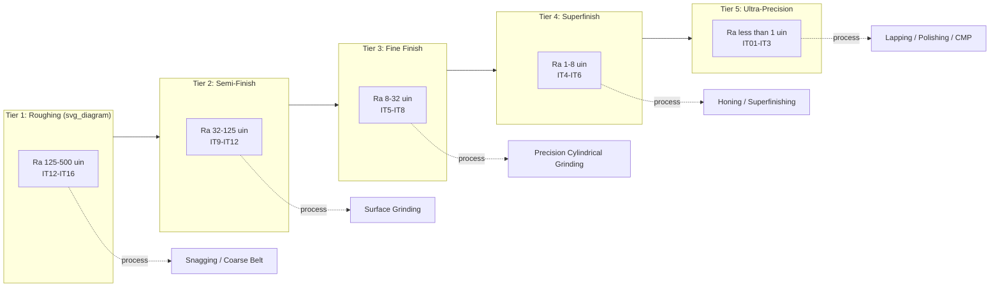

## Classification by Achievable Surface Finish and Tolerance

### Overview

Abrasive processes are frequently classified not by mechanism (bonded, coated, loose abrasive) but by their **output capability** — the surface finish (Ra, Rz) and dimensional tolerance band each process family can reliably achieve. This performance-based taxonomy is used heavily in process planning, where an engineer selects an abrasive operation by working backward from a drawing's finish callout and tolerance grade rather than from the abrasive mechanism itself.

### Core Metrics Used for Classification

**Key Points**

- **Ra (arithmetic mean roughness)** — the primary finish metric in North American practice, expressed in microinches ($\mu in$) or micrometers ($\mu m$).
- **Rz (mean roughness depth)** — peak-to-valley average, more common in European/ISO practice, generally 4–6× the Ra value for similar surfaces [Inference: the exact ratio is process- and material-dependent and not a fixed constant].
- **Dimensional tolerance (IT grade)** — per ISO 286, expressed as IT grades (IT01 through IT18), where lower numbers indicate tighter tolerance bands.
- **Geometric tolerance capability** — roundness, cylindricity, flatness, and parallelism achievable independent of size tolerance, particularly relevant for grinding and honing.

These metrics are often correlated but not interchangeable: a process can achieve fine Ra while holding a relatively loose dimensional tolerance, or vice versa, depending on machine rigidity and process control rather than abrasive grit alone.

### Classification Tiers

#### Tier 1: Roughing / Stock Removal Abrasive Processes

**Key Points**

- Typical Ra: 125–500 $\mu in$ (3.2–12.5 $\mu m$)
- Typical tolerance: IT12–IT16
- Processes: offhand grinding, snagging, coarse belt grinding (grit 24–60)
- Purpose: rapid material removal, weld/casting cleanup, not intended as a finishing operation

#### Tier 2: Semi-Finish Abrasive Processes

**Key Points**

- Typical Ra: 32–125 $\mu in$ (0.8–3.2 $\mu m$)
- Typical tolerance: IT9–IT12
- Processes: precision surface grinding (grit 60–120), belt finishing (grit 80–150), rough honing
- Purpose: intermediate operation preparing a surface for final finishing, or acceptable as final finish for non-critical mating surfaces

#### Tier 3: Fine Finish / Precision Grinding

**Key Points**

- Typical Ra: 8–32 $\mu in$ (0.2–0.8 $\mu m$)
- Typical tolerance: IT5–IT8
- Processes: precision cylindrical/OD-ID grinding, surface grinding (grit 120–320), centerless grinding
- Purpose: bearing journals, gauge surfaces, mating shaft/bore fits requiring controlled interference or clearance

#### Tier 4: Superfinishing / Micro-Finishing

**Key Points**

- Typical Ra: 1–8 $\mu in$ (0.025–0.2 $\mu m$)
- Typical tolerance: IT4–IT6 (dimensional change is minimal; the operation is primarily finish-correcting, not stock-removing)
- Processes: honing, superfinishing (microfinishing film/stone), lapping (coarse-to-medium)
- Purpose: sealing surfaces, hydraulic cylinder bores, crankshaft journals, gear tooth flanks

#### Tier 5: Ultra-Precision / Optical Finish

**Key Points**

- Typical Ra: below 1 $\mu in$ (below 0.025 $\mu m$), down to single-digit nanometer Ra for optical lapping/polishing
- Typical tolerance: IT01–IT3, or specified directly in sub-micrometer terms rather than IT grade
- Processes: fine lapping, polishing, chemical-mechanical polishing (CMP), superabrasive (diamond/CBN) fine grinding
- Purpose: optical components, semiconductor wafers, gauge blocks, precision seals

### Comparative Table

| Tier | Ra Range ($\mu in$) | Ra Range ($\mu m$) | IT Grade | Representative Process | Typical Application |
| --- | --- | --- | --- | --- | --- |
| 1 – Roughing | 125–500 | 3.2–12.5 | IT12–IT16 | Snagging, coarse belt grinding | Weld cleanup, deburring |
| 2 – Semi-finish | 32–125 | 0.8–3.2 | IT9–IT12 | Surface grinding (medium grit) | General machined surfaces |
| 3 – Fine finish | 8–32 | 0.2–0.8 | IT5–IT8 | Precision cylindrical grinding | Bearing journals, shaft fits |
| 4 – Superfinish | 1–8 | 0.025–0.2 | IT4–IT6 | Honing, superfinishing | Cylinder bores, seal surfaces |
| 5 – Ultra-precision | <1 | <0.025 | IT01–IT3 | Lapping, polishing, CMP | Optics, semiconductor wafers |

[Inference] These ranges represent commonly cited industry values and reasonable process capability under good practice; actual achievable Ra/tolerance for any specific job depends heavily on machine condition, abrasive selection, coolant, workpiece material, and fixturing, so figures should be treated as planning guidance rather than guaranteed outcomes.

### Diagram: Finish/Tolerance Capability Bands

### Process Selection Logic (Backward Selection Example)

**Example**

Given a drawing callout of **Ra 16 $\mu in$, ⌀25.000 +0.005/−0.000 mm (IT6)**:

1. Ra 16 $\mu in$ falls within Tier 3 (Fine Finish, 8–32 $\mu in$ range).
2. IT6 tolerance aligns with Tier 3's IT5–IT8 capability band.
3. Process selection: precision cylindrical (OD) grinding is indicated as the finishing operation, likely preceded by a Tier 2 semi-finish grind to remove bulk stock before the final precision pass.
4. If the same drawing specified Ra 4 $\mu in$ instead, the callout would push the operation into Tier 4, requiring an added honing or superfinishing step after grinding, since grinding alone at that tolerance grade would not reliably reach that Ra.

This illustrates the core logic of the finish/tolerance taxonomy: it functions as a **process routing tool**, letting a planner sequence multiple abrasive operations (rough grind → finish grind → hone) by matching each drawing requirement to the tier capable of achieving it economically, rather than over-specifying (e.g., lapping a surface that only needs Tier 2 finish) or under-specifying (attempting Tier 4 finish with a Tier 2 process).

### Interaction Between Finish and Tolerance (Non-Correlation Cases)

**Key Points**

- Fine Ra with loose tolerance: a cosmetic housing surface may require Ra 16 $\mu in$ for appearance but only IT12 dimensional tolerance, achievable via careful semi-finish grinding without precision fixturing.
- Loose Ra with tight tolerance: a hydraulic valve spool may tolerate Ra 32 $\mu in$ but require IT5 roundness/cylindricity, demanding precision grinding equipment even though the finish requirement itself is modest.
- [Inference] This decoupling means that classification by finish alone, or by tolerance alone, is insufficient for process selection; both axes should be evaluated jointly, which is why mature process-planning references present them as a combined matrix rather than two independent lists.

### Limitations of This Classification Approach

- Achievable Ra/tolerance figures are empirically derived ranges from industry practice and machine tool builder data, not physical constants; a well-maintained precision grinder can sometimes exceed the nominal band for its "tier," and conversely a poorly maintained machine can underperform it. [Unverified — specific numeric bands vary across reference sources (e.g., Machinery's Handbook vs. individual grinding wheel manufacturer data) and are not standardized by a single governing body.]
- Material-specific behavior (hardness, ductility, thermal sensitivity) shifts achievable finish independent of the nominal process tier — grinding a hardened tool steel and grinding a soft aluminum alloy with the same wheel and parameters typically produce different Ra outcomes.
- Environmental and metrological factors (workholding rigidity, coolant filtration, ambient temperature control for Tier 5 work) become increasingly decisive as the tier number increases, meaning Tier 5 outcomes are more sensitive to shop conditions than Tier 1 outcomes.

### Related Topics

- Surface Roughness Parameters (Ra, Rz, Rq) and Measurement Methods
- ISO 286 Tolerance Grades and Fit Systems
- Grinding Wheel Grit Selection and Bond Type Effects on Finish
- Honing vs. Superfinishing: Process Distinctions
- Lapping and Polishing for Optical and Semiconductor Applications
- Process Sequencing in Precision Machining (Rough → Semi-Finish → Finish → Superfinish)
- Metrology Instruments for Surface Finish Verification (Profilometry, Interferometry)