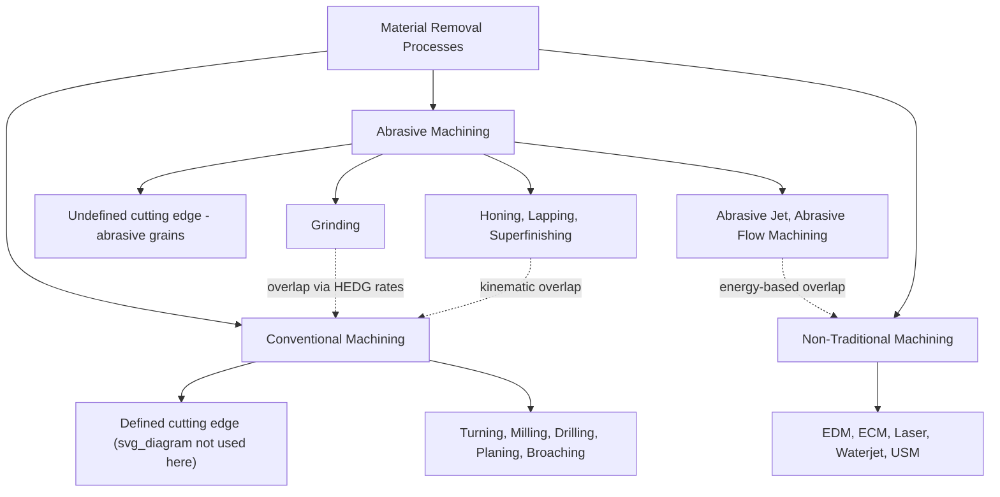

## Boundaries Between Abrasive and Conventional Machining

### Definition and Scope

Conventional machining and abrasive machining are two broad families within the manufacturing process classification of material removal processes. The boundary between them is not always sharp, and understanding where one ends and the other begins requires examining the nature of the cutting edge, the chip formation mechanism, and the geometric definition of the tool.

**Conventional machining** refers to processes that use a cutting tool with a geometrically defined edge (or edges) — turning, milling, drilling, planing, shaping, and broaching are the canonical examples. The tool has a known rake angle, clearance angle, and cutting edge geometry that can be specified and controlled.

**Abrasive machining** refers to processes that remove material using hard, irregularly shaped abrasive grains, each acting as a microscopic, geometrically undefined cutting edge. Grinding, honing, lapping, superfinishing, and abrasive jet machining fall into this category.

### Core Distinguishing Criteria

#### 1. Geometry of the Cutting Edge

The most fundamental boundary is whether the cutting edge geometry is *defined* or *undefined*.

- **Defined edge (conventional):** A single-point or multi-point tool (lathe tool, milling cutter, drill) has a specific, measurable edge geometry — rake angle $\alpha$, clearance angle $\gamma$, and edge radius — that remains largely constant during the cut.
- **Undefined edge (abrasive):** Each abrasive grain has a random shape, random orientation, and random negative rake angle. A grinding wheel may contain thousands of active grains per square centimeter, each acting as an independent micro-tool with unpredictable geometry.

#### 2. Chip Formation Mechanism

- Conventional machining chips form through **shear deformation** along a well-defined shear plane, producing continuous, discontinuous, or serrated chips that can be analyzed using classical orthogonal cutting models (e.g., Merchant's circle).
- Abrasive machining produces **microchips** through a combination of rubbing, ploughing, and cutting phases per grain. Only a fraction of the grain-workpiece interactions actually remove material as chips; much of the energy is dissipated as friction and plastic deformation (ploughing) without chip formation.

#### 3. Cutting Speed Regime

- Conventional machining typically operates at moderate cutting speeds (tens to a few hundred meters per minute for most metals).
- Abrasive processes, particularly grinding, operate at very high surface speeds (grinding wheel peripheral speeds of 20–60 m/s, and up to 150+ m/s in high-efficiency deep grinding), though creep-feed grinding uses low feed rates with high depth of cut, and lapping/honing use very low relative speeds.

#### 4. Depth of Cut and Material Removal Rate per Edge

- Conventional tools remove relatively large, controlled depths of cut per pass (tenths of a millimeter to several millimeters).
- Each individual abrasive grain removes an extremely small volume of material (microns), but the aggregate effect of many simultaneously engaged grains achieves comparable or higher overall material removal rates, especially in modern high-efficiency grinding.

#### 5. Surface Finish and Tolerance Capability

- Conventional machining generally achieves surface roughness in the range of $Ra = 0.4$ to $6.3\ \mu m$ depending on process and parameters.
- Abrasive processes achieve much finer finishes: grinding typically $Ra = 0.1$ to $1.6\ \mu m$, and finishing abrasive processes (honing, lapping, superfinishing) can achieve $Ra < 0.05\ \mu m$, often approaching optical-quality surfaces.

### Comparison Table

| Criterion | Conventional Machining | Abrasive Machining |
| --- | --- | --- |
| Cutting edge | Geometrically defined | Geometrically undefined (random grain shape) |
| Number of active edges | Few (single or multi-point) | Thousands (multi-grain) |
| Rake angle | Controlled, often positive | Random, usually strongly negative |
| Chip formation | Shear-dominated, classical | Microchip + rubbing/ploughing |
| Typical speed | Low-moderate | Very high (grinding) or very low (lapping) |
| Material hardness handled | Moderate (below tool hardness) | Very high, including hardened steels, ceramics |
| Surface finish | Coarser | Finer |
| Heat generation per unit volume | Lower specific energy | Higher specific energy |

### Why the Boundary Blurs

Several process categories sit at the overlap and complicate a clean classification:

- **Honing and superfinishing** use bonded abrasive stones with a defined stroke pattern, giving them kinematic characteristics similar to conventional reciprocating processes, even though the material removal mechanism is abrasive.
- **Single-point diamond turning** uses a geometrically defined cutting edge (like conventional machining) but is often grouped with precision/ultra-precision finishing because it achieves surface finishes and tolerances typically associated with abrasive processes.
- **Abrasive flow machining and abrasive jet machining** remove material via abrasive particles but lack a rotating bonded wheel, blurring the line between abrasive machining and non-traditional (unconventional) machining categories such as chemical or energy-beam processes.
- **High-efficiency deep grinding (HEDG)** achieves material removal rates comparable to milling, challenging the traditional view that abrasive processes are inherently "finishing only" operations.

### Classification Framework

### Specific Energy as a Quantitative Boundary Indicator

One of the most reliable quantitative distinctions is **specific cutting energy** $u$, defined as the energy required to remove a unit volume of material:

$$u = \frac{F_c \cdot v}{MRR}$$

where $F_c$ is the cutting force, $v$ is the cutting velocity, and $MRR$ is the material removal rate.

- Conventional machining: $u$ typically ranges from $1$–$5\ J/mm^3$ for most metals.
- Abrasive machining (grinding): $u$ is substantially higher, often $10$–$50\ J/mm^3$ or more, because of the large proportion of energy consumed in ploughing and rubbing rather than actual chip formation.

This order-of-magnitude difference in specific energy is one of the clearest physics-based boundaries between the two categories, even when surface outcomes overlap.

### Practical Example

**Example:** Machining a hardened steel shaft (58 HRC) to a final tolerance of $\pm 2\ \mu m$ and $Ra = 0.2\ \mu m$.

- A conventional carbide turning tool cannot economically cut steel at this hardness without rapid tool wear, since the tool hardness must exceed the workpiece hardness by a wide margin for stable chip formation.
- A **CBN (cubic boron nitride) grinding wheel** is used instead, exploiting the abrasive process's undefined-edge, high-hardness-differential capability. Multiple passes with decreasing depth of cut (rough, semi-finish, finish, spark-out) achieve the required tolerance and finish.
- This illustrates the practical boundary: abrasive processes are selected specifically when workpiece hardness, required tolerance, or surface finish exceeds what conventional single/multi-point cutting tools can economically achieve.

### Key Points

- The boundary is defined primarily by cutting edge geometry (defined vs. undefined) and chip formation mechanism (shear vs. rubbing/ploughing/microchip).
- Specific cutting energy provides a quantitative, physics-based distinction, with abrasive processes consuming several times more energy per unit volume removed.
- Hybrid and edge-case processes (honing, diamond turning, abrasive jet machining) demonstrate that classification is a spectrum rather than a strict binary.
- Material hardness relative to tool/abrasive hardness is often the deciding practical factor in process selection.

### Related Topics

- Classification of conventional machining processes (turning, milling, drilling, broaching)
- Grinding wheel specification and the abrasive process family (bonded, coated, loose abrasives)
- Specific cutting energy and the size effect in metal cutting
- Non-traditional (unconventional) machining process classification
- Honing, lapping, and superfinishing as finishing-process subclasses
- High-efficiency deep grinding (HEDG) and its implications for process boundaries
- Tool material hardness vs. workpiece hardness selection criteria