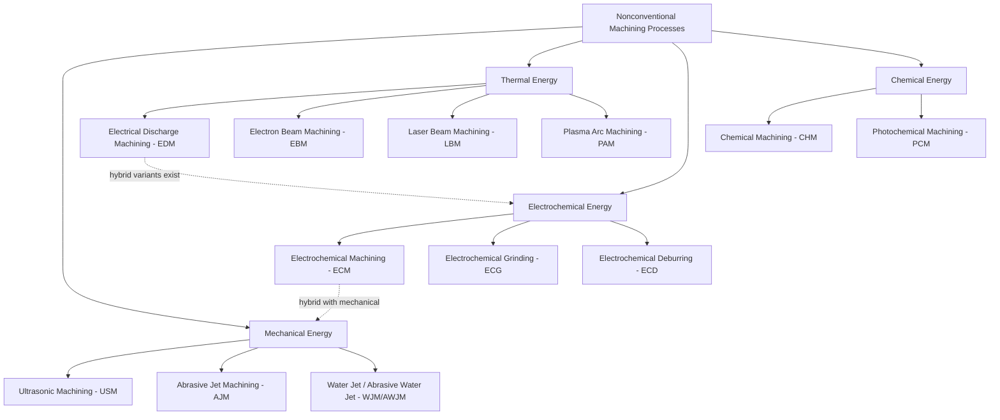

## Classification by Energy Source: Mechanical, Thermal, Electrochemical, Chemical

### Overview

Nonconventional (also called nontraditional or advanced) machining processes are most commonly classified according to the primary form of energy used to remove material, rather than by the mechanical shearing action that defines conventional machining. This classification framework organizes dozens of distinct processes into four fundamental energy domains: **mechanical, thermal (electrothermal), electrochemical, and chemical**. Some processes are hybrids that combine two energy mechanisms simultaneously.

### Rationale for Energy-Based Classification

Unlike conventional machining, where a single classification axis (tool geometry, motion type) suffices, nonconventional processes remove material through fundamentally different physical or chemical mechanisms — none of which necessarily involve a hard cutting tool contacting the workpiece under mechanical shear. Classifying by energy source allows engineers to predict:

- Whether the workpiece material's electrical or thermal conductivity matters
- Whether mechanical hardness of the workpiece is a limiting factor
- The nature of the material removal mechanism (erosion, melting/vaporization, ion dissolution, or corrosive reaction)
- Achievable tolerances, surface integrity, and heat-affected zones

### The Four Energy Source Categories

#### 1. Mechanical Energy Processes

Material is removed through mechanical erosion, abrasion, or shear at a microscopic or particulate level, without a conventional geometrically-defined tool and often without significant thermal or chemical action.

**Key processes:**

- **Ultrasonic Machining (USM):** A tool vibrates at ultrasonic frequency (~20 kHz) with a small amplitude (~25–75 μm), driving abrasive slurry particles against the workpiece to erode material via micro-chipping.
- **Abrasive Jet Machining (AJM):** A high-velocity stream of gas carrying fine abrasive particles impinges on the workpiece surface, eroding material by impact.
- **Water Jet Machining (WJM) / Abrasive Water Jet Machining (AWJM):** A high-pressure water jet (with or without entrained abrasive) erodes or cuts material through mechanical impact and shear.

**Characteristics:** Applicable to both conductive and non-conductive materials; particularly effective on brittle materials (ceramics, glass, composites); low thermal damage; relatively low material removal rates.

#### 2. Thermal (Electrothermal) Energy Processes

Material is removed by localized melting, vaporization, or ablation caused by intense, concentrated thermal energy, typically delivered by electrical discharge, an electron beam, a laser, or a plasma arc.

**Key processes:**

- **Electrical Discharge Machining (EDM):** Controlled sparks (electrical discharges) between an electrode and workpiece, submerged in dielectric fluid, erode material through localized melting and vaporization. Includes die-sinking EDM and wire EDM (WEDM).
- **Electron Beam Machining (EBM):** A focused, high-velocity electron beam strikes the workpiece in a vacuum, converting kinetic energy to heat that melts and vaporizes material.
- **Laser Beam Machining (LBM):** A coherent, focused laser beam delivers intense localized heat, causing melting, vaporization, or ablation.
- **Plasma Arc Machining (PAM):** An ionized gas (plasma) at extremely high temperature (up to ~28,000°C) melts and expels material, primarily used for cutting electrically conductive metals.

**Characteristics:** Workpiece must generally be conductive for EDM (exceptions exist for specialized dielectric-assisted variants); no mechanical contact force in most cases, enabling machining of fragile parts; heat-affected zone (HAZ) and recast layer are important surface integrity concerns; excellent for hard, heat-treated, and complex-geometry materials.

#### 3. Electrochemical Energy Processes

Material is removed through controlled anodic dissolution — the reverse of electroplating — governed by Faraday's laws of electrolysis, without direct mechanical or thermal erosion at the microscopic level.

**Key processes:**

- **Electrochemical Machining (ECM):** The workpiece (anode) and tool (cathode) are separated by a small gap filled with flowing electrolyte; a DC current dissolves the workpiece surface at a rate governed by Faraday's law.
- **Electrochemical Grinding (ECG):** Combines ECM with a rotating conductive abrasive wheel; most material removal is electrochemical, with light mechanical abrasion removing the passivating oxide film.
- **Electrochemical Deburring/Honing (ECD/ECH):** Specialized low-current-density variants for burr removal and bore finishing.

**Governing relationship (Faraday's Law):**

$$V = \frac{I \cdot t \cdot M}{z \cdot F \cdot \rho}$$

where $V$ is volume removed, $I$ is current, $t$ is time, $M$ is atomic/molar mass, $z$ is valence, $F$ is Faraday's constant, and $\rho$ is density.

**Characteristics:** Only applicable to electrically conductive materials; no tool wear (since the tool does not physically contact or erode); no thermal damage or residual stress imparted to the workpiece surface; excellent surface finish achievable; high capital equipment cost.

#### 4. Chemical Energy Processes

Material is removed through controlled chemical dissolution (etching) using reactive chemical reagents (etchants), without mechanical, thermal, or electrical energy input.

**Key processes:**

- **Chemical Machining (CHM) / Chemical Milling:** Selective removal of material from a workpiece using a maskant (resist) to protect areas not to be etched, with exposed areas dissolved by an etchant bath.
- **Photochemical Machining (PCM) / Photochemical Etching:** A photoresist is patterned using photolithography, then the workpiece is chemically etched to reproduce the pattern with high precision — widely used for thin sheet metal parts, lead frames, and fine mesh.

**Characteristics:** Applicable to almost any material that has a compatible etchant; no mechanical or thermal stress introduced; isotropic etching (undercutting beneath the mask) limits achievable aspect ratios and tolerances; low capital cost relative to EDM/ECM but chemical handling and disposal add process overhead.

### Comparative Summary Table

| Energy Source | Removal Mechanism | Conductivity Requirement | Tool Wear | Thermal Damage | Example Processes |
| --- | --- | --- | --- | --- | --- |
| Mechanical | Erosion/abrasion by particle or fluid impact | None required | Moderate (abrasive/nozzle wear) | Minimal | USM, AJM, AWJM |
| Thermal | Melting/vaporization via concentrated heat | Usually required (EDM); not required (laser) | Electrode wear (EDM) | Significant (HAZ, recast layer) | EDM, EBM, LBM, PAM |
| Electrochemical | Anodic dissolution (Faraday's law) | Required | None | None | ECM, ECG |
| Chemical | Chemical dissolution/etching | None required | None (maskant only) | None | CHM, PCM |

### Classification Diagram

### Hybrid Processes Spanning Multiple Energy Domains

Several advanced processes intentionally combine two energy sources to leverage complementary strengths:

- **Electrochemical Grinding (ECG):** electrochemical (dissolution) + mechanical (abrasion)
- **Electrical Discharge Grinding (EDG):** thermal (spark erosion) + mechanical (abrasive contact)
- **Chemical-Assisted USM:** mechanical (vibration/abrasion) + chemical (etchant-assisted removal)

These hybrids typically achieve higher material removal rates than either constituent process alone while mitigating a specific weakness (e.g., ECG's mechanical component removes the insulating oxide layer that would otherwise slow pure ECM).

### Practical Example

**Example:** Producing a turbine blade cooling hole (diameter 0.3 mm, depth 10 mm) in a nickel-based superalloy (Inconel 718).

- Conventional drilling is impractical due to the material's high hardness and work-hardening tendency at elevated temperature.
- **EDM (thermal energy)** or **ECM (electrochemical energy)** are the industry-standard choices:
  - EDM produces the hole via spark erosion, tolerating the material's hardness since no direct mechanical cutting force is involved, but leaves a thin recast layer requiring post-processing.
  - ECM produces the hole via anodic dissolution with no tool wear and no recast layer, but requires careful electrolyte flow control to avoid stray etching.
- The energy-source classification directly informs process selection: hardness limitations rule out mechanical shear-based cutting, while conductivity of the Inconel alloy makes both thermal and electrochemical routes viable, with the final choice driven by surface integrity requirements.

### Key Points

- Nonconventional machining is classified into four primary energy domains: mechanical, thermal, electrochemical, and chemical.
- Electrical conductivity of the workpiece is a critical selection filter: required for ECM/ECG and most EDM variants, not required for mechanical or chemical processes.
- Thermal processes introduce a heat-affected zone and possible recast layer; electrochemical and chemical processes do not.
- Hybrid processes combine two energy sources to overcome individual process limitations (e.g., ECG, EDG).
- Process selection depends on workpiece material properties (hardness, conductivity, chemical reactivity), required tolerance, and surface integrity constraints.

### Related Topics

- Electrical Discharge Machining (EDM): process variants, dielectric fluids, and recast layer formation
- Electrochemical Machining (ECM): electrolyte selection and Faraday's law applications
- Laser Beam Machining (LBM) parameters and beam-material interaction
- Ultrasonic Machining (USM) tool design and abrasive slurry selection
- Photochemical Machining (PCM) and photolithography-based etching
- Hybrid machining processes (ECG, EDG) and their comparative advantages
- Surface integrity considerations across nonconventional machining categories