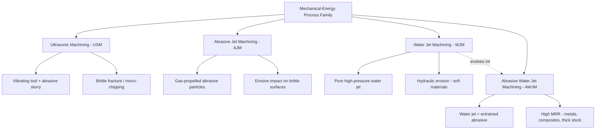

## Mechanical-Energy Nonconventional Process Family

### Overview

The mechanical-energy family of nonconventional machining processes removes material through the mechanical action of particles, fluid, or vibratory motion — erosion, abrasion, or shear at a micro-scale — without relying on melting, chemical dissolution, or electrolytic action. These processes are especially valued for machining hard, brittle, and heat-sensitive materials (ceramics, glass, composites, semiconductors) that are difficult or impossible to machine conventionally, and for materials where thermal damage must be avoided entirely.

### Common Characteristics of the Family

- No electrical conductivity requirement, making these processes applicable to virtually any material, including insulators
- Minimal to no heat-affected zone (HAZ), since bulk temperature rise is generally low
- Material removal occurs through brittle fracture, erosion, or micro-chipping rather than plastic shear
- Generally lower material removal rates (MRR) compared to thermal or conventional processes
- Well suited to brittle, hard, and fragile materials that would fracture under conventional cutting forces

### Member Processes

#### 1. Ultrasonic Machining (USM)

**Principle:** A tool (formed to the desired cavity shape) is vibrated at ultrasonic frequency, typically 19–25 kHz, with a small amplitude (25–75 μm), while an abrasive slurry (boron carbide, silicon carbide, or aluminum oxide grains suspended in water) is pumped into the gap between tool and workpiece. The vibrating tool drives the abrasive grains against the workpiece surface, causing localized brittle fracture and micro-chipping.

**Key parameters:**

- Vibration frequency: ~20 kHz
- Amplitude: 12–50 μm typical
- Abrasive grain size: determines surface finish and MRR trade-off
- Static feed force: controls contact pressure between tool and workpiece

**Material Removal Rate relationship (simplified model):**

$$MRR \propto f \cdot A \cdot d^{1/2}$$

where $f$ is vibration frequency, $A$ is amplitude, and $d$ is mean abrasive grain diameter. [Inference: exact exponents vary by model and empirical calibration; this expresses the general proportional trend.]

**Applications:** Machining of tungsten carbide dies, ceramics, glass, precious stones, quartz, ferrites, and semiconductor materials. Common for producing small, intricate cavities and through-holes in brittle materials.

**Limitations:** Low MRR compared to EDM/ECM; tool wear is significant since the tool itself experiences erosion; best suited to brittle materials, poor for ductile metals which absorb impact energy through plastic deformation rather than fracturing.

#### 2. Abrasive Jet Machining (AJM)

**Principle:** A focused, high-velocity stream of gas (typically dry air, nitrogen, or CO₂) carrying fine abrasive particles (aluminum oxide or silicon carbide, 10–50 μm) is directed at the workpiece through a small nozzle. Material removal occurs via repeated micro-impacts causing brittle fracture or erosive wear.

**Key parameters:**

- Gas pressure: 0.2–1.0 MPa
- Nozzle standoff distance and impingement angle (typically 60–90° for brittle materials)
- Abrasive flow rate and particle size

**Applications:** Cutting, deburring, cleaning, and etching of glass, ceramics, and thin brittle sheets; frosting of glass; deburring of small precision parts; cutting intricate patterns in hard, brittle sheet materials.

**Limitations:** Low MRR; nozzle wear from abrasive flow; stray cutting/tapering of the kerf due to jet divergence; not suitable for soft, ductile materials which tend to embed abrasive particles rather than fracture.

#### 3. Water Jet Machining (WJM)

**Principle:** A high-pressure (up to ~400 MPa), high-velocity (~600–900 m/s) water jet is forced through a small orifice (0.1–0.4 mm diameter) and directed at the workpiece, cutting through erosion and hydraulic shear without abrasive particles.

**Applications:** Cutting soft, non-metallic materials — rubber, foam, textiles, food products, paper, thin plastics — where thermal or mechanical stress-free cutting is critical.

#### 4. Abrasive Water Jet Machining (AWJM)

**Principle:** An extension of WJM in which abrasive particles (typically garnet, 80–120 mesh) are entrained into the water jet via a mixing chamber downstream of the orifice, dramatically increasing the cutting/erosive capability to allow machining of metals, composites, and thick hard materials.

**Key parameters:**

- Water pressure: 200–600 MPa (ultra-high-pressure pumps)
- Abrasive flow rate: 0.1–0.5 kg/min typical
- Standoff distance and traverse speed control kerf taper and edge quality

**Applications:** Cutting titanium, hardened steel, aerospace composites, stone, and thick armor plate; widely used in aerospace and automotive industries for its cold-cutting characteristic (no HAZ, no thermal distortion).

**Comparative note:** AWJM achieves significantly higher MRR than pure WJM or AJM and can cut materials up to 150+ mm thick, making it one of the most versatile members of the mechanical-energy family.

### Comparison Table

| Process | Medium | Abrasive Used | Typical Application | Relative MRR |
| --- | --- | --- | --- | --- |
| USM | Vibrating tool + slurry | Yes (B₄C, SiC, Al₂O₃) | Brittle, hard materials; die sinking | Low |
| AJM | Gas jet | Yes (Al₂O₃, SiC) | Deburring, frosting, thin brittle sheets | Very low |
| WJM | Water jet | No | Soft, non-metallic materials | Moderate (soft materials) |
| AWJM | Water jet | Yes (garnet) | Metals, composites, thick hard stock | Moderate–high |

### Process Family Diagram

### Illustrative Schematic: Ultrasonic Machining Setup

<svg xmlns="http://www.w3.org/2000/svg" viewBox="0 0 500 320">
<text x="250" y="20" font-size="14" text-anchor="middle" font-weight="bold">Ultrasonic Machining (USM) Schematic (svg_diagram)</text>
<rect x="220" y="30" width="60" height="30" fill="#cccccc" stroke="#333" />
<text x="250" y="50" font-size="10" text-anchor="middle">Transducer</text>
<rect x="235" y="60" width="30" height="40" fill="#999999" stroke="#333" />
<text x="250" y="82" font-size="9" text-anchor="middle" fill="white">Horn</text>
<line x1="250" y1="100" x2="250" y2="140" stroke="#333" stroke-width="3" />
<text x="290" y="120" font-size="9">Vibration ~20 kHz</text>
<rect x="225" y="140" width="50" height="15" fill="#666666" stroke="#333" />
<text x="250" y="151" font-size="8" text-anchor="middle" fill="white">Tool</text>
<ellipse cx="250" cy="170" rx="120" ry="15" fill="#a8d5e8" stroke="#333" opacity="0.7" />
<text x="250" y="174" font-size="8" text-anchor="middle">Abrasive Slurry</text>
<rect x="150" y="175" width="200" height="60" fill="#d9b38c" stroke="#333" />
<text x="250" y="210" font-size="10" text-anchor="middle">Workpiece</text>
<rect x="140" y="235" width="220" height="10" fill="#555555" />
<text x="250" y="260" font-size="9" text-anchor="middle">Machine Table</text>
<line x1="80" y1="180" x2="140" y2="180" stroke="#333" stroke-width="1" marker-end="url(#arrow)" />
<text x="40" y="184" font-size="8">Slurry In</text>
</svg>

### Practical Example

**Example:** Producing an intricate square cavity (5 mm × 5 mm × 3 mm deep) in a tungsten carbide die insert.

- Conventional milling cannot economically machine tungsten carbide due to its extreme hardness (>1500 HV).
- EDM could be used but risks introducing a recast layer that affects die life.
- **USM** is selected: a shaped tool electroformed to the cavity profile is vibrated at 20 kHz against the carbide surface with boron carbide abrasive slurry, achieving accurate cavity reproduction through brittle micro-fracture without thermal damage or the need for the workpiece to be electrically conductive.
- This demonstrates the mechanical-energy family's key advantage: applicability regardless of electrical or thermal properties, governed purely by the material's brittleness/hardness characteristics.

### Key Points

- The mechanical-energy family includes USM, AJM, WJM, and AWJM, unified by material removal through particle or fluid impact rather than melting, dissolution, or shear cutting.
- These processes require no electrical conductivity in the workpiece, distinguishing them from thermal and electrochemical families.
- USM and AJM are best suited to brittle materials (ceramics, glass, carbides); WJM suits soft non-metallics; AWJM extends capability to metals and thick composites via abrasive entrainment.
- Material removal rates are generally lower than thermal or electrochemical processes, making this family more suitable for precision, low-damage applications than high-volume stock removal.
- No heat-affected zone or thermal distortion is introduced, a critical advantage for heat-sensitive or dimensionally critical parts.

### Related Topics

- Classification by energy source: mechanical, thermal, electrochemical, chemical
- Abrasive Water Jet Machining (AWJM) process parameters and kerf taper control
- Brittle fracture mechanics in material removal processes
- Tool wear mechanisms in Ultrasonic Machining
- Comparison of nonconventional processes for hard and brittle material machining
- Rotary Ultrasonic Machining (RUM) as a hybrid variant combining USM with rotational cutting