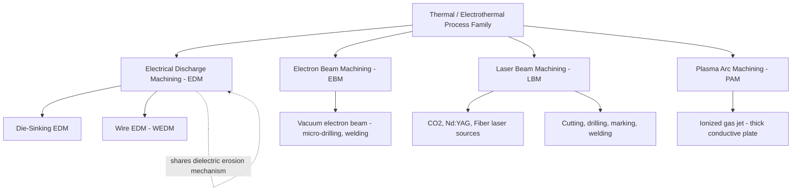

## Thermal and Electrothermal Nonconventional Process Family

### Overview

The thermal and electrothermal family of nonconventional machining processes removes material by generating intense, highly localized heat that causes melting, vaporization, or ablation of the workpiece surface. Energy is delivered through electrical discharges, high-energy particle beams, coherent light, or ionized gas, rather than through mechanical force. This family enables machining of extremely hard, tough, and heat-treated materials — including tool steels, superalloys, and refractory metals — that resist conventional mechanical cutting, but introduces thermal side effects (heat-affected zones, recast layers, residual stresses) that must be managed.

### Common Characteristics of the Family

- Material removal occurs via phase change: melting, vaporization, or sublimation/ablation
- No direct mechanical cutting force applied to the workpiece (except minor plasma/vapor pressure effects), enabling machining of fragile geometries
- A **heat-affected zone (HAZ)** is produced adjacent to the machined surface, with altered microstructure and potential residual stress
- A **recast layer** (resolidified molten material) often forms on the machined surface, particularly in EDM
- Most processes are largely unaffected by workpiece mechanical hardness, since removal depends on thermal properties (melting point, thermal conductivity, specific heat) rather than shear strength
- Several members require electrical conductivity of the workpiece (EDM, PAM); others (laser, electron beam) do not

### Member Processes

#### 1. Electrical Discharge Machining (EDM)

**Principle:** A series of rapid, controlled electrical discharges (sparks) occur between a shaped electrode (tool) and the workpiece, both submerged in a dielectric fluid (typically deionized water or hydrocarbon oil). Each discharge generates localized temperatures of 8,000–12,000°C, melting and vaporizing a tiny volume of material, which is then flushed away by the dielectric.

**Governing relationship (approximate MRR model):**

$$MRR \propto I \cdot t_{on}^{a} \cdot f^{b}$$

where $I$ is discharge current, $t_{on}$ is pulse-on time, and $f$ is discharge frequency, with $a$ and $b$ empirically determined constants dependent on electrode/workpiece material pairing. [Inference: exact exponents are process- and machine-specific; this expresses the general proportional trend documented in EDM literature.]

**Variants:**

- **Die-sinking EDM (Ram EDM):** A shaped electrode is plunged into the workpiece, reproducing its negative form as a cavity.
- **Wire EDM (WEDM):** A continuously traveling thin wire electrode (brass or coated copper, 0.1–0.3 mm) cuts complex 2D/3D profiles, commonly used for stamping dies and extrusion tooling.

**Applications:** Die and mold making, machining hardened tool steels, carbide, and superalloys; producing fine features, sharp internal corners, and deep narrow slots unreachable by conventional tools.

**Limitations:** Requires electrically conductive workpiece; relatively low MRR; electrode wear (particularly in die-sinking); recast layer and micro-cracking require post-processing (e.g., polishing, stress relief) for fatigue-critical applications.

#### 2. Electron Beam Machining (EBM)

**Principle:** A focused, high-velocity beam of electrons, accelerated to 50,000–200,000 V, strikes the workpiece surface in a vacuum chamber. Kinetic energy converts to heat almost instantaneously at the point of impact, vaporizing material in a very narrow zone.

**Applications:** Precision micro-drilling (holes as small as a few micrometers in diameter), cutting thin sheets and foils, and — in its welding variant — deep, narrow-penetration welds.

**Limitations:** Requires a vacuum environment, adding cycle time and equipment cost; limited to relatively thin sections for cutting applications; X-ray shielding required due to high accelerating voltages.

#### 3. Laser Beam Machining (LBM)

**Principle:** A coherent, monochromatic, highly focused beam of light (commonly CO₂, Nd:YAG, or fiber laser sources) delivers extremely high power density (up to $10^9$ W/cm²) to a small spot, causing rapid melting and vaporization. An assist gas (oxygen, nitrogen, or compressed air) often aids material ejection and/or controls oxidation.

**Applications:** Cutting, drilling, welding, and marking of metals, plastics, ceramics, and composites; widely used for sheet metal cutting, micro-drilling of cooling holes in turbine blades, and precision scribing of semiconductor wafers.

**Advantages:** No vacuum required (unlike EBM); no electrical conductivity requirement; highly automatable and integrates well with CNC/robotic systems; narrow kerf width enables fine detail.

**Limitations:** Reflective and highly thermally conductive materials (e.g., copper, aluminum, gold) are harder to process efficiently; HAZ and some recast/dross formation at cut edges, particularly at lower cutting speeds; limited penetration depth for very thick sections compared to plasma or waterjet.

#### 4. Plasma Arc Machining (PAM)

**Principle:** A gas (commonly nitrogen, argon, hydrogen, or air) is ionized by passing through a constricted electric arc, forming a plasma jet reaching temperatures of 10,000–28,000°C. This plasma jet rapidly melts and mechanically expels molten material through the kerf.

**Applications:** Primarily used for cutting electrically conductive metals — mild steel, stainless steel, aluminum — especially in thicknesses from thin sheet up to ~150 mm; heavily used in structural steel fabrication and heavy plate cutting.

**Limitations:** Wider kerf and lower precision compared to laser or wire EDM; larger HAZ; requires electrically conductive workpiece; less suited to fine or intricate detail work.

### Comparison Table

| Process | Energy Delivery | Conductivity Required | Environment | Typical HAZ | Best Suited For |
| --- | --- | --- | --- | --- | --- |
| EDM | Electrical spark discharge | Yes | Dielectric fluid | Moderate + recast layer | Hardened dies, molds, carbide |
| EBM | Electron beam | Not strictly required for cutting | Vacuum | Narrow, minimal | Precision micro-holes, thin foils |
| LBM | Focused laser light | No | Ambient/assist gas | Narrow | Sheet cutting, drilling, marking |
| PAM | Ionized gas (plasma) | Yes | Ambient/assist gas | Wider | Thick conductive plate cutting |

### Process Family Diagram

### Illustrative Schematic: EDM Working Principle

<svg xmlns="http://www.w3.org/2000/svg" viewBox="0 0 500 300">
<text x="250" y="20" font-size="14" text-anchor="middle" font-weight="bold">Electrical Discharge Machining (EDM) Principle (svg_diagram)</text>
<rect x="60" y="50" width="380" height="200" fill="#d6eaf8" stroke="#333" stroke-width="1" />
<text x="250" y="45" font-size="9" text-anchor="middle">Dielectric Fluid Tank</text>
<rect x="210" y="55" width="80" height="60" fill="#8c8c8c" stroke="#333" />
<text x="250" y="90" font-size="9" text-anchor="middle" fill="white">Electrode (Tool)</text>
<line x1="250" y1="115" x2="250" y2="135" stroke="orange" stroke-width="3" />
<line x1="240" y1="118" x2="260" y2="132" stroke="yellow" stroke-width="2" />
<line x1="260" y1="118" x2="240" y2="132" stroke="yellow" stroke-width="2" />
<text x="330" y="128" font-size="8">Spark Discharge Gap</text>
<rect x="150" y="140" width="200" height="80" fill="#d9b38c" stroke="#333" />
<text x="250" y="185" font-size="10" text-anchor="middle">Workpiece</text>
<rect x="180" y="140" width="30" height="15" fill="#555" opacity="0.6" />
<text x="195" y="151" font-size="6" text-anchor="middle" fill="white">Cavity</text>
<rect x="60" y="255" width="380" height="8" fill="#555555" />
<text x="250" y="278" font-size="9" text-anchor="middle">DC Pulse Generator Circuit (not shown to scale)</text>
</svg>

### Practical Example

**Example:** Producing a deep, narrow rectangular cavity (2 mm width, 15 mm depth) with sharp internal corners in a hardened H13 tool steel die (52 HRC).

- Conventional milling cannot access the narrow cavity with sufficient tool rigidity, and the material's hardness accelerates tool wear.
- **Die-sinking EDM** is selected: a copper or graphite electrode machined to the cavity's negative profile is plunged into the workpiece under dielectric oil, generating controlled sparks that erode the steel regardless of its post-hardening state.
- Sharp internal corners — impossible with a rotating end mill, which always leaves a corner radius equal to its own radius — are reproduced precisely, since the electrode itself defines the geometry.
- Post-process stress relief or polishing addresses the thin recast layer to restore fatigue performance for the die application.

### Key Points

- The thermal/electrothermal family includes EDM (with die-sinking and wire variants), EBM, LBM, and PAM, unified by material removal through localized melting/vaporization.
- EDM and PAM require electrically conductive workpieces; laser and electron beam processes are largely material-property-agnostic with respect to conductivity.
- A heat-affected zone and, in EDM's case, a recast layer are inherent trade-offs of this family, often requiring post-processing for critical applications.
- This family excels at machining hardened, tough, and refractory materials independent of mechanical hardness, since removal is governed by thermal rather than mechanical properties.
- Precision varies significantly across the family: wire EDM and laser offer fine detail capability, while plasma arc trades precision for high-thickness cutting capacity.

### Related Topics

- Classification by energy source: mechanical, thermal, electrochemical, chemical
- Wire EDM (WEDM) process parameters and wire electrode materials
- Recast layer formation and post-EDM surface treatment
- Laser beam machining parameters: power density, pulse duration, assist gas selection
- Electron beam welding as a related electrothermal joining process
- Hybrid thermal-mechanical processes (e.g., laser-assisted machining)