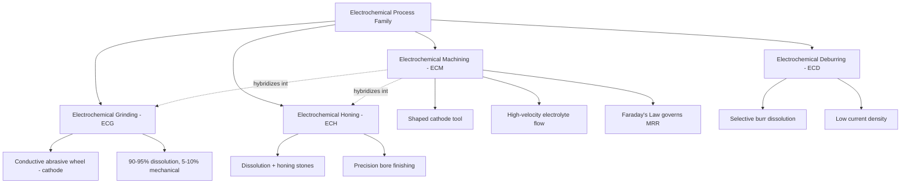

## Electrochemical Nonconventional Process Family

### Overview

The electrochemical family of nonconventional machining processes removes material through controlled anodic dissolution — the reverse of electroplating — governed by the principles of electrolysis. A DC current is passed between the workpiece (anode) and a shaped tool (cathode) across a thin gap filled with flowing electrolyte, causing metal ions to dissolve from the workpiece surface. Because material removal occurs at the atomic/ionic level rather than through mechanical force or thermal melting, this family produces no tool wear, no heat-affected zone, and no mechanically induced residual stress, making it valuable for precision machining of hard, tough, and fatigue-critical conductive materials.

### Common Characteristics of the Family

- Applicable **only to electrically conductive materials** (metals and their alloys)
- No tool wear, since the cathode does not physically contact or erode the workpiece
- No thermal damage, heat-affected zone, or recast layer, since removal is a dissolution process rather than melting
- No mechanically induced residual stress or work hardening on the machined surface
- Material removal rate is largely independent of workpiece hardness, governed instead by electrochemical properties (valence, atomic mass, current efficiency)
- Requires precise control of interelectrode gap, electrolyte flow, and current density to achieve dimensional accuracy

### Governing Physics: Faraday's Laws of Electrolysis

Material removal rate in all electrochemical processes is fundamentally governed by Faraday's law:

$$V = \frac{I \cdot t \cdot M}{z \cdot F \cdot \rho}$$

where:

- $V$ = volume of material removed
- $I$ = applied current
- $t$ = time
- $M$ = atomic (or molar) mass of the workpiece material
- $z$ = valence (number of electrons involved in the dissolution reaction)
- $F$ = Faraday's constant ($96{,}485\ C/mol$)
- $\rho$ = density of the workpiece material

Actual removal rates are typically somewhat lower than this theoretical value due to **current efficiency** $\eta$ (often 90–100% for ECM, lower for processes with competing side reactions), giving:

$$V_{actual} = \eta \cdot \frac{I \cdot t \cdot M}{z \cdot F \cdot \rho}$$

### Member Processes

#### 1. Electrochemical Machining (ECM)

**Principle:** The workpiece is connected as the anode and a shaped tool electrode as the cathode, separated by a small gap (typically 0.1–0.6 mm) through which electrolyte (commonly sodium chloride or sodium nitrate solution) flows at high velocity. As DC current passes through the gap, metal ions dissolve from the workpiece surface, and the tool's shape is reproduced as the negative image, with the dissolved metal hydroxide flushed away by the electrolyte flow before it can redeposit.

**Key parameters:**

- Current density: typically 20–200 A/cm²
- Interelectrode gap: 0.1–0.6 mm, held constant via controlled feed rate matching dissolution rate
- Electrolyte flow velocity: high (to flush products and dissipate Joule heating), often 10–60 m/s
- Applied voltage: typically 5–25 V DC

**Applications:** Machining complex 3D cavities in hardened superalloys and tool steels; turbine blade profiling; deburring; producing non-circular holes; die and mold cavity sinking in materials too hard or tough for conventional or EDM processes.

**Limitations:** High capital cost (power supply, electrolyte handling, corrosion-resistant tooling); electrolyte disposal and environmental handling requirements; stray etching if gap control is imprecise; tool (cathode) design is complex, as the equilibrium gap shape determines final workpiece geometry.

#### 2. Electrochemical Grinding (ECG)

**Principle:** A hybrid process combining electrochemical dissolution with light mechanical abrasion. A rotating grinding wheel with a conductive bond (commonly metal-bonded diamond or CBN) serves as the cathode, while the workpiece is the anode. Approximately 90–95% of material removal occurs electrochemically; the abrasive grains' mechanical action primarily removes the thin, non-conductive oxide/passivation film that would otherwise slow the electrochemical dissolution, rather than performing bulk cutting.

**Applications:** Grinding carbide tool tips without inducing micro-cracking (a risk with conventional grinding of carbides); sharpening surgical needles and thin-walled tubing; producing burr-free edges on hardened materials.

**Advantage over conventional grinding:** Since most material removal is electrochemical rather than mechanical, wheel wear and workpiece thermal damage are drastically reduced, extending wheel life and improving surface integrity, particularly for brittle, crack-sensitive materials like cemented carbide.

#### 3. Electrochemical Deburring (ECD)

**Principle:** A specialized, low-current-density variant of ECM in which a shaped cathode is positioned near burrs or sharp edges resulting from prior machining operations. The electrochemical dissolution selectively removes the burr (which has higher current density due to its geometry) without significantly affecting the surrounding bulk surface.

**Applications:** Deburring intersecting holes, cross-drilled passages, and gear teeth where mechanical deburring tools cannot reach; particularly valuable in fuel injection components and hydraulic manifolds where trapped burrs pose functional risks.

#### 4. Electrochemical Honing (ECH)

**Principle:** Combines ECM with conventional honing motion (rotating and reciprocating abrasive stones) to finish bores, similar in concept to ECG but applied to cylindrical internal surfaces. Electrochemical dissolution provides the bulk of stock removal while the honing stones maintain geometric accuracy and remove the passivation layer.

**Applications:** High-precision bore finishing in hardened cylinder liners and hydraulic components, achieving fine surface finish with minimal cycle time compared to conventional honing alone.

### Comparison Table

| Process | Primary Mechanism | Mechanical Component | Typical Application |
| --- | --- | --- | --- |
| ECM | Pure anodic dissolution | None (shaped cathode only) | Complex 3D cavity/profile machining |
| ECG | Dissolution + light abrasion | Conductive abrasive wheel | Carbide tool grinding, crack-free finishing |
| ECD | Selective dissolution | None | Burr removal in inaccessible areas |
| ECH | Dissolution + honing motion | Abrasive honing stones | Precision bore finishing |

### Process Family Diagram

### Illustrative Schematic: ECM Working Principle

<svg xmlns="http://www.w3.org/2000/svg" viewBox="0 0 500 300">
<text x="250" y="20" font-size="14" text-anchor="middle" font-weight="bold">Electrochemical Machining (ECM) Principle (svg_diagram)</text>
<rect x="200" y="45" width="100" height="50" fill="#8c8c8c" stroke="#333" />
<text x="250" y="75" font-size="9" text-anchor="middle" fill="white">Tool (Cathode) -</text>
<rect x="205" y="95" width="6" height="70" fill="#a8d5e8" opacity="0.8" />
<rect x="215" y="95" width="6" height="70" fill="#a8d5e8" opacity="0.8" />
<rect x="225" y="95" width="50" height="70" fill="#ffffff" />
<rect x="285" y="95" width="6" height="70" fill="#a8d5e8" opacity="0.8" />
<rect x="295" y="95" width="6" height="70" fill="#a8d5e8" opacity="0.8" />
<text x="250" y="130" font-size="7" text-anchor="middle">Electrolyte Gap (0.1-0.6mm)</text>
<rect x="150" y="165" width="200" height="70" fill="#d9b38c" stroke="#333" />
<text x="250" y="205" font-size="10" text-anchor="middle">Workpiece (Anode) +</text>
<line x1="80" y1="120" x2="200" y2="120" stroke="#2874a6" stroke-width="2" marker-end="url(#arrow2)" />
<text x="40" y="115" font-size="8">Electrolyte In</text>
<line x1="300" y1="120" x2="420" y2="120" stroke="#2874a6" stroke-width="2" marker-end="url(#arrow2)" />
<text x="380" y="115" font-size="8">Outflow</text>
<text x="250" y="260" font-size="9" text-anchor="middle">DC Power Supply (5-25V)</text>

</svg>

### Practical Example

**Example:** Machining a complex, curved internal cooling passage in a nickel-based superalloy (Inconel 718) turbine blade.

- The material's high hardness and work-hardening tendency make conventional drilling/milling impractical, and the complex internal curvature is inaccessible to rigid rotating tools.
- **ECM** is selected: a precisely shaped cathode tool is fed into the workpiece as high-velocity electrolyte flows through the gap, dissolving the Inconel 718 anodically to reproduce the tool's negative profile.
- Because no mechanical force or heat is applied, the blade's fatigue-critical microstructure remains unaffected — critical for a component subject to cyclic thermal and mechanical stress in service.
- No tool wear occurs regardless of the material's hardness, since the cathode never contacts the workpiece.

### Key Points

- The electrochemical family includes ECM, ECG, ECD, and ECH, unified by anodic dissolution governed by Faraday's laws of electrolysis.
- Applicability is strictly limited to electrically conductive workpiece materials.
- Zero tool wear and zero thermal/mechanical damage are the family's defining advantages over EDM and conventional machining.
- ECG and ECH are hybrids that combine electrochemical dissolution with light mechanical abrasion, primarily to remove passivating oxide films rather than perform bulk cutting.
- High capital and operating costs (power supply, electrolyte systems, corrosion-resistant equipment) are the primary economic limitation of this family.

### Related Topics

- Classification by energy source: mechanical, thermal, electrochemical, chemical
- Faraday's laws of electrolysis and current efficiency in electrochemical processes
- Electrochemical Grinding (ECG) for crack-free carbide tool sharpening
- Tool (cathode) design and equilibrium gap prediction in ECM
- Electrolyte selection and passivation film chemistry
- Comparison of ECM and EDM for hardened superalloy machining