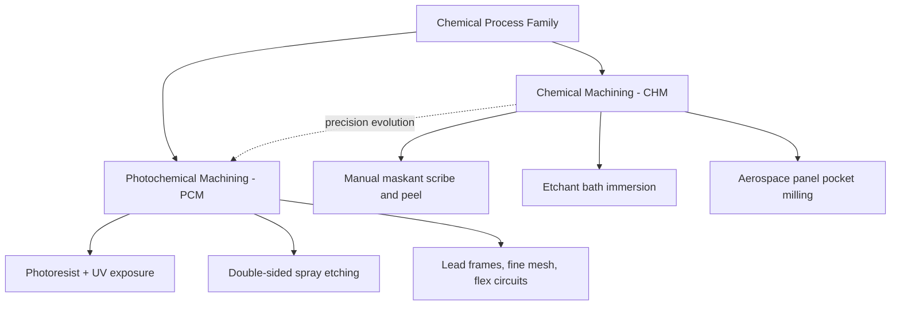

## Chemical Nonconventional Process Family

### Overview

The chemical family of nonconventional machining processes removes material through controlled chemical dissolution — a corrosive chemical reaction between a reactive reagent (etchant) and the workpiece surface — without any mechanical, thermal, or electrical energy input. Selective material removal is achieved by masking the areas to be preserved and exposing only the desired regions to the etchant. This family is distinguished by its ability to produce complex, shallow-depth patterns simultaneously across large or intricate surfaces, with no mechanical or thermal stress introduced into the workpiece.

### Common Characteristics of the Family

- Material removal occurs via chemical dissolution (etching), not mechanical, thermal, or electrical action
- No mechanically or thermally induced residual stress, distortion, or work hardening
- Applicable to nearly any material for which a suitable etchant exists (metals, some ceramics, semiconductors)
- Etching is generally **isotropic** — the etchant attacks in all directions equally, causing undercutting beneath the maskant edges, which limits achievable aspect ratio and tolerance
- Well suited to producing many identical, intricate, shallow features simultaneously across a large sheet or batch
- Requires careful chemical handling, ventilation, and effluent/waste treatment due to the corrosive etchants involved

### Member Processes

#### 1. Chemical Machining (CHM) / Chemical Milling

**Principle:** A workpiece surface is cleaned and coated with a chemically resistant maskant (typically a neoprene-based or vinyl-based elastomeric coating). The maskant is selectively scribed and peeled away from areas designated for material removal, exposing bare metal. The workpiece is then immersed in a temperature-controlled etchant bath (e.g., ferric chloride for steel, sodium hydroxide for aluminum), which dissolves the exposed material at a controlled rate, typically 0.025–0.1 mm/min depending on material and etchant concentration.

**Process sequence:**

1. Surface cleaning and degreasing
2. Maskant application (dip, spray, or brush)
3. Scribing and peeling of maskant per the desired pattern
4. Immersion in etchant bath under controlled temperature and agitation
5. Rinsing and maskant stripping
6. Inspection and dimensional verification

**Key parameters:**

- Etch rate: material- and etchant-dependent, typically expressed in mm/min or mils/min
- Etch factor: ratio of depth etched to lateral undercut, a key figure of merit for tolerance capability

$$\text{Etch Factor} = \frac{\text{Depth of Cut}}{\text{Lateral Undercut}}$$

- Higher etch factors indicate less undercutting relative to depth, allowing tighter tolerances and steeper sidewalls

**Applications:** Weight reduction in aerospace structural panels (pocket milling of large aluminum or titanium skins), producing shallow relief patterns, tapering, and blending large-area contours where mechanical milling would be time-prohibitive.

**Limitations:** Relatively shallow depth capability (typically up to a few millimeters); isotropic undercutting limits tolerance and aspect ratio; process is comparatively slow and best suited to shallow, wide-area removal rather than deep pockets.

#### 2. Photochemical Machining (PCM) / Photochemical Etching / Photo Etching

**Principle:** An extension of chemical machining using photolithography to define the mask pattern with much finer precision than manual scribing. A thin metal sheet (typically 0.01–3 mm thick) is coated on both sides with a UV-sensitive photoresist. A photographic negative (photo-tool) bearing the desired pattern is placed over the resist, which is then exposed to UV light, hardening the exposed resist regions. Unexposed resist is chemically developed away, exposing bare metal in the pattern areas, which is then etched (typically from both sides simultaneously to reduce undercut and etch time) in a spray etching system.

**Process sequence:**

1. CAD pattern generation and photo-tool (film) production
2. Photoresist lamination onto both sides of the metal sheet
3. UV exposure through the photo-tool (double-sided registration)
4. Resist development (removal of unexposed/uncured resist)
5. Chemical etching (typically spray etching for uniformity and speed)
6. Resist stripping, rinsing, and inspection

**Key parameters:**

- Achievable feature tolerance: typically ±10% of material thickness, with fine features achievable down to material thickness limits
- Etchant selection depends on base metal: ferric chloride for stainless steel and copper alloys, ammonium/cupric chloride for copper, and specialized etchants for exotic alloys

**Applications:** Precision lead frames for semiconductor packaging, fine mesh and filter screens, decorative and functional thin-metal components, flexible circuit shielding, encoder discs, and complex burr-free stamping die alternatives for prototyping and low-to-medium volume production.

**Advantages over mechanical stamping/blanking:** No mechanical stress, burrs, or tool wear; extremely fine, complex geometries achievable without hard tooling; economical for prototyping and moderate production volumes since no dedicated die is required; excellent repeatability across large sheets.

**Limitations:** Limited to relatively thin sheet stock; isotropic etching still imposes an aspect-ratio and tolerance ceiling; tooling (photo-tool/film) revision required for any design change, though this is far less costly than hard tooling revision.

### Comparison Table

| Process | Precision Method | Typical Stock Thickness | Depth Capability | Primary Application |
| --- | --- | --- | --- | --- |
| Chemical Machining (CHM) | Manual scribe-and-peel maskant | Thick plate/sheet (structural) | Shallow-moderate (pockets, tapers) | Aerospace panel weight reduction |
| Photochemical Machining (PCM) | Photolithographic mask | Thin sheet (0.01–3 mm) | Full through-etch or shallow relief | Lead frames, fine mesh, flex circuits |

### Process Family Diagram

### Illustrative Schematic: Photochemical Machining Process Flow

<svg xmlns="http://www.w3.org/2000/svg" viewBox="0 0 520 300">
<text x="260" y="20" font-size="14" text-anchor="middle" font-weight="bold">Photochemical Machining (PCM) Process Flow (svg_diagram)</text>
<rect x="20" y="50" width="90" height="40" fill="#d9b38c" stroke="#333" />
<text x="65" y="74" font-size="8" text-anchor="middle">1. Bare Metal Sheet</text>
<rect x="140" y="50" width="90" height="40" fill="#f4d03f" stroke="#333" />
<text x="185" y="68" font-size="8" text-anchor="middle">2. Photoresist</text>
<text x="185" y="80" font-size="8" text-anchor="middle">Laminated</text>
<rect x="260" y="50" width="90" height="40" fill="#aed6f1" stroke="#333" />
<text x="305" y="68" font-size="8" text-anchor="middle">3. UV Exposure</text>
<text x="305" y="80" font-size="8" text-anchor="middle">through Photo-tool</text>
<rect x="380" y="50" width="90" height="40" fill="#f9e79f" stroke="#333" />
<text x="425" y="68" font-size="8" text-anchor="middle">4. Develop</text>
<text x="425" y="80" font-size="8" text-anchor="middle">Resist</text>
<rect x="380" y="130" width="90" height="40" fill="#82e0aa" stroke="#333" />
<text x="425" y="154" font-size="8" text-anchor="middle">5. Spray Etch</text>
<rect x="260" y="130" width="90" height="40" fill="#d5d8dc" stroke="#333" />
<text x="305" y="148" font-size="8" text-anchor="middle">6. Strip Resist</text>
<text x="305" y="160" font-size="8" text-anchor="middle">/ Rinse</text>
<rect x="140" y="130" width="90" height="40" fill="#e8daef" stroke="#333" />
<text x="185" y="154" font-size="8" text-anchor="middle">7. Final Part</text>
<line x1="110" y1="70" x2="140" y2="70" stroke="#333" marker-end="url(#a3)" />
<line x1="230" y1="70" x2="260" y2="70" stroke="#333" marker-end="url(#a3)" />
<line x1="350" y1="70" x2="380" y2="70" stroke="#333" marker-end="url(#a3)" />
<line x1="425" y1="90" x2="425" y2="130" stroke="#333" marker-end="url(#a3)" />
<line x1="380" y1="150" x2="350" y2="150" stroke="#333" marker-end="url(#a3)" />
<line x1="260" y1="150" x2="230" y2="150" stroke="#333" marker-end="url(#a3)" />
</svg>

### Illustrative Diagram: Isotropic Undercut in Chemical Etching

<svg xmlns="http://www.w3.org/2000/svg" viewBox="0 0 400 220">
<text x="200" y="20" font-size="13" text-anchor="middle" font-weight="bold">Isotropic Undercut Profile (svg_diagram)</text>
<rect x="50" y="50" width="300" height="20" fill="#333333" />
<text x="200" y="45" font-size="8" text-anchor="middle">Maskant Layer</text>
<rect x="50" y="70" width="80" height="15" fill="#333333" />
<rect x="270" y="70" width="80" height="15" fill="#333333" />
<path d="M130,70 Q135,110 170,140 L230,140 Q265,110 270,70 Z" fill="#d9b38c" stroke="#333" />
<text x="200" y="180" font-size="8" text-anchor="middle">Undercut Region (beneath mask edge)</text>
<line x1="130" y1="70" x2="130" y2="190" stroke="red" stroke-dasharray="3,3" />
<line x1="170" y1="140" x2="170" y2="190" stroke="red" stroke-dasharray="3,3" />
<text x="150" y="205" font-size="7" text-anchor="middle" fill="red">Lateral Undercut</text>
</svg>

### Practical Example

**Example:** Producing a stainless-steel lead frame for a semiconductor package, 0.15 mm thick, with 500 identical fine-pitch features (0.2 mm width) across a panel.

- Conventional stamping would require a hardened progressive die, economical only at very high volumes, with significant lead time and tooling cost for design changes.
- **Photochemical Machining** is selected: a photo-tool encoding all 500 features is produced digitally and used to expose photoresist on both sides of the stainless-steel sheet; double-sided spray etching removes the exposed metal simultaneously across the entire panel.
- Because the process introduces no mechanical stress, the fine, closely spaced features remain flat and burr-free, meeting the tight coplanarity requirements of semiconductor packaging.
- Design changes require only a new photo-tool (film), avoiding the cost and lead time of hard-tooling revision — a decisive advantage for prototyping and evolving product designs.

### Key Points

- The chemical family includes Chemical Machining (CHM) and Photochemical Machining (PCM), unified by material removal via controlled chemical dissolution (etching).
- No mechanical or thermal stress is introduced, making this family ideal for stress-sensitive, thin, or precision components.
- Etching is inherently isotropic, causing undercut beneath the maskant and limiting achievable aspect ratio and tolerance — quantified by the etch factor.
- CHM is typically applied to thicker stock for shallow pocket/taper removal (e.g., aerospace panels), while PCM targets thin sheet stock with photolithographic precision for fine, complex patterns.
- Tooling costs are comparatively low and design changes are fast, since photo-tools (film) replace hard mechanical dies.

### Related Topics

- Classification by energy source: mechanical, thermal, electrochemical, chemical
- Etch factor and undercut control in chemical etching processes
- Photolithography fundamentals as applied to photochemical machining
- Maskant selection and etchant chemistry for various base metals
- Comparison of PCM with conventional stamping/blanking for prototyping
- Chemical milling in aerospace structural weight reduction applications