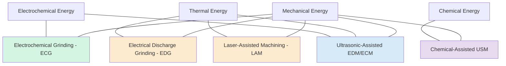
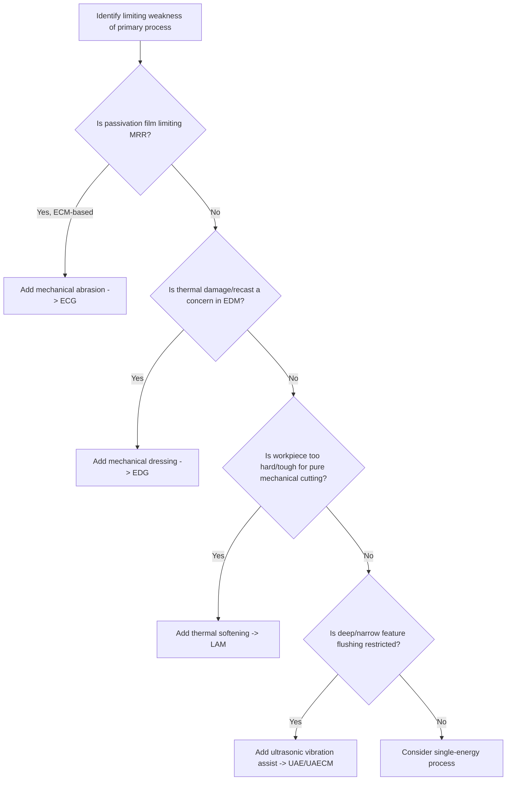

## Hybrid Nonconventional Process Combinations

### Overview

Hybrid nonconventional machining processes deliberately combine two or more distinct energy mechanisms — mechanical, thermal, electrochemical, or chemical — simultaneously in a single operation, rather than applying them sequentially. The intent is to exploit the complementary strengths of each constituent mechanism, overcoming a specific weakness of one process by superimposing another. A properly designed hybrid typically achieves higher material removal rate (MRR), better surface integrity, or expanded material applicability than either process could achieve independently at comparable parameters.

### Rationale for Hybridization

Pure single-energy nonconventional processes each carry a characteristic limitation:

- Pure ECM has excellent surface integrity but is slowed by passivating oxide films that resist dissolution
- Pure EDM produces a recast layer and micro-cracking, and has relatively low MRR
- Pure USM has very low MRR on ductile/tough materials
- Pure mechanical grinding on brittle, hard materials (e.g., cemented carbide) risks micro-cracking and rapid wheel wear

Hybrid processes address these limitations by adding a second energy mechanism that specifically targets the weak point of the primary mechanism, rather than simply superimposing two full-strength processes.

### Key Hybrid Process Combinations

#### 1. Electrochemical Grinding (ECG) — Electrochemical + Mechanical

**Principle:** A rotating, conductive-bonded abrasive wheel (typically metal-bonded diamond or CBN) serves as the cathode, while the workpiece is the anode, with electrolyte flooding the grinding zone. Approximately 90–95% of material removal occurs via electrochemical dissolution; the abrasive grains' mechanical action removes the thin, non-conductive oxide/passivation film that otherwise impedes further dissolution, rather than performing the bulk of the cutting.

**Benefit of hybridization:** Removes the passivation-film limitation of pure ECM while drastically reducing the mechanical/thermal stress that pure grinding would impose on crack-sensitive materials like cemented carbide — wheel wear and micro-cracking are minimized since the abrasive does the minimum mechanical work needed.

**Applications:** Sharpening and profiling carbide cutting tool tips, grinding thin-walled surgical needles, burr-free edge finishing of hardened components.

#### 2. Electrical Discharge Grinding (EDG) — Thermal + Mechanical

**Principle:** Similar in configuration to ECG but replacing electrochemical dissolution with spark erosion: a rotating conductive-bonded wheel acts as one electrode, generating discharges against the workpiece while also providing light mechanical contact and continuous dressing of the wheel face.

**Benefit of hybridization:** Combines the hardness-independence of EDM's thermal erosion with the wheel's mechanical action, which helps maintain wheel geometry and flush eroded debris, improving process stability over pure spark erosion between two static electrodes.

**Applications:** Grinding fine, hardened, conductive components where conventional grinding would cause excessive wheel wear or thermal damage.

#### 3. Chemical-Assisted Ultrasonic Machining — Mechanical + Chemical

**Principle:** Ultrasonic vibration and abrasive slurry impact (mechanical) are combined with a chemically reactive etchant in the slurry medium, so that the chemical action weakens or pre-reacts the workpiece surface, allowing the mechanical abrasive action to remove material more readily than either mechanism alone.

**Benefit of hybridization:** Chemical softening reduces the mechanical energy required for micro-fracture, improving MRR on materials that are only marginally brittle enough for efficient pure USM.

**Applications:** [Inference: less standardized in industrial practice than ECG/EDG; typically found in specialized or research-driven micromachining contexts for hard, chemically reactive materials.]

#### 4. Laser-Assisted Machining (LAM) — Thermal + Mechanical

**Principle:** A laser beam locally preheats the workpiece material immediately ahead of a conventional cutting tool, thermally softening the material to reduce its shear strength before mechanical cutting occurs. The two energy sources act on the same material volume in immediate succession within the same operation.

**Benefit of hybridization:** Reduces cutting forces and tool wear when machining hard, difficult-to-cut materials (e.g., ceramics, nickel-based superalloys, hardened steels) compared to conventional cutting alone, while avoiding the full melting/vaporization and recast layer that pure thermal processes (EDM, LBM) would introduce.

**Applications:** Turning and milling of hardened superalloys and advanced ceramics where a balance between MRR and surface integrity is required.

#### 5. Ultrasonic-Assisted EDM / ECM — Mechanical + Thermal or Electrochemical

**Principle:** Ultrasonic vibration is superimposed on the tool electrode in EDM or ECM, improving dielectric/electrolyte circulation and debris flushing within the machining gap through cavitation and pumping effects.

**Benefit of hybridization:** Improves process stability, reduces short-circuiting (in EDM) and stray current effects (in ECM), and can improve achievable MRR and surface finish, particularly in deep, narrow features where fluid flushing is otherwise restricted.

**Applications:** Micro-EDM and micro-ECM of deep, high-aspect-ratio micro-features.

### Comparison Table

| Hybrid Process | Constituent Mechanisms | Primary Removal Mode | Secondary Mode's Role | Key Application |
| --- | --- | --- | --- | --- |
| ECG | Electrochemical + Mechanical | Anodic dissolution (~90–95%) | Removes passivation film | Carbide tool grinding |
| EDG | Thermal + Mechanical | Spark erosion | Wheel dressing/debris flushing | Hardened conductive part grinding |
| Chemical-Assisted USM | Mechanical + Chemical | Abrasive micro-fracture | Chemical surface softening | Specialized hard-material micromachining |
| LAM | Thermal + Mechanical | Mechanical shear cutting | Local thermal softening ahead of tool | Superalloy/ceramic turning-milling |
| Ultrasonic-Assisted EDM/ECM | Thermal or Electrochemical + Mechanical | Spark erosion or dissolution | Vibration-enhanced flushing | Deep micro-feature machining |

### Hybrid Process Relationship Diagram

### Decision Framework for Selecting a Hybrid Process

### Practical Example

**Example:** Grinding a cemented tungsten carbide insert to a sharp cutting edge with a target surface free of micro-cracks for a fatigue-critical cutting tool application.

- Pure conventional diamond grinding risks introducing sub-surface micro-cracks in the brittle carbide due to high mechanical contact stresses, shortening tool life in service.
- Pure ECM alone could dissolve the carbide's cobalt binder phase preferentially but cannot efficiently address the tungsten carbide grains, and lacks the precision edge-forming control of a wheel.
- **Electrochemical Grinding (ECG)** is selected: the conductive diamond wheel supplies the shape-defining mechanical contact needed for a sharp edge while electrochemical dissolution performs the bulk of the material removal, minimizing mechanical contact force and therefore minimizing micro-crack initiation.
- The result is a sharper, longer-lasting cutting edge than pure mechanical grinding would achieve on the same substrate, illustrating the core hybrid rationale: each mechanism compensates for the other's specific weakness.

### Key Points

- Hybrid nonconventional processes combine two energy mechanisms simultaneously (not sequentially) to overcome a specific limitation of the primary mechanism.
- ECG and EDG are the most industrially mature hybrids, both pairing mechanical wheel action with electrochemical or thermal erosion respectively.
- Laser-Assisted Machining (LAM) pairs thermal softening with conventional mechanical cutting, distinct from the grinding-based hybrids.
- Ultrasonic assistance is commonly layered onto EDM or ECM primarily to improve fluid/debris flushing in deep or narrow features, rather than to perform primary material removal.
- Hybrid process selection should be driven by identifying the specific weakness of the best-fit single-energy process and choosing a secondary mechanism that directly addresses that weakness.

### Related Topics

- Classification by energy source: mechanical, thermal, electrochemical, chemical
- Electrochemical Grinding (ECG) wheel bond types and passivation film chemistry
- Laser-Assisted Machining (LAM) thermal softening parameters for superalloys
- Micro-EDM and micro-ECM for high-aspect-ratio micro-feature production
- Surface integrity comparison: hybrid vs. single-energy nonconventional processes
- Economic trade-offs of hybrid process adoption in high-value manufacturing