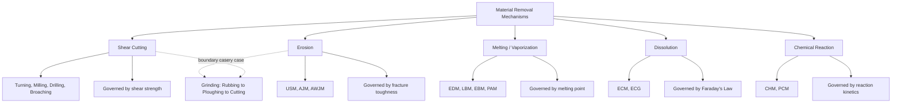
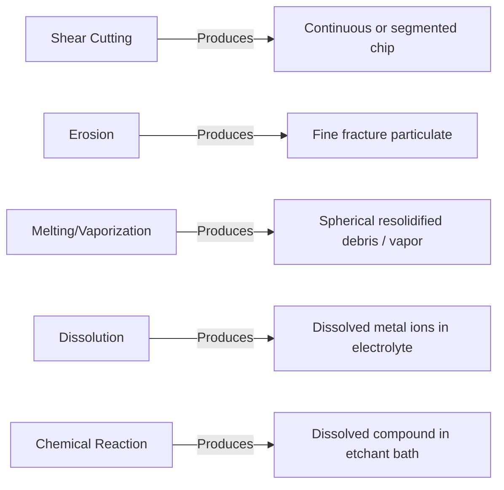

## Classification by Material-Removal Mechanism Versus Cutting

### Overview

An alternative and complementary framework to energy-source classification organizes nonconventional and conventional processes according to the fundamental **mechanism of material removal** — that is, the underlying physical or chemical phenomenon by which atoms, molecules, or particles leave the workpiece — rather than by the form of energy that drives it. This distinction separates true **cutting** (mechanical shear along a defined plane, producing a continuous or discontinuous chip) from a broader set of **non-cutting removal mechanisms**: erosion, melting/vaporization, dissolution, and chemical reaction. Two processes can share the same energy source category yet differ fundamentally in removal mechanism, making this an independent and valuable classification axis.

### Why This Classification Axis Matters

Energy-source classification (mechanical, thermal, electrochemical, chemical) answers "what powers the process?" Mechanism-based classification answers "how does material actually leave the surface?" The two axes are not redundant:

- Two mechanical-energy processes — USM (erosion via abrasive impact) and conventional turning (shear cutting) — share no removal mechanism despite both being "mechanical."
- This axis directly predicts chip/debris morphology, achievable surface finish, subsurface damage character, and whether classical metal-cutting theory (shear plane angle, Merchant's circle, chip formation models) applies at all.

### The Fundamental Mechanisms

#### 1. Shear Cutting (True Cutting)

Material separates along a defined shear plane ahead of a geometrically defined cutting edge, producing a coherent chip through plastic deformation followed by fracture or continuous flow.

**Characteristic processes:** Turning, milling, drilling, planing, shaping, broaching (all conventional machining); also single-point diamond turning.

**Governing theory:** Classical orthogonal cutting models apply — shear plane angle $\phi$, rake angle $\alpha$, and the Merchant relationship:

$$2\phi + \beta - \alpha = \frac{\pi}{2}$$

where $\beta$ is the friction angle at the tool-chip interface.

**Debris form:** Continuous, discontinuous, or serrated chips with identifiable geometry.

#### 2. Erosion (Mechanical Impact / Abrasive Wear)

Material is removed through repeated micro-impacts or abrasive contact that cause localized brittle fracture, micro-chipping, or fatigue-driven particle detachment, without a coherent shear plane or classical chip.

**Characteristic processes:** Ultrasonic Machining (USM), Abrasive Jet Machining (AJM), Water Jet/Abrasive Water Jet Machining (WJM/AWJM); also grinding, lapping, and honing sit partly in this category since individual abrasive grains erode rather than cut in the classical sense.

**Debris form:** Fine particulate debris (microchips and fracture fragments), not coherent chips.

**Governing behavior:** Removal rate depends on impact energy, particle hardness/size, and workpiece fracture toughness rather than shear strength.

#### 3. Melting and Vaporization (Thermal Ablation)

Material is removed by heating a localized volume past its melting point and/or boiling point, causing it to flow away as molten material or escape as vapor/plasma.

**Characteristic processes:** EDM, EBM, LBM, PAM.

**Debris form:** Resolidified spherical debris particles (EDM), vapor/plasma plume (laser, plasma, electron beam), recast layer remaining on the surface.

**Governing behavior:** Removal rate depends on thermal properties (melting point, latent heat, thermal conductivity, specific heat) rather than mechanical strength; largely independent of hardness.

#### 4. Dissolution (Anodic/Electrochemical)

Material is removed atom-by-atom (strictly, ion-by-ion) through electrochemically driven oxidation, governed quantitatively by Faraday's law.

**Characteristic processes:** ECM, ECG (removal is ~90–95% dissolution), ECD, ECH.

**Debris form:** Dissolved metal ions/hydroxide sludge carried away in the electrolyte stream; no solid chip or particulate debris from the workpiece itself.

**Governing behavior:** Removal rate depends on current density, valence, and current efficiency; independent of mechanical or thermal properties.

#### 5. Chemical Reaction (Etching)

Material is removed through a direct chemical reaction between the workpiece surface and a reactive reagent, converting solid metal into a soluble compound that is carried away in solution.

**Characteristic processes:** Chemical Machining (CHM), Photochemical Machining (PCM).

**Debris form:** Dissolved reaction products in the etchant bath; no particulate or chip debris.

**Governing behavior:** Removal rate depends on reaction kinetics (etchant concentration, temperature, agitation) rather than mechanical, thermal, or electrical properties.

### Comparative Table: Mechanism vs. Energy Source

| Mechanism | Debris Form | Governing Property | Example Processes | Energy Source(s) Typically Used |
| --- | --- | --- | --- | --- |
| Shear cutting | Coherent chip | Shear strength, hardness | Turning, milling, drilling | Mechanical |
| Erosion | Fine particulate/fracture debris | Fracture toughness, hardness | USM, AJM, AWJM, grinding | Mechanical |
| Melting/vaporization | Resolidified debris, vapor plume | Melting point, thermal conductivity | EDM, LBM, EBM, PAM | Thermal |
| Dissolution | Dissolved ions/sludge | Valence, current density | ECM, ECG | Electrochemical |
| Chemical reaction | Dissolved reaction products | Reaction kinetics | CHM, PCM | Chemical |

### Cross-Cutting Insight: Grinding as a Boundary Case

Grinding is instructive precisely because it does not fit cleanly into either "cutting" or "erosion" alone. Each abrasive grain undergoes three sequential interaction phases with the workpiece:

1. **Rubbing** — elastic contact, no material removal
2. **Ploughing** — plastic deformation without chip formation
3. **Cutting** — actual microchip formation, mechanically analogous to shear cutting but at microscopic scale with extreme negative rake angle

This is why grinding is often described as sitting at the boundary between conventional (shear-based) and abrasive/erosive (nonconventional-adjacent) classification — reinforcing that mechanism-based classification is a spectrum, not a strict partition.

### Classification Diagram

### Debris/Chip Morphology Comparison

### Practical Example

**Example:** Comparing two candidate processes for deburring a cross-drilled hydraulic manifold passage in hardened steel — mechanical deburring tool versus electrochemical deburring (ECD).

- A mechanical deburring tool relies on **shear cutting**: a small rotating cutter physically shears the burr material, requiring line-of-sight tool access to the intersecting bore, which is often geometrically impossible for deeply intersecting passages.
- ECD relies on **dissolution**: current density concentrates at the sharp burr geometry (higher current density at sharp features), preferentially dissolving it without requiring direct mechanical tool access.
- The mechanism distinction — shear cutting requiring physical tool access versus dissolution requiring only electrolyte and current path access — directly determines process feasibility for this geometry, independent of either process's "energy source" classification.

### Key Points

- Material-removal mechanism (shear cutting, erosion, melting/vaporization, dissolution, chemical reaction) is an independent classification axis from energy source, answering "how" material leaves the surface rather than "what powers" the process.
- Only shear cutting produces a coherent chip amenable to classical cutting mechanics (Merchant's circle, shear plane angle); all other mechanisms produce particulate, molten, or dissolved debris.
- Grinding exemplifies a boundary case, cycling through rubbing, ploughing, and true cutting phases within a single abrasive grain's engagement.
- Governing predictive properties differ fundamentally by mechanism: shear strength (cutting), fracture toughness (erosion), melting point (thermal), valence/current density (dissolution), and reaction kinetics (chemical).
- This classification axis is often more predictive of achievable surface integrity and subsurface damage than energy-source classification alone.

### Related Topics

- Classification by energy source: mechanical, thermal, electrochemical, chemical
- Boundaries between abrasive and conventional machining
- Chip formation theory and Merchant's circle diagram in classical cutting mechanics
- Rubbing-ploughing-cutting phases in grinding grain interaction
- Surface integrity and subsurface damage comparison across removal mechanisms
- Debris/swarf analysis as a diagnostic tool for process verification