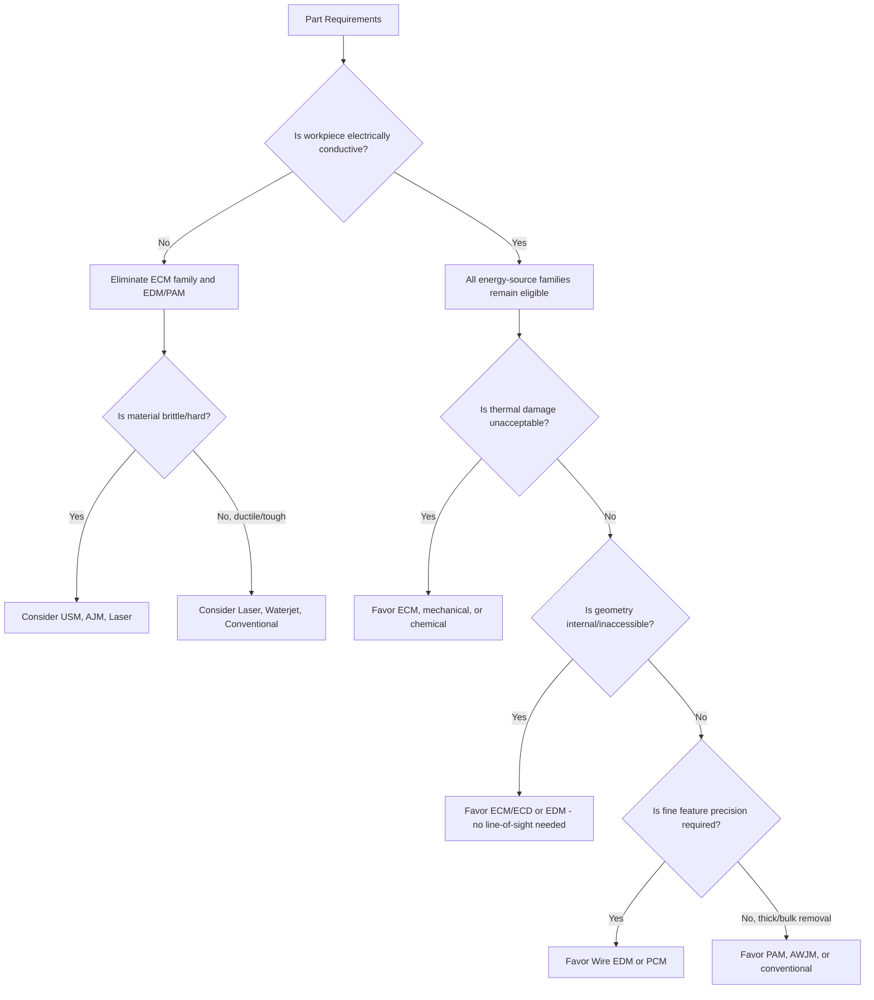

## Linking Process Classification to Material and Geometry Constraints

### Overview

Process classification (by energy source and by removal mechanism) is not merely descriptive — it is a practical decision framework for process selection. Every classification category carries an inherent set of material property dependencies (conductivity, hardness, brittleness, thermal sensitivity) and geometric capability boundaries (aspect ratio, accessibility, feature size, surface curvature). Systematically linking classification category to these constraints allows a process engineer to narrow the feasible process set for a given part before evaluating cost or throughput.

### Material Constraint Mapping by Energy Source

#### Electrical Conductivity Requirement

Conductivity is the single most decisive material filter across nonconventional processes, since it determines eligibility for two entire energy-source families.

| Energy Source | Conductivity Required? | Consequence |
| --- | --- | --- |
| Mechanical (USM, AJM, WJM, AWJM) | No | Usable on ceramics, glass, composites, polymers |
| Thermal — EDM, PAM | Yes | Excludes ceramics, glass, most polymers |
| Thermal — LBM, EBM | No (though absorption/reflectivity varies) | Broadly applicable, but efficiency material-dependent |
| Electrochemical (ECM, ECG, ECD, ECH) | Yes | Excludes all non-metals |
| Chemical (CHM, PCM) | No (etchant-dependent) | Applicable if a compatible etchant exists |

**Practical implication:** A non-conductive ceramic or glass component immediately eliminates EDM, PAM, and the entire electrochemical family from consideration, regardless of geometry, narrowing the feasible set to mechanical, laser/electron-beam thermal, or chemical processes.

#### Hardness and Toughness

- Mechanical erosion processes (USM, AJM) perform best on **brittle, hard** materials that fracture readily under impact; they perform poorly on ductile, tough materials that absorb impact energy through plastic deformation rather than fracturing.
- Thermal processes (EDM, LBM, PAM, EBM) are largely **hardness-independent**, since removal depends on thermal properties (melting point, thermal conductivity) rather than mechanical strength — this is precisely why EDM is the standard choice for hardened tool steel dies.
- Electrochemical processes (ECM) are similarly **hardness-independent**, governed by electrochemical valence and current density rather than mechanical strength.
- Conventional shear cutting is **strongly hardness-dependent**: tool hardness must substantially exceed workpiece hardness for stable, low-wear cutting.

#### Thermal Sensitivity

- Materials prone to metallurgical damage from heat (heat-treated tool steels near their tempering temperature, thin-walled precision components, fatigue-critical aerospace alloys) favor **non-thermal** families: mechanical, electrochemical, or chemical.
- ECM is frequently the preferred choice specifically *because* it introduces no heat-affected zone, making it standard for fatigue-critical turbine blade machining despite its high capital cost.

#### Chemical Reactivity

- Chemical machining (CHM/PCM) requires that a controllable, selective etchant exists for the specific base material; exotic alloys or multi-phase materials may lack a suitable etchant with acceptable selectivity, ruling this family out regardless of geometry.

### Geometric Constraint Mapping by Process Family

#### Aspect Ratio and Feature Depth

| Process | Achievable Aspect Ratio (depth:width) | Notes |
| --- | --- | --- |
| Wire EDM | High (limited primarily by wire rigidity/deflection) | Excellent for tall, thin profiles |
| Die-sinking EDM | Moderate-high | Limited by dielectric flushing in deep cavities |
| ECM | Moderate | Limited by gap control stability over depth |
| USM | Low-moderate | Tool wear limits depth accuracy |
| CHM/PCM | Low (isotropic undercut limits depth:width) | Etch factor caps practical aspect ratio |
| AWJM | High (can cut very thick stock) | Kerf taper increases with thickness |

#### Internal/Inaccessible Geometry

- **ECM and ECD** excel at internal, inaccessible, or intersecting geometries (e.g., cross-drilled passages) because material removal requires only an electrolyte and current path, not physical tool line-of-sight — a decisive advantage over any shear-cutting or mechanical-erosion process requiring direct tool access.
- **EDM** similarly requires no cutting force, allowing thin, fragile electrode shapes to reach deep, narrow cavities that a rigid mechanical tool could not enter without breaking.
- **Laser and waterjet processes** require line-of-sight (or nearly so) to the surface being processed, limiting their use on fully enclosed internal features.

#### Feature Size and Precision

- **Wire EDM and PCM** offer the finest feature resolution among nonconventional processes, suited to fine slots, sharp internal corners, and intricate 2D patterns.
- **PAM** produces the widest kerf and largest heat-affected zone, making it unsuitable for fine detail but efficient for thick-plate structural cutting.
- **USM** is geometry-limited by the physical tool shape, which must be manufactured to the cavity's negative profile, constraining very fine internal detail to what the tool itself can be shaped to.

### Combined Decision Framework

### Constraint Cross-Reference Table

| Constraint | Eliminates | Favors |
| --- | --- | --- |
| Non-conductive workpiece | EDM, PAM, ECM family | USM, AJM, WJM, LBM, EBM, CHM/PCM |
| Extreme hardness (post-heat-treat) | Conventional shear cutting | EDM, ECM, USM (if brittle) |
| Thermal damage intolerance | EDM, LBM, EBM, PAM | ECM, USM, AJM, CHM/PCM |
| Internal/inaccessible geometry | Laser, waterjet, conventional tooling | ECM, ECD, EDM |
| Deep, high-aspect-ratio feature | CHM/PCM, USM | Wire EDM, AWJM |
| Fine 2D detail requirement | PAM, AWJM (thick stock) | Wire EDM, PCM |
| Thin sheet, many identical features | EDM, ECM (cost-inefficient at scale) | PCM |

### Practical Example

**Example:** Selecting a process for a fuel injector nozzle with multiple 0.15 mm diameter micro-holes at compound angles in a hardened, electrically conductive nickel alloy, requiring no thermal damage to the surrounding fatigue-critical structure.

- **Material constraint:** The alloy is conductive and hardened, immediately ruling out efficient conventional drilling (rapid tool wear) while keeping EDM, ECM, and laser families eligible on conductivity grounds.
- **Thermal sensitivity constraint:** The fatigue-critical requirement disfavors EDM (recast layer, micro-cracking risk) and laser (HAZ), narrowing the field toward ECM-based approaches or micro-EDM with tightly controlled post-processing.
- **Geometry constraint:** The small hole diameter and compound angle favor a process with a slender, non-contact tool — **micro-EDM drilling** or **ECM drilling** are the standard industrial solutions, since neither requires mechanical cutting force that could deflect or break a tool at this scale.
- **Resolution:** Micro-EDM is frequently selected in practice for this exact application (turbine and injector cooling/fuel holes), with post-process electropolishing or ECM-based recast removal used to mitigate the thermal HAZ concern — illustrating how real-world process selection often combines a primary process chosen against the dominant constraint with a secondary process addressing its residual weakness.

### Key Points

- Electrical conductivity is the single most decisive material filter, immediately eliminating EDM, PAM, and the entire electrochemical family for non-conductive workpieces.
- Thermal and electrochemical processes are largely hardness-independent, making them the standard choice for hardened, hard-to-cut materials where conventional cutting fails.
- Geometric accessibility (internal, inaccessible, or intersecting features) strongly favors ECM/ECD and EDM, since neither requires direct mechanical tool line-of-sight or cutting force.
- Aspect ratio, feature size, and precision requirements further discriminate within an already material-filtered process set — wire EDM and PCM offer the finest achievable detail.
- Real-world process selection frequently combines a primary process chosen against the dominant constraint with a secondary process or post-treatment addressing that primary process's residual weakness.

### Related Topics

- Classification by energy source: mechanical, thermal, electrochemical, chemical
- Classification by material-removal mechanism versus cutting
- Hybrid nonconventional process combinations
- Micro-EDM and micro-ECM for high-aspect-ratio micro-feature production
- Process selection economics: capital cost versus throughput trade-offs
- Surface integrity requirements in fatigue-critical aerospace component machining