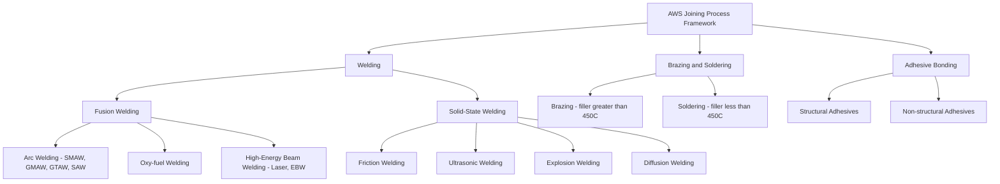
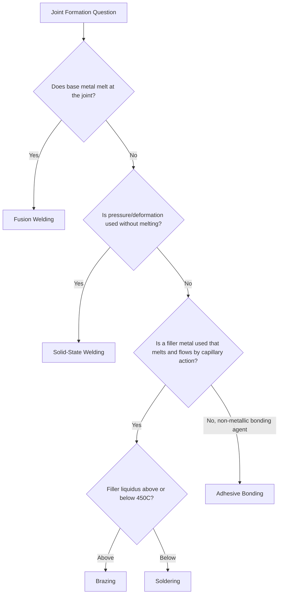

## AWS Three-Category Joining Framework Overview

### Overview

The American Welding Society (AWS) organizes all joining processes into three fundamental categories based on the mechanism by which two or more materials are made to adhere: **welding**, **brazing/soldering**, and **adhesive bonding** (mechanical fastening is sometimes treated as a distinct fourth, non-metallurgical/non-chemical category in broader manufacturing classification schemes, but the AWS core framework centers on the fusion/thermal and filler-metal-based joining processes). Within this framework, the primary distinguishing criterion across the AWS process classification is whether the base materials themselves are melted, and whether a filler material is used, and if so, at what relative temperature compared to the base metal's melting point.

### The Three Core Categories

#### 1. Welding

**Definition:** A joining process in which coalescence of materials is produced by heating them to a suitable temperature, with or without the application of pressure, and with or without the use of filler metal. The base materials at the joint are typically melted (fusion welding) or plastically deformed under heat and pressure (solid-state welding) to form a metallurgically continuous bond.

**Sub-classification:**

- **Fusion welding:** Base metal(s) at the joint are melted and allowed to solidify together, often with added filler metal of similar composition (e.g., arc welding processes — SMAW, GMAW, GTAW, SAW; oxy-fuel welding; resistance welding in some cases; high-energy beam welding — laser, electron beam).
- **Solid-state welding:** Coalescence is achieved through pressure and/or localized plastic deformation, without melting the base metal (e.g., friction welding, ultrasonic welding, explosion welding, diffusion welding, cold welding).

**Key characteristic:** The resulting joint has base-metal-equivalent or near-equivalent mechanical properties and metallurgical continuity across the joint interface, since the base materials themselves participate directly in forming the bond.

#### 2. Brazing and Soldering

**Definition:** Joining processes in which coalescence is produced by heating the assembly to a suitable temperature and using a **filler metal with a liquidus temperature above 450°C (840°F) for brazing, or below 450°C for soldering** — critically, in both cases the filler metal melts and flows by capillary action into the closely fitted joint, while the base metal itself remains solid throughout the process (unlike fusion welding, where base metal melts).

**Distinguishing threshold:** The 450°C (840°F) filler-metal liquidus temperature is the formal AWS boundary separating brazing from soldering — filler alloys above this threshold (e.g., silver-based, copper-based, nickel-based brazing alloys) constitute brazing; filler alloys below it (e.g., tin-lead, tin-silver, tin-antimony solders) constitute soldering.

**Key characteristic:** Because the base metal never melts, brazing and soldering avoid the distortion, residual stress, and heat-affected zone severity typical of fusion welding, and can join dissimilar metals (and in some brazing applications, metal-to-ceramic) that would be metallurgically incompatible if fusion welded together.

#### 3. Adhesive Bonding

**Definition:** A joining process in which two surfaces are held together by an intervening non-metallic adhesive material through interfacial forces (chemical bonding, mechanical interlocking at the microscopic level, and/or van der Waals forces), without melting either base material and without a metallic filler.

**Key characteristic:** Adhesive bonding distributes load over the entire bonded area (as opposed to a discrete weld nugget or braze fillet), can join dissimilar and non-metallic materials with no metallurgical constraints, and introduces no thermal distortion in most formulations (with the exception of some heat-cured adhesive systems). Joint strength and durability depend heavily on surface preparation, adhesive chemistry, and environmental exposure (temperature, moisture, UV).

### Comparative Table

| Category | Base Metal Melted? | Filler Used? | Filler Melting Point | Typical Joint Strength | Thermal Distortion |
| --- | --- | --- | --- | --- | --- |
| Welding (fusion) | Yes | Optional (similar composition) | N/A (same as base) | Base-metal equivalent | High |
| Welding (solid-state) | No | Rarely | N/A | Base-metal equivalent | Low-moderate |
| Brazing | No | Yes | >450°C (840°F) | Moderate-high | Low-moderate |
| Soldering | No | Yes | <450°C (840°F) | Lower | Very low |
| Adhesive Bonding | No | N/A (adhesive, non-metallic) | N/A | Variable, distributed | Minimal |

### Classification Diagram

### Decision Framework: Which Category Applies?

### Practical Example

**Example:** Selecting a joining process for attaching a copper heat-exchanger fin to a steel tube, where excessive heat input would distort the thin copper fin and dissimilar-metal fusion welding would risk brittle intermetallic formation.

- **Fusion welding** is ruled out: copper and steel have very different melting points and thermal conductivities, making stable fusion welding difficult, and the resulting fusion zone would likely form brittle intermetallic compounds compromising joint integrity.
- **Solid-state welding** (e.g., friction welding) could theoretically join the dissimilar metals without melting, but is often impractical for thin-fin geometries due to the required axial force and rotational/oscillatory motion needed for the process.
- **Brazing** is selected: a silver-based filler alloy (liquidus above 450°C) is drawn into the closely fitted joint by capillary action while both the copper fin and steel tube remain solid, avoiding intermetallic fusion-zone embrittlement and minimizing distortion of the thin copper fin.
- This illustrates the AWS framework's practical value: the base-metal-melting question alone (fusion vs. non-fusion) immediately narrows the process category before finer selection (brazing vs. soldering vs. adhesive) is made based on required joint strength and service temperature.

### Key Points

- The AWS framework's primary classification criterion is whether the base metal melts at the joint, separating fusion welding, solid-state welding, brazing/soldering, and adhesive bonding.
- The 450°C (840°F) filler-metal liquidus temperature is the formal, quantitative threshold distinguishing brazing from soldering.
- Brazing and soldering never melt the base metal, enabling dissimilar-metal joining and minimizing thermal distortion compared to fusion welding.
- Adhesive bonding is the only category involving no metallic filler and no melting of any material, distributing load across the full bonded area rather than a discrete weld/braze zone.
- Solid-state welding achieves metallurgical continuity without melting, distinguishing it from both fusion welding and the filler-based categories.

### Related Topics

- Fusion welding process family: arc, oxy-fuel, and high-energy beam welding
- Solid-state welding processes: friction, ultrasonic, explosion, and diffusion welding
- Brazing filler metal selection and joint clearance design
- Soldering alloy classification (leaded vs. lead-free) and reflow processes
- Adhesive bonding surface preparation and structural adhesive selection
- Dissimilar-metal joining challenges and intermetallic compound formation