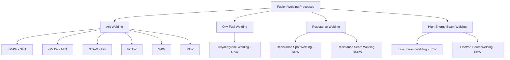
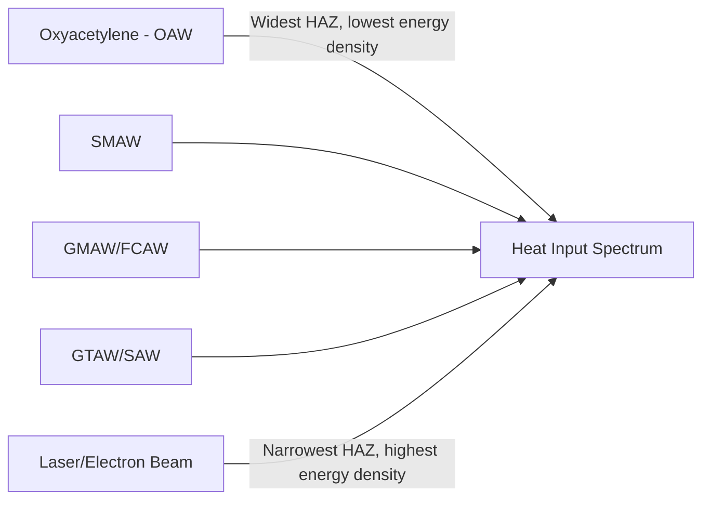

## Fusion-Welding Process Classification

### Overview

Fusion welding is the category of welding processes in which coalescence between two or more materials is achieved by melting the base metal at the joint interface (with or without added filler metal of similar composition), allowing it to solidify into a continuous, metallurgically integrated joint. Fusion welding is classically subclassified by the **source of heat energy** used to melt the base metal, since heat source fundamentally determines achievable heat input, heat-affected zone (HAZ) size, weld pool control, and process economics.

### Common Characteristics of Fusion Welding

- Base metal is locally melted at the joint and re-solidifies to form the bond, producing metallurgical continuity across the joint
- A heat-affected zone (HAZ) forms adjacent to the fusion zone, where the base metal experiences microstructural changes without melting
- Filler metal, when used, has a composition similar or metallurgically compatible with the base metal (unlike brazing/soldering, where filler composition and melting point differ substantially from the base metal)
- Weld quality depends on heat input control, shielding from atmospheric contamination (oxidation, nitrogen/hydrogen absorption), and cooling rate
- Residual stress and distortion are inherent consequences of the localized heating and cooling cycle

### Classification by Heat Source

#### 1. Arc Welding Processes

Heat is generated by an electric arc struck between an electrode and the workpiece (or between two electrodes), reaching arc temperatures of approximately 5,000–20,000°C at the arc column.

**Shielded Metal Arc Welding (SMAW / "Stick Welding"):** A consumable, flux-coated electrode is manually manipulated; the flux coating decomposes to form a shielding gas and slag layer protecting the weld pool. Highly portable, tolerant of outdoor/windy conditions, but lower productivity due to electrode changes and slag removal.

**Gas Metal Arc Welding (GMAW / "MIG Welding"):** A continuously fed, consumable solid or metal-cored wire electrode is shielded by an externally supplied inert or semi-inert gas (argon, CO₂, or blends). High productivity and adaptable to automation; sensitive to wind/drafts due to external gas shielding.

**Gas Tungsten Arc Welding (GTAW / "TIG Welding"):** A non-consumable tungsten electrode generates the arc, with shielding gas (typically pure argon or argon-helium blends) and, if needed, separately added filler rod. Produces high-quality, precise welds with excellent control; lower deposition rate and productivity compared to GMAW.

**Flux-Cored Arc Welding (FCAW):** Similar to GMAW but uses a tubular, flux-filled consumable electrode, providing self-shielding (self-shielded FCAW) or gas-assisted shielding (gas-shielded FCAW). Higher deposition rates than GMAW/SMAW, commonly used in structural and heavy fabrication.

**Submerged Arc Welding (SAW):** The arc is submerged beneath a blanket of granular flux, which melts to shield the weld pool and produces a slag layer. Very high deposition rates and deep penetration; largely limited to flat/horizontal position welding of thick sections due to the flux blanket requirement.

**Plasma Arc Welding (PAW):** A constricted arc (plasma) provides higher energy density and better arc stability than GTAW, using a similar non-consumable tungsten electrode configuration with a constricting nozzle.

#### 2. Oxy-Fuel Welding

**Oxyacetylene Welding (OAW):** Heat is generated by combustion of a fuel gas (typically acetylene) with oxygen, producing a flame temperature of approximately 3,100–3,500°C. Filler rod is manually fed into the weld pool. Low equipment cost and high portability, but low heat concentration leads to larger HAZ and slower welding speed compared to arc processes; largely superseded by arc welding for most industrial applications but retained for repair, maintenance, and specific thin-material applications.

#### 3. Resistance Welding

**Principle:** Heat is generated by electrical resistance to current flow through the interface of the workpieces being joined, combined with applied pressure, causing localized melting at the faying surfaces without an external arc or flame.

**Resistance Spot Welding (RSW):** Two copper electrodes apply pressure and current at discrete points, producing localized fused "nuggets" — the dominant joining process in automotive sheet metal body assembly.

**Resistance Seam Welding (RSEW):** Rotating wheel electrodes produce a continuous series of overlapping spot welds, forming a continuous, typically leak-tight seam.

**Note:** Resistance welding is sometimes classified separately from arc/oxy-fuel fusion welding since heat generation is resistive rather than arc- or flame-based, but it remains a fusion process since the base metal melts locally at the faying interface.

#### 4. High-Energy-Density Beam Welding

**Laser Beam Welding (LBW):** A focused, coherent laser beam provides extremely high power density, enabling narrow, deep-penetration welds with minimal HAZ and distortion; well suited to precision, high-speed, and automated welding applications.

**Electron Beam Welding (EBW):** A focused high-velocity electron beam, typically performed in a vacuum chamber, achieves very deep, narrow penetration welds with minimal HAZ, exploiting the same high-energy-density principle as laser welding but via a different energy carrier.

**Characteristic advantage of this subgroup:** Extremely high energy density (up to $10^9$ W/cm² for both LBW and EBW) allows deep, narrow "keyhole" welds with dramatically reduced total heat input and distortion compared to arc processes, at the cost of higher equipment capital cost and, for EBW, the added complexity of vacuum chamber operation.

### Comparative Summary Table

| Subcategory | Heat Source | Typical Penetration/HAZ | Productivity | Position Flexibility |
| --- | --- | --- | --- | --- |
| SMAW | Electric arc (flux-coated electrode) | Moderate HAZ | Low-moderate | High (all positions) |
| GMAW | Electric arc (gas-shielded wire) | Moderate HAZ | High | High |
| GTAW | Electric arc (tungsten, separate filler) | Narrow, precise | Low | High |
| FCAW | Electric arc (flux-cored wire) | Moderate-deep | High | Moderate-high |
| SAW | Electric arc (submerged flux) | Deep penetration | Very high | Limited (flat/horizontal) |
| OAW | Combustion flame | Wide HAZ | Low | High |
| RSW/RSEW | Electrical resistance | Localized nugget | Very high (automotive) | Limited to accessible faying surfaces |
| LBW | Laser beam | Narrow, deep, minimal HAZ | High | Moderate (line-of-sight) |
| EBW | Electron beam | Narrow, deep, minimal HAZ | Moderate-high | Limited (vacuum chamber) |

### Classification Diagram

### Heat Input and HAZ Relative Comparison

### Practical Example

**Example:** Welding a thin-gauge (0.8 mm) stainless steel sheet metal enclosure requiring minimal distortion and a cosmetically clean weld bead, for a production run of moderate volume.

- **OAW** and **SMAW** are excluded: both introduce excessive heat input and HAZ width relative to the thin material, causing warping and burn-through risk.
- **SAW** is excluded: designed for thick-section, flat-position, high-deposition welding, entirely mismatched to thin sheet metal.
- **GTAW (TIG)** is a strong candidate for its precise heat control and clean weld appearance, but its low productivity may not suit moderate production volume economics.
- **Laser Beam Welding (LBW)** is selected for production: its high energy density produces a narrow, minimal-HAZ weld with low distortion at high travel speed, well matched to thin-gauge stainless steel in an automated, moderate-to-high-volume production environment.
- This illustrates the heat-source classification's practical value: material thickness and required precision directly map to the achievable HAZ width and energy density of each heat-source subcategory.

### Key Points

- Fusion welding processes are classified primarily by heat source: arc, oxy-fuel, resistance, and high-energy-density beam.
- Arc welding is itself a diverse subfamily (SMAW, GMAW, GTAW, FCAW, SAW, PAW) differentiated by electrode type, shielding method, and deposition rate.
- High-energy-density beam processes (laser, electron beam) achieve the narrowest HAZ and highest precision but at greater equipment capital cost.
- Resistance welding generates heat internally at the faying interface via electrical resistance, distinguishing its heat generation mechanism from arc or flame-based processes while still qualifying as fusion welding.
- Heat source selection should be matched to material thickness, required precision, HAZ tolerance, and production volume/productivity requirements.

### Related Topics

- AWS three-category joining framework overview
- Solid-state welding process classification
- Heat-affected zone (HAZ) metallurgy and control strategies
- Shielding gas selection for GMAW and GTAW processes
- Weld defect classification: porosity, incomplete fusion, undercut, distortion
- Automated and robotic welding system integration for GMAW and laser welding