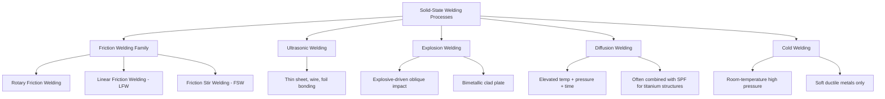
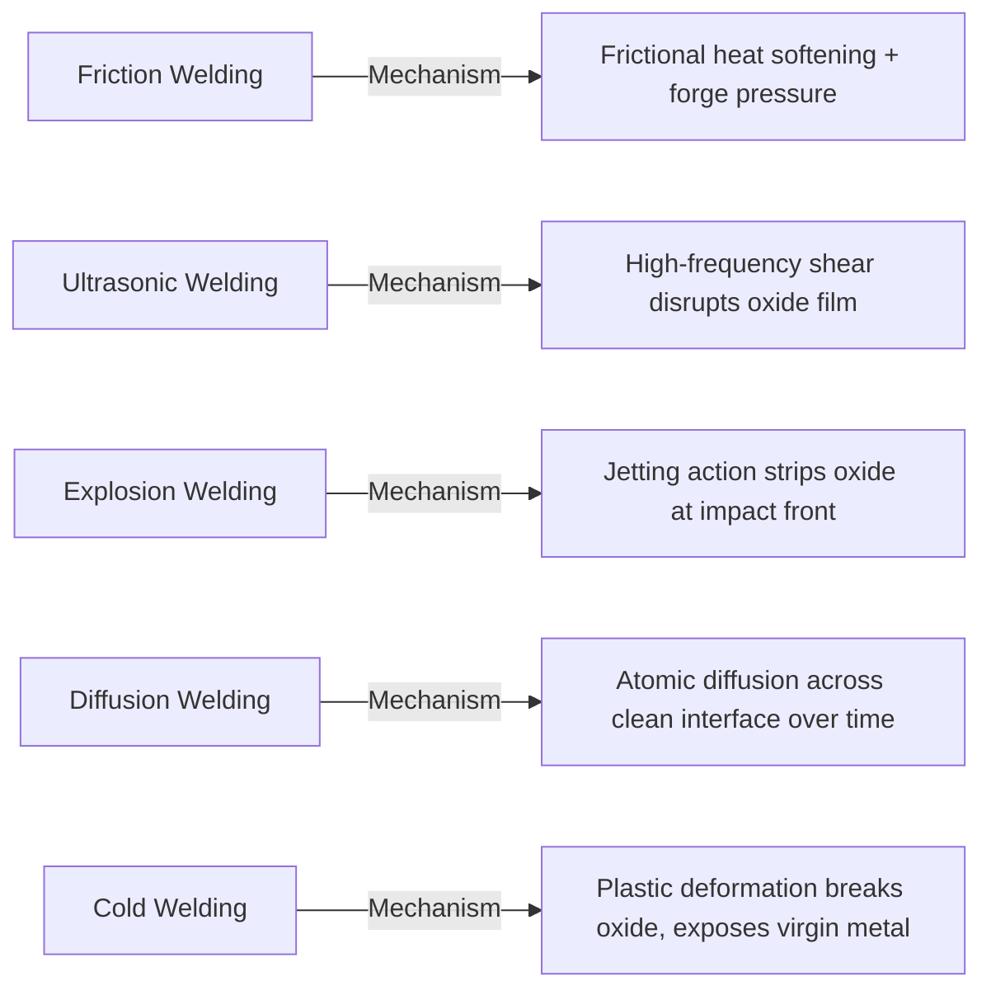

## Solid-State Welding Process Classification

### Overview

Solid-state welding is the category of welding processes in which coalescence between two or more materials is achieved without melting the base metal. Instead, joining occurs through the application of pressure, localized plastic deformation, friction, ultrasonic vibration, or diffusion at temperatures below the melting point, disrupting surface oxide layers and bringing clean metallic surfaces into sufficiently intimate atomic contact for metallurgical bonding to occur. Because no fusion zone or solidification structure forms, solid-state welding avoids many of the defects characteristic of fusion welding (porosity, solidification cracking, dendritic microstructure) and is particularly valuable for joining dissimilar metals that would form brittle intermetallics if fusion welded.

### Common Characteristics of Solid-State Welding

- Base metal does not reach its melting point during the process
- No fusion zone, cast/dendritic microstructure, or associated solidification defects (porosity, hot cracking) form
- Surface oxide films and contaminants must be disrupted or displaced for clean metal-to-metal contact — the central mechanism enabling bond formation
- Often enables joining of dissimilar metal combinations impractical or impossible via fusion welding due to intermetallic embrittlement
- Generally produces lower residual stress and distortion than fusion welding, since peak temperatures are lower and more localized
- Frequently well suited to automation and high production-rate manufacturing (particularly friction and resistance-adjacent variants)

### Member Processes

#### 1. Friction Welding (FRW)

**Principle:** One workpiece is rotated at high speed while pressed against a stationary workpiece; frictional heat generated at the interface softens (but does not melt) the material, and upon reaching forging temperature, rotation stops and axial force (forge pressure) is applied to complete the bond, extruding oxide-contaminated material outward as flash.

**Variants:**

- **Rotary/Conventional Friction Welding:** One part rotates continuously; suited to axisymmetric (round) parts.
- **Linear Friction Welding (LFW):** Parts oscillate linearly rather than rotating, enabling joining of non-axisymmetric geometries (e.g., turbine blisks in aerospace manufacturing).
- **Friction Stir Welding (FSW):** A rotating, non-consumable tool with a profiled pin plunges into and traverses along the joint line of two abutting workpieces (commonly aluminum alloys), generating frictional and deformational heat that plasticizes the material, which is then stirred and consolidated behind the tool without melting.

**Applications:** Joining dissimilar shaft/rod combinations, automotive drivetrain components, aerospace turbine components (LFW), and long structural aluminum panels/extrusions (FSW, notably shipbuilding and aerospace fuselage panels).

#### 2. Ultrasonic Welding (USW)

**Principle:** High-frequency (typically 20–40 kHz) ultrasonic vibration is applied parallel to the interface between two workpieces held together under moderate clamping pressure. The resulting localized frictional and shear energy disrupts surface oxide films and produces sufficient localized heating (well below melting point) to enable solid-state bonding.

**Applications:** Joining thin sheet metals (aluminum foil, copper), wire bonding in microelectronics, plastic and polymer part assembly (a related but distinct polymer-specific variant), and battery tab/terminal joining in electric vehicle battery pack manufacturing.

**Limitations:** Generally limited to thin sections and lap-type joint configurations; not well suited to thick or bulk sections.

#### 3. Explosion Welding (EXW)

**Principle:** A controlled explosive charge is detonated across one of two metal plates positioned at a slight angle, accelerating the "flyer plate" into the stationary "base plate" at very high velocity. The resulting oblique high-velocity impact creates a jetting action that strips surface oxides and contaminants immediately ahead of the collision point, allowing clean metal surfaces to bond under the extreme momentary pressure, often producing a characteristic wavy bond-line interface.

**Applications:** Cladding large-area dissimilar-metal plates (e.g., titanium-to-steel, copper-to-aluminum transition joints for electrical busbars), producing bimetallic and multi-metallic composite plates for corrosion-resistant pressure vessel linings.

**Limitations:** Requires specialized explosive handling expertise and safety infrastructure; primarily suited to flat plate/sheet geometries; limited precision/repeatability control compared to controlled-energy processes.

#### 4. Diffusion Welding / Diffusion Bonding (DFW)

**Principle:** Two clean, closely mated surfaces are held together under moderate pressure at elevated temperature (typically 50–70% of the base metal's absolute melting temperature) for an extended time (minutes to hours), allowing solid-state atomic diffusion across the interface to gradually eliminate the boundary and form a continuous metallurgical bond.

**Applications:** Joining dissimilar and often difficult-to-weld materials (titanium alloys, superalloys, refractory metals) in aerospace and high-precision applications; frequently combined with superplastic forming (SPF/DB) to produce complex hollow titanium aerospace structures in a single integrated process.

**Limitations:** Long process cycle times (minutes to hours) compared to other solid-state processes; requires very clean, closely fitted mating surfaces and often vacuum or inert atmosphere; generally limited to smaller components or specialized high-value applications due to cycle time and equipment cost.

#### 5. Cold Welding (CW)

**Principle:** Two clean metal surfaces are joined at room temperature purely through the application of very high pressure, causing sufficient plastic deformation to break up surface oxide films and bring virgin metal surfaces into intimate contact, forming a bond without any external heat input.

**Applications:** Joining soft, ductile metals (aluminum, copper) in wire and strip form; common in electrical connector and terminal manufacturing.

**Limitations:** Requires very high pressures and extremely clean, oxide-free surface preparation immediately prior to joining; largely limited to soft, ductile metals capable of the required plastic deformation without cracking.

### Comparative Summary Table

| Process | Heat Source | Relative Motion | Typical Geometry | Key Application |
| --- | --- | --- | --- | --- |
| Rotary Friction Welding | Frictional heat | Rotational | Axisymmetric (round) parts | Shaft/rod dissimilar joints |
| Linear Friction Welding | Frictional heat | Linear oscillation | Non-axisymmetric | Aerospace turbine blisks |
| Friction Stir Welding | Frictional + deformational heat | Rotating traverse pin | Long linear seams | Aluminum panels, fuselage sections |
| Ultrasonic Welding | Vibrational/frictional heat | High-frequency shear | Thin sheet/lap joints | Battery tabs, foil, wire bonding |
| Explosion Welding | Impact/kinetic energy | High-velocity oblique impact | Flat plates | Bimetallic clad plate |
| Diffusion Welding | Elevated temperature + pressure | None (static) | Closely mated surfaces | Titanium/superalloy aerospace structures |
| Cold Welding | Plastic deformation only | Applied pressure | Soft ductile wire/strip | Electrical connectors |

### Classification Diagram

### Bond Formation Mechanism Comparison

### Practical Example

**Example:** Joining a titanium alloy turbine disk to a dissimilar titanium alloy shaft in an aerospace engine assembly, where fusion welding risks forming a brittle fusion-zone microstructure incompatible with the component's fatigue-critical service.

- Fusion welding is disfavored: melting and resolidification of titanium alloys is prone to grain growth, porosity, and potential contamination (titanium is highly reactive with oxygen/nitrogen at elevated temperature), compromising fatigue performance.
- **Rotary Friction Welding** is selected: the axisymmetric shaft-to-disk geometry is well suited to rotational friction welding, and since the base metal never melts, the resulting joint retains a fine-grained, forged-like microstructure with mechanical properties close to the base material, meeting the fatigue-critical requirements of the rotating assembly.
- This illustrates the central rationale for solid-state welding selection: when fusion-zone microstructure or intermetallic formation would compromise service performance, achieving coalescence below the melting point becomes the governing selection criterion, with the specific solid-state process chosen based on part geometry (axisymmetric favoring rotary friction welding, non-axisymmetric favoring linear friction welding or diffusion welding).

### Key Points

- Solid-state welding achieves coalescence without melting the base metal, avoiding fusion-zone defects and enabling many dissimilar-metal combinations impractical for fusion welding.
- Friction-based processes (rotary, linear, and friction stir) form the largest and most industrially significant subfamily, differentiated primarily by relative motion type and resulting applicable geometry.
- Diffusion welding relies on time and temperature (not mechanical force) to achieve atomic-level bonding, making it well suited to precision aerospace structures but limited by long cycle times.
- Explosion welding uniquely produces large-area bimetallic clad plates through impact-driven oxide displacement, unmatched by other solid-state processes for that specific application.
- Cold welding is the only member of this family requiring no external heat input at all, relying purely on plastic deformation at room temperature.

### Related Topics

- AWS three-category joining framework overview
- Fusion-welding process classification
- Friction Stir Welding (FSW) parameters and tool pin geometry design
- Superplastic forming combined with diffusion bonding (SPF/DB) for aerospace structures
- Dissimilar-metal joining and intermetallic compound avoidance strategies
- Weld/bond quality inspection methods for solid-state joints (ultrasonic testing, metallographic examination)