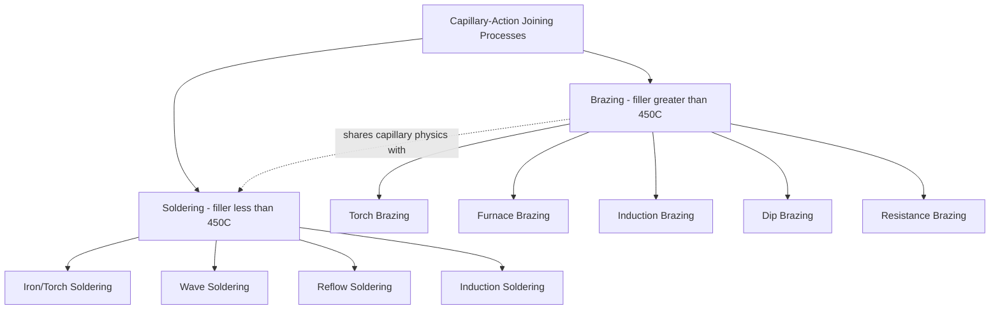
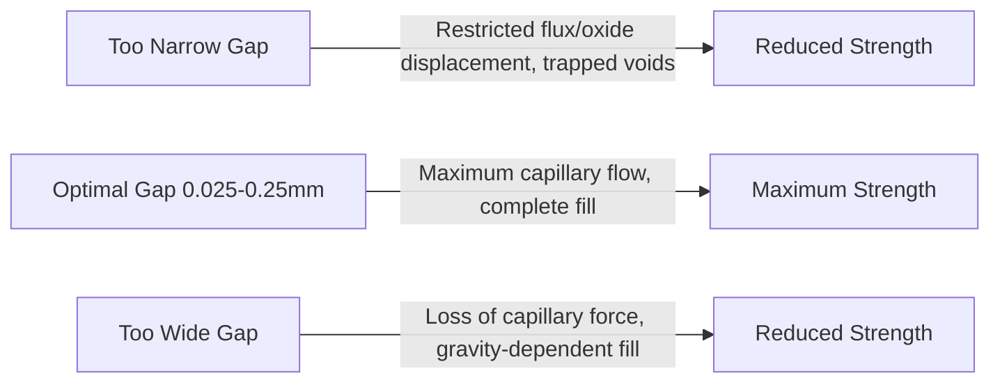

## Brazing and Soldering Classification by Capillary Action

### Overview

Brazing and soldering are joining processes in which coalescence is achieved by melting a filler metal that has a lower melting point than the base metals being joined, while the base metals themselves remain solid throughout the process. The filler metal is drawn into a closely fitted joint gap by **capillary action** — the physical phenomenon by which liquid flows into narrow spaces against or independent of gravity due to surface tension and wetting forces. Capillary action is the defining transport mechanism that distinguishes brazing and soldering from fusion welding (where filler, if used, is deposited directly into a melted weld pool rather than drawn in by capillary forces) and is the central design and process-control variable governing joint quality in both processes.

### The Physics of Capillary Flow in Joining

Capillary rise/flow in a joint gap is governed by the interaction of surface tension, wetting angle, and gap geometry. The driving pressure for capillary flow can be approximated by:

$$P = \frac{2\gamma \cos\theta}{d}$$

where $P$ is the capillary pressure, $\gamma$ is the surface tension of the molten filler metal, $\theta$ is the contact (wetting) angle between the filler and base metal, and $d$ is the joint gap width.

**Key implications of this relationship:**

- Smaller joint gaps produce stronger capillary driving force, up to a practical minimum gap limited by flux/oxide displacement and filler viscosity
- Good wetting (low contact angle, $\theta$ approaching 0°) is essential — a poorly wetting filler ($\theta > 90°$) will not flow into the joint regardless of gap size
- Surface cleanliness is critical, since oxides and contaminants increase the effective contact angle and impede wetting

### Requirements for Successful Capillary Joining

1. **Proper joint clearance:** Typically 0.025–0.25 mm (0.001–0.010 in) depending on filler alloy and joint design — too wide a gap loses capillary driving force and requires the filler to bridge by gravity/surface tension alone (weaker, more porous); too narrow a gap restricts flux/oxide displacement and can trap voids.
2. **Surface cleanliness:** Base metal surfaces must be free of oxides, oils, and contaminants, typically achieved through mechanical cleaning, chemical cleaning, and/or flux application immediately before joining.
3. **Adequate wetting:** The filler metal must chemically and metallurgically wet the base metal surface (low contact angle), which depends on filler-base metal compatibility and effective flux or atmosphere control to prevent reoxidation during heating.
4. **Sufficient heating and dwell time:** The joint must reach and briefly exceed the filler's liquidus temperature uniformly across the joint area to allow complete capillary flow before solidification.

### Classification by Filler Melting Point: Brazing vs. Soldering

The AWS-defined threshold separating the two processes is the filler metal's **liquidus temperature relative to 450°C (840°F)**:

| Criterion | Brazing | Soldering |
| --- | --- | --- |
| Filler liquidus temperature | Above 450°C (840°F) | Below 450°C (840°F) |
| Common filler alloys | Silver-based (BAg), copper-based (BCu), nickel-based (BNi), aluminum-based | Tin-lead, tin-silver, tin-antimony, tin-copper (lead-free) |
| Typical joint strength | Moderate-high (can approach base metal strength) | Lower (limited by filler alloy strength) |
| Base metal metallurgical effect | May cause some grain growth/annealing in base metal | Minimal thermal effect on base metal |
| Typical applications | Structural joints, HVAC tubing, carbide tool tip attachment | Electronics (PCB assembly), plumbing, electrical connections |

### Classification by Heating Method

Both brazing and soldering are further subclassified by how heat is delivered to reach and hold the filler's melting/flow temperature:

#### Brazing Heating Methods

- **Torch Brazing:** Oxy-fuel or air-fuel torch applies localized heat; flexible, manual or semi-automated, suited to low-to-moderate volume production and repair.
- **Furnace Brazing:** Entire assembly is heated in a controlled-atmosphere or vacuum furnace, allowing simultaneous brazing of multiple joints with excellent consistency; well suited to high-volume production.
- **Induction Brazing:** Localized heating via electromagnetic induction in a coil surrounding the joint; fast cycle times and good repeatability for symmetric parts.
- **Dip Brazing:** Assembly is immersed in a molten flux or filler metal bath, commonly used for aluminum heat exchanger and radiator manufacturing.
- **Resistance Brazing:** Heat generated by electrical resistance at the joint, similar in principle to resistance welding but with filler metal present.

#### Soldering Heating Methods

- **Iron/Torch Soldering:** Manual soldering iron or small torch, common in electronics rework, plumbing, and low-volume assembly.
- **Wave Soldering:** PCB assemblies are passed over a continuously flowing wave of molten solder, simultaneously soldering all through-hole component leads.
- **Reflow Soldering:** Pre-applied solder paste (solder particles suspended in flux) is heated in a controlled thermal profile (typically in a reflow oven), melting and reflowing to form joints — the dominant process for surface-mount electronics assembly.
- **Induction Soldering:** Localized electromagnetic heating, used for specific high-repeatability applications.

### Comparative Diagram: Capillary Joining Family Structure

### Illustrative Schematic: Capillary Flow into a Brazed Joint

<svg xmlns="http://www.w3.org/2000/svg" viewBox="0 0 460 260">
<text x="230" y="20" font-size="14" text-anchor="middle" font-weight="bold">Capillary Flow into Joint Gap (svg_diagram)</text>
<rect x="60" y="80" width="160" height="30" fill="#a9a9a9" stroke="#333" />
<text x="140" y="100" font-size="9" text-anchor="middle">Base Metal Part A</text>
<rect x="60" y="115" width="160" height="30" fill="#a9a9a9" stroke="#333" />
<text x="140" y="135" font-size="9" text-anchor="middle">Base Metal Part B</text>
<rect x="60" y="108" width="160" height="8" fill="#e8b923" />
<text x="140" y="70" font-size="8" text-anchor="middle">Joint Gap (0.025-0.25mm)</text>
<line x1="230" y1="90" x2="280" y2="90" stroke="#333" marker-end="url(#a5)" />
<text x="330" y="94" font-size="8" text-anchor="middle">Capillary flow direction</text>
<line x1="230" y1="130" x2="280" y2="130" stroke="#333" marker-end="url(#a5)" />

<text x="140" y="175" font-size="8" text-anchor="middle">Molten filler drawn in by capillary pressure P = 2γcosθ / d</text>

</svg>

### Joint Gap vs. Joint Strength Relationship (Qualitative)

### Practical Example

**Example:** Designing a brazed joint to attach a tungsten carbide cutting insert to a steel tool shank, requiring a strong, void-free bond capable of withstanding cutting forces and thermal cycling.

- **Filler selection:** A silver-based brazing alloy (BAg series, liquidus above 450°C) is selected over a soft solder, since the joint must withstand significant mechanical and thermal stress in service — soldering's lower-strength filler would be inadequate.
- **Joint clearance design:** The joint gap between the carbide insert and steel shank is designed to approximately 0.05–0.1 mm, within the optimal capillary range, ensuring the molten silver alloy is drawn completely through the joint by capillary pressure rather than relying on gravity fill, which would risk voids.
- **Heating method:** Induction brazing is selected for production consistency and fast, localized cycle time, precisely matching the coil geometry to the tool shank for repeatable heating.
- **Flux/atmosphere control:** Flux (or a controlled-atmosphere furnace alternative) is used to prevent oxide formation on both the carbide and steel surfaces during heating, ensuring the filler metal wets both dissimilar materials effectively despite their different surface chemistries.
- This illustrates how capillary-action design principles — gap clearance, wetting control, and filler selection — directly determine joint integrity independent of the specific heating method chosen.

### Key Points

- Capillary action, governed by surface tension, wetting angle, and joint gap, is the defining filler-metal transport mechanism distinguishing brazing/soldering from fusion welding.
- The AWS 450°C (840°F) filler liquidus threshold formally separates brazing from soldering, with brazing generally yielding higher joint strength suitable for structural applications.
- Optimal joint clearance (typically 0.025–0.25 mm) balances capillary driving force against flux/oxide displacement and void formation, and is a critical design parameter independent of heating method.
- Both brazing and soldering are further subclassified by heating method (torch, furnace, induction, dip, resistance for brazing; iron, wave, reflow, induction for soldering), which governs production volume suitability and joint consistency rather than joint mechanism itself.
- Surface cleanliness and adequate wetting are prerequisites for successful capillary flow regardless of filler alloy or heating method selected.

### Related Topics

- AWS three-category joining framework overview
- Fusion-welding process classification
- Solid-state welding process classification
- Flux chemistry and selection for brazing and soldering applications
- Reflow soldering thermal profile design for surface-mount electronics
- Joint design principles: lap joints, scarf joints, and clearance optimization for capillary processes