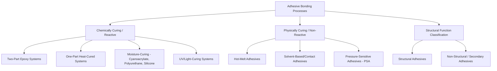
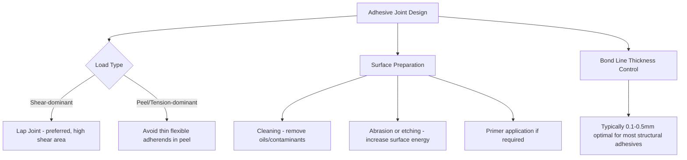

## Adhesive Bonding Process Classification

### Overview

Adhesive bonding is the AWS-recognized joining category in which two or more surfaces are held together by an intervening non-metallic adhesive material, relying on interfacial adhesion (chemical bonding, mechanical interlocking at microscopic surface irregularities, and secondary intermolecular forces) rather than metallurgical coalescence. Unlike welding, brazing, or soldering, adhesive bonding introduces no melting of the base materials and, in most formulations, minimal thermal input, while distributing load across the entire bonded area rather than concentrating it at a discrete weld nugget, braze fillet, or solder joint.

### Fundamental Bonding Mechanisms

Adhesive bond strength arises from a combination of mechanisms operating simultaneously at the adhesive-substrate interface:

- **Mechanical interlocking:** The adhesive penetrates microscopic surface roughness and pores of the substrate before curing, creating physical anchor points upon solidification.
- **Chemical bonding:** Covalent or ionic bonds form between reactive groups in the adhesive and complementary groups on the substrate surface (often enhanced by surface treatments/primers).
- **Van der Waals and secondary forces:** Weaker intermolecular attractive forces contribute to overall adhesion, particularly significant for adhesives with strong wetting characteristics on smooth surfaces.

Effective bonding requires good **wetting** of the substrate by the liquid adhesive (low contact angle) prior to cure, which in turn requires adequate surface energy of the substrate — a key reason surface preparation (cleaning, abrasion, chemical etching, or plasma treatment) is critical to adhesive joint performance.

### Classification by Curing Mechanism

#### 1. Chemically Curing (Reactive) Adhesives

**Principle:** Curing occurs through a chemical reaction — typically polymerization or cross-linking — between two or more components, or between a single component and ambient moisture/heat, transforming the liquid adhesive into a solid polymer network.

**Sub-types:**

- **Two-part (epoxy) systems:** Resin and hardener are mixed immediately before application, initiating an irreversible cross-linking reaction; cure time ranges from minutes to hours depending on formulation and temperature.
- **One-part heat-cured systems:** A single-component adhesive (commonly epoxy-based) remains stable at room temperature and cures only upon heating to an activation temperature, commonly used in automated production lines with oven-cure stations.
- **Moisture-curing systems (e.g., cyanoacrylates, certain polyurethanes/silicones):** Cure is triggered by ambient moisture, often producing very fast (cyanoacrylate, seconds) to moderate (polyurethane/silicone, hours) cure times.
- **UV/light-curing systems:** Cure is initiated by exposure to ultraviolet or visible light, enabling extremely rapid, on-demand curing well suited to inline automated assembly.

**Applications:** Structural aerospace bonding (epoxy composites), automotive body panel bonding, general assembly (cyanoacrylate "super glue"), electronics conformal coating and potting.

#### 2. Physically/Thermally Curing (Non-Reactive) Adhesives

**Principle:** Bonding is achieved through a physical phase change (solidification, solvent evaporation) rather than a chemical reaction, and in many cases the bond is reversible upon reheating or re-dissolving.

**Sub-types:**

- **Hot-melt adhesives:** A thermoplastic polymer is heated to a molten state, applied to the substrate, and forms a bond upon cooling and solidification; commonly used in packaging, textiles, and general assembly for its fast fixturing time.
- **Solvent-based/contact adhesives:** Adhesive is dissolved in a volatile solvent, applied to both substrates, allowed to partially dry, and then the surfaces are pressed together, forming a bond as the remaining solvent evaporates.
- **Pressure-sensitive adhesives (PSAs):** Remain permanently tacky and form a bond instantaneously upon light contact pressure, without curing or solvent evaporation required at the time of application (e.g., adhesive tapes, labels).

### Classification by Structural Function

#### Structural Adhesives

Designed to carry significant, sustained mechanical load as a primary load path in the assembly, requiring rigorous joint design, surface preparation, and often qualification testing (particularly in aerospace and automotive structural applications). Typically epoxy, polyurethane, or acrylic-based two-part or heat-cured systems.

#### Non-Structural (Secondary) Adhesives

Used for retention, sealing, gasketing, or light-duty assembly where the adhesive does not bear primary structural load. Typically includes many pressure-sensitive, hot-melt, and general-purpose adhesive applications.

### Comparative Table

| Category | Cure Mechanism | Typical Cure Time | Reversibility | Example Application |
| --- | --- | --- | --- | --- |
| Two-part epoxy | Chemical cross-linking | Minutes-hours | No (thermoset) | Aerospace structural bonding |
| One-part heat-cured | Chemical, heat-activated | Minutes (at elevated temp) | No (thermoset) | Automotive body panel bonding |
| Cyanoacrylate | Moisture-triggered polymerization | Seconds | No | General assembly, rapid fixturing |
| UV-curing | Light-initiated polymerization | Seconds | No | Electronics, inline automated assembly |
| Hot-melt | Thermal solidification | Seconds-minutes (cooling) | Yes (reheatable) | Packaging, textiles |
| Pressure-sensitive (PSA) | Contact pressure (no cure) | Instantaneous | Often yes (removable/repositionable) | Tapes, labels |

### Classification Diagram

### Adhesive Joint Design Considerations Diagram

### Illustrative Schematic: Adhesive Bond Load Distribution vs. Discrete Weld Nugget

<svg xmlns="http://www.w3.org/2000/svg" viewBox="0 0 480 240">
<text x="240" y="20" font-size="13" text-anchor="middle" font-weight="bold">Load Distribution: Adhesive vs. Spot Weld (svg_diagram)</text>
<rect x="30" y="60" width="180" height="20" fill="#a9a9a9" stroke="#333" />
<rect x="30" y="85" width="180" height="20" fill="#a9a9a9" stroke="#333" />
<rect x="30" y="80" width="180" height="5" fill="#3498db" opacity="0.7" />
<text x="120" y="115" font-size="8" text-anchor="middle">Adhesive: Load distributed over full overlap area</text>
<rect x="270" y="60" width="180" height="20" fill="#a9a9a9" stroke="#333" />
<rect x="270" y="85" width="180" height="20" fill="#a9a9a9" stroke="#333" />
<circle cx="360" cy="82" r="8" fill="#e74c3c" />
<text x="360" y="115" font-size="8" text-anchor="middle">Spot Weld: Load concentrated at discrete nugget</text>
<line x1="30" y1="140" x2="210" y2="140" stroke="#3498db" stroke-width="3" />
<text x="120" y="155" font-size="7" text-anchor="middle">Distributed stress profile</text>
<line x1="355" y1="135" x2="365" y2="135" stroke="#e74c3c" stroke-width="6" />
<text x="360" y="155" font-size="7" text-anchor="middle">Localized stress peak</text>
</svg>

### Practical Example

**Example:** Bonding an aluminum body panel to a steel vehicle frame in automotive manufacturing, where dissimilar-metal galvanic corrosion and fusion-welding compatibility are both concerns.

- Fusion welding aluminum to steel is metallurgically impractical due to intermetallic embrittlement, and direct metal-to-metal contact between the dissimilar metals risks galvanic corrosion in service.
- **Structural adhesive bonding** (typically a two-part or one-part heat-cured epoxy) is selected: the adhesive layer itself acts as an electrically insulating barrier preventing direct galvanic contact between the aluminum and steel, while distributing the panel's structural load across the entire bonded flange area rather than concentrating it at discrete weld points.
- **Process integration:** A one-part, heat-cured epoxy is commonly chosen for automotive production specifically because it remains stable (uncured) through handling and fixturing stages, then cures during the vehicle's existing paint-bake oven cycle, requiring no additional dedicated curing step in the production line.
- This illustrates a key structural adhesive advantage over mechanical or metallurgical joining: simultaneous solution of the dissimilar-metal joining challenge and the corrosion-isolation requirement within a single joining process.

### Key Points

- Adhesive bonding relies on mechanical interlocking, chemical bonding, and secondary intermolecular forces rather than metallurgical coalescence, distinguishing it fundamentally from welding, brazing, and soldering.
- Adhesives are classified by curing mechanism (chemically curing/reactive vs. physically curing/non-reactive) and by structural function (structural vs. non-structural).
- Load is distributed across the entire bonded area, offering more uniform stress distribution than the discrete, localized load paths of spot welds or fasteners.
- Surface preparation (cleaning, surface energy enhancement) is critical to achieving adequate wetting and, therefore, adhesive bond strength.
- Adhesive bonding can simultaneously solve dissimilar-metal joining and electrical/galvanic isolation challenges that welding or brazing cannot address as effectively.

### Related Topics

- AWS three-category joining framework overview
- Fusion-welding process classification
- Solid-state welding process classification
- Brazing and soldering classification by capillary action
- Surface preparation techniques for adhesive bonding (plasma treatment, chemical etching, primers)
- Structural adhesive qualification testing in aerospace and automotive applications