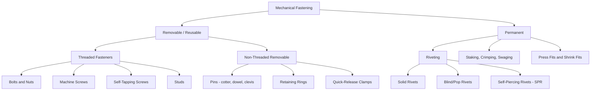
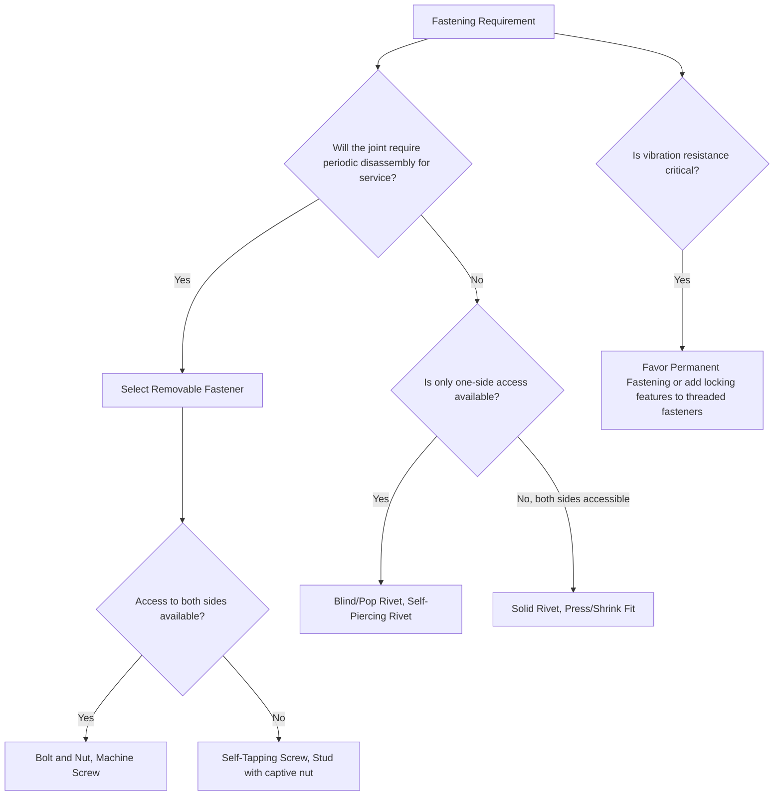

## Mechanical Fastening: Permanent Versus Removable

### Overview

Mechanical fastening is a joining category distinct from welding, brazing/soldering, and adhesive bonding in that it relies on discrete mechanical elements or localized deformation to hold parts together, without metallurgical coalescence, filler-metal capillary flow, or chemical adhesion. Within mechanical fastening, the most fundamental classification axis is **disassembly capability**: whether the joint can be non-destructively separated and reassembled (removable/reusable fastening) or is intended to remain permanently joined, with separation requiring destruction of the fastener or damage to the parts (permanent fastening).

### Rationale for the Permanent-vs-Removable Distinction

This classification axis drives critical downstream decisions in product design and manufacturing:

- **Maintenance and service strategy:** Removable fasteners are mandatory wherever periodic disassembly (inspection, part replacement, adjustment) is required in the product's service life.
- **Production cost and automation:** Permanent fastening methods are often faster to apply and more amenable to high-volume automated assembly, since no threaded engagement or torque-controlled tightening is needed.
- **Joint strength and vibration resistance:** Permanent fasteners generally offer superior resistance to vibration-induced loosening, since there is no threaded interface to back off under cyclic load.
- **Recyclability and end-of-life disassembly:** Removable fastening increasingly favored in designs targeting recyclability, where materials must be separable at end-of-life.

### Removable (Reusable) Mechanical Fasteners

#### Threaded Fasteners

**Bolts and Nuts:** A externally threaded bolt engages an internally threaded nut, with clamping force generated by torque-induced axial tension in the bolt shank. Requires access to both sides of the joint (or a captive nut) for installation.

**Screws (Machine and Self-Tapping):** Machine screws engage a pre-tapped hole or nut; self-tapping screws form or cut their own internal thread in the mating material during installation, eliminating the need for a separate nut or pre-tapped hole.

**Studs:** A fastener threaded on both ends (or threaded on one end with a plain or interference-fit shank on the other), permanently installed into one component, with a nut applied to the free end — commonly used where repeated removal of a component is expected while the stud itself remains installed.

**Key design parameters:** Thread pitch, torque-tension relationship, preload, and washer/locking feature selection (lock washers, thread-locking compounds, nylon-insert locknuts) to resist vibration-induced loosening.

#### Non-Threaded Removable Fasteners

**Pins (Cotter pins, dowel pins, clevis pins):** Provide removable positioning or retention, often in shear-loaded applications; typically low-cost and quick to install/remove but generally lower load capacity than threaded fasteners.

**Retaining Rings (Snap Rings/Circlips):** Spring-steel rings that seat into a machined groove, providing axial retention of a shaft or bore component while remaining removable with appropriate pliers.

**Quick-Release/Clamping Mechanisms:** Toggle clamps, cam-lock fasteners, and quarter-turn fasteners designed for frequent, tool-free or minimal-tool disassembly, common in access panels and equipment covers requiring frequent service access.

### Permanent Mechanical Fasteners

#### Riveting

**Principle:** A rivet (a headed pin, typically aluminum, steel, or other ductile metal) is inserted through aligned holes in the workpieces, and its protruding tail end is deformed (upset) — either by hammering/pressing (solid rivets) or by a mandrel-pull mechanism (blind/pop rivets) — to form a second head that clamps the parts together. The deformed rivet cannot be removed without drilling it out or shearing it off.

**Variants:**

- **Solid Rivets:** Require access to both sides for upsetting the tail; common in aerospace structural assembly for their high strength and fatigue resistance.
- **Blind (Pop) Rivets:** A mandrel is pulled through the rivet body from one side, expanding and setting the rivet without requiring access to the opposite side — well suited to enclosed or single-side-accessible assemblies.
- **Self-Piercing Rivets (SPR):** The rivet pierces through the top sheet and flares within (without fully penetrating) the bottom sheet under high pressing force, requiring no pre-drilled hole — increasingly used in automotive multi-material (steel-aluminum) body assembly.

#### Staking, Crimping, and Swaging

**Staking:** Localized plastic deformation of a protruding boss or pin (often via a punch or roller tool) to mechanically capture a mating part, commonly used in electronics and small assembly applications.

**Crimping:** Controlled plastic deformation of a ductile metal sleeve or connector around a wire, cable, or tube to form a permanent mechanical and often electrically conductive joint, standard in electrical terminal and connector assembly.

**Swaging:** Compressive plastic deformation of a fastener or tube to permanently reduce its diameter or reshape it around a mating component, forming a mechanically locked, non-reversible joint.

#### Press Fits and Shrink Fits

**Press Fitting:** Two components with a deliberate dimensional interference are forced together (axially pressed), generating a permanent frictional/interference bond without any additional fastener element.

**Shrink Fitting:** The outer component is thermally expanded (heated) and/or the inner component thermally contracted (cooled) prior to assembly, allowing near-zero-force insertion; upon returning to ambient temperature, the resulting interference generates a very high, permanent clamping force — commonly used for gear/hub-to-shaft assembly and cylinder liner installation.

### Comparative Table

| Fastening Type | Removable? | Access Requirement | Typical Application |
| --- | --- | --- | --- |
| Bolt and Nut | Yes | Both sides (or captive nut) | General mechanical assembly |
| Machine Screw | Yes | One side (pre-tapped hole/nut) | Panel/cover attachment |
| Self-Tapping Screw | Yes (limited reuse) | One side | Sheet metal, plastic assembly |
| Retaining Ring | Yes | One side (groove access) | Shaft/bore axial retention |
| Solid Rivet | No | Both sides (for upsetting) | Aerospace structural assembly |
| Blind (Pop) Rivet | No | One side only | Enclosed/single-access assembly |
| Self-Piercing Rivet | No | One side, no pre-drilled hole | Automotive multi-material body |
| Crimping | No | One side (tooling access) | Electrical terminal connections |
| Press/Shrink Fit | No (destructive to remove) | Assembly-direction access only | Gear/hub-shaft, bearing installation |

### Classification Diagram

### Decision Framework: Permanent vs. Removable Selection

### Practical Example

**Example:** Selecting a fastening method for joining an aluminum body panel to a steel automotive substructure, accessible from only one side during assembly, requiring high production throughput and resistance to vibration-induced loosening in service.

- **Bolted joints** are disfavored despite their removability: the vibration-prone automotive service environment risks loosening over time without additional locking features, and threaded fastening is comparatively slow for high-volume production throughput.
- **Solid rivets** are disfavored: the assembly is accessible from only one side, and solid riveting requires access to both sides to upset the tail.
- **Self-Piercing Rivets (SPR)** are selected: the process requires access from only one side, joins the dissimilar aluminum-steel combination without pre-drilling (which would otherwise require precise hole alignment for two dissimilar, differently-behaving sheet metals), and produces a permanent, vibration-resistant joint well suited to automated high-volume automotive body assembly.
- This illustrates how the permanent-vs-removable decision interacts with access constraints, production volume, and service environment to narrow the fastening method selection within the broader mechanical fastening category.

### Key Points

- The permanent-versus-removable distinction is the primary classification axis within mechanical fastening, driven by service/maintenance requirements, production economics, and vibration resistance needs.
- Removable fastening (threaded fasteners, retaining rings, quick-release clamps) is mandatory wherever periodic disassembly is required in the product's service life.
- Permanent fastening (riveting, staking, crimping, swaging, press/shrink fits) generally offers superior vibration resistance and faster automated assembly, at the cost of requiring destructive removal.
- Self-piercing rivets and blind rivets specifically address one-side-access constraints that solid rivets and through-bolted joints cannot accommodate.
- Access requirements (one-side vs. both-side) are a critical practical constraint that often determines feasible fastener selection independent of the permanent-vs-removable decision itself.

### Related Topics

- AWS three-category joining framework overview
- Adhesive bonding process classification
- Threaded fastener preload and torque-tension relationships
- Self-piercing rivet (SPR) process parameters for multi-material automotive assembly
- Press fit and shrink fit interference calculations and thermal expansion design
- Vibration-resistant fastening: locking features and thread-locking compounds