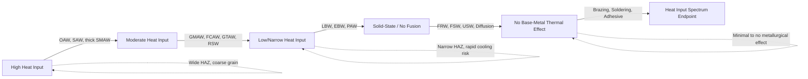
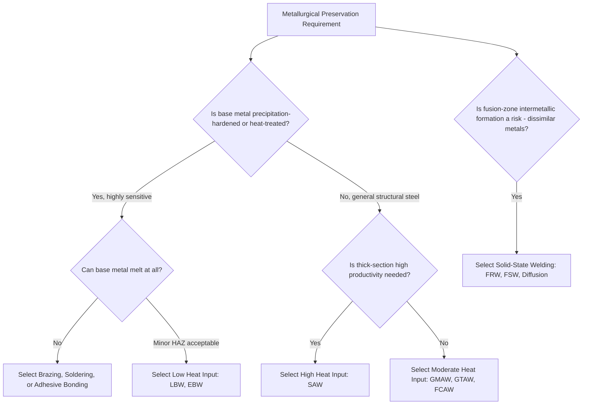

## Classification by Heat Input and Metallurgical Effect

### Overview

An alternative and highly practical classification framework for joining processes organizes them according to **heat input magnitude and the resulting metallurgical effect** on the base material, rather than by category (welding, brazing, adhesive) or heat source alone. This framework directly predicts the extent of the heat-affected zone (HAZ), residual stress, distortion, grain structure change, and risk of undesirable metallurgical phenomena (embrittlement, sensitization, softening of precipitation-hardened alloys), making it the most design-relevant classification axis when material property preservation is a governing constraint.

### Why Heat Input Classification Matters

Heat input directly governs the cooling rate and peak temperature experienced by material adjacent to the joint, which in turn determines:

- **Grain size in the HAZ:** Higher heat input generally produces slower cooling rates and coarser HAZ grain structure, which can reduce toughness and fatigue resistance.
- **Residual stress and distortion:** Higher heat input and larger thermally affected volumes produce greater differential thermal contraction upon cooling, increasing distortion and locked-in residual stress.
- **Precipitation-hardened alloy degradation:** Alloys strengthened by precipitation hardening (many aluminum and nickel-based superalloys) can experience local overaging or dissolution of strengthening precipitates in the HAZ, reducing local strength.
- **Sensitization risk in stainless steels:** Certain heat input ranges and dwell times can precipitate chromium carbides at grain boundaries in austenitic stainless steels, depleting adjacent chromium and increasing intergranular corrosion susceptibility.

### Approximate Heat Input Formula (Arc Welding)

For arc welding processes, heat input $H$ is commonly approximated as:

$$H = \frac{V \cdot I \cdot 60}{S}$$

where $V$ is arc voltage, $I$ is welding current, and $S$ is travel speed (mm/min or in/min), yielding heat input in joules per unit length (commonly kJ/mm or kJ/in). [Inference: actual thermal efficiency varies by process — arc efficiency factors of roughly 0.7–0.9 for GMAW/SMAW and lower for GTAW are commonly applied to refine this estimate, but exact values are process- and equipment-dependent.]

### Classification Spectrum: From Highest to Lowest Heat Input/Metallurgical Effect

#### 1. High Heat Input — Wide HAZ, Significant Metallurgical Disruption

**Representative processes:** Oxyacetylene welding (OAW), submerged arc welding (SAW), thick-section SMAW.

**Metallurgical effect:** Slow cooling rates produce coarse HAZ grain structure; large total heat input causes significant thermal distortion and residual stress; extended time at elevated temperature increases risk of grain growth and, in susceptible alloys, sensitization or precipitate coarsening.

**Design implication:** Generally avoided for thin sections, precision assemblies, or alloys highly sensitive to HAZ softening; favored for thick-section, high-deposition-rate structural work where HAZ width is a secondary concern relative to productivity.

#### 2. Moderate Heat Input — Controlled HAZ, Manageable Metallurgical Effect

**Representative processes:** GMAW, FCAW, GTAW, most resistance welding (RSW, RSEW).

**Metallurgical effect:** HAZ width and grain coarsening are present but controllable through parameter optimization (travel speed, current, interpass temperature control); represents the practical middle ground used for the large majority of general fabrication welding.

**Design implication:** The default process category for general structural and manufacturing fabrication where some HAZ effect is acceptable and can be managed through welding procedure specification (WPS) control and, where needed, post-weld heat treatment (PWHT).

#### 3. Low/Narrow Heat Input — Minimal HAZ, Highly Localized Metallurgical Effect

**Representative processes:** Laser beam welding (LBW), electron beam welding (EBW), plasma arc welding (PAW at low current).

**Metallurgical effect:** Extremely high energy density concentrates heat into a very narrow zone with rapid cooling rates, producing a narrow HAZ, often with fine-grained microstructure due to rapid solidification; however, rapid cooling can in some alloys promote hardening/embrittlement (e.g., martensite formation in certain steels) as a distinct metallurgical risk from the coarse-grain risk of high heat input processes.

**Design implication:** Favored where minimal distortion and narrow HAZ are critical (precision assemblies, thin sections, dissimilar-thickness joints), but cooling-rate-dependent hardening effects must be separately evaluated, particularly for hardenable steel alloys.

#### 4. No Melting — Solid-State Processes (No Fusion-Zone Metallurgical Effect)

**Representative processes:** Friction welding, friction stir welding, ultrasonic welding, diffusion welding, cold welding.

**Metallurgical effect:** No fusion zone forms; peak temperatures generally remain below the base metal's melting point, avoiding solidification-related defects (porosity, hot cracking, dendritic structure) entirely. Some processes (friction welding, friction stir welding) still generate significant local heat and plastic deformation, producing a thermomechanically affected zone (TMAZ) with altered (though not melted) microstructure.

**Design implication:** Preferred where fusion-zone metallurgy (intermetallic formation in dissimilar metals, solidification cracking in crack-sensitive alloys) must be avoided entirely, at the cost of typically requiring more complex fixturing and, for some variants, geometric constraints (axisymmetric parts for rotary friction welding).

#### 5. No Base-Metal Thermal Effect — Brazing, Soldering, and Adhesive Bonding

**Representative processes:** Brazing, soldering, adhesive bonding.

**Metallurgical effect:** Base metal never melts (brazing/soldering) or experiences no significant thermal cycle at all (most adhesive bonding), essentially eliminating base-metal HAZ formation; brazing can still produce minor base-metal effects (stress relief/annealing) at typical brazing temperatures (600–1150°C depending on filler) for cold-worked or precipitation-hardened alloys.

**Design implication:** The default choice where base-metal metallurgical properties must be fully preserved (heat-treated tool steels, precipitation-hardened aerospace alloys) or where dissimilar-metal/non-metallic combinations preclude any fusion-based approach.

### Comparative Summary Table

| Heat Input Tier | Representative Processes | HAZ Width | Cooling Rate | Primary Metallurgical Risk |
| --- | --- | --- | --- | --- |
| High | OAW, SAW, thick SMAW | Wide | Slow | Grain coarsening, distortion, sensitization |
| Moderate | GMAW, FCAW, GTAW, RSW | Moderate | Moderate | Manageable HAZ softening/coarsening |
| Low/Narrow | LBW, EBW, PAW | Narrow | Fast | Localized hardening/embrittlement in hardenable alloys |
| Solid-state (no fusion) | FRW, FSW, USW, diffusion welding | None (TMAZ only in some) | N/A | Thermomechanical microstructure change, no solidification defects |
| No thermal effect | Brazing, soldering, adhesive bonding | None (minor anneal possible in brazing) | N/A | Minimal; possible base-metal annealing at brazing temperature |

### Classification Spectrum Diagram

### Decision Framework: Selecting by Metallurgical Constraint

### Practical Example

**Example:** Joining a precipitation-hardened aluminum aircraft skin panel (e.g., 7075-T6) where preserving the T6 temper's strengthening precipitates in the joint vicinity is critical to structural performance.

- **High heat input processes (OAW, SAW)** are immediately excluded: the wide HAZ and slow cooling would cause extensive overaging and dissolution of strengthening precipitates over a broad region, significantly reducing local strength.
- **Moderate heat input arc processes (GMAW, GTAW)** remain problematic: even controlled arc welding of 7xxx-series aluminum is notoriously prone to HAZ softening and, in some alloys, hot cracking susceptibility, generally disqualifying fusion arc welding for this alloy family in critical structural applications.
- **Friction Stir Welding (FSW)**, a solid-state process, is frequently the preferred solution in practice: peak temperatures remain below melting point, avoiding solidification cracking entirely, and while a thermomechanically affected zone (TMAZ) with some precipitate coarsening still forms, it is generally narrower and less severe than the HAZ produced by fusion arc welding of the same alloy.
- Where even TMAZ effects are unacceptable, **mechanical fastening (riveting) or adhesive bonding** — both introducing no significant thermal cycle — represent the historically dominant aerospace solution for this exact alloy family, illustrating how the heat-input classification axis directly drives real-world material-process pairing in aerospace structural design.

### Key Points

- Heat input classification organizes joining processes on a spectrum from high heat input (OAW, SAW) through moderate (GMAW, GTAW, FCAW) and low/narrow (LBW, EBW) fusion processes, to solid-state (no fusion) and no-thermal-effect (brazing, soldering, adhesive) categories.
- Higher heat input generally produces wider HAZ, coarser grain structure, and greater distortion, while lower heat input and rapid cooling can introduce distinct risks (localized hardening/embrittlement) in hardenable alloys.
- Solid-state welding avoids fusion-zone solidification defects entirely but can still produce a thermomechanically affected zone (TMAZ) with altered microstructure in processes involving significant frictional/deformational heating.
- Brazing, soldering, and adhesive bonding represent the low end of the metallurgical-effect spectrum, preserving base-metal properties most completely, with brazing's elevated process temperature still capable of causing minor base-metal annealing in sensitive alloys.
- This classification axis is often the decisive practical factor for precipitation-hardened and heat-treated alloys, frequently overriding heat-source or category-based classification in final process selection.

### Related Topics

- AWS three-category joining framework overview
- Fusion-welding process classification
- Solid-state welding process classification
- Heat-affected zone (HAZ) metallurgy and post-weld heat treatment strategies
- Friction Stir Welding (FSW) of precipitation-hardened aluminum alloys
- Sensitization and intergranular corrosion in welded austenitic stainless steels