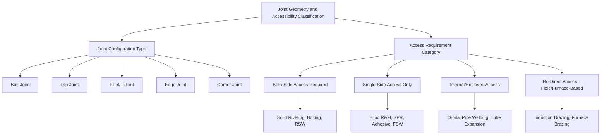
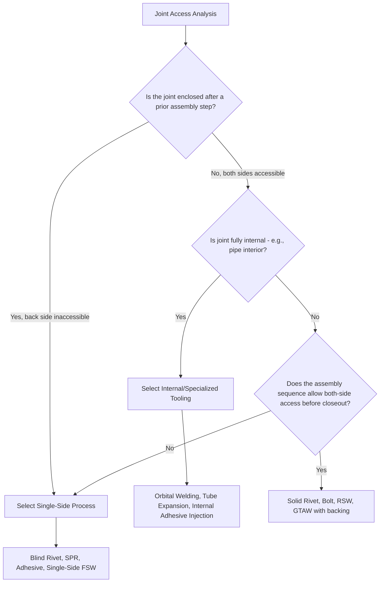

## Classification by Joint Geometry and Accessibility

### Overview

Joint geometry and accessibility form a practical, design-driven classification axis for joining process selection, organized around two related questions: **what shape must the joint take** (butt, lap, fillet, edge, corner) and **how much physical access does the joining process require** (both-side access, single-side access, internal/enclosed access, or none at all). Unlike energy-source or metallurgical-effect classification, this axis is governed primarily by part geometry and assembly sequence constraints rather than material properties, and frequently becomes the decisive filter once material-based classification has narrowed the candidate process set.

### Standard Joint Configuration Types

The five basic joint configurations, common across welding, brazing, adhesive bonding, and mechanical fastening, describe the relative geometric arrangement of the parts being joined:

#### 1. Butt Joint

Two members are aligned in the same plane with their edges meeting, joined along the abutting edge. Common in pressure vessel and pipe fabrication where a flush, full-penetration joint is required.

#### 2. Lap Joint

One member overlaps another, with the joint formed across the overlapping area. The most common configuration for spot welding, adhesive bonding, and riveting, since it provides a naturally larger joining area and does not require precise edge-to-edge alignment.

#### 3. Fillet/T-Joint

One member is positioned perpendicular (or at an angle) to another, forming a T- or corner-shaped intersection, with weld/joint material filling the internal angle.

#### 4. Edge Joint

The edges of two (typically parallel or near-parallel) members are joined along a common edge, often used for thin sheet stiffening or flange assembly.

#### 5. Corner Joint

Two members meet at their edges to form an angle (commonly 90°), used in box/enclosure fabrication.

### Classification by Access Requirement

#### Both-Side Access Required

**Representative processes:** Solid riveting (tail-side access for upsetting), through-bolting, resistance spot welding (RSW, requiring opposing electrode access), GTAW/GMAW on a joint requiring back-side weld or backing.

**Design implication:** Feasible only when the assembly sequence allows the joint to be accessed from both sides before the enclosure or structure is closed out; often dictates assembly order (join before final enclosure) rather than being retrofittable after assembly.

#### Single-Side Access Only

**Representative processes:** Blind (pop) riveting, self-piercing riveting (SPR), one-side resistance welding variants, adhesive bonding (applied from the accessible face), single-side fillet welding, friction stir welding (tool accesses from one face along the joint line).

**Design implication:** Essential for enclosed structures, sealed assemblies, or components where the back side becomes inaccessible after a prior assembly step (e.g., an inner panel already installed behind an outer skin).

#### Internal/Enclosed Access (No External Access)

**Representative processes:** Internal pipe/tube welding using specialized internal welding heads or orbital welding systems, adhesive injection into pre-assembled cavities, internal expansion joining (tube-to-tubesheet expansion in heat exchangers).

**Design implication:** Requires specialized tooling designed to reach and operate within a confined internal geometry, often at higher cost and lower productivity than external-access equivalents; frequently necessary in heat exchanger, boiler, and piping system manufacturing.

#### No Direct Access Required (Line-of-Sight or Field-Based Processes)

**Representative processes:** Induction brazing/soldering (field penetrates through some material thicknesses), certain adhesive cure mechanisms (heat-cured adhesives where the heat source need not directly contact the joint), diffusion bonding within a sealed furnace/press environment.

**Design implication:** Offers the greatest geometric flexibility for enclosed or complex internal joints, though typically at higher equipment complexity and cost.

### Comparative Table: Access Requirement by Process

| Process | Access Requirement | Compatible Joint Types |
| --- | --- | --- |
| Solid Riveting | Both sides | Lap, butt (with strap) |
| Bolting | Both sides (or captive nut) | Lap, butt (with flange) |
| Resistance Spot Welding | Both sides (electrodes) | Lap |
| Blind/Pop Riveting | Single side | Lap |
| Self-Piercing Riveting | Single side | Lap |
| Adhesive Bonding | Single side (application face) | Lap, butt (with scarf), edge |
| Friction Stir Welding | Single side (tool traverse face) | Butt, lap |
| GTAW (open joint) | Single side (with backing) or both (for back weld) | Butt, fillet, corner |
| Orbital/Internal Pipe Welding | Internal, specialized tooling | Butt (tube/pipe) |
| Furnace Brazing | Enclosed (furnace environment) | Lap, complex assemblies |

### Classification Diagram

### Access-Driven Process Selection Framework

### Illustrative Schematic: Joint Configuration Types

<svg xmlns="http://www.w3.org/2000/svg" viewBox="0 0 520 260">
<text x="260" y="20" font-size="14" text-anchor="middle" font-weight="bold">Standard Joint Configurations (svg_diagram)</text>
<rect x="20" y="50" width="70" height="15" fill="#a9a9a9" stroke="#333" />
<rect x="90" y="50" width="70" height="15" fill="#a9a9a9" stroke="#333" />
<text x="80" y="85" font-size="8" text-anchor="middle">Butt Joint</text>
<rect x="200" y="45" width="70" height="15" fill="#a9a9a9" stroke="#333" />
<rect x="235" y="62" width="70" height="15" fill="#a9a9a9" stroke="#333" />
<text x="270" y="95" font-size="8" text-anchor="middle">Lap Joint</text>
<rect x="360" y="50" width="70" height="15" fill="#a9a9a9" stroke="#333" />
<rect x="390" y="50" width="15" height="60" fill="#a9a9a9" stroke="#333" />
<text x="400" y="128" font-size="8" text-anchor="middle">Fillet/T-Joint</text>
<rect x="20" y="150" width="90" height="12" fill="#a9a9a9" stroke="#333" />
<rect x="20" y="165" width="90" height="12" fill="#a9a9a9" stroke="#333" />
<text x="65" y="195" font-size="8" text-anchor="middle">Edge Joint</text>
<rect x="200" y="150" width="15" height="60" fill="#a9a9a9" stroke="#333" />
<rect x="200" y="150" width="60" height="15" fill="#a9a9a9" stroke="#333" />
<text x="230" y="228" font-size="8" text-anchor="middle">Corner Joint</text>
</svg>

### Practical Example

**Example:** Joining an inner reinforcement panel to an outer body skin in an automotive door assembly, where the inner panel is installed first and the outer skin subsequently closes out access to the back side of the joint.

- **Resistance spot welding**, though widely used in automotive body assembly generally, requires opposing electrode access to both sides of the joint — feasible earlier in the assembly sequence, but not once the outer skin has enclosed the joint area, since the far-side electrode could no longer reach the inner panel.
- **Solid riveting** is similarly excluded once the assembly is closed out, for the same both-side access reason.
- **Adhesive bonding**, applied to the mating flange before the outer skin is closed onto the inner panel, requires access only to the single (accessible) face at the time of application, and the curing process (typically an oven-bake cycle) requires no further access to the joint at all — making it compatible with the closed-out assembly sequence.
- **Self-piercing rivets (SPR)** offer an alternative single-side-access permanent mechanical option if a discrete high-strength joint is additionally required alongside or instead of adhesive.
- This illustrates how the assembly sequence itself — not just the final part geometry — determines the access classification governing feasible joining process selection, since a joint that is technically both-side-accessible on the individual components becomes single-side-accessible once assembly order encloses it.

### Key Points

- Joint geometry and accessibility classification is organized around joint configuration type (butt, lap, fillet, edge, corner) and access requirement (both-side, single-side, internal/enclosed, no direct access).
- Access requirement is often determined by assembly sequence, not just final part geometry — a joint accessible on individual components may become single-side-accessible once prior assembly steps enclose it.
- Single-side-access processes (blind rivets, SPR, adhesive bonding, friction stir welding) are essential wherever enclosed or sealed assemblies preclude back-side access.
- Internal/enclosed access processes (orbital pipe welding, tube expansion) require specialized tooling and are common in piping, boiler, and heat exchanger manufacturing.
- This classification axis frequently becomes the decisive selection filter after material-based classification (conductivity, hardness, thermal sensitivity) has already narrowed the candidate process set.

### Related Topics

- AWS three-category joining framework overview
- Mechanical fastening: permanent versus removable
- Adhesive bonding process classification
- Assembly sequence planning and design for manufacturability (DFM) in multi-step joining
- Orbital and internal pipe welding system design
- Self-piercing riveting (SPR) process parameters for multi-material automotive assembly