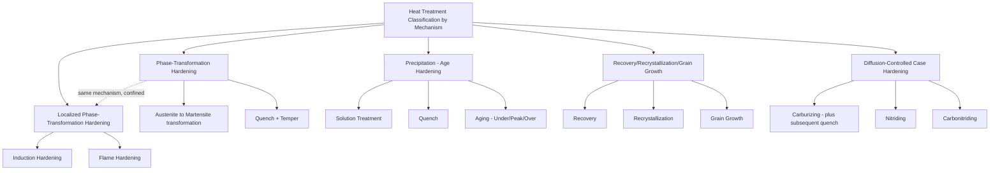

## Heat-Treatment Classification by Mechanism

### Overview

Heat treatment is a family of property-enhancing processes that deliberately alter a material's microstructure through controlled heating and cooling cycles, without changing the part's overall shape or composition (barring surface-modification variants). The most fundamentally useful classification axis for heat treatment is by **strengthening/softening mechanism** — the specific microstructural phenomenon exploited to achieve the desired property change — since this determines the applicable material systems, achievable property ranges, and the process parameters (temperature, cooling rate, time) that must be controlled.

### Rationale for Mechanism-Based Classification

Heat treatments span a wide range of purposes (hardening, softening, stress relief, grain refinement), and grouping them by mechanism rather than by name alone clarifies:

- Which alloy systems are metallurgically capable of a given treatment (e.g., only alloys with an allotropic phase transformation can be through-hardened by quenching)
- What property changes are achievable and their approximate magnitude
- Why certain treatments must be applied in a specific sequence (e.g., solution treatment must precede aging)
- The underlying physical basis for selecting cooling rate, since this is the primary process variable distinguishing mechanisms within the same general heating approach

### The Fundamental Mechanisms

#### 1. Phase-Transformation Hardening (Quench Hardening)

**Mechanism:** Exploits an allotropic phase transformation — most classically, the transformation of austenite (face-centered cubic iron with dissolved carbon) to martensite (a hard, supersaturated body-centered tetragonal phase) in steel upon rapid cooling (quenching) from above the austenitizing temperature. The diffusionless, shear-type transformation traps carbon atoms in a highly strained lattice, producing very high hardness at the cost of ductility and toughness.

**Governing variable:** Cooling rate relative to the material's critical cooling rate (a function of alloy composition/hardenability), commonly visualized via Time-Temperature-Transformation (TTT) or Continuous-Cooling-Transformation (CCT) diagrams.

**Representative processes:** Conventional quench hardening (water, oil, or air quench from austenitizing temperature), followed almost universally by tempering to restore some ductility/toughness at a controlled cost to peak hardness.

**Applicable materials:** Primarily steels (and select other alloys exhibiting an analogous allotropic or diffusionless transformation); does not apply to materials lacking a suitable phase transformation (e.g., most pure aluminum, austenitic stainless steel in its normal composition range).

#### 2. Precipitation (Age) Hardening

**Mechanism:** Exploits the decreasing solid solubility of an alloying element with decreasing temperature. The alloy is first heated to a high temperature to dissolve the alloying element into a supersaturated solid solution (**solution treatment**), then rapidly quenched to retain this supersaturation at room temperature, and finally reheated to a moderate temperature (**aging**) to allow controlled, fine precipitation of a second phase, which impedes dislocation motion and increases strength.

**Governing variables:** Solution treatment temperature/time (must fully dissolve the precipitating phase), quench rate (must be fast enough to suppress premature precipitation), and aging temperature/time (controls precipitate size and distribution — underaging, peak-aging, and overaging represent progressively coarser precipitate states with correspondingly different strength/ductility trade-offs).

**Representative processes:** T6 temper (solution treated + artificially aged) and related temper designations in aluminum alloys; precipitation hardening in nickel-based superalloys (gamma-prime precipitation), certain stainless steels (17-4PH and similar), and beryllium copper.

**Applicable materials:** Alloys exhibiting decreasing solid solubility of a key alloying element with temperature — notably aluminum-copper, aluminum-zinc-magnesium, and nickel-based superalloy systems; does not apply to alloy systems lacking this solubility behavior.

#### 3. Recovery, Recrystallization, and Grain Growth (Annealing Mechanisms)

**Mechanism:** Reduces the stored strain energy accumulated from prior cold working, proceeding through three sequential, temperature-dependent stages: **recovery** (dislocation rearrangement and annihilation without new grain formation, partially restoring properties with minimal microstructural change), **recrystallization** (nucleation and growth of new, strain-free grains, substantially restoring ductility and lowering strength/hardness), and **grain growth** (continued heating beyond recrystallization causes existing new grains to coarsen, generally undesirable as it reduces strength via the Hall-Petch relationship).

**Governing variables:** Annealing temperature relative to the material's recrystallization temperature (itself dependent on prior cold-work degree and alloy composition), and holding time.

**Representative processes:** Full annealing, process (recrystallization) annealing, stress-relief annealing (typically held below the recrystallization temperature, targeting only the recovery stage).

**Applicable materials:** Broadly applicable to any cold-worked metal, since recovery/recrystallization/grain growth is a general response to stored dislocation strain energy rather than being alloy-system-specific.

#### 4. Diffusion-Controlled Surface Modification (Case Hardening by Composition Change)

**Mechanism:** Introduces a compositional gradient at the surface by diffusing an interstitial or substitutional element (carbon, nitrogen, boron) into the surface layer at elevated temperature, then, for carbon- and nitrogen-based processes, often combining this with a subsequent phase-transformation hardening step (quench) to harden only the enriched surface layer while the core retains its original (softer, tougher) composition and properties.

**Representative processes:** Carburizing (carbon diffusion, followed by quench hardening), nitriding (nitrogen diffusion, forms hard nitride compounds without requiring a subsequent quench), carbonitriding (combined carbon/nitrogen diffusion).

**Applicable materials:** Low-to-medium carbon steels (carburizing, to provide sufficient carbon for subsequent hardening) and nitriding-grade alloy steels (containing strong nitride-forming elements such as aluminum, chromium, or molybdenum).

**Distinguishing note:** This mechanism is fundamentally different from surface hardening by localized heating alone (below), since it involves an actual compositional change at the surface, not merely localized application of the same phase-transformation mechanism used for through-hardening.

#### 5. Localized/Selective Phase-Transformation Hardening (Case Hardening by Localized Heating)

**Mechanism:** Applies the same phase-transformation (quench) hardening mechanism described above, but confines the austenitizing heat to only a thin surface layer (via rapid, localized heat input), followed by immediate quenching of that layer, leaving the core unaustenitized and therefore unhardened — without any change in bulk composition.

**Representative processes:** Induction hardening (electromagnetic induction heats only a controlled surface depth via the skin effect), flame hardening (a torch rapidly heats the surface, followed by an immediate quench).

**Applicable materials:** Medium-to-high carbon steels already possessing sufficient carbon content for hardening (unlike carburizing, no carbon is added — the base material must already contain adequate hardenable carbon content).

### Comparative Summary Table

| Mechanism | Key Physical Basis | Governing Process Variable | Representative Process | Applicable Materials |
| --- | --- | --- | --- | --- |
| Phase-transformation hardening | Diffusionless austenite-to-martensite transformation | Cooling rate vs. critical cooling rate | Quench + temper | Steels (sufficient carbon/hardenability) |
| Precipitation (age) hardening | Decreasing solid solubility with temperature | Solution temp/quench rate + aging temp/time | T6 temper, superalloy aging | Al-Cu, Al-Zn-Mg, Ni-superalloys |
| Recovery/recrystallization/grain growth | Reduction of stored dislocation strain energy | Annealing temp vs. recrystallization temp | Full/process/stress-relief anneal | Any cold-worked metal |
| Diffusion-controlled case hardening | Compositional gradient via interstitial diffusion | Diffusion temp/time, subsequent quench | Carburizing, nitriding | Low-C steels (carburize), alloy steels (nitride) |
| Localized phase-transformation hardening | Same as quench hardening, spatially confined | Heating depth/rate, immediate quench | Induction/flame hardening | Medium-high carbon steels |

### Classification Diagram

### Property Change Progression: Aging Curve Concept

### Practical Example

**Example:** Selecting a heat treatment strategy for a steel automotive gear requiring a hard, wear-resistant tooth surface combined with a tough, fatigue-resistant core capable of absorbing impact loading.

- **Through phase-transformation hardening (full quench and temper)** of a medium-carbon steel would harden the entire cross-section uniformly, but this sacrifices core toughness — a fully martensitic core is brittle and poorly suited to absorbing the cyclic impact and bending loads a gear experiences in service.
- **Diffusion-controlled carburizing** is selected: a low-carbon steel gear (which retains good inherent core toughness) is carburized at elevated temperature to diffuse carbon into only the tooth surface layer, then quenched — hardening only the carbon-enriched case while the low-carbon core remains tough and ductile.
- This produces the classic "hard case, tough core" property combination that neither a uniform through-hardening treatment nor a localized-heating case-hardening treatment (which cannot add carbon to an inherently low-carbon steel) could achieve on this same low-carbon base material.
- If the same gear were instead made from a medium-to-high carbon steel already containing sufficient carbon for hardening, **induction hardening** (localized phase-transformation hardening, no compositional change needed) would be the more efficient choice, since carbon diffusion would be unnecessary — illustrating how the two case-hardening mechanisms are selected based on whether the base material's carbon content is already sufficient for hardening.

### Key Points

- Heat treatment mechanisms include phase-transformation hardening, precipitation (age) hardening, recovery/recrystallization/grain growth, diffusion-controlled case hardening, and localized phase-transformation hardening.
- Phase-transformation hardening relies on a diffusionless austenite-to-martensite transformation and applies primarily to steels with sufficient hardenability.
- Precipitation hardening exploits decreasing solid solubility with temperature and requires a specific three-stage sequence: solution treatment, quench, and aging.
- Diffusion-controlled case hardening (carburizing, nitriding) changes surface composition and is distinct from localized phase-transformation hardening (induction, flame), which requires no compositional change but does require the base material to already contain sufficient hardenable carbon content.
- Recovery, recrystallization, and grain growth represent a temperature-ordered sequence of microstructural relaxation applicable broadly to any cold-worked metal, independent of alloy-specific transformation behavior.

### Related Topics

- Phase diagrams and TTT/CCT diagram interpretation for steel hardening
- Aluminum alloy temper designations (T4, T6, T651) and aging kinetics
- Carburizing versus nitriding: process comparison and case depth control
- Induction hardening coil design and case depth prediction
- Tempering and its effect on hardness-toughness trade-off after quenching
- Surface treatment classification: mechanical, thermal, and diffusion-based methods