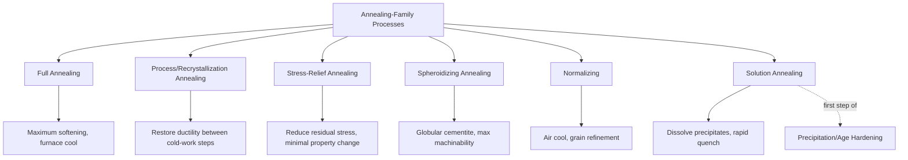
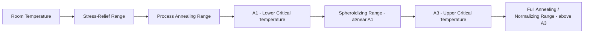

## Annealing-Family Process Classification

### Overview

Annealing is a family of heat-treatment processes that heat a material to a specific temperature range and cool it in a controlled manner (typically slowly) to achieve a targeted combination of softening, stress relief, ductility restoration, or microstructural conditioning — generally the opposite objective of hardening treatments. The annealing family is best classified by the **specific microstructural or property objective** each variant targets, since "annealing" is not a single process but a spectrum of treatments distinguished primarily by temperature range and intended outcome, while sharing the common feature of a controlled (generally slow) cooling cycle following heating.

### Common Characteristics of the Annealing Family

- Primary objective is softening, stress relief, ductility improvement, or microstructural refinement/homogenization — the inverse purpose of hardening treatments
- Cooling is generally slow and controlled (often furnace cooling), in contrast to the rapid quenching central to phase-transformation hardening
- Temperature selection relative to the material's critical transformation temperatures (for steels, the $A_1$ and $A_3$ temperatures) or recrystallization temperature is the primary variable distinguishing annealing subtypes
- Applicable broadly across ferrous and non-ferrous alloys, though the specific subtype names and temperature ranges are often alloy-system-specific

### Member Processes by Objective

#### 1. Full Annealing

**Objective:** Maximum softening and ductility, producing a coarse pearlitic (in steels) or fully recrystallized, stress-free microstructure suitable for subsequent extensive machining or cold forming.

**Process:** The material (typically steel) is heated above its upper critical temperature ($A_3$ for hypoeutectoid steels, $A_1$ for hypereutectoid steels) to fully austenitize, held to homogenize, then cooled very slowly (typically furnace-cooled) to allow formation of coarse, soft pearlite.

**Applications:** Preparing hot-worked or cast steel components for extensive machining; softening components that have become excessively hard from prior processing.

#### 2. Process (Recrystallization) Annealing

**Objective:** Restore ductility to cold-worked material by inducing recrystallization, without fully austenitizing (for steels) or undergoing a phase transformation.

**Process:** Heating to a temperature above the material's recrystallization temperature but below the lower critical transformation temperature ($A_1$ for steels), held briefly, then air-cooled (cooling rate is less critical here since no phase transformation is being controlled).

**Applications:** Restoring ductility between stages of a multi-step cold-working operation (e.g., wire drawing, deep drawing) where the material would otherwise fracture from accumulated strain hardening if worked further without intermediate softening.

#### 3. Stress-Relief Annealing

**Objective:** Reduce residual stresses accumulated from prior machining, welding, casting, or cold working, without significantly altering hardness, strength, or microstructure.

**Process:** Heating to a relatively low temperature — well below the recrystallization temperature for cold-worked material, or below the lower critical temperature for as-welded/cast steel — held for a sufficient time to allow stress relaxation via limited dislocation rearrangement (recovery), then slowly cooled to avoid introducing new thermal stresses.

**Applications:** Dimensionally critical machined parts prone to distortion from released residual stress during subsequent machining passes; post-weld stress relief to reduce distortion and cracking risk, particularly in thick-section or restrained weldments.

#### 4. Spheroidizing Annealing

**Objective:** Convert lamellar pearlite (alternating plates of ferrite and cementite) into a spheroidized (globular) cementite morphology dispersed in a ferrite matrix, maximizing machinability and cold-formability in high-carbon steels.

**Process:** Prolonged heating at or slightly below the lower critical temperature ($A_1$), or cycling just above and below it, allowing the cementite to gradually coalesce into spherical particles driven by surface-energy minimization.

**Applications:** High-carbon and tool steels prior to extensive machining or cold-forming operations, where the lamellar pearlite structure of a full anneal would still present excessive hardness/poor machinability for these carbon levels.

#### 5. Normalizing

**Objective:** Refine and homogenize grain structure, relieve internal stresses from prior processing (casting, forging, welding), and produce a more uniform, moderately fine-grained pearlitic structure than full annealing — considered by some classification schemes as a related but distinct process from true annealing due to its air-cooling (rather than furnace-cooling) practice.

**Process:** Heating above the upper critical temperature ($A_3$) similar to full annealing, but cooled in still air rather than furnace-cooled, producing a finer, more uniform grain structure and moderately higher strength/hardness than full annealing.

**Applications:** Refining grain structure after casting or forging prior to final heat treatment; improving machinability and mechanical property uniformity in structural steel components.

#### 6. Solution Annealing (Solution Treatment)

**Objective:** Dissolve a second phase or precipitates into a supersaturated solid solution, either as a standalone homogenization treatment or as the first stage of a subsequent precipitation-hardening sequence (see Heat-Treatment Classification by Mechanism).

**Process:** Heating to a temperature sufficient to fully dissolve the relevant precipitating phase, held to homogenize, then rapidly quenched to retain the supersaturated condition at room temperature.

**Applications:** Homogenizing austenitic stainless steels (dissolving chromium carbides to restore corrosion resistance, reversing sensitization) and as the essential first step of aluminum and superalloy precipitation-hardening treatments.

### Comparative Summary Table

| Subtype | Primary Objective | Temperature Range (relative) | Cooling Method | Typical Application |
| --- | --- | --- | --- | --- |
| Full Annealing | Maximum softening/ductility | Above $A_3$ (or $A_1$ for hypereutectoid) | Slow furnace cool | Pre-machining softening |
| Process Annealing | Restore cold-worked ductility | Above recrystallization, below $A_1$ | Air cool | Between cold-working stages |
| Stress-Relief Annealing | Reduce residual stress | Below recrystallization/$A_1$ | Slow cool | Post-machining/post-weld |
| Spheroidizing | Maximize machinability (high-C steel) | At/near $A_1$, prolonged or cyclic | Slow cool | High-carbon/tool steel prep |
| Normalizing | Grain refinement, uniformity | Above $A_3$ | Air cool | Post-casting/forging refinement |
| Solution Annealing | Dissolve precipitates/second phase | Above solvus temperature | Rapid quench | Stainless steel homogenization, precipitation-hardening first step |

### Classification Diagram

### Temperature Range Comparison (Relative to Critical Temperatures, Steel Example)

### Practical Example

**Example:** A high-carbon tool steel blank (1095 steel) has been through several cold-heading operations to form a preliminary punch shape and must now be finish-machined to close tolerance before final hardening.

- **Full annealing** is considered but risks producing a lamellar pearlitic structure that, while softer than the as-worked condition, still presents relatively poor machinability at this high carbon content (~0.95% C), since lamellar cementite plates resist clean cutting action.
- **Spheroidizing annealing** is selected instead: the prolonged near-$A_1$ treatment converts the pearlitic cementite into a globular (spheroidized) morphology, which machines significantly more cleanly than the lamellar structure, since discrete rounded carbide particles in a soft ferrite matrix cause far less tool wear and produce better surface finish than continuous hard cementite plates.
- Following spheroidize-annealed machining to final geometry, the punch subsequently undergoes phase-transformation hardening (austenitize and quench) to achieve its required service hardness — the spheroidized structure providing not only good pre-hardening machinability but also a favorable starting microstructure for subsequent austenitizing.
- This illustrates why the annealing family requires objective-specific subtype selection: a generic "anneal" instruction would be ambiguous for this high-carbon application, where spheroidizing — not full annealing — is the metallurgically correct choice for the machinability objective.

### Key Points

- The annealing family is organized by specific property/microstructural objective — full annealing, process annealing, stress-relief annealing, spheroidizing, normalizing, and solution annealing — rather than being a single undifferentiated process.
- Temperature selection relative to critical transformation temperatures ($A_1$, $A_3$ for steels) or the material's recrystallization temperature is the primary variable distinguishing subtypes.
- Normalizing is distinguished from full annealing primarily by its air-cooling (rather than furnace-cooling) practice, producing finer grain structure and somewhat higher strength.
- Spheroidizing is specifically targeted at high-carbon steels where a lamellar pearlitic structure (the product of full annealing) still presents inadequate machinability.
- Solution annealing serves a dual role: as a standalone homogenization treatment (notably for sensitized austenitic stainless steel) and as the mandatory first stage of precipitation-hardening treatment sequences.

### Related Topics

- Heat-treatment classification by mechanism
- Phase diagrams and critical temperature ($A_1$, $A_3$) interpretation for steel
- Sensitization and solution annealing of austenitic stainless steels
- Cold working and recrystallization temperature relationships
- Precipitation (age) hardening sequence: solution treatment, quench, and aging
- Post-weld heat treatment (PWHT) for residual stress reduction