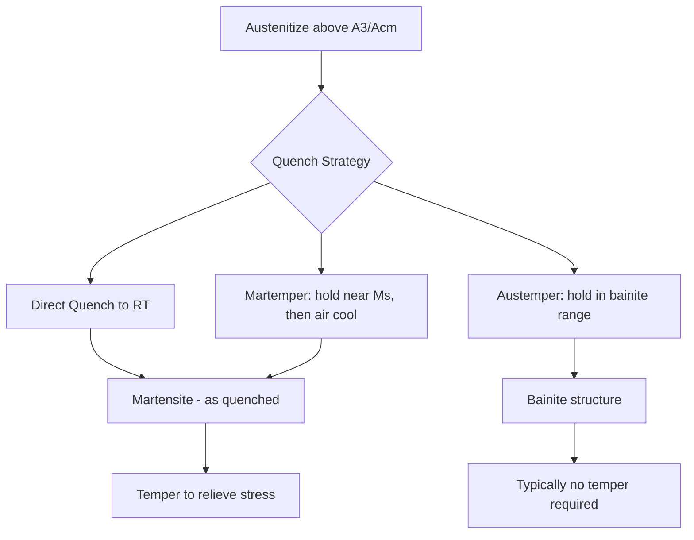

## Hardening and Quenching Classification

### Overview

Hardening and quenching are heat-treatment processes applied to ferrous and select non-ferrous alloys to increase hardness, strength, and wear resistance by controlling the transformation of the material's microstructure. Hardening refers to austenitizing a steel and then cooling it fast enough to suppress diffusion-controlled transformations, producing martensite. Quenching is the rapid-cooling step itself, classified by the medium, rate, and mechanism used to extract heat from the workpiece.

### Metallurgical Basis

**Key Points**

- Hardening requires heating steel above its upper critical temperature ($A_3$ for hypoeutectoid steel, $A_{cm}$ for hypereutectoid steel) to form austenite.
- Rapid cooling prevents carbon diffusion, forcing a diffusionless, shear-type transformation of austenite into martensite, a body-centered tetragonal (BCT) phase.
- The critical cooling rate needed to avoid pearlite/bainite formation depends on alloy composition (hardenability), captured by the Jominy end-quench test and represented on Time-Temperature-Transformation (TTT) and Continuous-Cooling-Transformation (CCT) diagrams.
- Martensite start ($M_s$) and finish ($M_f$) temperatures determine how much retained austenite remains after quenching.

$$M_s(^{\circ}C) \approx 539 - 423(\%C) - 30.4(\%Mn) - 17.7(\%Ni) - 12.1(\%Cr) - 7.5(\%Mo)$$

This is a widely used empirical approximation (Andrews equation) [Unverified for alloys outside typical low-alloy steel ranges].

### Classification by Process Type

#### 1. Through Hardening

The entire cross-section is austenitized and quenched to achieve uniform hardness. Suited to medium/high-carbon and alloy steels where full-section strength is required (e.g., shafts, gears, fasteners).

#### 2. Surface (Case) Hardening

Only the surface layer is hardened while the core remains tough and ductile. Subclassified by mechanism:

- **Carburizing** – diffusing carbon into a low-carbon steel surface (typically 850–950°C) before quenching, raising surface carbon content to 0.8–1.0%.
- **Carbonitriding** – simultaneous diffusion of carbon and nitrogen in a gaseous atmosphere; lower temperature than carburizing, producing a shallower but more wear- and temper-resistant case.
- **Nitriding** – diffusing nitrogen into steel (500–550°C) without subsequent quenching-induced transformation; produces very hard, low-distortion cases via nitride precipitation, not martensite formation.
- **Induction Hardening** – localized rapid heating via electromagnetic induction followed by immediate quench, hardening only the heated zone (e.g., gear teeth, journals).
- **Flame Hardening** – localized heating with an oxy-fuel torch followed by quench; lower capital cost, less precise than induction.
- **Laser/Electron-Beam Hardening** – highly localized, high-energy-density heating enabling minimal distortion and precise case depth control.

#### 3. Selective/Differential Hardening

Combines masking, selective heating, or selective quenching to harden specific regions of a part (e.g., cutting edges of tools) while leaving other regions softer for toughness.

### Classification by Quenching Medium

| Medium | Relative Severity (H-value) | Typical Use |
| --- | --- | --- |
| Brine (10% NaCl/water) | ~2.0 | Fast quench for plain carbon steel; risk of high distortion/cracking |
| Water | ~1.0 | Plain carbon steels; fast but prone to distortion and cracking |
| Oil | ~0.25–0.5 | Alloy steels; slower, reduces cracking risk |
| Polymer (PAG, polyvinyl alcohol) | Adjustable, 0.15–1.0 | Tunable cooling rate between water and oil; environmentally preferable to oil |
| Molten salt (austempering/martempering) | Variable | Isothermal treatments; minimizes distortion |
| Forced air / gas (N₂, He) | ~0.02–0.05 | Low-distortion quench for tool steels, vacuum-furnace processing |
| Still air | <0.01 | Air-hardening ("self-hardening") alloy and tool steels |

The Grossmann H-value quantifies quench severity, feeding into hardenability calculations for predicting as-quenched hardness at a given depth.

### Classification by Cooling Mechanism (Quench Stages)

**Key Points**

1. **Vapor (Film) Boiling Stage** – a stable vapor blanket forms around the hot part, insulating it and slowing heat transfer (lowest cooling rate).
2. **Nucleate Boiling Stage** – the vapor film collapses; violent boiling produces the highest heat-transfer rate of the three stages.
3. **Convective (Liquid) Cooling Stage** – once the surface drops below the fluid's boiling point, cooling proceeds by convection alone (slowest, final stage).

Understanding these stages explains why additives (e.g., salt in brine) disrupt the vapor blanket to increase quench severity, and why agitation is used to promote uniform nucleate boiling.

### Classification by Cooling Path Strategy

- **Direct/Conventional Quenching** – continuous cooling from austenitizing temperature directly to room temperature.
- **Martempering (Marquenching)** – quench into a medium held just above $M_s$, hold to equalize temperature, then air-cool through the martensite range; reduces thermal gradient-induced distortion/cracking.
- **Austempering** – quench into a bath held above $M_s$ but within the bainite formation range, hold until bainitic transformation completes; produces bainite instead of martensite, yielding good toughness/ductility combinations without a separate tempering step.
- **Interrupted (Time) Quenching** – quench for a controlled duration, then transfer to a slower medium, used to balance hardness and distortion control.

### Post-Quench Requirement: Tempering

As-quenched martensite is hard but brittle, with high residual stress. Tempering (reheating below $A_1$, typically 150–650°C) is classified alongside hardening because it is functionally inseparable from the process chain:

- **Low-temperature tempering** (150–250°C): relieves stress while retaining most hardness; used for cutting tools, bearings.
- **High-temperature tempering** (400–650°C): trades hardness for toughness/ductility; used for structural and machine components. This combined hardening + high-temperature tempering sequence is termed **quenched and tempered (Q&T)** treatment.

### Defects Associated With Quenching Classification

**Key Points**

- **Quench cracking** – caused by excessive thermal/transformation stress gradients, especially in high-severity media (water, brine) on sections with sharp geometric transitions.
- **Distortion/warpage** – asymmetric cooling rates across a part's geometry.
- **Soft spots** – incomplete martensite formation due to local vapor-film persistence or insufficient agitation.
- **Retained austenite** – incomplete transformation when $M_f$ is below room temperature, common in high-carbon and highly alloyed steels; addressed via cryogenic (sub-zero) treatment.

### Example

A 1045 medium-carbon steel shaft requiring surface hardness for wear resistance but a tough core:

1. Austenitize the whole part at ~850°C.
2. Induction-harden only the bearing journal surfaces, quenching immediately with a spray quench.
3. Low-temperature temper (~200°C) to relieve quench stresses while preserving surface hardness (~55–60 HRC), leaving the untouched core at its original tougher, lower-hardness condition.

### Illustration: Quench Severity vs. Cooling Stage (svg_diagram)

<svg xmlns="http://www.w3.org/2000/svg" viewBox="0 0 640 360">
<rect width="640" height="360" fill="#ffffff" />
<text x="320" y="24" font-size="16" text-anchor="middle" font-family="sans-serif" font-weight="bold">Quenching Cooling Curve Stages (svg_diagram)</text>
<line x1="60" y1="320" x2="600" y2="320" stroke="black" stroke-width="2" />
<line x1="60" y1="320" x2="60" y2="40" stroke="black" stroke-width="2" />
<text x="330" y="345" font-size="13" text-anchor="middle" font-family="sans-serif">Time</text>
<text x="25" y="180" font-size="13" text-anchor="middle" font-family="sans-serif" transform="rotate(-90 25 180)">Temperature</text>
<path d="M60,60 C150,65 180,90 220,150 C260,210 300,225 340,235 C420,255 500,280 600,300" fill="none" stroke="#c0392b" stroke-width="3" />
<line x1="150" y1="40" x2="150" y2="320" stroke="#888" stroke-dasharray="4,4" />
<line x1="330" y1="40" x2="330" y2="320" stroke="#888" stroke-dasharray="4,4" />
<text x="100" y="55" font-size="12" font-family="sans-serif">Stage A</text>
<text x="70" y="70" font-size="11" font-family="sans-serif">Vapor (Film) Boiling</text>
<text x="200" y="130" font-size="12" font-family="sans-serif">Stage B</text>
<text x="175" y="145" font-size="11" font-family="sans-serif">Nucleate Boiling</text>
<text x="420" y="270" font-size="12" font-family="sans-serif">Stage C</text>
<text x="400" y="285" font-size="11" font-family="sans-serif">Convective Cooling</text>
</svg>

**Related Topics**

- Annealing and normalizing classification
- Tempering classification and temper embrittlement ranges
- Hardenability testing (Jominy end-quench method)
- Case-depth measurement and specification standards (e.g., SAE J423)
- Cryogenic treatment for retained austenite reduction
- Vacuum and gas quenching in tool-steel processing
- Distortion prediction and control in heat-treated components