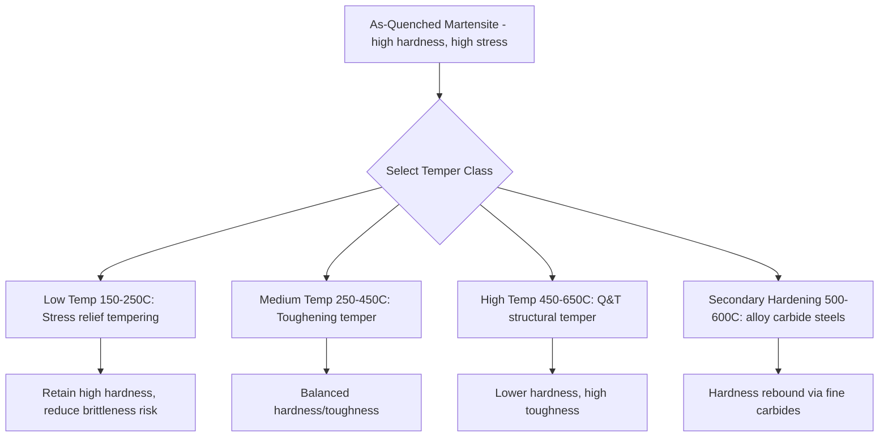

## Tempering and Stress-Relief Classification

### Overview

Tempering and stress relief are subcritical heat treatments (performed below the lower critical temperature, $A_1$) applied after hardening or after processes that induce residual stress (welding, machining, cold working, casting). Both processes reduce internal stresses and adjust microstructure/property balance, but they differ in intent, temperature range, and microstructural mechanism: tempering deliberately transforms as-quenched martensite toward a controlled hardness/toughness combination, while stress relief primarily removes locked-in residual stress without intentionally altering the base microstructure or bulk hardness.

### Metallurgical Basis of Tempering

**Key Points**

- As-quenched martensite is a supersaturated, carbon-strained BCT phase with high hardness, high residual stress, and low toughness.
- Tempering reheats the steel to a temperature below $A_1$ (typically 150–700°C), allowing carbon to diffuse out of solution and precipitate as carbides, progressively relieving lattice strain.
- The transformation occurs in recognized stages as temperature increases:
  1. **Stage 1 (~100–200°C):** Precipitation of transition carbides (epsilon-carbide) from martensite; slight hardness decrease.
  2. **Stage 2 (~200–300°C):** Decomposition of retained austenite into bainite-like ferrite/carbide aggregates.
  3. **Stage 3 (~250–350°C):** Epsilon-carbide replaced by cementite (Fe₃C); this stage overlaps with **tempered martensite embrittlement (TME)**, also called 350°C or "one-step" embrittlement.
  4. **Stage 4 (>350°C):** Cementite spheroidizes and coarsens, ferrite recovers/recrystallizes, producing tempered martensite with improved ductility and toughness at reduced hardness.

### Classification by Tempering Temperature Range

| Class | Temperature Range | Typical Hardness Outcome | Applications |
| --- | --- | --- | --- |
| Low-temperature tempering | 150–250°C | Retains most as-quenched hardness (55–65 HRC) | Cutting tools, files, bearings, gauges |
| Medium-temperature tempering | 250–450°C | Moderate hardness/toughness trade-off (40–55 HRC) | Springs, chisels, hammers |
| High-temperature tempering | 450–650°C | Lower hardness, high toughness (25–40 HRC) | Structural shafts, gears, "quenched and tempered" (Q&T) plate and bar |

Avoid tempering in the **350–400°C** band for many alloy steels where feasible, since this range coincides with tempered martensite embrittlement.

### Classification by Purpose/Function

#### 1. Stress-Relief Tempering

Performed at relatively low temperatures on hardened parts primarily to reduce quenching stresses without significantly softening the part (often 150–200°C, "snap tempering" performed immediately after quench to prevent delayed cracking).

#### 2. Toughening Tempering

The general-purpose case: intentionally trading hardness for ductility/impact toughness across the medium-to-high temperature range, tailored to the component's mechanical service requirements.

#### 3. Secondary Hardening

In steels containing strong carbide-forming elements (Cr, Mo, V, W), tempering at 500–600°C can cause fine alloy-carbide precipitation that increases hardness relative to a simple tempering curve — exploited in tool steels and high-speed steels (e.g., M2, H13) requiring hot hardness.

#### 4. Austempering-Associated Tempering

Steels processed by austempering (yielding bainite) generally require no separate temper, since bainite does not carry the same brittle, highly strained lattice as as-quenched martensite [Inference: dependent on specific bainite morphology and application toughness requirements].

### Stress Relief (Non-Hardening Context) Classification

Stress relief applies broadly beyond hardened steels — to weldments, castings, cold-worked parts, and machined components — to reduce distortion and stress-corrosion cracking risk, without functioning as a hardness-adjustment process.

**Key Points**

- **Thermal Stress Relieving** – uniform furnace heating typically to 550–650°C for steels (well below $A_1$), soaking, then slow, controlled cooling to minimize new thermal gradients. Common after welding (per codes such as ASME BPVC Section VIII, API 510).
- **Vibratory Stress Relief (VSR)** – mechanical, room-temperature process using controlled sub-resonant or resonant vibration to redistribute residual stresses; avoids thermal distortion and scaling, used where furnace treatment is impractical (large weldments, machine bases).
- **Cryogenic Stress Relief** – sub-zero treatment (sometimes combined with cryogenic treatment for retained austenite transformation) used on precision tooling to improve dimensional stability.
- **Natural (Aging) Stress Relief** – extended ambient-temperature aging (historically used for large iron castings, e.g., "seasoning"); slow and largely superseded by thermal/vibratory methods in modern practice.

### Comparison: Tempering vs. Stress Relief

| Aspect | Tempering | Stress Relief |
| --- | --- | --- |
| Primary goal | Adjust hardness/toughness balance | Reduce residual stress, minimize distortion |
| Applies to | Hardened (martensitic/bainitic) steel | Any processed metal (welded, cast, machined, cold-worked) |
| Temperature | Below $A_1$, process-specific range | Typically lower fraction of $A_1$, or non-thermal (vibratory) |
| Microstructural change | Significant (carbide precipitation, martensite tempering) | Minimal to none intended |
| Follows | Quench hardening | Welding, casting, machining, cold forming |

### Tempering Curve Behavior

Tempering response is often visualized as hardness vs. tempering temperature, showing:

- A general downward trend in hardness with increasing temperature for plain carbon/low-alloy steels.
- A secondary hardening hump for high-alloy tool/die/high-speed steels due to fine carbide precipitation, occurring roughly in the 500–600°C range [Inference: exact peak depends on specific alloy carbide chemistry].

### Example

An AISI 4140 alloy steel shaft, oil-quenched to martensite (~55 HRC as-quenched):

1. Snap temper at 180°C immediately after quench to reduce cracking risk during cooldown to room temperature.
2. Final temper at 600°C for 2 hours to achieve target mechanical properties (~28–32 HRC, high toughness) suited to a structural drive shaft — a classic Q&T treatment.

A separately welded steel frame for the same assembly undergoes furnace stress relief at 600°C with slow cooling to remove weld-induced residual stresses, without any intent to change base-metal hardness.

### Illustration: Tempering Temperature vs. Hardness Response (svg_diagram)

<svg xmlns="http://www.w3.org/2000/svg" viewBox="0 0 640 360">
<rect width="640" height="360" fill="#ffffff" />
<text x="320" y="24" font-size="16" text-anchor="middle" font-family="sans-serif" font-weight="bold">Tempering Temperature vs. Hardness (svg_diagram)</text>
<line x1="60" y1="320" x2="600" y2="320" stroke="black" stroke-width="2" />
<line x1="60" y1="320" x2="60" y2="40" stroke="black" stroke-width="2" />
<text x="330" y="345" font-size="13" text-anchor="middle" font-family="sans-serif">Tempering Temperature (°C)</text>
<text x="25" y="180" font-size="13" text-anchor="middle" font-family="sans-serif" transform="rotate(-90 25 180)">Hardness (HRC)</text>
<path d="M70,60 L170,110 L260,150 L330,175 L400,185 L470,165 L540,190 L590,220" fill="none" stroke="#c0392b" stroke-width="3" />
<text x="80" y="55" font-size="11" font-family="sans-serif">150C</text>
<text x="240" y="335" font-size="11" font-family="sans-serif">300C</text>
<text x="450" y="335" font-size="11" font-family="sans-serif">500C</text>
<text x="560" y="335" font-size="11" font-family="sans-serif">650C</text>
<text x="440" y="150" font-size="11" font-family="sans-serif" fill="#2c7a2c">Secondary hardening hump</text>
</svg>

**Related Topics**

- Hardening and quenching classification
- Tempered martensite embrittlement and temper brittleness mechanisms
- Secondary hardening in high-speed and tool steels
- Post-weld heat treatment (PWHT) code requirements
- Vibratory stress relief equipment and frequency selection
- Retained austenite and cryogenic treatment interactions with tempering