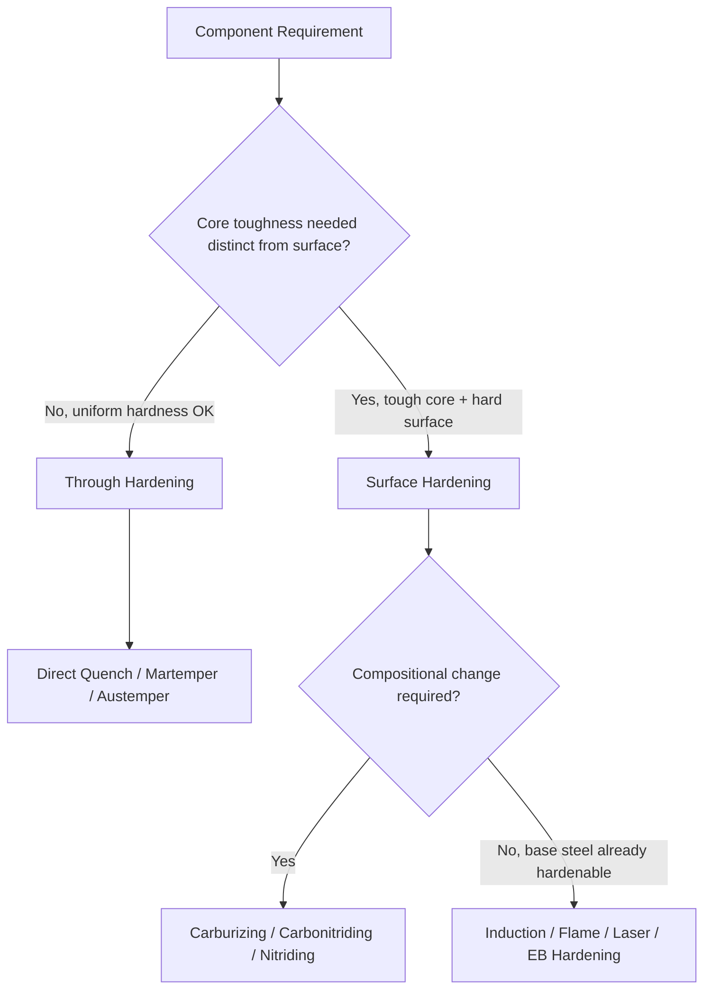

## Surface-Hardening versus Through-Hardening Classification

### Overview

Surface hardening and through hardening represent two fundamental strategies for distributing hardness across a component's cross-section. The choice between them is driven by the service requirement for a hard, wear-resistant surface paired with a tough core (surface hardening) versus a requirement for uniform strength and hardness throughout the section (through hardening). This classification sits above the individual process-level classifications (carburizing, induction hardening, direct quenching, etc.) and frames the engineering decision of *where* hardness is needed, not just *how* it is produced.

### Defining Criteria

**Key Points**

- **Through hardening**: austenitizing and quenching the entire cross-section so that hardness (ideally) approaches uniformity from surface to core, limited only by section-size effects on cooling rate.
- **Surface hardening**: hardening a shallow case (typically 0.1–3 mm, though deeper cases exist) while the core remains at or near its pre-treatment hardness and toughness.
- The dividing line is not the equipment used but the intended hardness gradient: a part can be induction-heated and still be "through-hardened" if the section is thin enough that the whole part reaches the hardening temperature and cools fast enough to fully martensite.

### Through-Hardening Classification

#### Mechanism

The entire part is austenitized above $A_3$/$A_{cm}$ and quenched at a rate exceeding the critical cooling rate throughout the section, governed by the steel's hardenability (Jominy curve behavior) and the section thickness/quench severity (Grossmann H-value).

#### Subtypes

- **Direct through hardening** – single austenitize-and-quench cycle for medium/high-carbon or alloy steels (e.g., 1045, 4140, 5160).
- **Through hardening with martempering/austempering** – same intent (uniform hardness) but using an interrupted quench path to reduce distortion/cracking risk in thicker or geometrically complex sections.

#### Governing Constraint: Section-Size Effect

As section thickness increases, the cooling rate at the core drops below the critical cooling rate even in high-severity media, producing a hardness gradient (mass effect) unless hardenability is increased via alloying. This is the practical limit on how "through" a through-hardening treatment actually is.

$$\text{Ideal Critical Diameter } D_I = f(\text{alloy content, grain size})$$

$D_I$ is the theoretical diameter hardenable to 50% martensite at the center in an ideal (infinite severity) quench; used with Grossmann charts to predict as-quenched hardness at any depth for a given real quench medium [Unverified — chart-based estimates, not exact analytical values].

#### Typical Applications

Fasteners, springs, axles, high-strength structural bar/plate, and any component where fatigue and wear resistance are needed uniformly (e.g., through-hardened bearing races in older/simpler designs).

### Surface-Hardening Classification

Surface hardening subclassifies by whether the case-hardness mechanism relies on **compositional change** (thermochemical diffusion) or **selective heat treatment** of an already through-hardenable composition.

#### A. Thermochemical (Diffusion-Based) Case Hardening

Requires diffusing an element into a low-carbon or low-alloy steel surface, followed by quenching to transform the enriched case (and often core) to martensite:

- **Carburizing** (gas, liquid/salt-bath, pack, vacuum/low-pressure, plasma/ion) – diffuses carbon; case depth and carbon gradient controlled by time/temperature/carbon potential.
- **Carbonitriding** – diffuses carbon and nitrogen simultaneously; lower distortion, shallower case than carburizing.
- **Nitriding** (gas, salt-bath, plasma/ion) – diffuses nitrogen only, at sub-critical temperature; no subsequent quench-hardening transformation is required since hardening comes from nitride precipitation, yielding minimal distortion.
- **Nitrocarburizing** – primarily nitrogen with some carbon, aimed at wear/fatigue/corrosion resistance rather than deep case hardness.

#### B. Selective Heat-Treatment (Transformation-Based) Case Hardening

Uses a steel already capable of through hardening (sufficient carbon content, ~0.4–0.6% C typical) but heats and quenches only the surface layer:

- **Induction hardening** – electromagnetic heating localized by frequency/coil design (higher frequency = shallower case), immediate spray or immersion quench.
- **Flame hardening** – oxy-fuel torch heating, manual or mechanized traverse, followed by quench.
- **Laser hardening** – high-energy-density beam scanning; self-quenching often achieved via conduction into the cold bulk material, no external quenchant needed for thin cases.
- **Electron-beam hardening** – vacuum-chamber process, similar self-quench behavior to laser hardening, very precise energy control.

### Comparative Classification Table

| Criterion | Through Hardening | Surface Hardening |
| --- | --- | --- |
| Core hardness/toughness | Same as case (uniform) | Core remains tough/ductile |
| Base steel carbon content | Medium-high (0.3–0.6%+ C) | Often low carbon (0.1–0.25% C) for carburizing; medium carbon for induction/flame |
| Distortion risk | Higher on thick/complex sections | Generally lower (especially nitriding, laser) |
| Fatigue performance | Governed by uniform properties | Compressive residual surface stress often improves fatigue life |
| Typical case depth | N/A (whole section) | 0.1–3+ mm depending on method |
| Equipment complexity | Simple (furnace + quench tank) | Ranges from simple (flame) to complex (vacuum carburizing, laser) |
| Representative parts | Bolts, springs, axles | Gear teeth, camshafts, crankshaft journals, cutting tools |

### Engineering Selection Logic

**Key Points**

1. **Load type**: predominantly surface-contact/wear loading (gear teeth, bearing surfaces) favors surface hardening; uniform tensile/bending loading through the full section favors through hardening.
2. **Fatigue requirement**: surface hardening's compressive residual stress at the case-core interface generally improves resistance to fatigue crack initiation at the surface [Inference: magnitude depends on case depth, core hardness, and residual stress profile].
3. **Section thickness**: thick sections may make full-section through hardening impractical without alloy hardenability increases, naturally steering design toward case hardening.
4. **Distortion tolerance**: precision components with tight dimensional tolerances often favor nitriding or laser hardening over quench-intensive through hardening or carburizing.
5. **Cost and volume**: through hardening is generally simpler and cheaper for parts that don't need a soft/tough core; diffusion case hardening (carburizing) involves longer cycle times and additional furnace atmosphere control.

### Example

**Through-hardened case**: A 5160 spring steel leaf spring is austenitized and oil-quenched across its full thickness, then tempered to a uniform 45–50 HRC, since the entire section must flex elastically and resist fatigue uniformly.

**Surface-hardened case**: An 8620 low-carbon steel gear is gas-carburized to a 0.020 in (≈0.5 mm) case depth, quenched to produce ~60 HRC at the tooth surface, and tempered lightly, while the core remains at ~30–35 HRC for impact resistance at the tooth root.

### Illustration: Hardness Gradient Comparison (svg_diagram)

<svg xmlns="http://www.w3.org/2000/svg" viewBox="0 0 640 320">
<rect width="640" height="320" fill="#ffffff" />
<text x="320" y="24" font-size="16" text-anchor="middle" font-family="sans-serif" font-weight="bold">Hardness vs. Depth: Through vs. Surface Hardened (svg_diagram)</text>
<line x1="60" y1="280" x2="600" y2="280" stroke="black" stroke-width="2" />
<line x1="60" y1="280" x2="60" y2="50" stroke="black" stroke-width="2" />
<text x="330" y="305" font-size="13" text-anchor="middle" font-family="sans-serif">Depth from Surface</text>
<text x="25" y="165" font-size="13" text-anchor="middle" font-family="sans-serif" transform="rotate(-90 25 165)">Hardness</text>
<path d="M70,90 L590,95" fill="none" stroke="#2c7a2c" stroke-width="3" />
<text x="450" y="80" font-size="12" fill="#2c7a2c" font-family="sans-serif">Through-Hardened (uniform)</text>
<path d="M70,70 C200,90 260,220 350,235 L590,238" fill="none" stroke="#c0392b" stroke-width="3" />
<text x="380" y="255" font-size="12" fill="#c0392b" font-family="sans-serif">Surface-Hardened (case-to-core gradient)</text>
</svg>

**Related Topics**

- Hardening and quenching classification
- Tempering and stress-relief classification
- Hardenability and the Jominy end-quench test
- Case-depth measurement standards and effective case depth definitions
- Residual stress profiles and fatigue life in case-hardened components
- Alloy selection for through-hardenable vs. case-hardening grades