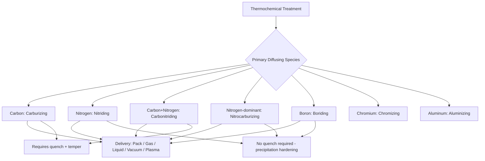

## Thermochemical Treatment Classification

### Overview

Thermochemical treatment refers to the family of heat-treatment processes that alter surface (and sometimes near-surface) composition by diffusing one or more elements into a metal's surface at elevated temperature, changing local chemistry to produce a hardened, wear-resistant, or corrosion-resistant case. Unlike purely thermal treatments (hardening, tempering) that act on a fixed composition, thermochemical treatments combine diffusion metallurgy with subsequent (or concurrent) phase transformation, and are classified primarily by the diffusing species and secondarily by the atmosphere/medium delivering that species.

### Classification by Diffusing Element

#### 1. Carburizing (Carbon Diffusion)

Diffuses carbon into low-carbon steel surfaces (typically from ~0.1–0.25% C base to 0.8–1.0% C case), performed at 850–950°C in the austenite phase field, followed by quenching to transform the enriched case to martensite.

#### 2. Nitriding (Nitrogen Diffusion)

Diffuses nitrogen into steel at 500–550°C, below $A_1$, forming hard iron and alloy nitrides (Fe₄N, Fe₂-₃N, and alloy nitrides such as AlN, CrN, VN in nitriding-grade steels). No subsequent quench-hardening transformation occurs; hardness derives directly from nitride precipitation.

#### 3. Carbonitriding (Carbon + Nitrogen Diffusion)

Simultaneous diffusion of carbon and nitrogen in a gaseous atmosphere (typically 700–900°C, lower than pure carburizing), followed by quench. Nitrogen addition increases hardenability, allowing case hardening of lower-hardenability steels and enabling oil quenching instead of water.

#### 4. Nitrocarburizing (Nitrogen-Dominant + Carbon)

Primarily nitrogen diffusion with minor carbon, performed near or just below 570°C (often in the ferrite phase field, avoiding austenitization). Produces a thin compound (white) layer plus a diffusion zone, targeting wear/fatigue/corrosion improvement rather than deep hardening.

#### 5. Boriding (Boronizing)

Diffuses boron into the surface (typically 800–1050°C) to form extremely hard iron borides (FeB, Fe₂B), producing surface hardness often exceeding 1500–2000 HV, well above carburized or nitrided cases. Used for severe abrasive wear applications.

#### 6. Chromizing

Diffuses chromium into the surface (via pack cementation, gas, or salt-bath methods) to improve corrosion and oxidation resistance, and secondarily wear resistance via chromium carbide formation, at temperatures typically 900–1100°C.

#### 7. Siliconizing (Ihrigizing)

Diffuses silicon into ferrous surfaces to enhance corrosion and abrasion resistance, historically used for pump and valve components in corrosive service; less common in current industrial practice than carburizing/nitriding [Unverified — regional/industry usage varies].

#### 8. Aluminizing (Calorizing)

Diffuses aluminum into the surface (commonly on steels and superalloys) primarily to improve high-temperature oxidation resistance by forming a protective alumina scale, rather than for hardness.

### Classification by Process/Delivery Medium

Within most of the above diffusion categories, the delivery method further subclassifies the process:

| Medium | Description | Common Application |
| --- | --- | --- |
| Pack (solid) cementation | Part packed in solid diffusant compound + energizer, sealed in a container, heated | Carburizing, chromizing, boriding (traditional/legacy method) |
| Gas | Diffusant delivered via controlled furnace atmosphere (e.g., endothermic gas + hydrocarbon enrichment for carburizing, NH₃ for nitriding) | Gas carburizing, gas nitriding, gas nitrocarburizing — dominant modern industrial method |
| Liquid (salt bath) | Diffusant dissolved/suspended in molten salt bath | Salt-bath (liquid) carburizing, nitriding, nitrocarburizing (e.g., Tenifer/Tufftride-type processes) |
| Vacuum / Low-Pressure | Diffusant gas introduced in a vacuum furnace at sub-atmospheric pressure, often combined with high-pressure gas quenching | Vacuum carburizing (LPC), vacuum nitriding |
| Plasma / Ion | Diffusant ionized via glow-discharge plasma, ions accelerated to the part surface | Plasma (ion) nitriding, plasma carburizing — precise case control, lower distortion, environmentally cleaner than salt baths |

### Case Formation Mechanism

**Key Points**

- Diffusion follows Fick's laws; case depth scales approximately with the square root of time at a given temperature:

$$x \approx k\sqrt{Dt}$$

where $x$ is case depth, $D$ is the temperature-dependent diffusion coefficient, and $t$ is time. This is the standard diffusion-controlled case-growth relationship [Unverified for exact proportionality constant $k$, which depends on process specifics and case-depth definition used].

- Higher temperature increases $D$ (diffusion coefficient) exponentially (Arrhenius relationship), so small temperature increases yield significant case-depth/time reductions, at the cost of grain growth risk and increased distortion.
- Case hardness profile after diffusion + hardening typically shows a gradual, continuous gradient from case to core (contrast with the more geometrically localized hardness zone in induction/flame hardening).

### Post-Diffusion Treatment Requirement

Most carbon-based thermochemical treatments (carburizing, carbonitriding) require a subsequent quench (direct or reheat-and-quench) to transform the carbon-enriched austenite into martensite, followed by tempering. Nitriding-family processes (nitriding, nitrocarburizing, boriding) generally do not require post-treatment quenching, since hardness arises from precipitation/compound formation rather than martensitic transformation — this is a key classification distinction with implications for distortion control.

### Comparative Summary

| Process | Temp Range | Post-Treatment Quench | Typical Case Hardness | Primary Goal |
| --- | --- | --- | --- | --- |
| Carburizing | 850–950°C | Required | 58–64 HRC | Wear + fatigue resistance |
| Carbonitriding | 700–900°C | Required (often oil) | 55–62 HRC | Wear resistance, lower-hardenability steels |
| Nitriding | 500–550°C | Not required | Up to ~70 HRC (nitride-dependent) | Wear, fatigue, minimal distortion |
| Nitrocarburizing | ~550–570°C | Not required | Moderate (compound layer dependent) | Wear + mild corrosion resistance |
| Boriding | 800–1050°C | Process-dependent | 1500–2000+ HV | Severe abrasive wear resistance |
| Chromizing | 900–1100°C | Not primary goal | Moderate (carbide-dependent) | Corrosion/oxidation resistance |
| Aluminizing | 800–1000°C | Not applicable | N/A (not hardness-driven) | High-temperature oxidation resistance |

### Example

A low-carbon 8620 steel automotive gear requiring both a hard, wear-resistant tooth surface and a tough core is gas-carburized at 925°C for several hours to reach a 0.030 in case depth, oil-quenched to transform the case to martensite, and tempered at 175°C. In contrast, a nitriding-steel (e.g., Nitralloy 135) crankshaft is gas-nitrided at 525°C for an extended cycle to build a thin, extremely hard nitride case directly, without any subsequent quench, minimizing distortion on the finished-machined part.

**Related Topics**

- Surface-hardening versus through-hardening classification
- Hardening and quenching classification
- Case-depth measurement and specification standards
- Diffusion kinetics and Fick's second law in metallurgical processing
- White-layer formation and control in nitrocarburizing
- Distortion control strategies in carburized vs. nitrided components