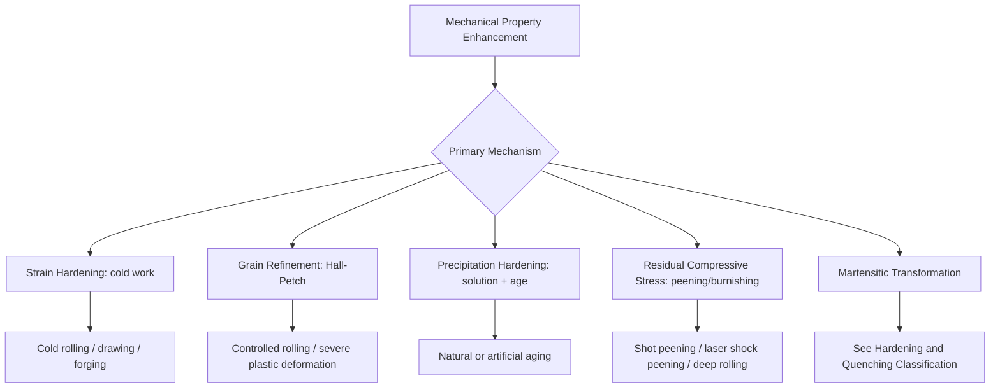

## Mechanical Property-Enhancement Classification

### Overview

Mechanical property-enhancement processes improve strength, hardness, fatigue resistance, or ductility through mechanisms other than (or in addition to) thermal phase transformation — primarily by introducing controlled plastic deformation, dislocation structures, residual stresses, or microstructural refinement via mechanical work rather than solely by heating and cooling. This classification sits alongside thermal hardening/quenching and thermochemical treatment as the third major branch of property-enhancing processes, and is organized by the underlying strengthening mechanism exploited.

### Classification by Strengthening Mechanism

#### 1. Strain (Work) Hardening

Plastic deformation at temperatures below the recrystallization temperature increases dislocation density, impeding further dislocation motion and raising yield strength and hardness at the cost of ductility.

$$\sigma_y = \sigma_0 + K\varepsilon^n$$

This is the standard Hollomon strain-hardening relationship relating flow stress to plastic strain, with $K$ the strength coefficient and $n$ the strain-hardening exponent [Unverified for exact exponent values, which are alloy- and temper-dependent].

- **Cold rolling / cold drawing** – reduces cross-section while increasing strength/hardness; used for wire, sheet, tube.
- **Cold forging / cold heading** – near-net-shape forming with simultaneous strengthening, common for fasteners.
- **Shot peening** (see below) – localized surface strain hardening combined with residual compressive stress.

#### 2. Grain Refinement Strengthening

Reducing grain size increases yield strength per the Hall-Petch relationship:

$$\sigma_y = \sigma_0 + \frac{k_y}{\sqrt{d}}$$

where $d$ is average grain diameter. Achieved via controlled thermomechanical processing (e.g., controlled rolling with recrystallization control, severe plastic deformation techniques such as equal-channel angular pressing).

#### 3. Precipitation (Age) Hardening

Solution treatment followed by controlled aging causes fine, coherent/semi-coherent precipitates to form, impeding dislocation motion. Distinct from carbide-based case hardening in that it typically applies to non-ferrous alloys (Al, Ni, Ti, Cu-Be) as well as certain precipitation-hardening (PH) stainless steels.

- **Natural aging** – precipitation at room temperature over time (e.g., some Al-Cu alloys).
- **Artificial aging** – elevated-temperature aging to accelerate and control precipitate size/distribution (e.g., T6 temper in aluminum alloys).

#### 4. Residual Compressive Stress Induction (Surface Mechanical Treatment)

Mechanically inducing a compressive residual stress layer at the surface improves fatigue life by opposing crack-initiating tensile stresses in service.

- **Shot peening** – bombarding the surface with media (steel, ceramic, glass beads) to plastically deform a thin surface layer, inducing compressive residual stress; widely used on springs, gears, and aerospace components.
- **Laser shock peening (LSP)** – high-energy laser pulses generate shock waves producing deeper compressive residual stress layers than conventional shot peening, used in high-value aerospace/turbine applications.
- **Deep rolling / roller burnishing** – a hardened roller applies localized pressure to plastically deform and smooth the surface, combining work hardening, compressive stress induction, and improved surface finish.
- **Low plasticity burnishing (LPB)** – controlled, single-pass burnishing producing deep, stable compressive residual stress with minimal cold work, aimed at retaining stress stability at elevated temperature/cyclic load.

#### 5. Martensitic (Transformation) Hardening

Covered in depth under hardening and quenching classification; included here as a mechanism category since the strengthening arises from a diffusionless phase transformation rather than mechanical work.

#### 6. Solid-Solution Strengthening

Alloying elements dissolved in the base lattice (substitutional or interstitial) distort the lattice and impede dislocation motion. This is primarily a compositional design choice rather than a discrete "process" step, but is often listed alongside process-based mechanisms since certain thermal treatments (solutionizing) are required to achieve it in a controlled state prior to aging.

### Classification by Application Method

| Method Category | Representative Processes | Primary Mechanism |
| --- | --- | --- |
| Bulk deformation | Cold rolling, cold drawing, cold forging | Strain hardening |
| Surface mechanical treatment | Shot peening, laser shock peening, deep rolling, LPB | Compressive residual stress + localized strain hardening |
| Thermal + deformation combined | Thermomechanical processing (controlled rolling), ausforming | Grain refinement + transformation strengthening |
| Solution + aging heat treatment | Solution treatment, natural/artificial aging | Precipitation hardening |
| Severe plastic deformation | Equal-channel angular pressing (ECAP), high-pressure torsion | Extreme grain refinement (often into ultrafine/nano-grain regime) |

### Comparative Table: Mechanism vs. Outcome

| Mechanism | Hardness/Strength Gain | Ductility Impact | Typical Materials |
| --- | --- | --- | --- |
| Strain hardening | Moderate-high | Reduced | Low-carbon steel, austenitic stainless, Cu alloys |
| Grain refinement | Moderate | Can improve toughness alongside strength | Fine-grain structural steels, refined castings |
| Precipitation hardening | High | Moderate reduction, tunable via aging | Al 2xxx/6xxx/7xxx series, Ni superalloys, 17-4PH stainless |
| Shot peening / LSP | Fatigue life increase (not bulk hardness) | Minimal bulk ductility impact | Springs, gears, turbine blades, aerospace structures |
| Martensitic transformation | Very high | Significantly reduced (requires tempering) | Medium/high-carbon and alloy steels |

### Process Selection Logic

**Key Points**

1. **Fatigue-critical components** (springs, gears, turbine blades) favor residual-compressive-stress methods (shot peening, LSP, deep rolling) since fatigue cracks typically initiate at the surface.
2. **Bulk strength requirements** with acceptable ductility loss favor strain hardening (wire, tube, fastener stock) or precipitation hardening (aerospace aluminum, superalloys).
3. **Non-ferrous alloys** that cannot undergo martensitic transformation (aluminum, most non-ferrous alloys) rely on solid-solution and precipitation strengthening as primary property-enhancement routes.
4. **Combined approaches** are common in practice: e.g., a carburized and quenched gear (thermochemical + transformation hardening) may also be shot-peened afterward to further improve fatigue life via added compressive stress.

### Example

A 7075-T6 aluminum aircraft wing spar fitting: solution-treated at ~480°C, quenched, then artificially aged at ~120°C to precipitate fine η' (MgZn₂) phases, achieving high strength-to-weight ratio via precipitation hardening — a process route entirely distinct from ferrous quench-hardening since aluminum does not undergo a comparable martensitic transformation.

A helical compression spring made from oil-tempered high-carbon steel wire is shot-peened after coiling and heat treatment to induce surface compressive residual stress, substantially increasing its fatigue life under cyclic loading without changing its bulk hardness.

### Illustration: Strengthening Mechanism Overview (svg_diagram)

<svg xmlns="http://www.w3.org/2000/svg" viewBox="0 0 640 340">
<rect width="640" height="340" fill="#ffffff" />
<text x="320" y="24" font-size="16" text-anchor="middle" font-family="sans-serif" font-weight="bold">Mechanical Property-Enhancement Mechanisms (svg_diagram)</text>
<rect x="40" y="60" width="150" height="70" rx="8" fill="#eef5ee" stroke="#2c7a2c" stroke-width="2" />
<text x="115" y="90" font-size="13" text-anchor="middle" font-family="sans-serif">Strain Hardening</text>
<text x="115" y="110" font-size="11" text-anchor="middle" font-family="sans-serif">(dislocation density)</text>
<rect x="245" y="60" width="150" height="70" rx="8" fill="#eef0f8" stroke="#2c3e78" stroke-width="2" />
<text x="320" y="90" font-size="13" text-anchor="middle" font-family="sans-serif">Grain Refinement</text>
<text x="320" y="110" font-size="11" text-anchor="middle" font-family="sans-serif">(Hall-Petch)</text>
<rect x="450" y="60" width="150" height="70" rx="8" fill="#f8f0e8" stroke="#a5652c" stroke-width="2" />
<text x="525" y="90" font-size="13" text-anchor="middle" font-family="sans-serif">Precipitation</text>
<text x="525" y="110" font-size="11" text-anchor="middle" font-family="sans-serif">(solution + age)</text>
<rect x="140" y="200" width="170" height="70" rx="8" fill="#f8eaea" stroke="#c0392b" stroke-width="2" />
<text x="225" y="230" font-size="13" text-anchor="middle" font-family="sans-serif">Residual Compressive</text>
<text x="225" y="250" font-size="11" text-anchor="middle" font-family="sans-serif">Stress (peening/burnishing)</text>
<rect x="350" y="200" width="170" height="70" rx="8" fill="#f0eaf8" stroke="#6c3ea5" stroke-width="2" />
<text x="435" y="230" font-size="13" text-anchor="middle" font-family="sans-serif">Martensitic</text>
<text x="435" y="250" font-size="11" text-anchor="middle" font-family="sans-serif">Transformation</text>
</svg>

**Related Topics**

- Hardening and quenching classification
- Tempering and stress-relief classification
- Thermochemical treatment classification
- Fatigue life prediction and residual stress profiling
- Precipitation hardening heat-treatment schedules (T4, T6, T7 tempers)
- Severe plastic deformation and ultrafine-grain material processing