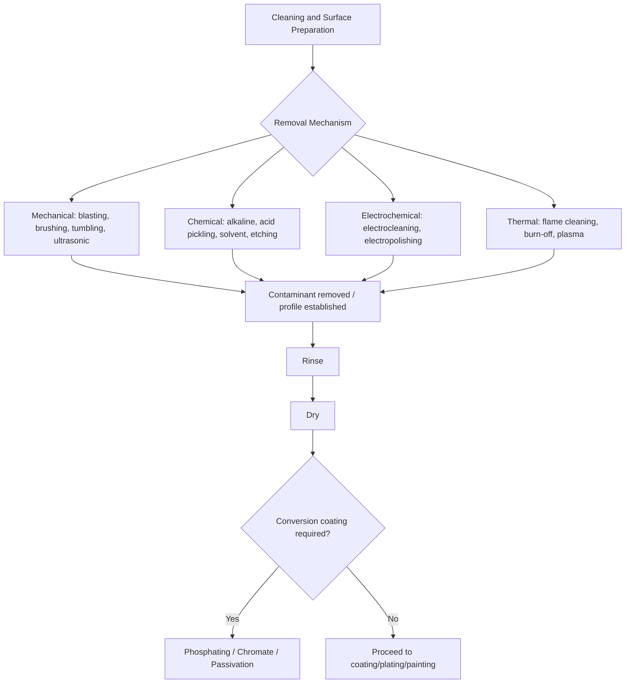

## Cleaning and Surface-Preparation Classification

### Overview

Cleaning and surface preparation encompass the processes applied to a workpiece prior to coating, joining, or finishing to remove contaminants (oils, oxides, scale, particulates) and/or establish a surface profile suitable for adhesion. These processes are classified by removal mechanism — chemical, mechanical, thermal, or electrochemical — and are a prerequisite step that directly governs the success of subsequent coating, plating, painting, welding, or bonding operations.

### Classification by Contaminant/Purpose

**Key Points**

- **Degreasing/Deoiling** – removal of oils, greases, and organic residues from machining, forming, or handling.
- **Descaling** – removal of oxide scale formed during hot working, welding, or heat treatment.
- **Derusting/Rust Removal** – removal of corrosion products from ferrous surfaces.
- **Surface Profiling (Roughening)** – deliberate creation of a controlled surface texture/anchor pattern to promote mechanical interlocking for coatings (paint, thermal spray).
- **Smut/Residue Removal** – removal of loose reaction byproducts left after etching or pickling (e.g., "smut" after aluminum etching).

### Classification by Removal Mechanism

#### 1. Mechanical Cleaning/Preparation

Physical abrasion or impact removes contaminants and/or creates surface profile.

- **Abrasive blasting (grit/sand/shot blasting)** – propelling abrasive media (sand, steel grit, steel shot, garnet, aluminum oxide, glass bead) at the surface via compressed air or centrifugal wheel; classified further by media type and resulting profile (angular grit for aggressive anchor pattern vs. round shot for peening-like smoothing).
- **Wire brushing/power brushing** – mechanical removal of loose scale, rust, or coating using rotary or hand wire brushes.
- **Grinding/sanding** – abrasive material removal for scale, weld spatter, or surface defect removal.
- **Tumbling/vibratory finishing** – bulk mechanical cleaning and deburring of small parts in a rotating or vibrating media-filled barrel.
- **Ultrasonic cleaning** – high-frequency sound waves in a liquid bath create cavitation bubbles that dislodge contaminants, effective for complex geometries and precision parts.
- **Water jetting/hydroblasting** – high-pressure water (with or without abrasive additive) for coating removal and surface preparation, notably in field maintenance of large structures.
- **Dry ice (CO₂) blasting** – sublimating dry ice pellets remove contaminants without secondary media waste or surface abrasion damage.

#### 2. Chemical Cleaning/Preparation

Removal via chemical reaction or dissolution.

- **Alkaline cleaning** – aqueous alkaline solutions (sodium hydroxide, sodium carbonate, surfactant blends) saponify/emulsify oils and greases; widely used as a pre-treatment step before plating or painting.
- **Acid pickling** – acid solutions (hydrochloric, sulfuric, phosphoric, nitric-hydrofluoric for stainless) dissolve oxide scale and rust; common after hot rolling, forging, or welding.
- **Solvent cleaning/degreasing** – organic solvents (mineral spirits, and historically chlorinated solvents such as trichloroethylene in vapor degreasing) dissolve oils and greases; vapor degreasing uses solvent vapor condensation for efficient, uniform cleaning.
- **Etching** – controlled chemical dissolution of the surface to remove a thin layer and/or create a specific microstructural surface profile (e.g., acid etching of aluminum prior to anodizing or bonding).
- **Emulsion cleaning** – combines solvent and aqueous cleaning action via oil-in-water or water-in-oil emulsions.
- **Phosphating/conversion pre-treatment** – while primarily a coating step in its own right, phosphate and chromate conversion coatings are often classified under surface preparation because their principal function is to prepare the surface (adhesion promotion, corrosion inhibition layer) ahead of painting.

#### 3. Electrochemical Cleaning/Preparation

- **Electrocleaning (electrolytic cleaning)** – applies electrical current in an alkaline bath to generate gas at the part surface, mechanically dislodging soils in conjunction with chemical action; classified as anodic, cathodic, or periodic-reverse (PR) cleaning depending on current polarity sequencing.
- **Electropolishing** – anodic dissolution that both cleans and smooths/brightens the surface, often used as a final preparation step for corrosion-sensitive or hygienic applications (e.g., stainless steel for pharmaceutical/food equipment).

#### 4. Thermal Cleaning/Preparation

- **Flame cleaning** – oxy-fuel flame used to burn off organic contaminants and loosen mill scale via differential thermal expansion, historically used on structural steel prior to painting.
- **Burn-off/pyrolysis ovens** – thermal decomposition of organic coatings/residues (paint, plastic) from racks, fixtures, or parts prior to recoating.
- **Plasma cleaning** – low-pressure or atmospheric plasma removes organic contamination at the molecular level and can also activate the surface (increase surface energy) for improved adhesion, widely used in electronics and advanced bonding applications.

### Classification by Process Sequence Role

| Stage | Purpose | Representative Processes |
| --- | --- | --- |
| Pre-cleaning | Bulk removal of heavy soils before primary cleaning | Wipe-down, coarse solvent wipe, initial rinse |
| Primary cleaning | Main contaminant removal | Alkaline cleaning, vapor degreasing, abrasive blasting |
| Surface activation/profiling | Establish anchor pattern or chemical reactivity for coating adhesion | Grit blasting to specified profile, etching, plasma treatment |
| Rinsing | Remove residual cleaning chemistry | DI water rinse, cascade rinse systems |
| Drying | Prevent flash rusting/water spotting before coating | Forced-air drying, oven drying |
| Conversion/passivation | Chemical layer for corrosion resistance and paint adhesion | Phosphating, chromate/chromate-free conversion coating, passivation (stainless steel) |

### Surface Profile Classification (for Coating Adhesion)

**Key Points**

- Surface preparation for coatings (especially thermal spray and heavy-duty paint systems) is frequently specified against standardized visual/roughness references:
  - **SSPC/NACE surface preparation standards** (e.g., SSPC-SP 10/NACE No. 2 "Near-White Blast Cleaning," SSPC-SP 6/NACE No. 3 "Commercial Blast Cleaning") define the acceptable residual contamination level after blast cleaning.
  - **Anchor profile depth** ($R_z$ or similar roughness parameter) is specified in micrometers/mils to match the coating system's adhesion requirements — deeper profiles generally needed for thicker thermal spray coatings, shallower for thin paint films.
- Surface cleanliness for painting is also assessed against ISO 8501 visual standards internationally, paralleling the SSPC system [Unverified — exact standard applicability varies by industry/region and specification called out in the contract/spec].

### Selection Logic

**Key Points**

1. **Substrate sensitivity**: aggressive mechanical blasting may not suit thin-gauge or precision components; ultrasonic or solvent cleaning may be preferred.
2. **Contaminant type**: oils/greases require chemical or solvent-based removal; scale/rust often requires mechanical or acid-based removal.
3. **Downstream process requirement**: electroplating requires a chemically clean, activated surface (often via electrocleaning + acid dip sequence); thermal spray coatings require a specific mechanical anchor profile from grit blasting; painting requires both cleanliness and, often, a conversion coating for adhesion/corrosion resistance.
4. **Environmental/regulatory constraints**: chlorinated solvent vapor degreasing has declined due to environmental and worker-safety regulation, driving adoption of aqueous alkaline cleaning and dry-ice/CO₂ blasting alternatives [Unverified — regulatory status varies by jurisdiction and specific solvent].
5. **Field vs. shop conditions**: large fixed structures (bridges, tanks, pipelines) often require field-portable methods such as abrasive blasting or hydroblasting, versus fully enclosed shop processes like vapor degreasing or electrocleaning for smaller parts.

### Example

A structural steel bridge girder scheduled for a high-performance epoxy/polyurethane coating system is prepared per SSPC-SP 10/NACE No. 2 near-white metal blast cleaning using angular steel grit, achieving a specified 2–4 mil anchor profile, followed by compressed-air dust removal and coating application within the specified recoat window to avoid flash rusting.

A machined aluminum aerospace bracket destined for anodizing is first vapor-degreased to remove cutting fluid residues, then alkaline cleaned, etched in a sodium hydroxide-based etch to remove the natural oxide and establish a uniform micro-etched surface, desmutted in a nitric acid-based solution, and rinsed before entering the anodizing tank.

**Related Topics**

- Thermal spray coating classification
- Electroplating and electrochemical coating classification
- Conversion coating classification (phosphating, chromating, anodizing)
- Paint and organic coating classification
- Surface roughness and profile measurement methods
- Environmental and regulatory considerations in industrial cleaning processes