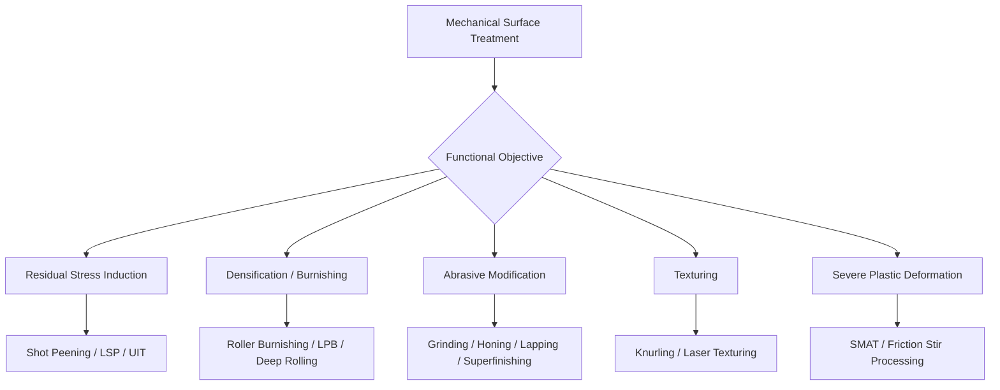

## Mechanical Surface-Treatment Classification

### Overview

Mechanical surface treatment encompasses processes that modify a component's surface layer through applied mechanical force — impact, pressure, or friction — rather than through chemical reaction, diffusion, or coating deposition. These treatments alter surface roughness, induce residual stress, refine near-surface grain structure, or physically remove/redistribute material, and are typically applied as a finishing or property-enhancing step distinct from (but sometimes overlapping with) the cleaning/preparation processes discussed previously. Note the overlap with mechanical property-enhancement classification (Property-Enhancing Process chapter) is intentional: several processes appear in both because the underlying mechanism is mechanical work applied to the surface, but this classification organizes them by *surface treatment function* rather than by strengthening mechanism.

### Classification by Functional Outcome

#### 1. Residual Stress Induction (Fatigue Enhancement)

- **Shot peening** – controlled bombardment with spherical media (cast steel shot, ceramic, glass bead, conditioned cut wire) to plastically deform a thin surface layer and induce compressive residual stress; intensity controlled and verified via Almen strip deflection per SAE J442/J443.
- **Laser shock peening (LSP)** – laser-induced plasma shockwaves produce deeper compressive residual stress than conventional peening, used selectively on high-value fatigue-critical components (turbine blades, fastener holes).
- **Ultrasonic peening/impact treatment (UIT/UP)** – ultrasonically vibrated pins or tips impact the surface, combining grain refinement and compressive stress induction; commonly applied to weld toes to improve fatigue life.
- **Cavitation peening** – water-jet-induced cavitation bubble collapse generates localized shock pressure for peening effect, an alternative to shot/laser peening in certain applications [Unverified — adoption and standardization less mature than shot peening].

#### 2. Surface Densification and Smoothing (Burnishing Family)

- **Roller burnishing** – a hardened roller under controlled force plastically deforms surface asperities, improving surface finish, dimensional precision, and inducing shallow compressive stress; common on shafts, bores, and fillet radii.
- **Ball burnishing** – similar principle using a spherical burnishing tool, suited to smaller features and complex geometries.
- **Low plasticity burnishing (LPB)** – single-pass, tightly controlled process producing deep, thermally stable compressive residual stress with minimal cold work, developed for fatigue-critical aerospace components operating at elevated temperature.
- **Deep rolling** – heavier-force burnishing variant targeting deeper compressive stress profiles, often applied to crankshaft fillets and similar high-cycle-fatigue features.

#### 3. Abrasive Surface Modification

- **Grinding** – controlled material removal via bonded abrasive wheel, also used to establish precise dimensional tolerances and surface finish; can introduce grinding-induced residual stress (tensile if thermal damage/burn occurs, compressive if properly controlled).
- **Honing** – low-velocity abrasive stone process for precision bore finishing (e.g., engine cylinder bores), producing a characteristic cross-hatch pattern that aids lubricant retention.
- **Lapping** – fine abrasive slurry process between the workpiece and a lap plate for extremely tight flatness/surface-finish tolerances (e.g., valve seats, gauge blocks).
- **Superfinishing (microfinishing)** – very fine abrasive stone or tape process removing the disturbed metal layer left by grinding, producing very low roughness ($R_a$ often <0.1 μm) and improving fatigue and wear performance on bearing races, camshafts, crankshaft journals.

#### 4. Mechanical Texturing/Profiling

- **Knurling** – forming a regular diamond or straight-line pattern into a surface via hardened rollers, typically for grip enhancement or press-fit retention rather than fatigue/wear performance.
- **Shot blasting for profile (vs. cleaning)** – when used primarily to establish anchor-pattern roughness for subsequent coating adhesion rather than to clean, this overlaps functionally with the cleaning/preparation chapter but is classified here when profile generation (not contaminant removal) is the stated objective.
- **Laser texturing** – controlled micro-pattern generation (dimples, grooves) on a surface to influence tribological performance (friction, lubricant retention), used in advanced bearing and cylinder-liner applications.

#### 5. Severe Surface Plastic Deformation (Grain Refinement)

- **Surface mechanical attrition treatment (SMAT)** – repeated multidirectional impact (often via vibrating balls) refines surface grain structure down to the nanocrystalline scale, improving hardness and fatigue resistance without changing bulk composition.
- **Friction stir processing (FSP)** – a rotating tool traverses the surface generating severe local plastic deformation and dynamic recrystallization, refining grain structure and homogenizing microstructure (related to, but distinct from, friction stir welding).

### Comparative Classification Table

| Category | Primary Mechanical Action | Primary Benefit | Representative Process |
| --- | --- | --- | --- |
| Residual stress induction | Impact | Fatigue life improvement | Shot peening, LSP, UIT |
| Densification/burnishing | Rolling contact pressure | Surface finish + shallow compressive stress | Roller burnishing, LPB, deep rolling |
| Abrasive modification | Controlled material removal | Dimensional precision, surface finish | Grinding, honing, lapping, superfinishing |
| Texturing | Forming/patterning | Tribological or mechanical-fit function | Knurling, laser texturing |
| Severe plastic deformation | Repeated/traversing high-strain impact or shear | Grain refinement, surface hardness | SMAT, friction stir processing |

### Process Interaction With Other Surface Classifications

**Key Points**

- Mechanical surface treatments are frequently sequenced *after* thermochemical or thermal hardening treatments to further enhance fatigue performance (e.g., shot peening a carburized and ground gear tooth).
- They can also serve as a pre-treatment for coating (blast profiling before thermal spray or paint), placing certain processes at the boundary between this classification and the cleaning/surface-preparation classification — the distinguishing factor is process intent (profile/property generation vs. contaminant removal).
- Grinding and honing, while primarily dimensional/finish operations, must be process-controlled to avoid inducing detrimental tensile residual stress or thermal damage (grinding burn), which can negate benefits gained from prior hardening treatments.

### Example

A gas-carburized and hardened automotive gear (case hardness ~60 HRC) undergoes final grinding to achieve tooth-profile tolerance, followed by shot peening with conditioned cut wire media to Almen intensity 0.010A–0.014A, inducing compressive residual stress at the tooth root fillet to substantially improve bending fatigue life beyond what the carburizing/hardening alone would provide.

An engine crankshaft's main bearing journals are ground to size, then roller-burnished (or deep-rolled at the fillet radii) to improve surface finish, close residual porosity/microcracks from grinding, and induce compressive stress at the fillet — a high-fatigue-risk location — while a separate honing operation finishes the connecting-rod bore surfaces for optimal oil retention.

**Related Topics**

- Mechanical property-enhancement classification
- Cleaning and surface-preparation classification
- Hardening and quenching classification
- Fatigue life analysis and residual stress measurement (X-ray diffraction)
- Thermal spray coating classification (profile requirements)
- Surface roughness parameters ($R_a$, $R_z$) and measurement standards