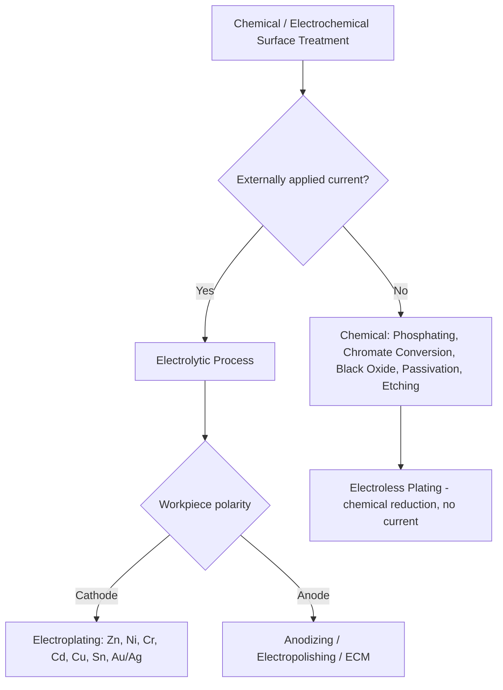

## Chemical and Electrochemical Surface-Treatment Classification

### Overview

Chemical and electrochemical surface treatments modify a workpiece surface through chemical reaction or electrically driven reaction at the solid-liquid interface, rather than through mechanical force or thermal diffusion. These processes are used to build protective/functional layers (conversion coatings, anodic films, electrodeposited metal), remove material selectively (etching, electropolishing), or alter surface chemistry for corrosion resistance, wear resistance, decorative finish, or subsequent coating adhesion. The dividing line between "chemical" and "electrochemical" is the presence or absence of an externally applied electrical current driving the reaction.

### Classification by Reaction-Driving Mechanism

#### A. Purely Chemical (Non-Electrolytic) Treatments

Reactions proceed via direct chemical exchange between the solution and the substrate, without externally applied current.

#### B. Electrochemical (Electrolytic) Treatments

An external current source drives oxidation/reduction reactions at the workpiece (as anode or cathode) in an electrolyte bath, enabling controlled film growth, metal deposition, or material removal at a rate governed by current density and time (Faraday's law).

$$m = \frac{ItM}{nF}$$

where $m$ is mass deposited/dissolved, $I$ is current, $t$ is time, $M$ is molar mass, $n$ is valence, and $F$ is Faraday's constant — the standard governing relationship for electrolytic processes.

### Classification by Functional Category

#### 1. Conversion Coatings (Primarily Chemical)

Chemical reaction between the substrate and a treatment solution converts the outermost surface layer into a new compound, typically for corrosion resistance and/or paint adhesion.

- **Phosphating (Phosphate Conversion Coating)** – zinc, iron, or manganese phosphate solutions react with the steel surface to form a crystalline or amorphous phosphate layer; zinc phosphate is common as a paint base layer (automotive), manganese phosphate for wear/break-in surfaces on machined steel parts (e.g., firearm components, gears).
- **Chromate Conversion Coating** – hexavalent or trivalent chromium-based solutions form a protective chromate film on aluminum, zinc, cadmium, or magnesium surfaces; increasingly replaced by chromate-free (trivalent chromium or non-chromium) alternatives due to hexavalent chromium regulatory restrictions [Unverified — regulatory status and adoption vary by jurisdiction and industry sector].
- **Black oxide (chemical blackening)** – alkaline oxidizing salt bath forms a thin magnetite (Fe₃O₄) layer on steel, providing mild corrosion resistance and a decorative matte black finish; typically finished with an oil or wax sealant.
- **Passivation (stainless steel)** – nitric or citric acid treatment removes free iron contamination from the surface and promotes formation of the protective chromium-oxide passive layer, per standards such as ASTM A967.

#### 2. Etching and Chemical Milling

- **Chemical etching** – controlled acid or alkaline dissolution to remove a thin surface layer, reveal microstructure (metallographic etching), or create a specific texture prior to bonding/coating.
- **Chemical milling (chem-milling)** – masked chemical etching used to remove material from selected areas for weight reduction or contour shaping, historically significant in aerospace skin panel manufacturing.
- **Photochemical machining (PCM)** – photoresist-masked etching to produce precise flat-part geometries (used for fine mesh, lead frames, decorative/functional metal parts).

#### 3. Electroplating (Electrolytic Metal Deposition)

Deposits a metallic coating onto a (typically) conductive substrate via electrolytic reduction of metal ions at the cathode.

- Classified by deposited metal: **zinc plating**, **nickel plating**, **chromium plating** (decorative vs. hard/functional chrome), **cadmium plating**, **copper plating**, **tin plating**, **gold/silver plating** (electronics, decorative).
- Classified by function: **decorative plating** (appearance, thin deposits, often multi-layer e.g., Cu-Ni-Cr), **functional/engineering plating** (wear resistance, hard chrome; corrosion protection, zinc/cadmium; solderability, tin; electrical conductivity, silver/gold).
- **Electroless (autocatalytic) plating** – chemical reduction deposits metal without external current (e.g., electroless nickel), included here due to functional overlap with electroplating despite being purely chemical in mechanism; provides more uniform coating thickness on complex geometries than electrolytic plating.

#### 4. Anodizing (Electrolytic Oxide Film Growth)

Electrochemical oxidation of a (typically) aluminum, titanium, or magnesium substrate, where the part serves as the anode, growing a controlled oxide layer thicker and more durable than the natural passive oxide.

- **Type I (Chromic Acid Anodizing, CAA)** – thin, corrosion-resistant film, minimal dimensional change; historically significant in aerospace but declining due to hexavalent chromium concerns.
- **Type II (Sulfuric Acid Anodizing, SAA)** – most common conventional anodizing, moderate thickness, readily dyeable for decorative/color applications.
- **Type III (Hardcoat/Hard Anodizing)** – thicker, denser oxide layer produced at lower temperature and higher current density, providing significant wear and abrasion resistance.
- **Plasma Electrolytic Oxidation (PEO)/Micro-Arc Oxidation (MAO)** – higher-voltage variant producing a thicker, harder ceramic-like oxide via localized micro-discharge/plasma events at the part surface, applicable to aluminum, magnesium, and titanium; an area of active industrial development [Unverified — process standardization and adoption maturity vary by application].

#### 5. Electropolishing and Electrochemical Machining

- **Electropolishing** – reverse of electroplating; the workpiece is the anode, and controlled anodic dissolution preferentially removes surface peaks, producing a smooth, bright, passivated surface — widely used on stainless steel for pharmaceutical, food, and semiconductor equipment.
- **Electrochemical machining (ECM)** – higher material-removal-rate electrolytic process for shaping hard or complex-geometry parts without mechanical cutting forces or tool wear, used for turbine blades and similarly demanding geometries.
- **Electrochemical deburring/etching for marking** – localized electrolytic removal for deburring edges or producing permanent part marking/identification.

### Comparative Classification Table

| Process Category | Driving Mechanism | Substrate as Anode/Cathode/N-A | Primary Function |
| --- | --- | --- | --- |
| Phosphating | Chemical reaction | N/A | Corrosion resistance, paint base |
| Chromate conversion | Chemical reaction | N/A | Corrosion resistance |
| Black oxide | Chemical reaction | N/A | Mild corrosion resistance, appearance |
| Passivation | Chemical reaction | N/A | Corrosion resistance (stainless) |
| Etching / chem-milling | Chemical reaction | N/A | Material removal, texturing |
| Electroplating | Electrolytic | Cathode | Metal deposition (decorative/functional) |
| Electroless plating | Autocatalytic chemical | N/A | Uniform metal deposition |
| Anodizing | Electrolytic | Anode | Oxide film growth (corrosion/wear/decorative) |
| Electropolishing | Electrolytic | Anode | Smoothing, brightening, passivation |
| Electrochemical machining | Electrolytic | Anode (workpiece) | Precision material removal |

### Selection Logic

**Key Points**

1. **Substrate material** strongly constrains options: anodizing applies to valve metals (Al, Ti, Mg); phosphating/black oxide primarily to ferrous substrates; electroplating spans most conductive substrates.
2. **Function required**: decorative appearance favors thin decorative plating or dyed Type II anodizing; wear resistance favors hard chrome plating or Type III hardcoat anodizing; corrosion resistance favors passivation, chromate/phosphate conversion, or zinc/cadmium plating.
3. **Dimensional tolerance sensitivity**: anodizing and plating both add measurable thickness and can affect tight-tolerance features, requiring masking or post-process allowance.
4. **Environmental/regulatory drivers**: ongoing shift away from hexavalent chromium (chromate conversion, CAA) and cadmium plating toward trivalent chromium, chromate-free conversion coatings, and zinc-nickel or other cadmium alternatives in many industries [Unverified — pace and completeness of transition vary by industry/region].
5. **Geometry complexity**: electroless plating and PEO/MAO can offer more uniform coverage on complex geometries than standard electrolytic processes, which are subject to current-density (throwing power) variation across the part.

### Example

An aluminum aerospace fitting requiring both corrosion protection and dimensional stability is Type II sulfuric acid anodized to build a controlled oxide layer, sealed to close surface porosity, while a separate high-wear aluminum hydraulic component is Type III hardcoat anodized to resist abrasive wear in service.

A steel automotive fastener requiring corrosion protection is zinc-electroplated with a trivalent chromate conversion topcoat (replacing legacy hexavalent chromate) to meet salt-spray corrosion requirements while avoiding hexavalent chromium restrictions.

**Related Topics**

- Cleaning and surface-preparation classification
- Thermochemical treatment classification
- Thermal spray coating classification
- Paint and organic coating classification
- Corrosion resistance testing (salt spray, ASTM B117)
- Environmental regulation of hexavalent chromium and cadmium finishing processes