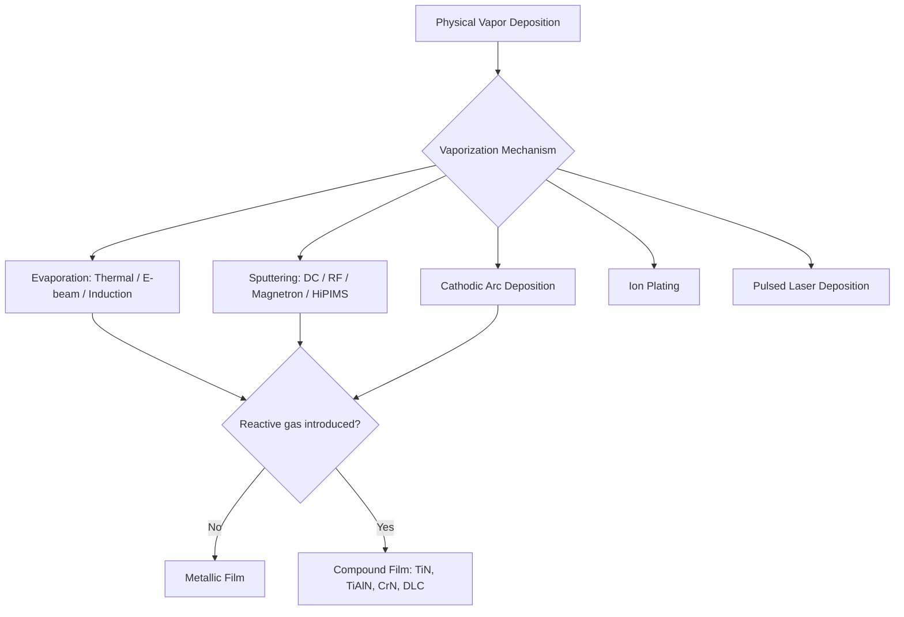

## Physical Vapor Deposition Classification

### Overview

Physical vapor deposition (PVD) encompasses a family of vacuum-based coating processes in which a solid or liquid source material is physically converted into a vapor phase and then condensed onto a substrate to form a thin film, without a chemical reaction being the primary transport mechanism (distinguishing it from chemical vapor deposition, CVD, where the coating forms via a gas-phase chemical reaction at the substrate). PVD processes are classified primarily by the mechanism used to vaporize the source material, and secondarily by the reactive gas environment, resulting film composition, and process configuration.

### Classification by Vaporization Mechanism

#### 1. Vacuum Evaporation

Source material is heated (resistively, by electron beam, or inductively) in a vacuum until it vaporizes, then condenses on the cooler substrate.

- **Resistive (thermal) evaporation** – electrical current through a resistive boat/filament heats the source material; simple, lower cost, limited to materials with manageable melting/vapor points.
- **Electron-beam (E-beam) evaporation** – a focused electron beam heats the source in a water-cooled crucible, enabling evaporation of high-melting-point materials (refractory metals, oxides) with better film purity control.
- **Induction evaporation** – RF induction heating of the source, used for select high-purity or reactive-metal deposition scenarios.

#### 2. Sputtering

Energetic ions (typically argon, generated in a plasma) bombard a target material, ejecting ("sputtering") atoms that then condense on the substrate.

- **DC sputtering** – direct-current plasma applied to a conductive target; simple and widely used for metallic films.
- **RF sputtering** – radio-frequency excitation enables sputtering of non-conductive (insulating/dielectric) targets, which would otherwise charge up and extinguish a DC plasma.
- **Magnetron sputtering** – magnetic field confines electrons near the target surface, increasing plasma density and sputtering (deposition) rate; the dominant industrial sputtering configuration.
- **Reactive sputtering** – a reactive gas (nitrogen, oxygen, or hydrocarbon) is introduced into the chamber to react with sputtered metal atoms in-flight or at the substrate, forming compound coatings (e.g., titanium nitride from a titanium target + N₂).
- **High-power impulse magnetron sputtering (HiPIMS)** – short, high-power pulses generate a highly ionized plasma, producing denser, better-adhered films with improved coverage on complex geometries compared to conventional magnetron sputtering; an area of continuing industrial adoption [Unverified — degree of current industrial penetration relative to conventional magnetron sputtering varies by sector].

#### 3. Arc Vapor Deposition (Cathodic Arc Deposition)

A high-current electric arc struck on the target (cathode) surface generates a highly ionized plasma plume of source-material ions, which condense on the substrate, often with a reactive gas present to form compound coatings.

- **Cathodic arc PVD** – widely used for hard coatings (TiN, TiAlN, CrN, AlCrN) on cutting tools and dies due to high ionization fraction and strong film adhesion; can produce macroparticle defects ("droplets") requiring process control (e.g., filtered arc sources) to minimize.

#### 4. Ion Plating

Combines evaporation (or sputtering) with simultaneous ion bombardment of the growing film (via substrate bias), densifying the coating and improving adhesion; sometimes treated as a hybrid category bridging evaporation/sputtering and plasma-assisted processes rather than a fully distinct mechanism.

#### 5. Pulsed Laser Deposition (PLD)

A high-energy pulsed laser ablates target material, generating a plasma plume that deposits onto the substrate; primarily used in research/specialty applications requiring precise stoichiometry control of complex compound films (e.g., oxide thin films), less common in high-volume industrial coating.

### Classification by Film Chemistry (Reactive vs. Non-Reactive)

| Category | Description | Representative Coating |
| --- | --- | --- |
| Metallic (non-reactive) PVD | Pure metal or alloy transferred without chemical reaction | Al, Cr, Ti decorative/functional metal films |
| Reactive PVD | Reactive gas introduced to form a compound coating | TiN, TiAlN, CrN, AlCrN, TiCN, DLC (with hydrocarbon precursor) |
| Multilayer/nanocomposite PVD | Alternating or co-deposited layers/phases for tailored properties | TiAlN/CrN multilayers, nanocomposite hard coatings |

### Classification by Application Domain

**Key Points**

- **Decorative PVD** – thin, often colored metallic or compound films (TiN gold-tone, ZrN brass-tone) applied to hardware, plumbing fixtures, watch cases, and similar consumer goods for appearance and mild wear/tarnish resistance.
- **Tribological/Hard Coating PVD** – wear-resistant, low-friction, high-hardness coatings (TiN, TiAlN, AlCrN, DLC) applied to cutting tools, forming dies, and precision mechanical components to extend service life and enable higher cutting speeds.
- **Optical PVD** – precisely controlled thin-film stacks (evaporated or sputtered dielectrics/metals) for anti-reflective coatings, mirrors, and optical filters.
- **Electronic/Semiconductor PVD** – sputtered or evaporated metal and barrier layers in integrated circuit and display manufacturing (interconnects, diffusion barriers, transparent conductive oxides such as ITO).
- **Corrosion-Resistant PVD** – functional metallic or compound coatings applied for corrosion protection in select applications, though PVD is less commonly the primary corrosion-protection method compared to electroplating or conversion coatings for bulk corrosion service [Unverified — application-specific and less dominant than plating/conversion coatings for pure corrosion protection].

### Process Comparison

| PVD Method | Ionization Level | Typical Deposition Rate | Line-of-Sight Sensitivity | Common Use |
| --- | --- | --- | --- | --- |
| Thermal evaporation | Low | Moderate-high | High | Simple metallic films, optical coatings |
| E-beam evaporation | Low-moderate | Moderate-high | High | High-purity/high-melting-point films |
| Magnetron sputtering | Moderate | Moderate | Moderate | Widely used general-purpose thin films |
| HiPIMS | High | Lower (pulsed) | Moderate (improved coverage) | Dense, well-adhered hard coatings |
| Cathodic arc | Very high | High | Moderate (droplet issue) | Hard coatings on cutting tools |
| Ion plating | Moderate-high | Moderate | Moderate | Adhesion-critical functional coatings |

### Selection Logic

**Key Points**

1. **Coating hardness/wear requirement**: cathodic arc and magnetron sputtering (often reactive) dominate for hard tool coatings due to high adhesion and controllable compound stoichiometry.
2. **Substrate temperature sensitivity**: PVD generally operates at lower substrate temperatures than CVD, making it favorable for heat-treated tool steels (avoiding re-tempering) and temperature-sensitive substrates.
3. **Geometric complexity**: line-of-sight limitations affect all PVD methods to some degree; complex geometries with deep recesses may see non-uniform coating thickness, requiring part rotation/fixturing strategies or, in severe cases, favoring CVD or ALD (atomic layer deposition) alternatives instead.
4. **Film purity/stoichiometry control**: E-beam evaporation and PLD offer fine control for specialty optical/research applications; reactive magnetron sputtering and cathodic arc are the industrial workhorses for compound hard coatings.
5. **Throughput/cost**: thermal evaporation is generally lower-cost and simpler but less versatile for hard, reactive-compound coatings compared to sputtering or arc PVD systems.

### Example

A carbide end mill requiring extended tool life in high-speed steel-cutting applications is coated via cathodic arc PVD with a TiAlN layer, chosen for its high hardness, oxidation resistance at elevated cutting-edge temperatures, and strong adhesion characteristic of the high ionization fraction in arc deposition.

A decorative faucet handle requiring a durable brass-tone finish is reactively magnetron-sputtered with a thin zirconium nitride (ZrN) coating over a polished stainless steel substrate, providing tarnish resistance and consistent color superior to traditional lacquered brass plating.

**Related Topics**

- Chemical vapor deposition classification
- Thermal spray coating classification
- Chemical and electrochemical surface-treatment classification
- Hard coating tribological performance testing (scratch adhesion, Rockwell C adhesion test)
- Cutting tool coating selection for machining applications
- Thin-film residual stress and adhesion measurement methods