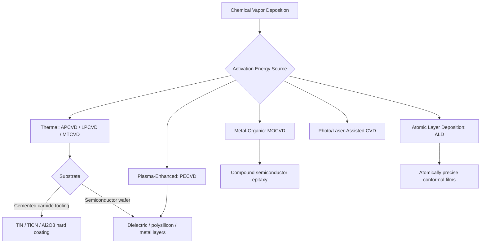

## Chemical Vapor Deposition Classification

### Overview

Chemical vapor deposition (CVD) is a coating process in which gaseous precursor compounds react and/or decompose at or near a heated substrate surface, depositing a solid thin film as a reaction product. Unlike PVD, where material is physically transported from a solid/liquid source to the substrate, CVD relies on a chemical reaction as the film-forming mechanism, typically producing highly conformal coatings capable of coating complex, non-line-of-sight geometries. CVD processes are classified primarily by the energy source driving the reaction, secondarily by operating pressure regime, and further by precursor chemistry and resulting film type.

### Classification by Activation Energy Source

#### 1. Thermal CVD (Conventional/Atmospheric or Low-Pressure)

Reaction driven purely by substrate/chamber heat, typically 800–1100°C for hard-coating applications on tool steels and carbides.

- **Atmospheric Pressure CVD (APCVD)** – reaction occurs near atmospheric pressure; simpler equipment but can suffer from less uniform film thickness and higher precursor consumption.
- **Low-Pressure CVD (LPCVD)** – reduced chamber pressure improves film uniformity and step coverage by increasing precursor mean free path and reducing gas-phase (homogeneous) nucleation in favor of surface reaction; the dominant industrial variant for hard-coating and semiconductor applications.
- **Medium-Temperature CVD (MTCVD)** – process variant operating at intermediate temperatures (~700–900°C) relative to conventional high-temperature CVD, developed to reduce distortion/re-hardening requirements on tool steel substrates while retaining strong coating adhesion.

#### 2. Plasma-Enhanced CVD (PECVD)

A plasma (typically RF or microwave-generated) supplies additional activation energy, allowing the chemical reaction to proceed at substantially lower substrate temperatures than thermal CVD (often 200–400°C), broadening applicability to temperature-sensitive substrates (aluminum alloys, polymers, pre-hardened steels without re-tempering risk).

#### 3. Metal-Organic CVD (MOCVD)

Uses metal-organic precursor compounds (rather than metal halides or hydrides), enabling lower-temperature deposition of compound semiconductors and specialty films; central to compound semiconductor and LED/laser diode epitaxial layer manufacturing.

#### 4. Atomic Layer Deposition (ALD)

A self-limiting, sequential variant of CVD in which precursor gases are pulsed alternately (with purge steps between), each pulse reacting only with available surface sites until saturation, producing highly conformal, atomically precise, thickness-controlled films one atomic layer at a time. Classified as a distinct CVD sub-family due to its unique self-limiting growth mechanism versus continuous-flow conventional CVD.

#### 5. Photo-Assisted / Laser CVD

Ultraviolet light or laser energy drives or localizes the chemical reaction, enabling selective-area deposition or lower thermal budget processing; primarily specialty/research applications rather than high-volume industrial coating [Unverified — degree of industrial-scale adoption relative to thermal/PECVD/ALD].

### Classification by Precursor Chemistry / Film Type

| Precursor Class | Example Reaction Chemistry | Resulting Film |
| --- | --- | --- |
| Metal halide | TiCl₄ + N₂/CH₄ + H₂ → TiN/TiC + HCl | Hard coatings: TiN, TiC, TiCN, Al₂O₃ on cemented carbide tooling |
| Metal-organic | Trimethylgallium + arsine → GaAs | Compound semiconductor epitaxial layers |
| Silane-based | SiH₄ + O₂/N₂O → SiO₂ / Si₃N₄ | Semiconductor dielectric/passivation layers |
| Hydrocarbon | CH₄/C₂H₂ plasma decomposition | Diamond-like carbon (DLC), CVD diamond films |
| Carbonyl | Ni(CO)₄ decomposition | Metallic nickel coatings (Mond process-related chemistry) |

### Classification by Application Domain

**Key Points**

- **Hard-coating CVD (Cemented Carbide Tooling)** – thermal CVD (often MTCVD) applies multilayer TiN/TiCN/Al₂O₃ coatings to tungsten-carbide cutting inserts, exploiting CVD's excellent adhesion and conformal coverage on complex insert geometries; typically thicker (5–15 μm) than comparable PVD hard coatings.
- **Semiconductor CVD** – LPCVD, PECVD, MOCVD, and ALD collectively form the backbone of integrated circuit fabrication: dielectric layers (SiO₂, Si₃N₄), polysilicon, metal interconnect barriers, and compound semiconductor epitaxy.
- **CVD Diamond and DLC Coatings** – hydrocarbon-precursor CVD (often plasma-assisted) deposits polycrystalline diamond or diamond-like carbon films for extreme wear resistance and low friction in specialized tooling and tribological applications.
- **Optical/Barrier Coating CVD** – used for glass coating (e.g., low-emissivity glazing via APCVD) and flexible packaging barrier films.
- **Refractory Metal CVD** – tungsten, molybdenum, and similar refractory metal CVD used for semiconductor interconnects and specialty high-temperature component coatings.

### CVD versus PVD: Key Distinguishing Factors

| Aspect | CVD | PVD |
| --- | --- | --- |
| Mechanism | Gas-phase chemical reaction at surface | Physical vaporization + condensation |
| Typical temperature | Higher (thermal CVD: 800–1100°C; lower for PECVD/ALD) | Lower (generally <500°C) |
| Step coverage / conformality | Excellent, including non-line-of-sight | Line-of-sight limited (improved but not eliminated by advanced sources) |
| Substrate thermal impact | Can require re-hardening/tempering on tool steels at high-temp CVD | Generally compatible with pre-hardened substrates |
| Typical coating thickness (hard coatings) | Thicker (5–15+ μm typical) | Thinner (1–5 μm typical) |
| Equipment complexity/hazard | Precursor gas handling (often toxic/corrosive, e.g., TiCl₄, silane) | Vacuum/plasma equipment, generally less hazardous precursor chemistry |

### Selection Logic

**Key Points**

1. **Substrate temperature tolerance**: thermal CVD's high processing temperature can exceed the tempering temperature of hardened tool steels, requiring post-coating re-hardening; PECVD, ALD, or PVD are preferred when this is unacceptable.
2. **Geometric complexity/non-line-of-sight coverage**: CVD (including ALD) is favored for complex 3D geometries, deep holes, and high-aspect-ratio features (e.g., semiconductor trench/via coating) where PVD's line-of-sight limitation would produce non-uniform coverage.
3. **Film thickness and atomic-level control**: ALD is selected when sub-nanometer thickness control and perfect conformality are required (advanced semiconductor gate dielectrics, barrier layers); conventional thermal CVD suits thicker, less precision-critical hard coatings.
4. **Precursor safety/handling infrastructure**: CVD often requires specialized gas-handling and abatement systems for toxic/pyrophoric/corrosive precursors, a cost and safety factor influencing process selection versus PVD.
5. **Coating-substrate adhesion vs. distortion risk**: CVD hard coatings on carbide tooling benefit from excellent adhesion at high process temperature, appropriate since carbide substrates are not distortion-sensitive in the way hardened steel tooling can be.

### Example

A cemented tungsten-carbide turning insert for steel machining is coated via medium-temperature CVD with a multilayer TiCN/Al₂O₃/TiN structure at ~850–950°C, exploiting CVD's strong adhesion and thick, wear-resistant coating buildup suited to the carbide substrate's high temperature tolerance and complex insert chip-breaker geometry.

A semiconductor gate dielectric requiring precise, sub-nanometer-controlled, fully conformal coverage over a high-aspect-ratio trench structure is deposited via atomic layer deposition (ALD), using sequential self-limiting precursor pulses to build the film one atomic layer at a time, achieving thickness uniformity unattainable with line-of-sight PVD methods.

**Related Topics**

- Physical vapor deposition classification
- Thermal spray coating classification
- Cutting tool coating selection for machining applications
- Semiconductor thin-film fabrication process flow
- Diamond-like carbon (DLC) coating tribological properties
- Coating adhesion and thickness measurement methods