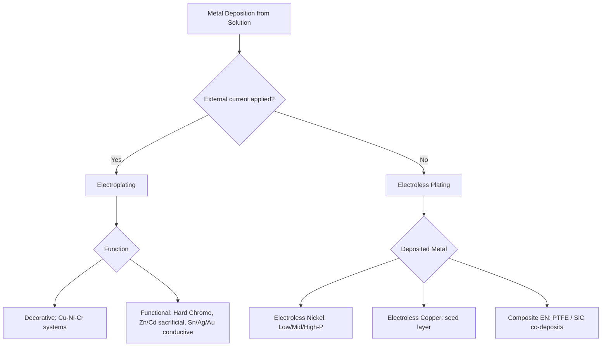

## Electroplating and Electroless Coating Classification

### Overview

Electroplating and electroless coating are both wet-chemical metal deposition processes that build a metallic layer on a substrate from ions in solution, but they differ fundamentally in their driving mechanism: electroplating relies on an externally applied electrical current to reduce metal ions at the cathode (the workpiece), while electroless plating relies on a controlled autocatalytic chemical reduction reaction that proceeds without external current. This classification expands on the electroplating category introduced in the chemical/electrochemical surface-treatment chapter, detailing the deposition chemistry, bath types, and functional coating categories in both families.

### Classification by Driving Mechanism

#### 1. Electroplating (Electrolytic Deposition)

Governed by Faraday's law, with deposition rate proportional to current density and time:

$$m = \frac{ItM}{nF}$$

The workpiece serves as the cathode in an electrolyte bath containing dissolved metal ions; current drives reduction of metal ions onto the workpiece surface. Coating thickness distribution is influenced by current density variation across the part geometry (throwing power), requiring auxiliary anodes, robbers/thieves, or shields for complex shapes.

#### 2. Electroless Plating (Autocatalytic Chemical Deposition)

Metal ions are chemically reduced onto the substrate surface by a reducing agent in solution (e.g., sodium hypophosphite for electroless nickel, formaldehyde for electroless copper), with the substrate surface itself catalyzing continued deposition once initiated. No external current is applied, and deposition rate is governed by bath chemistry, temperature, and catalytic surface activity rather than current density, yielding more uniform thickness on complex/non-conductive geometries.

### Electroplating Classification by Deposited Metal

| Metal | Bath Chemistry (typical) | Primary Function |
| --- | --- | --- |
| Zinc | Acid chloride, alkaline cyanide/non-cyanide | Sacrificial corrosion protection (steel fasteners, automotive parts) |
| Nickel | Watts nickel (nickel sulfate/chloride), sulfamate nickel | Corrosion resistance, decorative base layer, engineering buildup |
| Chromium | Hexavalent (traditional) or trivalent chromium baths | Decorative bright finish (thin) or hard/functional wear coating (thick "hard chrome") |
| Cadmium | Cyanide-based (legacy) | Corrosion protection, especially aerospace fasteners (declining due to toxicity regulation) |
| Copper | Acid sulfate, cyanide (strike) | Conductivity, base layer for subsequent plating (leveling/adhesion) |
| Tin | Acid stannous, alkaline stannate | Solderability, corrosion resistance, food-contact applications |
| Gold | Cyanide or non-cyanide gold baths | Electrical contact conductivity, decorative, bonding applications (electronics) |
| Silver | Cyanide silver baths | Electrical conductivity, antimicrobial, decorative |
| Precious metal alloys (Au-Ni, Pd-Ni) | Specialty alloy baths | Electronic connector durability/wear resistance |

### Electroplating Classification by Function

#### 1. Decorative Plating

Thin, aesthetically finished multilayer systems (commonly copper strike + nickel + thin chromium) applied to consumer hardware, automotive trim, plumbing fixtures; corrosion resistance is a secondary benefit of the underlying nickel layer rather than the primary design driver.

#### 2. Functional/Engineering Plating

- **Hard chromium plating** – thick (often 0.0005–0.020+ in) deposits for wear resistance, low friction, and dimensional restoration (e.g., hydraulic cylinder rods, mold cavities).
- **Sacrificial corrosion-protective plating** – zinc and cadmium coatings that corrode preferentially to protect the underlying steel substrate (galvanic protection), distinct from barrier-type coatings that merely isolate the substrate from the environment.
- **Electroformed components** – electroplating built up to substantial thickness on a mandrel, then separated, to directly form a functional part (e.g., thin-wall nickel shells, mesh screens).
- **Solderable/conductive plating** – tin, silver, or gold plating applied for electrical or soldering functionality in electronic connectors and PCB finishing.

#### 3. Multilayer Composite Systems

Sequential plating of dissimilar metals to combine properties: e.g., copper (leveling/adhesion) + nickel (corrosion barrier) + chromium (wear/tarnish resistance) is the classic automotive/decorative "triple-plate" system; microporous or micro-cracked nickel layers are sometimes specified to distribute corrosion attack and slow substrate penetration.

### Electroless Plating Classification by Deposited Metal/Alloy

- **Electroless nickel (EN)** – nickel-phosphorus (Ni-P) or nickel-boron (Ni-B) alloy deposits, classified by phosphorus content:
  - **Low-phosphorus EN (2–4% P)** – higher hardness as-deposited, better wear resistance.
  - **Mid-phosphorus EN (5–9% P)** – balanced corrosion resistance and hardness, most common general-purpose grade.
  - **High-phosphorus EN (10–13% P)** – best corrosion resistance (amorphous structure), lower as-deposited hardness (can be heat-treated to increase hardness via nickel-phosphide precipitation).
- **Electroless copper** – primarily used as a conductive seed/strike layer for subsequent electroplating on non-conductive substrates (printed circuit board through-hole metallization, plastics).
- **Electroless nickel-PTFE or nickel-SiC composite coatings** – composite electroless deposits co-depositing particulate additives (PTFE for lubricity, SiC or diamond for wear resistance) within the metal matrix.

### Comparative Table: Electroplating vs. Electroless Plating

| Aspect | Electroplating | Electroless Plating |
| --- | --- | --- |
| Driving mechanism | External applied current | Autocatalytic chemical reduction |
| Thickness uniformity | Varies with current density (throwing power) | Generally more uniform, including recesses |
| Substrate conductivity requirement | Requires conductive substrate (or conductive seed layer) | Can plate non-conductive substrates (with catalytic activation) |
| Deposition rate control | Current density and time | Bath chemistry, temperature, time |
| Typical hardness (as-deposited) | Metal-dependent (e.g., hard chrome very high) | EN alloy composition-dependent (higher P = lower as-deposited hardness) |
| Bath complexity/cost | Generally simpler, lower reagent cost | More complex/expensive bath chemistry, tighter control needed |
| Common special capability | Electroforming, selective plating via masking | Uniform coating on complex/blind geometries, plating on plastics |

### Pre-Treatment Dependency

**Key Points**

- Both electroplating and electroless plating depend heavily on the cleaning and surface-preparation sequence (degreasing, acid activation/pickling, and for electroless plating on non-metallics, catalytic seeding typically with a tin-palladium sensitization/activation sequence) — adhesion failures are frequently traced to inadequate pre-treatment rather than plating bath chemistry itself.
- Plating on plastics (e.g., ABS) typically requires a chemical etch step (often chromic acid-based, historically) to create a micro-roughened surface for mechanical adhesion keying prior to electroless copper/nickel strike and subsequent electroplating buildup.

### Selection Logic

**Key Points**

1. **Substrate conductivity**: non-conductive substrates (plastics, ceramics) require electroless plating (with appropriate activation) or an electroless conductive seed layer before electroplating can proceed.
2. **Geometric complexity**: deep recesses, blind holes, and complex internal geometries favor electroless plating's more uniform, current-density-independent deposition.
3. **Wear/hardness requirement**: hard chrome electroplating remains a common choice for extreme wear resistance on cylindrical/rotationally symmetric parts; low-phosphorus electroless nickel is preferred where uniform hardness on complex geometry is required without the throwing-power limitations of plating.
4. **Corrosion environment severity**: high-phosphorus electroless nickel's amorphous structure provides excellent corrosion resistance in aggressive chemical environments, often exceeding comparable electroplated nickel in specific media [Unverified — comparative performance is media- and condition-dependent].
5. **Regulatory/environmental drivers**: ongoing shift from cyanide-based and hexavalent chromium plating baths toward non-cyanide and trivalent chromium chemistries, and from cadmium toward zinc-nickel alloy plating in many sectors [Unverified — adoption pace varies by industry and jurisdiction].

### Example

A hydraulic cylinder rod requiring both wear resistance and corrosion protection is ground to size, then hard chrome electroplated to a controlled thickness, and finish-ground/polished to final dimension — leveraging electroplating's ability to deposit a thick, hard, dense chromium layer suited to a simple cylindrical geometry with good current-density uniformity.

A complex injection-molded valve body with internal cavities requiring uniform corrosion protection is electroless nickel plated (mid-phosphorus grade) after appropriate activation, achieving consistent coating thickness across both external surfaces and internal passages that would show significant thickness variation if conventional electroplating were used due to current-density (throwing power) limitations in the recessed areas.

**Related Topics**

- Chemical and electrochemical surface-treatment classification
- Cleaning and surface-preparation classification
- Physical vapor deposition classification
- Corrosion testing methods for plated coatings (salt spray, ASTM B117)
- Plating thickness measurement (X-ray fluorescence, magnetic/eddy current methods)
- Environmental regulation of cyanide, hexavalent chromium, and cadmium plating processes