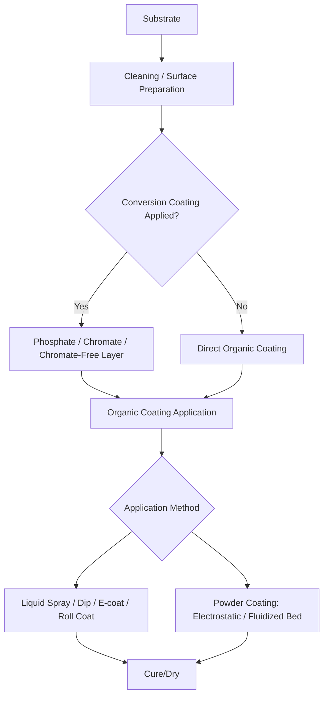

## Organic and Conversion-Coating Classification

### Overview

Organic coatings and conversion coatings represent two distinct but frequently paired coating families. Organic coatings (paints, powder coatings, lacquers, specialty polymer coatings) deposit a distinct polymeric film onto a substrate for corrosion protection, appearance, or functional properties. Conversion coatings, by contrast, chemically transform the substrate's own surface into a new compound layer (rather than depositing a separate film), typically serving as a corrosion-resistant base and adhesion-promoting layer beneath an organic topcoat. This classification treats organic coatings by application method and chemistry, and revisits conversion coatings (introduced under chemical/electrochemical surface treatment) with focus on their role as an organic-coating pretreatment system.

### Organic Coating Classification by Application Method

#### 1. Liquid (Wet) Coating Application

- **Spray application** – conventional air spray, airless spray, HVLP (high-volume low-pressure), and air-assisted airless spray; classified by atomization mechanism and transfer efficiency.
- **Electrostatic spray application** – charged paint particles are attracted to a grounded workpiece, improving transfer efficiency and wrap-around coverage on complex shapes.
- **Dip coating** – part immersed in a liquid coating bath and withdrawn; simple but limited control over film thickness uniformity on complex geometries.
- **Electrocoating (E-coat)** – electrophoretic deposition of charged paint resin particles onto a conductive substrate under applied voltage; classified as **cathodic electrocoat (CED)**, the dominant automotive primer process, and **anodic electrocoat**, an older/less common variant. E-coat provides excellent coverage into recesses and consistent film build due to the self-limiting electrophoretic deposition mechanism (as film builds, its electrical resistance increases, self-limiting further deposition).
- **Roll coating / coil coating** – continuous application onto flat or coiled sheet stock (e.g., pre-painted steel coil for appliances, roofing), enabling high-throughput, consistent-thickness application prior to fabrication.
- **Brush/roller application** – manual, lower-throughput application typically for touch-up, field application, or small-batch work.

#### 2. Powder Coating (Solvent-Free Dry Application)

- **Electrostatic powder spray** – dry polymer powder is electrostatically charged and sprayed onto a grounded part, then cured (fused and cross-linked) in an oven; classified by resin chemistry:
  - **Thermoset powder coatings** (epoxy, polyester, epoxy-polyester hybrid, polyurethane, acrylic) – cross-link permanently during cure, cannot be remelted.
  - **Thermoplastic powder coatings** (nylon, PVC, polyethylene) – melt and flow without chemical cross-linking, can theoretically be remelted; often applied via fluidized-bed dipping rather than electrostatic spray.
- **Fluidized-bed powder coating** – preheated part is dipped into a fluidized bed of powder, which melts on contact and fuses into a continuous film; common for thick, tough thermoplastic coatings (e.g., rebar coating, wire goods).

#### 3. Specialty/Functional Organic Coatings

- **Lacquers** – solvent-based, air-drying (non-cross-linking) organic coatings that dry by solvent evaporation alone; largely superseded by cross-linking systems in many industrial applications but still used for specific decorative/protective niches.
- **Conformal coatings** – thin polymer coatings (acrylic, silicone, urethane, parylene) applied to electronic assemblies for moisture/contaminant protection.
- **Anti-fouling and marine coatings** – specialty organic systems formulated to resist biological fouling in marine service.
- **High-performance protective coatings** – multi-coat systems (zinc-rich primer + epoxy intermediate + polyurethane topcoat) used in severe corrosion service (bridges, offshore structures, chemical plants), often specified per SSPC/NACE coating system standards.

### Organic Coating Classification by Resin Chemistry (Cross-Link Mechanism)

| Resin System | Cure Mechanism | Typical Application |
| --- | --- | --- |
| Alkyd | Oxidative (air) cure | General-purpose industrial/maintenance paint |
| Epoxy | Chemical cross-link (amine/polyamide curing agent) | Corrosion-resistant primers, tank linings, flooring |
| Polyurethane | Chemical cross-link (isocyanate reaction) | UV-resistant, durable topcoats |
| Acrylic | Thermoplastic or thermoset (depending on formulation) | Automotive/decorative topcoats |
| Polyester | Thermoset (heat cure, often powder) | Powder coating for appliances, architectural |
| Vinyl | Thermoplastic (solvent evaporation) | Chemical-resistant tank/pipe linings |

### Conversion Coating Classification (as Organic-Coating Pretreatment)

**Key Points**

Conversion coatings chemically transform the substrate surface, producing a layer that is part of the substrate rather than a separately deposited film, and are frequently specified specifically to promote paint/organic-coating adhesion and add a layer of corrosion protection beneath the organic system.

- **Iron phosphate conversion coating** – lighter-duty phosphate layer, common for general industrial painting where moderate corrosion resistance is acceptable.
- **Zinc phosphate conversion coating** – heavier, more corrosion-resistant crystalline phosphate layer, standard automotive body pretreatment ahead of cathodic electrocoat.
- **Manganese phosphate conversion coating** – typically applied for wear/break-in surface treatment on machined steel components rather than primarily as a paint base, though it also provides a degree of oil-retention corrosion benefit.
- **Chromate conversion coating** (hexavalent/trivalent) – applied on aluminum, zinc, and magnesium substrates for corrosion resistance and paint adhesion; trivalent and chromate-free alternatives increasingly specified due to hexavalent chromium regulatory restriction.
- **Chromate-free / non-chrome conversion coatings** – zirconium-oxide-based and other emerging pretreatment chemistries developed as replacements across automotive and general industrial pretreatment lines [Unverified — degree of full-scale replacement of phosphate/chromate systems varies by industry and specific OEM specification].

### Integrated System: Conversion Coating + Organic Topcoat

Modern industrial and automotive corrosion-protection systems are frequently classified as a layered system rather than a single process:

1. **Cleaning/preparation** (degreasing, surface activation)
2. **Conversion coating** (zinc phosphate or chromate-free equivalent) — corrosion inhibition layer, mechanical/chemical anchor for organic film adhesion
3. **Primer** (often cathodic electrocoat for automotive) — base corrosion-resistant organic layer
4. **Intermediate/basecoat** (as required) — additional corrosion protection, color layer
5. **Topcoat** (polyurethane, acrylic, clearcoat) — UV resistance, final appearance, environmental barrier

### Comparative Summary: Organic Coating vs. Conversion Coating

| Aspect | Organic Coating | Conversion Coating |
| --- | --- | --- |
| Film origin | Separately deposited polymer film | Substrate surface chemically transformed |
| Primary function | Barrier protection, color/appearance, UV resistance | Corrosion inhibition layer + adhesion promotion |
| Typical thickness | Tens to hundreds of micrometers | Sub-micrometer to a few micrometers |
| Applied via | Spray, dip, electrocoat, powder coat | Chemical immersion/spray dip (often inline with cleaning) |
| Stands alone as final finish? | Yes, commonly | Rarely — usually a pretreatment beneath paint |

### Selection Logic

**Key Points**

1. **Corrosion severity and service environment**: high-severity environments (marine, chemical processing) favor multi-coat epoxy/polyurethane systems over phosphate + zinc-rich primer combinations, often specified per SSPC/NACE coating systems.
2. **Substrate material**: chromate/chromate-free conversion coatings apply to aluminum, zinc, magnesium; phosphate conversion coatings apply primarily to ferrous substrates.
3. **Production volume and geometry**: high-volume automotive bodies favor cathodic electrocoat for its recess penetration and consistent film build; low-volume or large fabricated structures often use conventional spray application.
4. **Environmental/VOC regulation**: powder coating and waterborne liquid coatings have gained adoption over solvent-based systems due to volatile organic compound (VOC) emission regulations [Unverified — adoption rate and regulatory stringency vary by jurisdiction and coating category].
5. **Functional requirement beyond corrosion**: conformal coatings for electronics, anti-fouling marine coatings, and wear-oriented manganese phosphate treatments represent specialized selection paths outside general corrosion-protection logic.

### Example

An automotive body-in-white assembly is cleaned, zinc-phosphate conversion coated for corrosion inhibition and paint adhesion, cathodic electrocoat (E-coat) primed for complete recess coverage, then spray-applied with a basecoat/clearcoat polyurethane/acrylic topcoat system for final color and UV/weathering protection — a layered organic + conversion coating system rather than a single process.

An outdoor steel electrical enclosure requiring durable, chip-resistant finish is degreased, iron-phosphate conversion coated, then electrostatically powder coated with a polyester thermoset powder and oven-cured, providing a solvent-free, VOC-compliant, mechanically robust finish suited to high-throughput production.

**Related Topics**

- Chemical and electrochemical surface-treatment classification
- Cleaning and surface-preparation classification
- Thermal spray coating classification
- Corrosion testing methods (salt spray/ASTM B117, cyclic corrosion testing)
- VOC regulation and waterborne/powder coating adoption trends
- SSPC/NACE protective coating system specifications