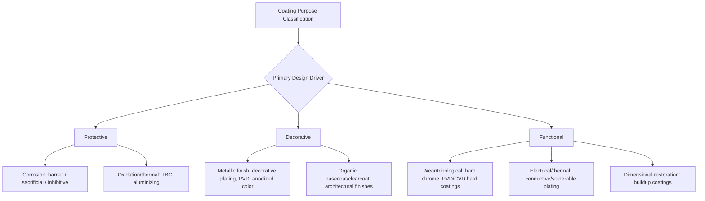

## Classification by Coating Purpose: Protective, Decorative, Functional

### Overview

While earlier classifications in this chapter organized coatings by process family (mechanical, chemical, electrochemical, PVD, CVD, organic), this classification cuts across all of those families by the *intended purpose* of the coating in service. Any given coating process — electroplating, PVD, organic paint, thermal spray — can serve a protective, decorative, or functional role depending on formulation, thickness, and application context. This purpose-based lens is essential for coating selection, since the same base process (e.g., nickel plating) may be specified entirely differently depending on which purpose category drives the requirement.

### Protective Coatings

**Key Points**

Protective coatings exist primarily to prevent or slow degradation of the substrate — corrosion, oxidation, chemical attack, or environmental damage — with appearance and secondary functionality being incidental.

#### Corrosion-Protective Subclassification

- **Barrier protection** – isolates the substrate from the corrosive environment without electrochemical interaction (e.g., most paint/organic coating systems, many PVD/CVD ceramic coatings, chromate/phosphate conversion coatings).
- **Sacrificial (galvanic) protection** – the coating corrodes preferentially to the substrate, actively protecting it even where the coating is locally damaged (e.g., zinc galvanizing and zinc electroplating on steel, zinc-rich primers).
- **Inhibitive protection** – the coating releases or contains corrosion-inhibiting compounds that passivate the substrate or interrupt the corrosion reaction at breaks in the coating (e.g., chromate conversion coatings, some inhibitive primers).

#### Oxidation/High-Temperature Protective Subclassification

- **Aluminide and MCrAlY thermal barrier/oxidation-resistant coatings** – applied to superalloy turbine components to resist high-temperature oxidation and hot corrosion.
- **Aluminizing (calorizing)** – diffusion coating forming a protective alumina-forming surface layer for elevated-temperature service.
- **Thermal barrier coatings (TBCs)** – ceramic (often yttria-stabilized zirconia) top layers over a metallic bond coat, providing thermal insulation to underlying superalloy substrates in gas turbine hot sections.

#### Chemical-Resistant Protective Subclassification

- **Tank and pipe linings** (epoxy, vinyl ester, PTFE, rubber linings) – protect against specific chemical exposure in process industry equipment.
- **Passivation layers** (stainless steel passivation, chromate conversion) – promote or reinforce a naturally protective oxide layer.

### Decorative Coatings

**Key Points**

Decorative coatings exist primarily to control appearance — color, gloss, texture, reflectivity — with corrosion or wear resistance being a secondary or incidental benefit rather than the design driver.

#### Metallic-Finish Decorative Subclassification

- **Decorative electroplating** – thin chrome-over-nickel-over-copper systems on automotive trim, plumbing fixtures, and consumer hardware.
- **Decorative PVD** – thin colored compound films (TiN gold-tone, ZrN brass-tone, colored chromium nitrides) on hardware, watch cases, architectural fittings.
- **Anodized color finishes** – dyed Type II anodizing on aluminum architectural and consumer products, exploiting the porous oxide structure's dye-absorption capability before sealing.

#### Organic Decorative Subclassification

- **Automotive basecoat/clearcoat systems** – color layer plus a protective clear topcoat for gloss and UV protection.
- **Architectural and furniture coatings** – lacquers, varnishes, and pigmented paints selected primarily for appearance, texture, and finish quality.
- **Specialty decorative effects** – textured powder coatings, metallic-flake finishes, faux-finish techniques.

#### Distinguishing Note

Many decorative systems retain meaningful protective value as a secondary effect (e.g., the nickel underlayer in decorative chrome plating provides real corrosion resistance), which is why coating specifications often explicitly state whether appearance or protection is the governing requirement, since this affects acceptance criteria (visual defects vs. corrosion test performance).

### Functional Coatings

**Key Points**

Functional coatings exist to impart or modify a specific engineering property beyond simple protection or appearance — wear resistance, friction control, electrical/thermal conductivity, biocompatibility, or dimensional restoration.

#### Wear and Tribological Functional Subclassification

- **Hard chromium plating** – wear resistance and low friction on hydraulic rods, mold components.
- **PVD/CVD hard coatings** (TiN, TiAlN, CrN, DLC) – cutting tool and die wear resistance, friction reduction.
- **Thermal spray wear coatings** (tungsten carbide-cobalt, chromium oxide) – abrasion and erosion resistance on industrial components.
- **Boriding/nitriding** – case hardness for wear resistance without dimensional buildup concerns typical of thicker coatings.

#### Electrical/Thermal Functional Subclassification

- **Conductive plating** (silver, gold, tin) – electrical contact performance in connectors, busbars.
- **Solderable coatings** (tin, tin-lead alloy where still permitted) – enabling reliable soldered joints in electronics assembly.
- **Thermal barrier coatings** – covered under protective above but also functionally enable higher operating temperatures/efficiency in turbine engines, illustrating overlap between purpose categories.
- **Electrically insulating coatings** (anodized dielectric layers, certain ceramic/polymer coatings) – used in motor windings, electronic assemblies.

#### Dimensional Restoration / Engineering Functional Subclassification

- **Hard chrome or thermal spray buildup** – restoring worn dimensions on shafts, rolls, and machine components during repair/remanufacturing.
- **Electroformed components** – coatings built to substantial thickness to function as the finished part itself.

#### Tribological Friction-Modification Subclassification

- **DLC (diamond-like carbon) coatings** – low-friction, wear-resistant coatings on engine components, tooling, and precision mechanical parts.
- **PTFE-impregnated or composite coatings** (electroless nickel-PTFE, fluoropolymer coatings) – reduce friction and prevent galling/seizing.

#### Biological/Medical Functional Subclassification

- **Hydroxyapatite coatings** on orthopedic implants – promote bone in-growth (osseointegration).
- **Antimicrobial coatings** (silver-based) – reduce microbial colonization on medical devices and high-touch surfaces.

### Cross-Reference Table: Purpose vs. Process Family

| Purpose | Common Process Families Used | Representative Example |
| --- | --- | --- |
| Protective (corrosion) | Electroplating (Zn, Cd), conversion coating, organic coating, thermal spray | Zinc-phosphate + E-coat + topcoat automotive body |
| Protective (oxidation/thermal) | Diffusion coating, thermal spray, PVD/CVD ceramic | MCrAlY bond coat + YSZ thermal barrier coating |
| Decorative | Electroplating, PVD, anodizing, organic coating | Cu-Ni-Cr decorative plate, TiN gold-tone PVD |
| Functional (wear) | Hard chrome plating, PVD/CVD hard coatings, thermal spray, boriding | TiAlN-coated cutting tool, hard chrome hydraulic rod |
| Functional (electrical) | Electroplating (Ag, Au, Sn) | Gold-plated electronic connector |
| Functional (dimensional) | Hard chrome, thermal spray | Worn shaft build-up and re-machining |

### Multi-Purpose System Recognition

**Key Points**

Real coating specifications frequently target more than one purpose simultaneously, and classification by purpose helps clarify which requirement is primary for acceptance testing:

- A **decorative chrome-plated automotive bumper** is specified primarily for appearance, but must also pass corrosion (salt-spray) testing — protective performance is a secondary but still binding requirement.
- A **thermal barrier coating on a turbine blade** is simultaneously protective (oxidation resistance) and functional (enables higher operating temperature, improving efficiency) — the two purposes are inseparable in this application.
- A **hard-chrome-plated hydraulic rod** is functional (wear/friction) first, with corrosion resistance as a secondary benefit; specification acceptance criteria (surface finish, hardness, thickness) reflect the functional emphasis over decorative appearance.

### Example

A stainless steel surgical implant screw requires a functional coating (hydroxyapatite for osseointegration) as the primary purpose, with corrosion resistance from the underlying passivated stainless steel substrate serving as an essential but secondary protective requirement — illustrating how purpose classification clarifies which property governs the specification and acceptance testing hierarchy.

A chrome-plated kitchen faucet is specified first as a decorative coating (bright, tarnish-free appearance) but must simultaneously pass ASTM B117 salt-spray corrosion testing as a protective requirement, since the underlying nickel-chrome system provides genuine barrier and (for nickel) sacrificial-adjacent protection even though appearance drives the initial coating selection.

**Related Topics**

- Organic and conversion-coating classification
- Electroplating and electroless coating classification
- Physical vapor deposition classification
- Thermal spray coating classification
- Corrosion testing standards (ASTM B117 salt spray, cyclic corrosion testing)
- Coating specification and acceptance criteria development