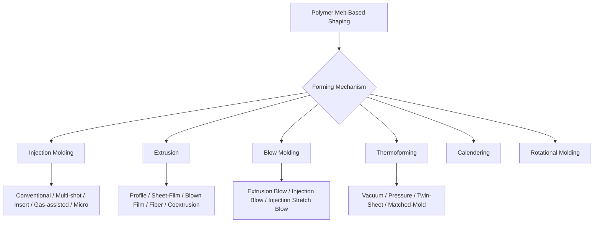

## Polymer Melt-Based Shaping-Process Classification

### Overview

Polymer melt-based shaping processes form thermoplastic polymers into final or near-final geometries by heating the material above its melting point (semi-crystalline polymers) or above its glass transition temperature into a flowable state (amorphous polymers), forcing or forming it into a shape, and then cooling it to solidify. These processes are classified primarily by the mechanism used to move and shape the molten polymer — pressure-driven flow into a mold, continuous extrusion through a die, or stretching/forming of a heated sheet or preform — distinguishing them from solid-state, solution-based, or reaction-based polymer processing routes covered elsewhere in this chapter.

### Classification by Forming Mechanism

#### 1. Injection Molding

Molten polymer is injected under high pressure into a closed, precision-machined mold cavity, packed to compensate for shrinkage, then cooled and ejected as a near-net-shape part.

- **Conventional injection molding** – single-material, single-cavity or multi-cavity molds for general thermoplastic parts.
- **Multi-shot / overmolding** – sequential injection of different materials or colors into the same mold to produce multi-material parts (e.g., soft-touch grips over rigid substrates).
- **Insert molding** – pre-placed metal or other inserts are encapsulated by the injected polymer.
- **Gas-assisted injection molding** – pressurized gas is injected into the melt stream to hollow out thick sections, reducing material use and cycle time while controlling sink marks.
- **Micro-injection molding** – specialized process for very small, high-precision parts (medical devices, micro-connectors), requiring tight control of shot volume and mold venting.
- **Reaction injection molding (RIM)** – reactive liquid monomers/prepolymers (not a pre-formed thermoplastic melt) are mixed and injected into a mold where polymerization occurs in-mold; included here due to process/equipment similarity though the underlying chemistry differs from thermoplastic melt processing.

#### 2. Extrusion

Molten polymer is continuously forced through a shaped die by a rotating screw (single or twin-screw extruder), producing a continuous profile that is then cooled/sized.

- **Profile extrusion** – continuous constant-cross-section shapes (pipe, tubing, window/door profiles, structural shapes).
- **Sheet/film extrusion** – flat die produces continuous sheet or film, often followed by calendering rolls for thickness control and surface finish.
- **Blown film extrusion** – molten polymer is extruded through an annular die and inflated with internal air pressure into a thin-walled tube (bubble), used for plastic bags, packaging film.
- **Fiber/filament extrusion (melt spinning)** – polymer melt is extruded through fine die orifices (spinnerets) and drawn into continuous fibers for textile or technical fiber applications.
- **Coextrusion** – multiple extruders feed a single die simultaneously to produce multi-layer profiles/films/sheets with layered material properties (e.g., barrier layers in food packaging film).
- **Extrusion coating/lamination** – molten polymer is extruded directly onto a substrate (paper, foil, fabric) to form a coated or laminated composite structure.

#### 3. Blow Molding

Combines extrusion or injection molding of a preform with inflation to form hollow parts.

- **Extrusion blow molding (EBM)** – a continuously extruded tube (parison) is captured in a mold and inflated with air to conform to the mold cavity; common for bottles, containers, automotive ducting.
- **Injection blow molding (IBM)** – an injection-molded preform is transferred to a blow mold and inflated; offers better dimensional control of the neck/finish area than EBM, common for smaller precision containers (pharmaceutical bottles).
- **Injection stretch blow molding (ISBM)** – the injection-molded preform is both axially stretched and radially blown, biaxially orienting the polymer for improved strength and clarity; the dominant process for PET beverage bottles.

#### 4. Thermoforming

A heated thermoplastic sheet is formed over or into a mold using vacuum, pressure, or mechanical force, then trimmed to final shape.

- **Vacuum forming** – vacuum draws the heated sheet against a single-sided mold.
- **Pressure forming** – compressed air assists (or replaces) vacuum to achieve finer surface detail and better mold conformity than vacuum alone.
- **Twin-sheet thermoforming** – two heated sheets are simultaneously formed and fused at their perimeter (and sometimes internal contact points) to produce a hollow double-walled part without a separate assembly step.
- **Matched-mold (mechanical) thermoforming** – male and female mold halves mechanically press the heated sheet into shape, used for thicker gauge or more dimensionally critical parts.

#### 5. Calendering

Molten or heavily plasticized polymer (commonly PVC) is passed through a series of heated rollers to progressively reduce thickness and produce continuous sheet or film with precise thickness and surface finish control; historically significant for vinyl flooring, sheeting, and coated fabrics.

#### 6. Rotational Molding (Rotomolding)

Powdered or liquid polymer is placed in a mold that is rotated biaxially while heated, causing the polymer to melt and coat the interior mold surface by gravity and centrifugal distribution, then cooled while still rotating to solidify a hollow part without internal seams; suited to large, hollow parts (tanks, playground equipment, kayaks) with relatively low tooling cost compared to blow molding for large sizes.

### Classification by Continuity of Process

| Category | Description | Representative Processes |
| --- | --- | --- |
| Continuous (in-line) processes | Material flows continuously through the process, producing indefinite-length or high-repetition output | Extrusion (profile, film, fiber), calendering, blown film |
| Discrete (cyclic/batch) processes | Each part or shot is a discrete cycle with a start/stop sequence | Injection molding, blow molding, thermoforming, rotational molding |
| Hybrid/semi-continuous | Continuous feedstock formed into discrete parts within a cyclic secondary step | Thermoforming from extruded roll-stock sheet |

### Comparative Table: Process Selection Factors

| Process | Typical Part Geometry | Relative Tooling Cost | Production Volume Fit |
| --- | --- | --- | --- |
| Injection molding | Complex, precise, 3D geometry | High | High volume |
| Extrusion | Continuous constant cross-section | Moderate (die cost) | High volume, continuous |
| Blow molding | Hollow, thin-walled containers | Moderate-high | Medium-high volume |
| Thermoforming | Large, shallow-to-moderate depth shapes | Low-moderate | Low-medium volume, large parts |
| Rotational molding | Large, hollow, seamless parts | Low (compared to blow/injection at large scale) | Low-medium volume, large parts |
| Calendering | Continuous sheet/film | High (roll train) | Very high volume, continuous |

### Selection Logic

**Key Points**

1. **Part geometry**: hollow parts with narrow openings (bottles) favor blow molding; complex 3D geometries with fine detail favor injection molding; large, simple hollow shapes favor rotational molding or blow molding depending on wall-thickness uniformity needs.
2. **Production volume**: high-volume, dimensionally precise parts favor injection molding despite high tooling cost; lower-volume, large-format parts favor thermoforming or rotational molding due to lower tooling investment.
3. **Wall thickness uniformity**: rotational molding produces highly uniform wall thickness on complex hollow shapes without the thinning risk inherent to blow molding's stretch-based forming.
4. **Material orientation/strength requirement**: injection stretch blow molding's biaxial orientation significantly improves strength and barrier properties versus non-oriented processes, driving its dominance in PET bottle production.
5. **Continuous vs. discrete part need**: continuous profile requirements (pipe, sheet, fiber) inherently require extrusion-based (or calendering) continuous processes rather than discrete molding cycles.

### Example

A PET carbonated beverage bottle is produced via injection stretch blow molding: a preform is injection molded with precisely controlled neck geometry, reheated, then simultaneously axially stretched by a core rod and radially blown against the mold, biaxially orienting the PET to achieve the strength and gas-barrier properties required for a carbonated beverage container — a combination unattainable via simple extrusion blow molding of the same material.

A large polyethylene water storage tank is produced via rotational molding: powdered polyethylene is charged into a mold, which is rotated biaxially in an oven, allowing the polymer to progressively melt and coat the entire interior surface uniformly, then cooled while still rotating, producing a seamless, stress-free hollow part suited to large-volume, low-to-medium production quantities without the high tooling investment blow molding would require at that size.

**Related Topics**

- Polymer solid-state and solution-based process classification
- Thermoset and reaction-based polymer process classification
- Composite material shaping-process classification
- Injection mold design and gate/runner system classification
- Polymer material classification (thermoplastic vs. thermoset, amorphous vs. semi-crystalline)
- Extrusion die design and screw geometry fundamentals