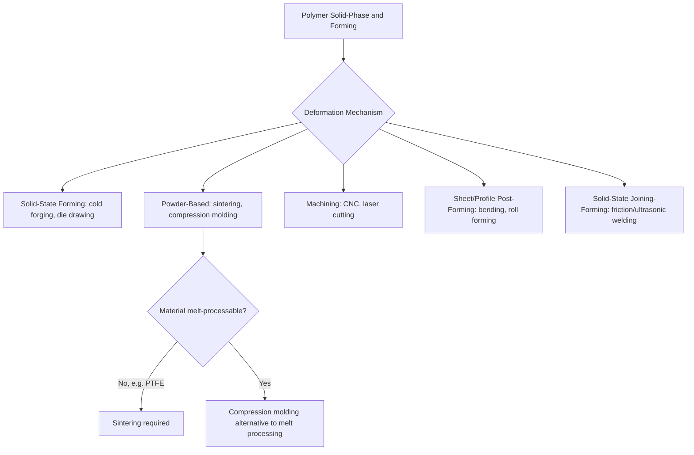

## Polymer Solid-Phase and Forming-Process Classification

### Overview

Polymer solid-phase and forming processes shape thermoplastic materials while they remain fully or substantially in the solid state — below the melt temperature of semi-crystalline polymers or, for some processes, below/near the glass transition temperature of amorphous polymers — rather than processing a fully molten melt as in the injection molding, extrusion, and blow molding processes covered previously. These processes are classified by the mechanism of solid-state deformation and by whether the starting stock is bulk solid, powder, or a pre-existing semi-finished form (sheet, rod, profile).

### Classification by Deformation Mechanism

#### 1. Solid-State (Cold/Warm) Forming

Deformation of a solid polymer stock below its melt temperature, exploiting the material's ductility and, in some cases, strain-induced crystallinity or molecular orientation.

- **Cold forging/cold forming** – polymer billet or preform is deformed under pressure at or near room temperature; limited to polymers with sufficient room-temperature ductility (e.g., certain polyolefins), producing enhanced mechanical properties via strain-induced orientation without the cycle time of melt processing.
- **Solid-state (die) drawing** – a solid polymer rod or profile is pulled through a heated, converging die below melt temperature, inducing molecular orientation and property enhancement along the draw direction; related in principle to metal wire drawing but exploiting polymer viscoelastic deformation rather than melt flow.
- **Solid-phase pressure forming** – polymer sheet or billet formed under pressure at a temperature below melting but sufficiently elevated to allow plastic flow, often used for engineering thermoplastics requiring dimensional precision without full melt processing.

#### 2. Powder-Based Solid/Near-Solid Forming

- **Sintering (polymer)** – polymer powder (notably PTFE, which cannot be conventionally melt-processed due to its extremely high melt viscosity) is compacted and then heated below or near its melting point to fuse particles via diffusion bonding, analogous in principle to powder metallurgy sintering.
- **Compression molding (thermoplastic)** – preheated polymer charge (often a semi-solid or doughy state rather than fully molten) is placed in an open mold and compressed under heat and pressure; more commonly associated with thermosets and composites but applicable to certain thermoplastic compounds as well.

#### 3. Machining and Material Removal from Solid Stock

- **CNC machining of polymer stock** – conventional milling, turning, and drilling applied to solid polymer bar, sheet, or block stock, used for prototypes, low-volume parts, or precision features not achievable via molding.
- **Laser cutting/engraving of polymer sheet** – thermal material removal for cutting profiles or surface marking from sheet stock.

#### 4. Sheet and Profile Post-Forming (Secondary Solid-State Shaping)

Distinct from primary melt-based thermoforming (covered in the melt-based classification), these processes operate on already-solidified semi-finished polymer stock:

- **Bending/folding of thermoplastic sheet** – localized heating (strip heaters, hot air) softens a narrow zone of an otherwise solid sheet to permit a controlled bend, without processing the entire sheet through a melt state.
- **Roll forming of thermoplastic profile** – progressive bending of solid thermoplastic sheet/strip through a series of rollers, analogous to sheet-metal roll forming, for continuous profile shapes.

#### 5. Solid-State Welding and Joining-Adjacent Forming

While primarily a joining category, several solid-state polymer joining processes involve localized forming and are noted here due to mechanism overlap:

- **Friction/spin welding** – frictional heat at the joint interface locally melts a thin layer while the bulk parts remain solid, then the joint solidifies under pressure.
- **Ultrasonic welding/forming** – high-frequency vibration generates localized frictional heat to join or stake polymer features (e.g., ultrasonic staking of assembly bosses) without processing the bulk part through a melt state.

### Classification by Starting Stock Form

| Starting Stock | Representative Process | Resulting Part Type |
| --- | --- | --- |
| Bulk solid billet/rod | Solid-state die drawing, cold forging | Oriented rod, profile, or near-net preform |
| Powder | Polymer sintering (PTFE), compression molding | Sintered billet/rod, molded part |
| Pre-formed sheet | Sheet bending, roll forming, secondary post-forming | Folded/bent panel, formed profile |
| Machined block/bar stock | CNC machining, laser cutting | Prototype or low-volume precision part |

### Solid-State Orientation and Property Enhancement

**Key Points**

- Solid-state deformation processes (die drawing, cold forging) can induce significant molecular chain orientation and, in semi-crystalline polymers, strain-induced crystallization, producing substantial increases in tensile strength and stiffness along the deformation direction compared to unoriented, melt-processed material of the same base polymer.
- This property enhancement is analogous in principle to cold working's dislocation-strengthening effect in metals, though the underlying mechanism (molecular chain alignment and crystallite formation/reorientation) is distinct from metallic dislocation-based strengthening.
- The enhancement is generally anisotropic — properties improve substantially in the draw/deformation direction but may be little changed or even reduced transverse to it, a key design consideration distinguishing solid-state-formed polymer components from isotropic melt-molded parts [Unverified — degree of anisotropy is highly process- and polymer-specific].

### PTFE as a Distinguishing Case

**Key Points**

- Polytetrafluoroethylene (PTFE) cannot be processed by conventional melt-based methods (injection molding, extrusion in the traditional sense) due to its extremely high melt viscosity even above its melting point, making it a primary industrial driver for polymer sintering as a distinct process category.
- PTFE is typically processed by compacting powder (via ram extrusion or isostatic/compression molding) into a preform billet, then sintering in an oven above its crystalline melting point (~327°C) but without the shear-flow processing typical of true melt forming, followed by cooling and, where needed, machining to final shape.

### Comparative Table: Melt-Based vs. Solid-Phase Processing

| Aspect | Melt-Based Processing | Solid-Phase Processing |
| --- | --- | --- |
| Material state during forming | Fully molten/flowable | Solid or near-solid, below melt temperature |
| Typical driver for selection | High-volume, complex geometry, flow-fill requirement | Enhanced mechanical properties via orientation, materials unprocessable by melt flow (PTFE), or low-volume/prototype needs |
| Property outcome | Generally isotropic (absent deliberate orientation steps) | Often anisotropic, with directional strength enhancement |
| Representative processes | Injection molding, extrusion, blow molding | Solid-state die drawing, polymer sintering, CNC machining, sheet bending |

### Selection Logic

**Key Points**

1. **Material processability**: PTFE and certain ultra-high-molecular-weight polymers (UHMWPE) that cannot be conventionally melt-processed require solid-phase (sintering, ram extrusion, compression) routes.
2. **Property enhancement requirement**: applications demanding maximum tensile strength/stiffness along a specific axis (oriented fiber/tape, high-strength rod stock) favor solid-state die drawing or cold forming over as-molded material.
3. **Production volume**: low-volume, prototype, or highly customized geometries often favor CNC machining from solid stock over investment in melt-processing tooling.
4. **Dimensional/thermal distortion sensitivity**: solid-state processes generally introduce less thermal distortion risk than full melt processing, relevant for precision components with tight dimensional tolerances.
5. **Cost and cycle time**: solid-phase processes (particularly machining and sintering) are generally slower and more expensive per part than high-volume melt processing, restricting their use to applications where melt processing is infeasible or the property/precision benefit justifies the cost.

### Example

A PTFE gasket sheet material is produced by compacting PTFE powder via isostatic or ram-extrusion compaction into a billet, sintering the billet in an oven above its crystalline melting point without shear-flow processing, then skiving (thin-slicing) the sintered billet into sheet form — a process route dictated entirely by PTFE's unprocessability via conventional melt extrusion or injection molding.

A high-strength polypropylene strapping tape is produced via solid-state die drawing, pulling an extruded polypropylene tape through a series of heated, converging dies below the polymer's melt temperature, inducing substantial molecular orientation along the draw direction and significantly increasing tensile strength compared to the as-extruded (unoriented) tape.

**Related Topics**

- Polymer melt-based shaping-process classification
- Thermoset and reaction-based polymer process classification
- Composite material shaping-process classification
- Molecular orientation and crystallinity effects on polymer mechanical properties
- Polymer machining considerations (tool geometry, heat management)
- Powder metallurgy sintering (comparative process principles)