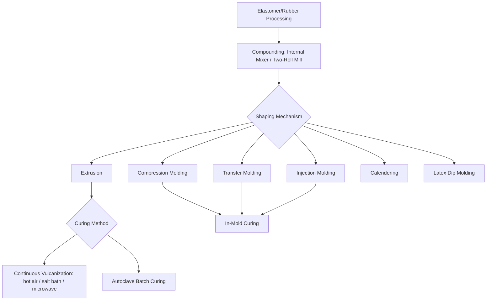

## Elastomer and Rubber Process Classification

### Overview

Elastomer and rubber processing encompasses the shaping and curing (vulcanization) of both natural rubber and synthetic elastomers into finished products. Unlike thermoplastic polymers, most rubber compounds are thermosetting in behavior once cured (crosslinked), meaning the shaping and curing steps are typically distinct sequential operations, and the classification here is organized around the compounding/mixing stage, the shaping mechanism, and the curing (vulcanization) mechanism — with thermoplastic elastomers (TPEs) noted separately since they follow melt-processing routes closer to conventional thermoplastics.

### Classification by Elastomer Type (Process-Relevant Distinction)

**Key Points**

- **Thermoset rubber (conventional vulcanized rubber)** – natural rubber (NR) and synthetic rubbers (SBR, NBR, EPDM, silicone, fluoroelastomers, etc.) that undergo irreversible crosslinking (vulcanization) during cure; cannot be remelted or reprocessed once cured.
- **Thermoplastic elastomers (TPEs)** – materials (TPU, TPO, SEBS-based compounds, thermoplastic vulcanizates/TPV) that exhibit rubber-like elasticity without chemical crosslinking, processed via conventional thermoplastic melt methods (injection molding, extrusion) and fully recyclable/remeltable, distinguishing their process route fundamentally from conventional vulcanized rubber.

This classification focuses primarily on conventional (thermoset) rubber processing, since TPE processing follows the polymer melt-based shaping classification already covered.

### Compounding and Mixing (Pre-Shaping Stage)

Before shaping, raw rubber (natural or synthetic) is compounded with fillers, curatives, processing aids, and additives:

- **Internal (Banbury) mixing** – enclosed rotor mixer for high-shear, batch compounding of raw rubber with carbon black/silica fillers, oils, and curatives.
- **Two-roll (open) milling** – open counter-rotating rolls for compounding, sheeting out, and final mixing/masterbatch letdown steps.

### Classification by Shaping Mechanism

#### 1. Compression Molding

Uncured rubber compound (typically a pre-formed slug or preform) is placed in an open mold cavity, the mold is closed under heat and pressure, and the rubber flows to fill the cavity while simultaneously curing; classified as the traditional, lowest-tooling-cost rubber molding method, well suited to lower-volume production and thick-section parts.

#### 2. Transfer Molding

Uncured rubber compound is placed in a separate transfer pot, then forced through a sprue/runner system into a closed mold cavity under pressure before curing; offers better dimensional control and flash reduction than compression molding, particularly for parts with inserts (e.g., rubber-bonded-to-metal components) or intricate geometry.

#### 3. Injection Molding (Rubber Injection Molding)

Uncured, uncrosslinked rubber compound is injected via a screw or plunger into a heated, closed mold cavity where it cures in place, then is demolded; offers the highest production efficiency and dimensional consistency among conventional rubber molding methods, at higher tooling and equipment cost, and is the dominant method for high-volume rubber parts (seals, grommets, automotive components).

#### 4. Extrusion (Rubber Extrusion)

Uncured rubber compound is continuously forced through a shaping die by a screw extruder, producing a continuous uncured profile (hose, seal strip, weatherstripping) that is subsequently cured in a secondary continuous or batch process:

- **Continuous vulcanization (CV) lines** – extruded profile passes through a continuous curing medium (hot air, molten salt bath (LCM — liquid curing medium), microwave/UHF curing, or a continuous autoclave) immediately after extrusion.
- **Autoclave (batch) curing** – extruded, cut lengths are cured in a static pressurized steam autoclave, common for lower-volume or thick-section extruded profiles.

#### 5. Calendering

Rubber compound is passed through a series of heated rolls to produce continuous sheet of controlled thickness, or to apply a rubber coating/skim layer onto a textile or cord fabric substrate (critical in tire ply and conveyor belt manufacturing), prior to subsequent cutting, building, and curing operations.

#### 6. Latex-Based Shaping Processes

For rubber supplied as an aqueous latex dispersion rather than solid compound:

- **Dip molding** – a form is repeatedly dipped into a latex compound bath, building up a coating layer by layer, then cured; used for gloves, balloons, and thin-walled hollow parts.
- **Latex casting/foam processing** – latex is foamed (mechanically or chemically) and cast into a mold, then gelled and cured, producing flexible foam products (e.g., some mattress/cushioning foams).

#### 7. Assembly-Built Products (Multi-Component Construction)

Certain rubber products are built up from multiple pre-shaped components (calendered sheet, extruded profile, textile cord/fabric) assembled on a former or drum prior to a single final curing step:

- **Tire building** – calendered rubber-coated cord plies, extruded tread/sidewall components, and bead wire assemblies are built up on a tire-building drum into a "green tire," then shaped and cured in a tire mold/press (curing simultaneously vulcanizes the assembly and imparts the final tread pattern).
- **Conveyor belt/hose construction** – layered rubber-coated fabric and rubber compound built up and cured, often in a continuous or batch press process depending on product type.

### Classification by Curing (Vulcanization) Mechanism

| Curing System | Chemistry | Typical Application |
| --- | --- | --- |
| Sulfur vulcanization | Sulfur + accelerators cross-link diene rubbers (NR, SBR, NBR) via sulfur bridges | General-purpose rubber goods, tires |
| Peroxide curing | Organic peroxides generate free-radical crosslinks | Silicone, EPDM, applications requiring heat/compression-set resistance |
| Metal oxide curing | Zinc oxide or other metal oxides cross-link specific elastomers (e.g., chloroprene, chlorosulfonated polyethylene) | CR (neoprene), CSM rubber |
| Radiation (electron beam) curing | High-energy electron beam induces crosslinking without chemical curatives | Wire/cable insulation, specialty applications |
| Room-temperature vulcanization (RTV) | Moisture-cure or two-part addition-cure silicone systems | Sealants, molds, potting compounds |

### Comparative Table: Rubber Shaping Process Selection

| Process | Tooling Cost | Production Volume Fit | Dimensional Precision | Typical Product |
| --- | --- | --- | --- | --- |
| Compression molding | Low | Low-medium | Moderate (flash typical) | Simple gaskets, low-volume seals |
| Transfer molding | Moderate | Medium | Good | Insert-bonded parts, moderate complexity seals |
| Injection molding | High | High | Excellent | High-volume seals, grommets, automotive components |
| Extrusion + CV curing | Moderate | High (continuous) | Good (profile-dependent) | Hose, weatherstripping, seal strip |
| Calendering | High (roll train) | Very high | Good | Sheet stock, tire ply/skim coating |
| Dip molding | Low-moderate | Medium-high | Moderate | Gloves, balloons, thin dip-formed parts |

### Selection Logic

**Key Points**

1. **Production volume**: high-volume precision parts (automotive seals, O-rings) favor rubber injection molding despite higher tooling investment; low-volume or prototype parts favor compression molding.
2. **Part geometry**: continuous constant-cross-section profiles (hose, weatherstrip) require extrusion with downstream continuous or batch curing; hollow thin-walled parts (gloves) require latex dip molding.
3. **Insert/bonding requirements**: parts requiring metal inserts or rubber-to-metal bonding often favor transfer or injection molding for better control of insert positioning and flash minimization around the insert.
4. **Curing system compatibility**: elastomer chemistry dictates available cure systems — silicone and EPDM commonly use peroxide or platinum-catalyzed addition cure, while general-purpose diene rubbers use sulfur vulcanization, directly influencing achievable cure cycle time and equipment configuration.
5. **Multi-component product complexity**: products requiring reinforcement (tires, hoses, conveyor belts) require assembly-built construction combining calendering, extrusion, and building/curing steps rather than a single-step molding process.

### Example

An automotive radiator hose is produced by extruding an EPDM rubber compound through an annular die to form a continuous tube, which then passes through a continuous vulcanization line using a hot-air or microwave (UHF) curing tunnel to crosslink the extruded profile in-line before cutting to length — a process route selected for its high throughput suited to continuous constant-cross-section profile production.

A radial passenger car tire is constructed by building calendered, rubber-coated steel-belt and textile-cord plies, along with extruded tread and sidewall compound, onto a tire-building drum to form a "green tire," which is then transferred to a curing press where a heated mold simultaneously vulcanizes the entire assembly and imprints the final tread pattern — illustrating the multi-component assembly-built construction category distinct from single-step molding.

**Related Topics**

- Polymer melt-based shaping-process classification
- Thermoset and reaction-based polymer process classification
- Composite material shaping-process classification
- Vulcanization chemistry and cure system selection
- Tire construction and reinforcement architecture
- Thermoplastic elastomer (TPE/TPV) material classification and processing