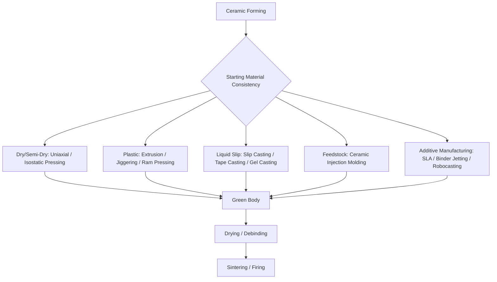

## Ceramic Forming-Process Classification

### Overview

Ceramic forming processes shape ceramic powders, pastes, or suspensions into a green (unfired) body prior to densification via sintering or firing. Because most technical and traditional ceramics cannot be melt-processed like metals or thermoplastics (due to extremely high melting points and/or decomposition below melting), ceramic forming is fundamentally a powder- or suspension-based shaping discipline, classified primarily by the moisture/binder content and flow behavior of the starting material — dry, plastic, or liquid/slip-based — and secondarily by the specific forming mechanism applied.

### Classification by Starting Material Consistency

#### 1. Dry and Semi-Dry Pressing

Ceramic powder, typically pre-granulated with a small amount of binder (often 2–8% moisture, "semi-dry"), is compacted under pressure in a rigid die.

- **Uniaxial (die) pressing** – powder is compacted in a single direction between rigid punches; suited to simple, relatively flat or axisymmetric shapes with limited height-to-diameter ratio due to density gradients from single-direction pressure transmission.
- **Isostatic pressing (cold isostatic pressing, CIP)** – powder enclosed in a flexible mold is compacted by uniform hydrostatic pressure from a fluid medium, producing more uniform density than uniaxial pressing and enabling more complex or elongated shapes.

#### 2. Plastic Forming

Ceramic powder is mixed with sufficient water and/or organic binder (typically 15–25% moisture) to form a plastic, deformable mass, which is then shaped.

- **Extrusion (plastic extrusion)** – plastic ceramic body is forced through a die to produce continuous constant-cross-section shapes (brick, tile, tubing, honeycomb substrates for catalytic converters).
- **Jiggering/jolleying** – traditional pottery-forming technique where a rotating plaster mold and a shaping tool (profile template) form a plastic clay body against the mold, used for axisymmetric tableware and similar shapes.
- **Hand/wheel throwing** – traditional manual forming of plastic clay on a rotating wheel; primarily artisanal/small-scale rather than industrial production.
- **Plastic pressing/ram pressing** – plastic clay body is pressed between porous plaster or polymer dies that absorb moisture, forming complex shapes such as sanitaryware components.

#### 3. Slip (Suspension) Casting

Ceramic powder is dispersed in a liquid (typically water) with dispersants to form a slip (colloidal suspension) with low viscosity, which is then cast.

- **Slip casting (traditional)** – slip is poured into a porous plaster mold, which absorbs liquid via capillary action, building a solid ceramic layer against the mold wall; excess slip is drained (drain casting) for hollow parts, or the mold is filled completely (solid casting) for solid parts.
- **Pressure slip casting** – slip is forced into the mold under pressure (often using non-porous polymer molds with a pressure-driven dewatering mechanism), accelerating the casting cycle compared to gravity/capillary-driven traditional slip casting.
- **Tape casting (doctor blade casting)** – a thin, uniform ceramic slip layer is spread onto a moving carrier film using a doctor blade, then dried to form thin, flexible "green tape," widely used for multilayer ceramic capacitors, substrates, and fuel cell components.
- **Gel casting** – a ceramic slurry containing a monomer/gelling agent is cast into a mold and polymerized in situ to form a rigid gel body, enabling complex net-shape forming with good green strength before drying and firing.

#### 4. Injection Molding (Ceramic Injection Molding, CIM)

Ceramic powder is mixed with a thermoplastic/wax binder system to form a moldable feedstock, injection molded in equipment similar to plastic injection molding, then the binder is removed (debinding) prior to sintering; enables complex, high-precision net-shape ceramic parts at production volumes comparable to plastic injection molding.

#### 5. Additive Manufacturing of Ceramics

Layer-by-layer forming of green ceramic bodies, increasingly significant as a distinct forming category:

- **Stereolithography-based ceramic printing** – photocurable resin loaded with ceramic powder is selectively cured layer by layer, followed by debinding and sintering.
- **Binder jetting** – liquid binder is selectively deposited onto ceramic powder bed layers to build a green part.
- **Robocasting/direct ink writing** – a concentrated ceramic paste is extruded through a fine nozzle in a controlled path to build up a 3D green structure layer by layer.

### Classification by Resulting Green-Body Density Uniformity

| Method | Density Uniformity | Typical Shape Complexity |
| --- | --- | --- |
| Uniaxial pressing | Lower (pressure gradient with height) | Simple, low aspect ratio |
| Isostatic pressing | High (uniform hydrostatic pressure) | Moderate-complex, elongated shapes |
| Slip casting | Moderate-high (mold-geometry dependent) | Complex hollow/thin-walled shapes |
| Plastic extrusion | High along cross-section (continuous) | Constant-cross-section profiles |
| Ceramic injection molding | High | Complex, precise net-shape geometry |

### Post-Forming Processing Dependency

**Key Points**

- All ceramic forming processes produce a "green" (unfired, often still containing binder/moisture) body that requires subsequent drying (for moisture-containing processes) and/or debinding (for binder-containing processes such as CIM and 3D-printed feedstocks) prior to the final densification (sintering/firing) step.
- Shrinkage during drying and sintering (often 10–20% linear shrinkage, depending on formulation and process) must be accounted for in green-body tooling dimensions — a critical dimensional-control consideration unique to ceramic (and to a lesser degree, powder metallurgy) forming compared to melt-based metal or polymer processes [Unverified — exact shrinkage figures are formulation- and process-specific].
- Improper drying/debinding rate control can introduce cracking or distortion, making this transitional stage a significant process-control focus independent of the forming method itself.

### Selection Logic

**Key Points**

1. **Shape complexity and wall thickness**: hollow, thin-walled, or intricate shapes favor slip casting or, for high precision, ceramic injection molding; simple axisymmetric or flat shapes favor uniaxial or isostatic pressing.
2. **Production volume**: high-volume precision parts (spark plug insulators, technical ceramic components) favor CIM; lower-volume or larger/more variable shapes favor slip casting or plastic forming.
3. **Material and green-body property requirement**: applications requiring very high green density and minimal pore gradient (structural/technical ceramics, cutting tool inserts) favor isostatic pressing.
4. **Thin, flat, multilayer component needs**: electronic ceramic substrates and multilayer capacitors specifically require tape casting due to its unique ability to produce thin, uniform, flexible green sheets.
5. **Rapid prototyping / complex internal geometry**: additive manufacturing routes (robocasting, binder jetting, ceramic stereolithography) are increasingly selected where geometric complexity (internal lattices, channels) exceeds what conventional molds can economically produce, though throughput and post-processing complexity remain considerations relative to established high-volume methods [Unverified — relative industrial maturity compared to conventional forming methods continues to evolve].

### Example

A high-voltage electrical insulator is formed via isostatic pressing of alumina powder, achieving uniform green density across the elongated shape needed to withstand internal stresses during sintering, then machined in the green or bisque-fired state to final dimensional tolerances before final high-temperature sintering.

A multilayer ceramic capacitor (MLCC) substrate layer is formed via tape casting: a barium titanate-based slip is spread to a precisely controlled thin thickness using a doctor blade onto a moving carrier film, dried to form a flexible green tape, then cut, stacked with internal electrode layers, laminated, and co-fired — a forming route uniquely suited to producing the very thin, uniform ceramic layers required for electronic component miniaturization.

**Related Topics**

- Polymer melt-based shaping-process classification
- Composite material shaping-process classification
- Sintering and firing process classification
- Green-body drying and shrinkage control
- Technical ceramic material classification (oxide, non-oxide, advanced structural ceramics)
- Additive manufacturing of ceramics and post-processing requirements