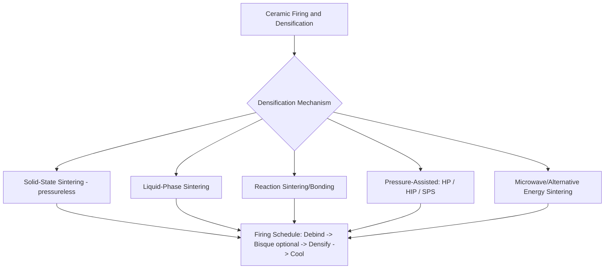

## Ceramic Firing and Densification Classification

### Overview

Firing and densification transform a green (unfired) ceramic body into its final dense, strong, functional state by applying thermal energy to drive particle bonding, pore elimination, and often phase development. While loosely grouped under the umbrella term "sintering," these processes are classified by the mechanism driving densification (solid-state diffusion, liquid-phase assistance, or externally applied pressure) and by the atmosphere/energy source used, since these factors govern achievable density, microstructure, and final mechanical/functional properties.

### Classification by Densification Mechanism

#### 1. Solid-State Sintering

Densification occurs entirely through solid-state atomic diffusion (surface diffusion, grain-boundary diffusion, volume diffusion) between adjacent powder particles at elevated temperature, without any liquid phase forming; typically requires temperatures approaching 70–90% of the material's absolute melting point.

$$\frac{\Delta L}{L_0} \propto \left(\frac{D \cdot t}{r^n}\right)^{1/m}$$

This is a generalized form of the sintering kinetics relationship, where $D$ is the diffusion coefficient, $t$ is time, $r$ is particle radius, and the exponents depend on the dominant diffusion mechanism (surface vs. grain-boundary vs. volume diffusion) [Unverified — exact functional form and exponents are mechanism- and material-specific, per classical Kingery/Coble sintering models].

- **Conventional (pressureless) solid-state sintering** – green body is heated in a furnace without applied external pressure, relying on capillary/surface-energy-driven diffusion alone; the most common industrial densification route for structural and technical ceramics (alumina, zirconia, silicon carbide with sintering aids).

#### 2. Liquid-Phase Sintering

A secondary phase (often a lower-melting-point additive or impurity) melts at the sintering temperature, providing a liquid that enhances particle rearrangement and mass transport, significantly accelerating densification compared to pure solid-state sintering, at the cost of introducing a residual glassy or secondary crystalline phase at grain boundaries that can affect high-temperature mechanical properties.

- Common in silicon nitride (with yttria/alumina sintering aids), many traditional ceramics (porcelain, with feldspar as the liquid-forming flux), and certain cemented carbide/cermet systems (where a metallic binder phase, e.g., cobalt in WC-Co, provides liquid-phase densification, bridging into powder-metallurgy-adjacent processing).

#### 3. Reaction Sintering / Reaction Bonding

Densification occurs concurrently with a chemical reaction between constituents, rather than (or in addition to) simple diffusion between like particles.

- **Reaction-bonded silicon carbide (RBSC)** – a porous carbon/SiC preform is infiltrated with molten silicon, which reacts with carbon to form additional SiC in situ, filling porosity and achieving near-full density without the shrinkage typical of conventional sintering.
- **Reaction-bonded silicon nitride (RBSN)** – a silicon powder compact is nitrided in a nitrogen atmosphere at elevated temperature, forming silicon nitride in place with minimal dimensional change.

#### 4. Pressure-Assisted Densification

External mechanical pressure is applied concurrently with heating to enhance densification kinetics and enable near-full theoretical density, often at lower temperature and/or shorter time than pressureless sintering.

- **Hot pressing (HP)** – uniaxial pressure applied via a heated die/punch system during sintering; limited to relatively simple shapes due to the uniaxial pressure application, but achieves high density and fine grain structure.
- **Hot isostatic pressing (HIP)** – simultaneous heat and isostatic gas pressure (applied via an inert gas, typically argon, in a pressure vessel) densify the part uniformly in all directions; used both as a primary densification route and as a post-sintering secondary treatment to close residual porosity in already-sintered (or cast metal) parts.
- **Spark plasma sintering (SPS) / field-assisted sintering (FAST)** – pulsed direct current passes through a conductive die (and, for conductive powders, the powder itself), combined with uniaxial pressure, enabling very rapid heating rates and short sintering times, useful for retaining fine/nanostructured grain size that would coarsen under conventional longer-duration sintering cycles.

#### 5. Microwave and Alternative Energy-Source Sintering

- **Microwave sintering** – volumetric heating via microwave energy absorption within the ceramic body itself (rather than conduction from an external furnace element), potentially reducing sintering time and energy consumption for microwave-susceptible materials [Unverified — degree of industrial-scale adoption relative to conventional furnace sintering remains material- and application-specific].
- **Plasma sintering / laser sintering** – localized, rapid energy input for specialty or additive-manufacturing-integrated densification of ceramic green bodies.

### Classification by Atmosphere Control

| Atmosphere | Purpose | Representative Application |
| --- | --- | --- |
| Air/oxidizing | Standard atmosphere for oxide ceramics stable in air | Alumina, zirconia, traditional ceramics |
| Inert (argon, nitrogen) | Prevent oxidation of non-oxide or metallic-phase-containing ceramics | Silicon carbide, cemented carbides |
| Reducing (hydrogen, forming gas) | Prevent oxidation, reduce certain oxide phases | Specialty electronic ceramics, some metal-ceramic composites |
| Vacuum | Remove trapped gas, enable very high density, avoid atmosphere-related contamination | High-purity technical ceramics, HIP processing |
| Reactive (nitrogen for nitriding) | Atmosphere itself participates in the densification reaction | Reaction-bonded silicon nitride |

### Firing Schedule Classification (Thermal Profile Stages)

**Key Points**

1. **Binder burnout/debinding** – slow, controlled heating (often the rate-limiting and most defect-prone stage) to remove organic binders/plasticizers without cracking the green body from rapid gas evolution.
2. **Bisque firing (optional intermediate stage)** – a lower-temperature pre-fire, common in traditional ceramics, producing a porous but handleable body suitable for glazing or machining before final high-temperature firing.
3. **Densification (sintering) hold** – the primary high-temperature dwell where the bulk of shrinkage and pore elimination occurs.
4. **Controlled cooling** – gradual cooling to avoid thermal-stress-induced cracking, particularly critical for larger or thermal-shock-sensitive ceramic bodies.

### Comparative Table: Densification Method Selection

| Method | Applied Pressure | Achievable Density | Shape Complexity | Typical Use |
| --- | --- | --- | --- | --- |
| Pressureless solid-state sintering | None | High (with proper formulation) | Complex (formed shape retained) | Structural/technical ceramics, general production |
| Liquid-phase sintering | None (typically) | Very high, faster than solid-state | Complex | Silicon nitride, porcelain, cemented carbide |
| Hot pressing | Uniaxial | Very high, fine grain | Simple (limited by die geometry) | Cutting tool ceramics, research-grade dense samples |
| Hot isostatic pressing | Isostatic (gas) | Near-theoretical density | Complex (uniform pressure) | High-performance technical ceramics, defect closure |
| Spark plasma sintering | Uniaxial (pulsed current) | High, with fine/nano grain retention | Simple-moderate | Nanostructured and advanced research ceramics |
| Reaction bonding | None (reaction-driven) | High, minimal shrinkage | Complex (near-net-shape preserved) | RBSC, RBSN components |

### Selection Logic

**Key Points**

1. **Density and porosity requirement**: applications demanding near-theoretical density and elimination of residual porosity (structural ceramics under high stress, optical-grade ceramics) favor pressure-assisted methods (HP, HIP) or HIP as a post-sinter treatment.
2. **Shape complexity**: complex, near-net-shape green bodies favor pressureless sintering (or reaction bonding, which preserves dimensions particularly well) since hot pressing's uniaxial constraint limits geometry.
3. **Grain size control**: applications requiring fine or nanostructured grain size for enhanced mechanical or functional properties favor rapid, short-duration methods (SPS) that limit grain growth during densification.
4. **Dimensional stability/shrinkage tolerance**: reaction-bonded processes are selected specifically where minimal shrinkage/dimensional change from the green (or preform) shape is required.
5. **Cost and throughput**: pressureless sintering remains the lowest-cost, highest-throughput route and is the default choice unless density, grain-size, or shape constraints specifically require a pressure-assisted or reaction-based alternative.

### Example

A cutting tool insert made from alumina-based ceramic requiring maximum hardness and fracture toughness is densified via hot pressing, applying uniaxial pressure during the sintering hold to achieve near-theoretical density and fine, controlled grain structure suited to the demanding wear and edge-retention requirements of the cutting application, accepting the geometric simplicity constraint imposed by the uniaxial die.

A complex-shaped silicon nitride turbocharger rotor requiring both intricate geometry and high density is first pressurelessly (or liquid-phase) sintered to near-final shape using yttria-alumina sintering aids to promote liquid-phase densification, then subjected to a secondary hot isostatic pressing (HIP) treatment to close any residual internal porosity uniformly in all directions without distorting the complex rotor geometry.

**Related Topics**

- Ceramic forming-process classification
- Composite material shaping-process classification
- Powder metallurgy sintering (comparative process principles)
- Technical ceramic material classification (oxide, non-oxide, advanced structural ceramics)
- Grain growth control and microstructure development in sintering
- Thermal shock resistance and controlled cooling schedules in ceramic processing