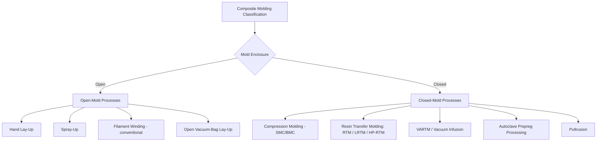

## Open-Mold versus Closed-Mold Composite-Process Classification

### Overview

Composite manufacturing processes are frequently classified by whether the mold tooling is open (exposed to atmosphere during forming, with only one rigid mold surface) or closed (fully enclosed, with two matched mold surfaces or a sealed bag/vacuum system). This distinction governs achievable part quality (fiber volume fraction, void content, surface finish on both sides), production rate, emissions/environmental control, and tooling cost, making it one of the most fundamental classification axes in composite process selection alongside resin system and reinforcement form.

### Open-Mold Processes

**Key Points**

Open-mold processes expose the wet resin/reinforcement layup to the atmosphere during at least part of the forming and cure cycle, using a single rigid mold surface (typically defining only the exterior or interior surface, with the opposite surface finished by hand or gravity/atmospheric pressure alone).

#### 1. Hand Lay-Up

Reinforcement (woven fabric, mat, or roving) is manually placed into an open mold and impregnated with resin using rollers or brushes, layer by layer, then cured at ambient or elevated temperature; the lowest-tooling-cost composite process, but labor-intensive with inherently variable fiber volume fraction and higher void content than closed-mold alternatives.

#### 2. Spray-Up

Chopped fiberglass roving and catalyzed resin are simultaneously sprayed onto an open mold via a spray gun, then rolled out to consolidate and remove entrapped air; faster than hand lay-up for large, simple shapes but produces lower and less consistent fiber content, generally limiting mechanical performance relative to fabric-reinforced lay-up.

#### 3. Filament Winding (Open-Mold Variant)

Continuous resin-impregnated fiber tow is wound under tension onto a rotating mandrel in a controlled pattern; while the mandrel itself constrains the internal geometry, the outer surface remains exposed/open during winding and cure, classifying conventional filament winding as an open-mold process even though it uses precision fiber placement rather than manual layup.

#### 4. Open-Mold Vacuum Bagging (Vacuum-Assisted Lay-Up)

Following hand lay-up or spray-up, a flexible vacuum bag is sealed over the open mold and a vacuum is drawn, compacting the layup and removing trapped air/volatiles before or during cure; this hybrid variant improves fiber consolidation and reduces void content compared to unassisted open-mold lay-up while retaining the single rigid mold surface characteristic of open-mold tooling.

### Closed-Mold Processes

**Key Points**

Closed-mold processes fully enclose the reinforcement and resin between two rigid mold surfaces (or a rigid mold plus a sealed flexible membrane under vacuum), producing controlled surface finish on both sides of the part and substantially reducing volatile organic compound (VOC) emissions compared to open-mold processes.

#### 1. Compression Molding (Matched-Die Molding)

Pre-formed reinforcement (often as a sheet molding compound, SMC, or bulk molding compound, BMC) is placed between matched, heated rigid mold halves and compressed, curing the part under heat and pressure; well suited to high-volume automotive and appliance components with good surface finish on both faces.

#### 2. Resin Transfer Molding (RTM)

Dry reinforcement preform is placed in a closed, rigid two-part mold; resin is then injected (often under moderate pressure) to fully wet out the reinforcement before curing.

- **Light RTM (LRTM)** – uses a lighter-weight, often composite or lower-cost tooling with vacuum assistance to reduce injection pressure requirements, suited to lower-volume production than conventional steel-tooled RTM.
- **High-pressure RTM (HP-RTM)** – fast-cycle, high-pressure injection into matched steel tooling, developed for high-volume automotive structural composite production with short cycle times compatible with automotive production rates.

#### 3. Vacuum-Assisted Resin Transfer Molding (VARTM) / Vacuum Infusion

A rigid mold on one side and a flexible vacuum bag on the other fully enclose the dry reinforcement preform; resin is drawn through the reinforcement by vacuum pressure alone (rather than positive injection pressure), making this a closed-mold process despite using a flexible membrane rather than a second rigid mold half. Widely used for large composite structures (wind turbine blades, boat hulls) where matched rigid tooling on both sides would be prohibitively expensive.

#### 4. Autoclave Processing (Prepreg Lay-Up)

Pre-impregnated fiber/resin material (prepreg) is laid up (often on a single rigid tool) and then enclosed in a vacuum bag, which is placed inside an autoclave applying combined heat and elevated gas pressure during cure; classified as closed-mold due to the sealed vacuum bag enclosure, even though only one rigid mold surface is used — the sealed bag and elevated autoclave pressure distinguish it from simple open-mold vacuum bagging by achieving substantially higher consolidation pressure and lower void content, standard for aerospace primary structure.

#### 5. Pultrusion

Continuous fiber reinforcement is pulled through a resin bath and then through a heated, closed die that both shapes the cross-section and cures the resin as the profile is continuously pulled through; classified as closed-mold due to the fully enclosed die cavity, producing continuous constant-cross-section structural profiles (ladder rails, structural shapes, rebar) with excellent fiber alignment and consistent cross-section.

### Comparative Table

| Aspect | Open-Mold | Closed-Mold |
| --- | --- | --- |
| Mold surfaces | One rigid surface (or mandrel) | Two rigid surfaces, or rigid + sealed membrane |
| Surface finish | Good on tool side only; opposite side rough/uncontrolled | Controlled finish on both sides (or tool side + smooth bag side for VARTM) |
| Fiber volume fraction | Lower, more variable (hand lay-up/spray-up) | Higher, more consistent (injection/infusion under pressure or vacuum) |
| Void content | Higher (unless vacuum-bag assisted) | Lower, particularly with vacuum infusion or autoclave pressure |
| VOC/styrene emissions | Higher (open exposure to atmosphere) | Substantially reduced (enclosed system) |
| Tooling cost | Low (single mold) | Higher (matched tooling or vacuum infrastructure) |
| Production rate | Lower, labor-intensive (hand lay-up) to moderate (spray-up) | Higher achievable rate, especially HP-RTM and compression molding |
| Typical part size | Very large parts feasible (boat hulls, tanks) | Large parts feasible via VARTM; matched-die size more constrained by press/tool size |

### Classification by Resin Delivery Mechanism (Cross-Cutting Both Categories)

| Delivery Mechanism | Open-Mold Example | Closed-Mold Example |
| --- | --- | --- |
| Manual wet-out | Hand lay-up | — |
| Spray application | Spray-up | — |
| Pre-impregnated material | Open vacuum-bag prepreg lay-up (less common) | Autoclave prepreg processing |
| Injected under pressure | — | RTM, HP-RTM |
| Vacuum-drawn infusion | — | VARTM/vacuum infusion |
| Continuous pull-through | — | Pultrusion |

### Selection Logic

**Key Points**

1. **Production volume**: high-volume automotive/structural applications favor closed-mold processes (compression molding, HP-RTM) for cycle-time and consistency advantages; low-volume or large one-off/small-batch parts (boat hulls, tanks) often remain open-mold (hand lay-up, spray-up) or closed-mold via VARTM for large size without matched-die tooling cost.
2. **Surface finish requirement**: parts requiring controlled finish on both faces (structural panels visible from both sides) require closed-mold (matched-die or double-sided tooling); parts with only one cosmetically critical surface can use open-mold with the critical surface against the tool.
3. **Mechanical performance requirement**: high fiber volume fraction and low void content required for structural/aerospace applications favor closed-mold processes (RTM, autoclave prepreg, VARTM) over unassisted open-mold hand lay-up.
4. **Environmental/regulatory constraints**: increasingly stringent VOC/styrene emission regulation has driven migration from open-mold spray-up/hand lay-up toward closed-mold VARTM and RTM processes in many industrial sectors [Unverified — pace and completeness of this transition vary by region, regulation, and market segment].
5. **Part size and tooling economics**: very large composite structures (wind turbine blades) favor VARTM specifically because it achieves closed-mold quality benefits without requiring a matched rigid mold set at that scale, which would be prohibitively expensive and heavy.

### Example

A large wind turbine blade shell is manufactured via vacuum-assisted resin transfer molding (VARTM): dry fiberglass reinforcement is laid into a single large rigid mold, a vacuum bag is sealed over the layup, and resin is drawn through the reinforcement purely by vacuum pressure — achieving closed-mold quality benefits (controlled fiber volume fraction, low void content, reduced emissions) at a size and cost that would be impractical with matched rigid tooling on both sides.

An aerospace wing skin panel requiring the highest achievable mechanical performance and lowest void content is manufactured from carbon fiber prepreg laid up on a single rigid tool, vacuum-bagged, and cured in an autoclave under combined elevated temperature and gas pressure — classified as closed-mold due to the sealed bag enclosure and autoclave pressure, distinguishing it from simple open-mold vacuum bagging by achieving substantially higher fiber consolidation and lower porosity suited to primary aerospace structure requirements.

**Related Topics**

- Composite material shaping-process classification
- Ceramic forming-process classification
- Thermoset and reaction-based polymer process classification
- Fiber reinforcement architecture (unidirectional, woven, braided, chopped)
- Resin system classification (epoxy, polyester, vinyl ester, phenolic)
- Composite void content and fiber volume fraction measurement methods