## Continuous Composite-Process Classification

### Overview

Composite manufacturing processes are classified along several independent axes: the **reinforcement form** (particulate, short fiber, continuous fiber, woven or non-crimp fabric), the **matrix type** (thermoset, thermoplastic, ceramic, metal, carbon), the **mold or tooling concept** (open, closed, mandrel, die), and the **production mode** (batch, semi-continuous, continuous). A **continuous composite process** is one in which raw materials (fibers, fabrics, resin or matrix) are fed steadily into a forming zone and a profile, laminate, or tube of theoretically unlimited length emerges without interruption, other than at a cut-off station.

Continuous processes are economically important because they deliver:

- High throughput and low labor content per kilogram
- High and repeatable fiber volume fraction ($V_f$)
- Consistent quality and low scrap
- Long, constant-cross-section parts (profiles, pipes, sheet, tapes)

Their principal limitations are geometric: a constant or slowly varying cross-section, high capital cost, and long changeover times.

### Classification Framework

Continuous composite processes are best classified by three questions:

1. **What is the forming mechanism?** Pulling through a die, winding onto a mandrel, compressing between belts or rolls, or extruding.
2. **What is the matrix state at impregnation?** Liquid thermoset resin, molten thermoplastic, powder, commingled fibers, or solvent-based solution.
3. **What is the output geometry?** Solid or hollow profile, cylindrical tube or vessel, flat sheet or laminate, or tape/prepreg.

```mermaid
flowchart TD
    A[Continuous Composite Processes] --> B[Die-Based / Pulling]
    A --> C[Mandrel-Based / Winding]
    A --> D[Sheet / Laminate Forming]
    A --> E[Intermediate Product Manufacture]
    A --> F[Ceramic and Carbon Matrix Continuous]

    B --> B1[Pultrusion]
    B --> B2[Pull-winding]
    B --> B3[Pulforming]
    B --> B4[Thermoplastic pultrusion]

    C --> C1[Continuous filament winding]
    C --> C2[Continuous pipe winding - Drostholm / Fiberglass Pipe]
    C --> C3[Centrifugal casting - semi-continuous]

    D --> D1[Continuous laminating - corrugated sheet]
    D --> D2[Double-belt press / Isochoric press]
    D --> D3[Continuous compression molding - CFRT sheet]
    D --> D4[SMC/BMC compounding line]

    E --> E1[Hot-melt prepreg]
    E --> E2[Solution prepreg]
    E --> E3[UD tape extrusion / melt impregnation]
    E --> E4[Commingling / powder coating]
    E --> E5[Braiding - overbraiding]

    F --> F1[CVI continuous fiber coating]
    F --> F2[Continuous fiber tow spreading]
```

### Classification by Forming Mechanism

#### Die-Based Processes (Pulling)

These processes draw reinforcement through a shaping and curing die. Tension is applied by a downstream puller.

| Process | Matrix | Typical Output | Key Feature |
| --- | --- | --- | --- |
| Pultrusion (thermoset) | Polyester, vinyl ester, epoxy, polyurethane | Rods, I-beams, channels, tubes, gratings | Heated die cures resin in-line |
| Thermoplastic pultrusion | PP, PA, PEEK, PPS | Rods, profiles | Impregnation with melt, powder, or commingled yarn; cooling die |
| Pull-winding | Thermoset | Hollow profiles, tubes with off-axis fibers | Adds off-axis winding stations to pultrusion |
| Pulforming | Thermoset | Curved profiles (leaf springs, frames) | Pultruded material pulled into a moving or closing mold |
| Pull-extrusion | Thermoplastic | Fiber-reinforced profiles | Combines pultrusion with an extruder |

#### Mandrel-Based Processes (Winding)

Fibers are laid onto a rotating or moving mandrel. A process is **continuous** when the mandrel is effectively endless (a steel band or a sequence of advancing mandrel sections) and product is cut to length.

- **Continuous filament winding** (also "continuous advancing mandrel"): a steel strip is helically wound into a moving tubular mandrel; glass rovings, chopped glass, and resin are applied in layers. Used for glass-reinforced plastic (GRP) pipe.
- **Discontinuous (batch) filament winding** is typically excluded from the continuous class because each part is wound on a finite mandrel and then removed.

#### Sheet and Laminate Forming

- **Continuous laminating**: resin-impregnated glass mat or roving is carried between films through an oven to make flat or corrugated translucent panels.
- **Double-belt press**: heated or cooled steel belts consolidate thermoplastic organosheets or laminates under pressure and temperature profile.
- **Continuous compression molding**: a continuous ribbon of laminate is compressed between rolls or a pressing tool, then shaped.
- **SMC (sheet molding compound) line**: chopped fibers are deposited on a resin paste layer carried on carrier film, compacted, and maturated; the sheet is later compression molded (the compounding is continuous, the molding is batch).

### Classification by Matrix State at Impregnation

| Impregnation Route | Description | Typical Processes |
| --- | --- | --- |
| Wet resin bath | Fibers pass through a liquid thermoset resin bath | Pultrusion, filament winding |
| Resin injection | Resin injected into a closed die under pressure | Injection pultrusion |
| Hot melt | Molten polymer film or coating impregnates fibers | Hot-melt prepreg, thermoplastic tape |
| Solution | Polymer dissolved in solvent, then dried | Solution prepreg |
| Powder | Fine polymer powder deposited on spread tow, then fused | Powder-coated tow, powder prepreg |
| Commingled / co-woven | Matrix fibers intimately blended with reinforcement fibers | Commingled yarn pultrusion, fabric laminating |
| Slurry or precursor | Ceramic slurry or polymer precursor infiltrated | Continuous ceramic matrix composite prepreg |

### Classification by Output Geometry

- **Solid profiles**: rods, bars, plates
- **Open profiles**: angles, channels, I- and wide-flange beams
- **Closed profiles / hollow sections**: tubes, box beams (require a mandrel or core in the die)
- **Cylindrical products**: pipe, tanks, poles
- **Flat products**: sheet, organosheet, laminates
- **Semi-finished products**: unidirectional tape, prepreg, SMC, commingled tape

### Detailed Process Descriptions

#### Pultrusion

Pultrusion is the archetypal continuous composite process.

**Process sequence:**

1. Creel supplies rovings, mats, and fabrics.
2. Guides and a preform station align reinforcement in the target architecture.
3. Impregnation station wets out fibers with resin (open bath or injection box).
4. A heated die shapes and cures the resin, gelling along the die length.
5. A puller (caterpillar or reciprocating clamp) draws the cured profile.
6. A saw cuts the profile to length.

**Governing relationships:**

The fiber volume fraction of a unidirectional pultruded section is:

$$V_f = \frac{N \, A_{\text{roving}}}{A_{\text{die}}}$$

where $N$ is the number of rovings and $A_{\text{roving}}$ is the fiber cross-sectional area per roving (derived from tex and fiber density: $A_{\text{roving}} = \dfrac{\text{tex}}{\rho_f}$ with consistent units).

The pulling force is the sum of contributions:

$$F_{\text{pull}} = F_{\text{viscous}} + F_{\text{compaction}} + F_{\text{friction}} + F_{\text{adhesion}}$$

Pull speed is limited by cure kinetics: the resin must reach sufficient conversion before leaving the die. A simple heat-transfer estimate uses the required residence time $t_{\text{res}}$:

$$v_{\max} = \frac{L_{\text{die}}}{t_{\text{res}}}$$

where $L_{\text{die}}$ is heated die length.

**Example:** A 1.2 m heated die with a required residence time of 60 s allows $v_{\max} = 1.2/60 = 0.02$ m/s = 1.2 m/min. Actual line speeds are usually chosen below this with a safety margin, and behavior varies with resin system, section thickness, and die temperature profile.

**Typical process parameters** (representative ranges; actual values depend on resin, section, and equipment):

| Parameter | Typical Range |
| --- | --- |
| Line speed | 0.1 to 3 m/min |
| Die temperature | 100 to 200 °C for thermoset (zoned) |
| Fiber volume fraction | 40 to 70 % |
| Pulling force | Hundreds of N to tens of kN |

**Common defects:** dry spots, surface cracking, transverse cracks (from resin shrinkage and friction), delamination, die sticking, resin starvation.

#### Pull-Winding and Pulforming

**Pull-winding** places rotating winding heads between the impregnation station and the die. This adds $\pm\theta$ fibers around the profile, improving hoop and torsional properties in tubes, while the pultruded roving provides axial stiffness.

**Pulforming** modifies the process so cured or partially cured material is drawn into a shaping cavity that moves with the product, producing curved or variable-section parts such as leaf springs and frames. Because motion is intermittent or cyclical, it is often described as semi-continuous.

#### Thermoplastic Pultrusion

Thermoplastic matrices replace curing with a melt/consolidate/cool cycle. Impregnation is difficult because of high melt viscosity, so material forms such as **commingled yarn**, **powder-coated tow**, or **pre-impregnated tape** are common.

The process requires:

- Preheating above melt temperature $T_m$ (semicrystalline) or $T_g$ (amorphous)
- A shaping die that consolidates under pressure
- A cooling die or zone to solidify below crystallization or glass transition temperature

Impregnation time is often modeled with Darcy's law:

$$\frac{dz}{dt} = \frac{K \, \Delta P}{\mu \, \phi \, z}$$

where $K$ is permeability, $\Delta P$ is the driving pressure, $\mu$ is melt viscosity, $\phi$ is porosity, and $z$ is the impregnation front position.

#### Continuous Filament Winding (Continuous Pipe Process)

In the **continuous advancing mandrel** method, a steel band is helically wound and welded or interlocked to form a moving tubular mandrel. Layers are applied in sequence:

1. Release film and inner liner (veil plus resin)
2. Helical or circumferential filament windings
3. Chopped roving with resin and optional sand core layers for stiffness
4. Outer barrier layer

The product cures on the mandrel in heating zones and is cut to length at the end.

Winding angle $\alpha$ controls the strength split between hoop and axial loading. For a pipe under internal pressure with closed ends, the netting-analysis balanced angle satisfies:

$$\tan^2 \alpha = \frac{\sigma_{\text{axial}}}{\sigma_{\text{hoop}}} = \frac{1}{2} \;\Rightarrow\; \alpha \approx 54.7^\circ$$

Real designs deviate from this because of end constraints, external loads, and matrix contribution.

#### Continuous Laminating and Double-Belt Pressing

In continuous laminating, reinforcement mat is impregnated between carrier films, formed (flat or corrugated) in a shaping section, and cured in an oven. Thermoplastic double-belt presses apply heat, pressure ($p$), and cooling in successive zones to consolidate layers of tape or organosheet, with a consolidation time approximated by the residence time in the pressure zone:

$$t_{\text{consol}} = \frac{L_{\text{press}}}{v_{\text{belt}}}$$

#### Continuous Intermediate Product Manufacture

These lines do not shape the final part but create the feedstock for other processes.

- **Hot-melt prepreg**: a resin film is coated on release paper; fibers are pressed between films under heat and nip pressure.
- **Solution prepreg**: fibers pass through a resin solution, then a drying oven removes solvent.
- **UD tape extrusion**: fibers spread and impregnated with molten polymer to form unidirectional tape of controlled width and thickness.
- **Braiding (overbraiding)**: fibers are interlaced in a tubular architecture around a core; production is continuous in the axial direction as the mandrel advances.

#### Continuous Processes for Ceramic and Carbon Matrices

Most ceramic-matrix composite (CMC) and carbon-carbon steps are batch (furnace cycles), but some stages are continuous:

- **Continuous fiber coating** (e.g., BN or pyrolytic carbon interphase deposited by CVD on a moving tow)
- **Tow spreading and slurry impregnation** to make ceramic prepreg tape
- **Polymer-derived ceramic** precursor fiber pyrolysis (continuous furnace passes)

Densification (CVI, PIP, melt infiltration) is generally batch, so full CMC part manufacture is considered hybrid rather than fully continuous.

### Comparison Table

| Process | Reinforcement | Matrix | Geometry | Rate | Capital Cost | Fiber Orientation |
| --- | --- | --- | --- | --- | --- | --- |
| Pultrusion | Continuous rovings, mats, fabrics | Thermoset | Constant profile | Medium | Medium | Mostly 0°, some off-axis |
| Thermoplastic pultrusion | Commingled, powder, tape | Thermoplastic | Constant profile | Low to medium | Medium to high | Mostly 0° |
| Pull-winding | Rovings + winding | Thermoset | Tubes | Medium | High | 0° plus ±θ |
| Continuous pipe winding | Roving, chopped glass, sand | Thermoset | Pipe | High | Very high | Hoop and helical |
| Continuous laminating | Mat, chopped strand | Thermoset | Flat/corrugated sheet | High | High | Random |
| Double-belt press | Tape, fabric, organosheet | Thermoplastic | Flat laminate | Medium to high | High | Designed stack |
| Hot-melt prepreg | Tow, fabric | Thermoset (or TP) | Tape/sheet | High | High | UD or woven |
| Braiding | Tows | Dry or commingled | Tubular/profile | Medium | Medium | ±θ |

### Selection Guidelines

- **Constant cross-section, high axial stiffness, structural** → pultrusion
- **Hollow section with torsion or hoop loading** → pull-winding or filament winding
- **Large-diameter pressure or sewer pipe** → continuous advancing mandrel winding
- **Recyclable, weldable, fast-cycle profiles** → thermoplastic pultrusion
- **Flat stock for stamping or thermoforming** → double-belt press or continuous compression molding
- **Feedstock for autoclave or out-of-autoclave layup** → hot-melt prepreg

### Process Control and Quality

**Key Points**

- Monitor die temperature profile, line speed, and pulling force continuously; sudden force increases indicate curing problems or fiber jams.
- Use in-die dielectric or thermocouple sensors to track cure state where available.
- Control resin bath viscosity and temperature to maintain wet-out and $V_f$.
- Verify fiber tension uniformity at the creel to avoid misalignment and waviness.
- Sample regularly for fiber content (burn-off or acid digestion), void content, degree of cure (DSC), and mechanical properties (flexure, short-beam shear).

**Typical mechanical estimate** (rule of mixtures, unidirectional, axial):

$$E_1 = V_f E_f + (1 - V_f) E_m$$

**Example:** For E-glass ($E_f = 72$ GPa) with polyester resin ($E_m = 3.5$ GPa) at $V_f = 0.55$:

$$E_1 = 0.55 \times 72 + 0.45 \times 3.5 = 39.6 + 1.575 \approx 41.2 \text{ GPa}$$

Real pultruded profiles have lower values because of mats, off-axis plies, and voids; actual values depend on architecture and should be verified by testing.

### Advantages and Limitations

| Aspect | Advantages | Limitations |
| --- | --- | --- |
| Economics | Low labor, high material utilization | High tooling and line investment |
| Quality | Repeatable, high $V_f$, low void | Sensitive to process upset |
| Geometry | Excellent for long constant sections | Limited complex 3D shapes |
| Materials | Broad thermoset and growing thermoplastic options | Thermoplastic impregnation is challenging |
| Properties | Excellent axial properties | Low transverse strength without off-axis fibers |

### Conclusion

Continuous composite processes are classified by forming mechanism (die pulling, mandrel winding, sheet laminating, intermediate-product manufacture), by matrix state at impregnation (wet resin, melt, solution, powder, commingled), and by output geometry (profile, pipe, sheet, tape). Pultrusion and its variants dominate constant-section profiles; continuous winding dominates pipe; belt-based systems dominate thermoplastic laminate; and hot-melt and tape lines supply the wider composite industry with prepreg feedstock. Ceramic and carbon matrix systems are generally hybrid, with continuous fiber preparation feeding batch densification.

### Related Topics

- Batch and discrete composite-process classification (autoclave, RTM, compression molding)
- Filament winding and automated fiber placement classification
- Thermoset versus thermoplastic composite process windows
- Cure kinetics and heat-transfer modeling in pultrusion dies
- Prepreg manufacturing and out-of-autoclave processing
- Ceramic-matrix composite densification routes (CVI, PIP, MI)
- Process monitoring and in-line quality control for composites