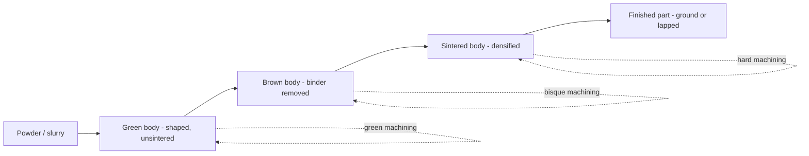
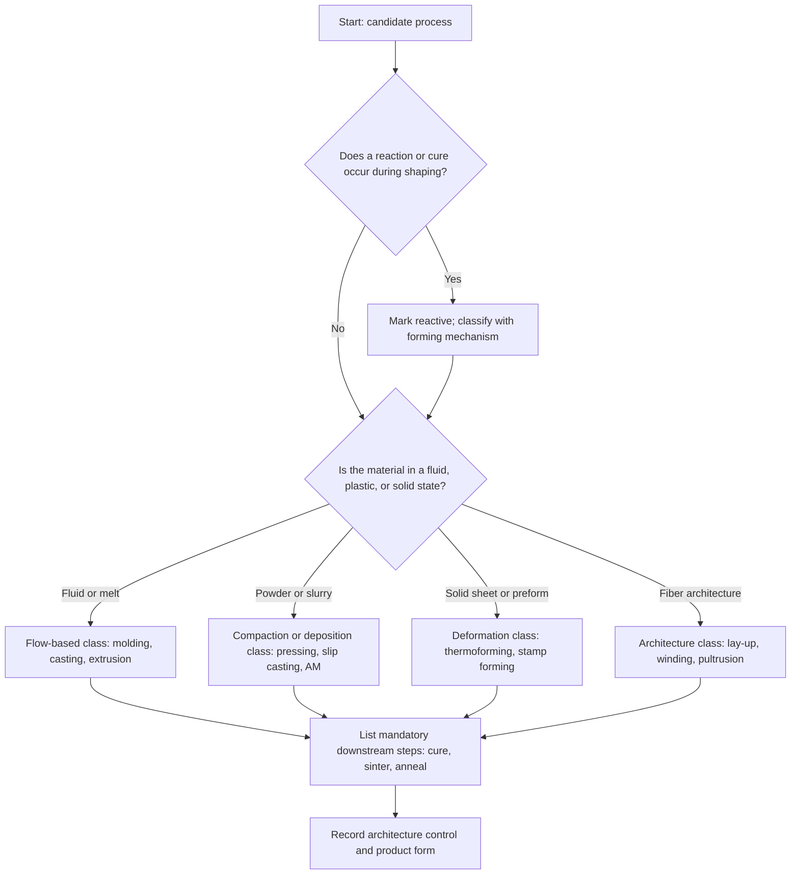

## Classification Challenges Unique to Non-Metallic Materials

### Overview

Manufacturing process classification schemes (casting, forming, machining, joining, additive, and so on) were developed largely around metals, where a single material state diagram, a small set of well-understood deformation mechanisms, and a shared vocabulary (cast, wrought, sintered, heat-treated) let most processes sort into clean categories. Non-metallic materials (polymers, ceramics, glasses, and composites) strain these schemes for structural reasons:

- **The material is often created during the process.** A thermoset does not exist as a solid until the process cures it; a ceramic part does not have its final phase content until sintering; a composite laminate is a material and a part at the same time.
- **Several physical transformations occur in one process step.** Melting, flow, chemical reaction, crystallization, and solidification can overlap.
- **Property, geometry, and microstructure are set simultaneously**, so "shaping" and "conditioning" cannot be cleanly separated.
- **Material families have different governing physics** (viscoelastic flow, brittle fracture, thermally activated diffusion, anisotropic fiber mechanics), so one classification axis rarely fits all.

This topic catalogs the resulting challenges, shows how each breaks a metal-derived taxonomy, and describes practical strategies for classifying processes consistently.

### Baseline: A Metal-Derived Classification

A conventional scheme sorts by the primary physical mechanism of shape creation:

| Class | Mechanism | Typical Metal Example |
| --- | --- | --- |
| Primary shaping (casting) | Liquid to solid in a mold | Sand casting, die casting |
| Deformation | Plastic flow of solid | Forging, rolling, extrusion |
| Material removal | Chip or erosion removal | Turning, milling, EDM |
| Joining | Bonding of parts | Welding, brazing |
| Powder-based | Consolidation of particles | Press and sinter |
| Additive | Layer accretion | Powder bed fusion |
| Property modification | Heat treatment, surface treatment | Quench and temper, carburizing |

This scheme assumes that (a) shaping and property modification are separable, (b) a process name implies a mechanism, and (c) the feedstock is already the final material. Each assumption weakens for non-metals.

### Core Challenge Categories

```mermaid
flowchart TD
    A[Classification challenges for non-metallic materials] --> B[Material-creation coupling]
    A --> C[Multi-mechanism overlap]
    A --> D[Reversibility and state ambiguity]
    A --> E[Feedstock form diversity]
    A --> F[Anisotropy and architecture]
    A --> G[Hybrid and multi-stage routes]
    A --> H[Vocabulary and cross-family ambiguity]

    B --> B1[Thermoset cure]
    B --> B2[Ceramic firing / reaction]
    B --> B3[Composite lay-up = material + part]

    C --> C1[Flow + reaction + crystallization]
    C --> C2[Sintering + shrinkage + densification]

    D --> D1[Thermoplastic recyclable vs thermoset irreversible]
    D --> D2[Green / brown / sintered ceramic states]

    E --> E1[Pellets, powders, slurries, resins, prepregs, preforms]

    F --> F1[Fiber orientation from process]
    F --> F2[Molecular orientation from flow]

    G --> G1[Shape then fire then machine]
    G --> G2[Compound then mold then post-cure]

    H --> H1[Extrusion, casting, molding mean different things]
```

### Challenge 1: Material Creation Coupled to Shaping

**Problem.** In metal casting, the alloy is chosen beforehand and the process only changes its shape and solidification structure. In many non-metallic routes, the process is where the material forms.

- **Thermosets**: Crosslinking reactions convert a low-viscosity liquid into an infusible network during molding. Reaction molding (RIM, RTM) is simultaneously a shaping process and a chemical synthesis step.
- **Ceramics**: Reaction-bonded silicon nitride and reaction-bonded silicon carbide form the final phase during firing. Cement and gypsum-based ceramics set through hydration.
- **Composites**: The laminate's properties come from the stacking sequence and fiber volume fraction chosen during lay-up, so design and manufacture merge.

**Classification consequence.** A category such as "casting" cannot say whether the item is a pure shaping step (thermoplastic melt casting) or a reactive synthesis step (thermoset casting with cure). Two processes with identical tooling can belong to different classes depending on whether a chemical reaction occurs.

**Example.** Polyurethane casting and polyethylene rotational molding both fill a mold under low pressure. The first involves irreversible crosslinking; the second is a physical melt-and-solidify cycle. A geometry-based scheme groups them; a mechanism-based scheme separates them.

### Challenge 2: Overlapping Physical and Chemical Mechanisms

A single polymer process step can involve heat transfer, non-Newtonian flow, crystallization kinetics, chemical reaction, and residual stress development at once. This is why the classification axis is not clean.

**Polymer melt processing example:**

Injection molding of a semicrystalline polymer includes:

1. Melting and mixing (thermal and shear)
2. Flow into the cavity (viscoelastic, shear-thinning)
3. Packing (compressible melt)
4. Cooling with crystallization (phase transformation)
5. Ejection with residual stress and warpage

Shear-thinning behavior is often described by the power-law model:

$$\eta = K \dot{\gamma}^{\,n-1}$$

where $\eta$ is viscosity, $\dot{\gamma}$ is shear rate, $K$ is the consistency index, and $n < 1$ for shear-thinning fluids.

**Ceramic sintering example:**

Sintering combines particle rearrangement, neck growth, grain growth, and densification. A common simplified relation for the initial stage of solid-state sintering is:

$$\left(\frac{\Delta L}{L_0}\right)^{m} = \frac{K(T)}{r^{p}}\, t$$

where $\Delta L / L_0$ is linear shrinkage, $r$ is particle radius, $t$ is time, $K(T)$ is a temperature-dependent constant, and the exponents $m$ and $p$ depend on the dominant diffusion mechanism (for example, volume versus grain boundary diffusion). The exponents vary by mechanism, so actual values must be established for a given material system.

**Classification consequence.** Because several mechanisms coexist, forcing each process into one mechanism bin produces arbitrary boundaries. Practical schemes therefore use a *dominant mechanism* rule, and this rule is a judgment call.

### Challenge 3: Reversibility and Material State Ambiguity

Metals can usually be remelted, so process history can be partially erased. Non-metals differ:

| Material Class | Reversibility | Classification Impact |
| --- | --- | --- |
| Thermoplastics | Repeatedly softenable (subject to degradation) | Melt processes can be reprocessed; regrind changes properties |
| Thermosets | Irreversibly crosslinked | Shaping and curing must be classified together; no remelting route |
| Elastomers (vulcanized) | Irreversible network | Molding plus vulcanization is a coupled step |
| Ceramics (fired) | Not reversible to powder | Green-state and fired-state operations are separate classes |
| Glass | Reversible above softening | Hot forming is repeatable; annealing history matters |

**Ceramic state ladder.** Ceramic parts move through named states, each supporting different operations:

Machining a green body is closer to machining a soft compact, while machining a sintered body is hard-ceramic grinding. A "machining" class without state qualification is therefore too coarse.

### Challenge 4: Feedstock Form Diversity

Metals are typically classified by starting form: ingot, billet, bar, sheet, or powder. Non-metals begin as a much wider range of forms, each implying different process families.

| Family | Feedstock Forms |
| --- | --- |
| Polymers | Pellets, granules, powder, liquid resin, film, filament, solution, monomer |
| Ceramics | Dry powder, slurry, paste, plastic body (clay), sol-gel, preceramic polymer, glass frit |
| Composites | Dry fiber tow, fabric, prepreg, SMC/BMC, commingled yarn, preform, film-stacked laminate |

The same final part geometry can be reached from different feedstocks by different routes. For example, a ceramic tube can be made by extrusion of plastic paste, slip casting, or isostatic pressing of powder. A classification by feedstock therefore disagrees with a classification by shape, and neither agrees with a classification by mechanism.

### Challenge 5: Anisotropy and Process-Induced Architecture

In most metal processes, resulting properties are only weakly directional (rolled sheet and drawn wire are exceptions). In non-metals, the process often *creates* strong directionality.

- **Polymers**: Molecular orientation from flow or drawing gives anisotropic strength, shrinkage, and optical behavior. Fiber spinning, film blowing, and biaxial stretching are defined by the orientation they impart.
- **Fiber composites**: Fiber orientation and stacking sequence determine stiffness and strength.
- **Short-fiber molded parts**: Flow direction determines fiber alignment, so gate location becomes a property-setting decision.

For a unidirectional lamina, longitudinal and transverse stiffness differ greatly. Using the rule of mixtures for the longitudinal case and the inverse rule for the transverse case:

$$E_1 = V_f E_f + (1 - V_f) E_m$$

$$\frac{1}{E_2} = \frac{V_f}{E_f} + \frac{1 - V_f}{E_m}$$

**Example:** For carbon fiber ($E_f = 230$ GPa) in epoxy ($E_m = 3.5$ GPa) at $V_f = 0.60$:

$$E_1 = 0.60 \times 230 + 0.40 \times 3.5 = 138 + 1.4 = 139.4 \text{ GPa}$$

$$\frac{1}{E_2} = \frac{0.60}{230} + \frac{0.40}{3.5} = 0.002609 + 0.114286 = 0.116895 \;\Rightarrow\; E_2 \approx 8.6 \text{ GPa}$$

The ratio $E_1/E_2$ is roughly 16, so the manufacturing route that controls fiber direction is as important as the material itself. Simple rule-of-mixtures estimates are approximations, and measured values will vary with fiber alignment, voids, and interface quality.

**Classification consequence.** Two processes producing the same shape (for example, compression molding of random-mat versus unidirectional prepreg) yield very different property classes. A shape-only or mechanism-only scheme misses this, so an *architecture* attribute is needed.

### Challenge 6: Hybrid and Multi-Stage Process Chains

Metals commonly follow a chain of shape, treat, finish. Non-metallic routes often have more mandatory stages that are part of the *definition* of the process:

- **Ceramics**: powder preparation, forming, drying, binder burnout, sintering, and finishing. Skipping any stage yields no usable part.
- **Thermoset composites**: lay-up, vacuum bagging, cure cycle, demolding, and often post-cure.
- **Rubber**: mixing, forming, vulcanization.
- **Glass**: melting, forming, annealing (annealing is required to relieve stress).

**Classification consequence.** Should "slip casting of porcelain" be classified as one process or as forming plus drying plus firing? Different schemes make different choices, and consistency requires an explicit rule such as: *classify by the stage that establishes the part's macroscopic geometry, and list downstream stages as attributes.*

### Challenge 7: Vocabulary Collisions and Cross-Family Ambiguity

The same process name means different things across material families:

| Term | In Metals | In Polymers | In Ceramics | In Composites |
| --- | --- | --- | --- | --- |
| Casting | Pour molten metal into a mold | Pour liquid resin or monomer that may cure | Slip casting: slurry poured into a porous mold | Resin casting of matrix only |
| Extrusion | Force solid billet through a die | Continuous melt through a die (screw-driven) | Paste or plastic body forced through a die | Pultrusion is a related but distinct process |
| Sintering | Bond metal powder below melting | Rarely used (powder sintering of PTFE, SLS) | Central densification step | Used in ceramic-matrix composites |
| Forging / forming | Plastic deformation of solid | Thermoforming of sheet | Not applicable at room temperature (brittle) | Stamp forming of organosheet |
| Molding | Rare term | Central term (injection, blow, compression) | Pressing into die | Compression, RTM, autoclave |

A classification that reuses metal-based names can mislead. "Extrusion" in polymers is a continuous plasticating process, whereas in metals it is typically a solid-state deformation process.

### Challenge 8: Brittle Versus Ductile and Viscoelastic Behavior

Metal forming classes rely on plastic deformation. Ceramics fracture before significant plastic flow at room temperature, so all forming happens in a non-consolidated state (powder, slurry, plastic paste) or at high temperature (glass viscous flow). Polymers are viscoelastic, so time and temperature define whether they behave as elastic solids, rubbery solids, or viscous liquids.

The temperature dependence of polymer relaxation is often described near and above $T_g$ by the Williams-Landel-Ferry relation:

$$\log a_T = -\frac{C_1 (T - T_{\text{ref}})}{C_2 + (T - T_{\text{ref}})}$$

where $a_T$ is the shift factor and $C_1$, $C_2$ are material constants (values depend on the polymer and reference temperature).

**Classification consequence.** "Cold forming" has a well-defined meaning for metals (below recrystallization) but is ambiguous for polymers, where forming below $T_g$ can cause crazing or cracking, and for ceramics, where cold forming means shaping an unfired compact rather than deforming a solid.

### Challenge 9: Scale, Volume, and Product-Form Ambiguity

Non-metal processes span from commodity bulk production to precision micro-parts, and some are simultaneously material-making and part-making:

- **Fiber spinning** produces a material form (filament) rather than a component.
- **Film extrusion** and **calendering** produce semi-finished sheets.
- **Glass float process** produces flat glass as a continuous ribbon.
- **Prepreg manufacture** produces an intermediate for later molding.

These belong to *intermediate product manufacture*, a class that is less visible in metal schemes, where rolling or drawing usually fits under deformation processes. Non-metal taxonomies commonly need an explicit split between **semi-finished production** and **net-shape or near-net-shape component production**.

### Challenge 10: Additive Manufacturing Across Material Families

Additive manufacturing (AM) standards classify by energy and deposition mechanism (vat photopolymerization, material extrusion, powder bed fusion, binder jetting, material jetting, sheet lamination, directed energy deposition). For non-metals:

- Polymer AM covers most categories, with cure chemistry (photopolymerization) or thermal fusion as the mechanism.
- Ceramic AM often requires a **post-processing chain** (debinding and sintering) that shifts the effective classification toward powder metallurgy-like routes.
- Composite AM adds fiber placement (continuous fiber in a filament) or short-fiber-filled feedstock, introducing architecture attributes.

The same AM class can therefore behave like a shaping-only process for thermoplastics and like a first stage of a multi-stage route for ceramics.

### Summary Table of Challenges

| Challenge | Root Cause | Typical Symptom in a Metal-Derived Scheme | Mitigation |
| --- | --- | --- | --- |
| Material creation coupled to shaping | Cure, reaction, hydration during process | "Casting" mixes physical and reactive processes | Add a reactive vs non-reactive attribute |
| Overlapping mechanisms | Flow, reaction, crystallization occur together | Arbitrary bin assignment | Use a dominant-mechanism rule with documented exceptions |
| Reversibility and state ambiguity | Thermoset, green body, sintered body | Cannot distinguish machining of green vs fired | Add material-state qualifiers |
| Feedstock diversity | Pellets, slurries, prepregs, preforms | Same part reachable from many routes | Add a feedstock-form axis |
| Anisotropy and architecture | Flow and fiber orientation | Same shape, different property class | Add an architecture attribute |
| Multi-stage chains | Mandatory downstream steps | Unclear where process begins and ends | Classify by geometry-setting stage; list downstream steps |
| Vocabulary collisions | Shared names, different physics | Misleading transfer of metal terms | Use material-family-qualified names |
| Brittle / viscoelastic behavior | Different deformation physics | "Cold forming" ambiguity | Define forming by material-specific state |
| Semi-finished vs component | Intermediate product manufacture | Fibers, films, prepregs unplaced | Add a product-form axis |
| AM variation | Post-processing dependence | Same AM class, different behavior | Record post-processing chain |

### A Practical Multi-Axis Classification Approach

Because a single hierarchy cannot represent all of these dimensions, a multi-axis descriptor is more robust. A process is described by a tuple of attributes:

$$P = (M, S, F, R, A, C)$$

where:

- $M$ = material family (polymer, ceramic, glass, composite)
- $S$ = material state during shaping (melt, solution, slurry, powder, paste, solid, prepreg)
- $F$ = forming mechanism (flow into cavity, deposition, compaction, deformation, removal)
- $R$ = reactive character (non-reactive, chemically reactive, thermally activated densification)
- $A$ = architecture control (isotropic, oriented, fiber-controlled)
- $C$ = post-forming chain (none, cure, sinter, anneal, machine)

**Example descriptors:**

| Process | $M$ | $S$ | $F$ | $R$ | $A$ | $C$ |
| --- | --- | --- | --- | --- | --- | --- |
| Injection molding (thermoplastic) | Polymer | Melt | Flow into cavity | Non-reactive | Flow-induced orientation | Cooling, ejection |
| Reaction injection molding | Polymer | Reactive liquid | Flow into cavity | Chemically reactive | Mostly isotropic | Cure |
| Slip casting | Ceramic | Slurry | Casting into porous mold | Non-reactive | Isotropic | Dry, fire |
| Pultrusion | Composite | Wet fiber + resin | Pulling through die | Chemically reactive | Fiber-controlled (0° dominant) | Cure in die |
| Glass blowing / pressing | Glass | Viscous melt | Viscous deformation | Non-reactive | Isotropic | Anneal |
| Binder jetting of ceramic | Ceramic | Powder bed | Layer deposition | Non-reactive | Isotropic | Debind, sinter |

**Decision rules for assignment** (a recommended convention rather than a universal standard):

1. Identify the stage that establishes the macroscopic geometry; that stage names the process.
2. If a chemical reaction sets the final material within that stage, mark $R$ as reactive.
3. List mandatory downstream stages in $C$ rather than creating new process classes.
4. Record material state at shaping in $S$ to disambiguate shared terms.

### Worked Example: Classifying Three Superficially Similar Processes

Consider three processes that all "pour" a fluid into a mold:

1. **Metal die casting** of aluminum.
2. **Polyurethane cast molding**.
3. **Slip casting** of alumina.

| Attribute | Aluminum die casting | Polyurethane casting | Alumina slip casting |
| --- | --- | --- | --- |
| Material family | Metal | Polymer | Ceramic |
| State at shaping | Molten metal | Reactive liquid | Aqueous slurry |
| Solidification driver | Heat loss | Crosslinking reaction | Water removal by porous mold |
| Reactive? | No | Yes | No |
| Post-forming chain | Trim, optional heat treat | Post-cure (optional) | Dry, bisque or sinter |
| Dimensional change | Thermal contraction | Cure shrinkage | Drying plus sintering shrinkage (often large, tens of percent by volume) |

A geometry-based scheme groups all three as "casting." The multi-axis descriptor separates them by driver of solidification and by required downstream steps, which is exactly the information a process planner needs. Shrinkage magnitudes vary considerably with formulation and solids loading, so specific values must be obtained empirically for a given system.

### Implications for Process Planning and Standards

**Key Points**

- Any classification for non-metals should state whether it classifies by *mechanism*, *feedstock*, *geometry*, or *product form*; mixing these silently produces inconsistent categories.
- The material-state qualifier (melt, slurry, green, sintered, prepreg) carries much of the information that "process name" carries for metals.
- Shrinkage and dimensional prediction requires accounting for multiple contributions (thermal, cure, drying, sintering), each of which is process-class specific.
- Recycling and reprocessing behavior (thermoplastic versus thermoset, fired ceramic) is a classification-relevant property because it constrains process chains.
- Existing standards (for example, additive manufacturing terminology and polymer-processing terminology) are family-specific; cross-family comparison requires a mapping layer like the descriptor tuple above.
- Behavior of specific processes varies with equipment, formulation, and process window, so classification should be treated as a planning aid rather than a guarantee of process behavior.

### Conclusion

Non-metallic materials challenge metal-derived process classification because material synthesis is coupled to shaping, multiple physical and chemical mechanisms overlap, reversibility and material state vary widely, feedstock forms are diverse, process-induced anisotropy is central to properties, mandatory multi-stage chains are common, and process vocabulary is inconsistently shared across families. A robust approach replaces a single hierarchy with a multi-axis description (material family, state at shaping, forming mechanism, reactive character, architecture control, and post-forming chain) plus explicit decision rules for naming and boundary cases. This preserves the intuitive process families while capturing the information needed for planning, quality control, and comparison across polymers, ceramics, glasses, and composites.

### Related Topics

- Polymer process classification (melt, solution, reactive, and solid-state routes)
- Ceramic process classification (powder, slurry, plastic, and sol-gel routes)
- Glass forming and annealing classification
- Continuous and batch composite-process classification
- Shrinkage, warpage, and dimensional prediction across non-metallic routes
- Additive manufacturing standards for polymers, ceramics, and composites
- Recycling and reprocessing implications of thermoplastic versus thermoset routes
- Process monitoring and quality control for cure, sintering, and crystallization