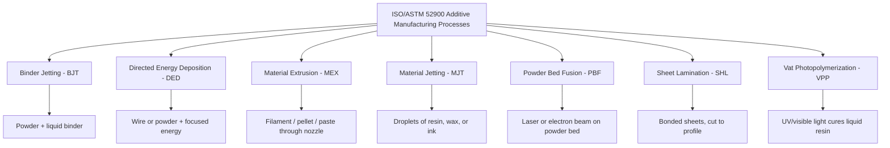
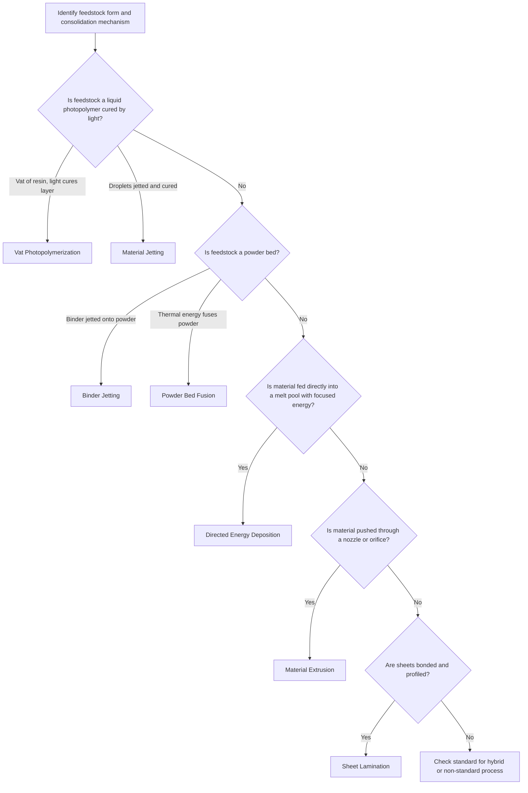

## ISO and ASTM 52900 Seven-Category Framework Overview

### Introduction

ISO/ASTM 52900 is the joint international standard that defines the general principles and terminology of additive manufacturing (AM). Its most widely used contribution to process classification is the grouping of all AM processes into **seven process categories**, defined by the physical mechanism by which material is added and consolidated rather than by brand names, machine vendors, or feedstock alone.

The standard is the product of a partnership between ISO Technical Committee 261 (Additive Manufacturing) and ASTM International Committee F42 (Additive Manufacturing Technologies), formalized under a Partner Standard Development Organization agreement. It superseded the earlier ASTM F2792 terminology standard, which first introduced the seven-category grouping. The current edition is ISO/ASTM 52900:2021, which superseded the 2015 edition. Readers should confirm the latest edition and any amendments directly with ISO or ASTM, since standards are periodically revised.

**Why a seven-category framework matters:**

- Provides a vendor-neutral vocabulary, so "Fused Deposition Modeling" (a trademarked term) and "Fused Filament Fabrication" both map to *material extrusion*
- Enables consistent comparison of capabilities, materials, and limitations across machines
- Supports specification, procurement, qualification, and certification workflows
- Serves as the basis for related standards on qualification, data formats, testing, and design guidelines

### Definition of an Additive Manufacturing Process

The standard defines additive manufacturing as the process of joining materials to make parts or objects from 3D model data, usually layer upon layer, as opposed to subtractive and formative manufacturing methodologies. A **process category** groups together processes that share a common consolidation principle.

The standard also establishes the general workflow terms that apply across all categories:

- **Feedstock**: the raw material supplied to the machine (powder, filament, liquid resin, sheet, wire)
- **Build volume / build space**: the region in which parts can be fabricated
- **Layer**: a single addition step of material
- **Build platform**: the surface on which the part is constructed
- **Support structure**: auxiliary geometry that anchors or stabilizes a part
- **Post-processing**: operations performed after the build (depowdering, curing, sintering, machining, surface finishing, heat treatment)

### The Seven Process Categories at a Glance

| # | Category | Core Mechanism | Typical Feedstock |
| --- | --- | --- | --- |
| 1 | Binder Jetting (BJT) | Liquid binding agent selectively deposited to join powder | Powder (metal, ceramic, sand, polymer) |
| 2 | Directed Energy Deposition (DED) | Focused thermal energy fuses material as it is deposited | Wire or powder (mostly metal) |
| 3 | Material Extrusion (MEX) | Material selectively dispensed through a nozzle or orifice | Thermoplastic filament, pellets, paste |
| 4 | Material Jetting (MJT) | Droplets of build material selectively deposited | Photopolymer, wax, nanoparticle inks |
| 5 | Powder Bed Fusion (PBF) | Thermal energy selectively fuses regions of a powder bed | Polymer, metal, ceramic powder |
| 6 | Sheet Lamination (SHL) | Sheets of material bonded to form a part | Paper, plastic film, metal foil or sheet |
| 7 | Vat Photopolymerization (VPP) | Liquid photopolymer in a vat selectively cured by light | Liquid photopolymer resin |

### Category 1: Binder Jetting (BJT)

**Definition.** An additive manufacturing process in which a liquid bonding agent is selectively deposited to join powder materials.

**Mechanism.** A recoater spreads a thin powder layer. An inkjet-style print head then deposits binder droplets in the cross-section pattern. The build platform lowers by one layer thickness, and the cycle repeats. The resulting "green" part is held together by binder and is fragile until post-processed.

**Typical process chain:**

1. Spread powder layer
2. Jet binder in the layer pattern
3. Dry or partially cure binder (machine-dependent)
4. Repeat to complete the build
5. Cure, depowder, and handle green part
6. For metal and ceramic parts: debind and sinter (often with infiltration)

**Key characteristics:**

- No thermal energy source in the build chamber, so residual stress during the build is low
- Unbound powder supports overhangs, so support structures are usually not needed
- Sintering shrinkage must be compensated; it is often substantial and material-dependent

A first-order shrinkage compensation for isotropic linear shrinkage relates the printed (green) dimension $L_g$ to the target sintered dimension $L_s$:

$$L_g = \frac{L_s}{1 - \varepsilon}$$

where $\varepsilon$ is the fractional linear shrinkage. **Example:** If a metal binder jetting process shows about 18 % linear shrinkage ($\varepsilon = 0.18$) and the target sintered dimension is 50 mm, the green dimension is $L_g = 50 / 0.82 \approx 60.98$ mm. Real shrinkage is generally anisotropic (often different in the build direction) and must be calibrated for each material, powder lot, and furnace cycle.

**Materials:** metals (stainless steels, tool steels, nickel alloys), ceramics, sand for casting molds and cores, and full-color gypsum-type materials.

**Typical applications:** sand molds and cores, metal parts in medium to high volume, ceramic components, and visual models.

### Category 2: Directed Energy Deposition (DED)

**Definition.** An additive manufacturing process in which focused thermal energy is used to fuse materials by melting as they are being deposited.

**Mechanism.** A deposition head simultaneously delivers feedstock (powder through nozzles or wire) and focused energy (laser, electron beam, or plasma/electric arc) to a melt pool on a substrate or existing part. The head, the part, or both move (often on a multi-axis robot or gantry) to trace the geometry.

**Common sub-variants (informal names, vendor and community usage varies):**

- Laser-based powder DED (often called LENS, DMD, or laser cladding-based AM)
- Laser or arc wire-fed DED
- Wire arc additive manufacturing (WAAM)
- Electron beam wire-fed DED

**Key characteristics:**

- High deposition rates and large build envelopes compared to PBF
- Suited to **repair, cladding, and feature addition** on existing components
- Coarser feature resolution and rougher surface finish than PBF; near-net shape usually requires machining
- Can produce functionally graded materials by varying feedstock composition during deposition
- Often operated in inert gas environments or shielded chambers for reactive metals

A useful first-order descriptor is the volumetric energy input per unit deposited length (linear heat input):

$$Q = \frac{\eta \, P}{v}$$

where $P$ is beam or arc power, $v$ is travel speed, and $\eta$ is absorption efficiency (which varies with process and material). Higher $Q$ tends to increase melt pool size and heat-affected zone, influencing microstructure and distortion; actual effects depend on alloy and geometry.

**Materials:** titanium alloys, nickel superalloys, stainless steels, aluminum alloys, cobalt-chromium, and tool steels.

### Category 3: Material Extrusion (MEX)

**Definition.** An additive manufacturing process in which material is selectively dispensed through a nozzle or orifice.

**Mechanism.** Thermoplastic filament (or pellets, or a paste) is heated in a liquefier and extruded through a nozzle, deposited along toolpaths, and solidifies on cooling. Each layer bonds to the previous layer through thermal diffusion at the interface.

**Related terms.** Fused Deposition Modeling (FDM) is a trademark; the generic term is Fused Filament Fabrication (FFF). The standard's *material extrusion* also covers pellet-fed large-format systems, direct ink writing (paste extrusion), and bioprinting by extrusion.

**Key characteristics:**

- Broad material range and low equipment cost
- **Anisotropic properties**: strength across layers (Z direction) is typically lower than along deposited roads, because bonding depends on interlayer diffusion
- Requires supports for overhangs
- Visible layer lines; surface finish depends on layer height and nozzle diameter

**Governing considerations:**

Volumetric flow rate through the nozzle is limited by melting capacity. A simple relationship for deposition rate is:

$$\dot{V} = w \cdot h \cdot v$$

where $w$ is extrusion width, $h$ is layer height, and $v$ is print speed. **Example:** With $w = 0.4$ mm, $h = 0.2$ mm, and $v = 60$ mm/s, $\dot{V} = 0.4 \times 0.2 \times 60 = 4.8$ mm³/s. The hot end must be able to melt and deliver at least this flow, so real maximum speeds are constrained by heater power and material.

**Materials:** PLA, ABS, PETG, nylon, polycarbonate, PEEK and PEKK (high-temperature systems), fiber-reinforced filaments, ceramic and metal pastes (which need debinding and sintering).

**Common defects:** warping, stringing, under-extrusion, delamination between layers, and poor bridging.

### Category 4: Material Jetting (MJT)

**Definition.** An additive manufacturing process in which droplets of build material are selectively deposited.

**Mechanism.** Print heads similar to industrial inkjet heads deposit droplets of photopolymer or wax onto the build platform. Photopolymer droplets are cured immediately by UV lamps. Multiple print heads can deposit different materials in the same layer, including a dissolvable or removable support material.

**Key characteristics:**

- Very high resolution and smooth surface finish
- **Multi-material and multi-color capability** within a single build
- Support material required for overhangs and removed by water jet, dissolution, or melting
- Photopolymer parts can be less thermally and mechanically robust than thermoplastic parts and can be sensitive to UV and long-term aging

Droplet formation in jetting is often characterized by dimensionless groups. The **Ohnesorge number** relates viscous, inertial, and surface tension forces:

$$Oh = \frac{\mu}{\sqrt{\rho \, \sigma \, d}}$$

where $\mu$ is dynamic viscosity, $\rho$ is density, $\sigma$ is surface tension, and $d$ is a characteristic length (typically nozzle diameter). Stable drop-on-demand jetting is generally reported within a limited range of $Oh$ (commonly quoted as roughly between 0.1 and 1 in the literature); the exact window depends on head design and fluid, so this should be treated as a guideline rather than a fixed limit.

**Materials:** photopolymers (rigid, flexible, transparent, and digital-blend materials), wax-like casting materials, and research inks containing ceramic or metal nanoparticles.

**Typical applications:** high-fidelity prototypes, anatomical models, dental and medical models, jewelry casting patterns, and multi-material visual models.

### Category 5: Powder Bed Fusion (PBF)

**Definition.** An additive manufacturing process in which thermal energy selectively fuses regions of a powder bed.

**Mechanism.** A recoater spreads a thin, uniform layer of powder over the build area. A focused energy source (laser or electron beam), or in some polymer systems an infrared lamp plus a fusing agent, melts or sinters the cross-section. The platform lowers and the sequence repeats.

**Sub-variants:**

| Sub-variant | Energy Source | Typical Materials | Notes |
| --- | --- | --- | --- |
| Laser Powder Bed Fusion of polymers (SLS) | CO₂ or fiber laser | PA11, PA12, TPU, PP | Unfused powder supports parts; no supports needed |
| Laser Powder Bed Fusion of metals (LPBF, also called SLM or DMLS by vendors) | Fiber laser | Ti-6Al-4V, Inconel, stainless steel, aluminum alloys, CoCr | Requires supports for thermal management and anchoring; inert atmosphere |
| Electron Beam Melting (EBM) | Electron beam in vacuum | Titanium alloys, CoCr, some nickel alloys | Preheated powder bed reduces residual stress; vacuum environment |
| Multi Jet Fusion (MJF) and High Speed Sintering | Infrared lamps with fusing/detailing agents | PA12, PA11, TPU | Agent-based selective heating; vendor-specific terms |

**Key characteristics:**

- Fine feature resolution and good mechanical properties, especially for metals
- Powder handling, recoating quality, and powder reuse strategy strongly influence quality
- Metal PBF develops significant residual stresses, so supports, preheating, stress-relief heat treatment, and build orientation are critical
- Common metal defects: lack of fusion porosity, keyholing, balling, spatter, and distortion

**Volumetric energy density (VED)** is a widely used first-order process descriptor for laser PBF:

$$E_v = \frac{P}{v \cdot h_s \cdot t}$$

where $P$ is laser power (W), $v$ is scan speed (mm/s), $h_s$ is hatch spacing (mm), and $t$ is layer thickness (mm), giving units of J/mm³. **Example:** With $P = 200$ W, $v = 1000$ mm/s, $h_s = 0.10$ mm, and $t = 0.03$ mm:

$$E_v = \frac{200}{1000 \times 0.10 \times 0.03} = \frac{200}{3} \approx 66.7 \text{ J/mm}^3$$

VED is a convenient comparative metric, but it does not capture melt pool dynamics, and different parameter combinations giving the same $E_v$ can produce different densities and microstructures. Optimal windows are material and machine specific.

**Typical applications:** aerospace brackets, lattice and topology-optimized parts, medical implants, tooling with conformal cooling, and functional polymer parts in low to medium volume.

### Category 6: Sheet Lamination (SHL)

**Definition.** An additive manufacturing process in which sheets of material are bonded to form a part.

**Mechanism.** Layers of sheet stock are bonded (by adhesive, ultrasonic welding, brazing, or diffusion bonding) and cut to the cross-section profile by laser, blade, or machining. Cutting may occur before or after bonding depending on the variant.

**Sub-variants:**

- **Laminated Object Manufacturing (LOM)**: paper or plastic sheets bonded with adhesive and cut with a laser or blade
- **Ultrasonic Additive Manufacturing (UAM)**: metal foils bonded by ultrasonic vibration and pressure, with intermittent CNC machining
- **Selective lamination composite object manufacturing** and related variants for composites

**Key characteristics:**

- Relatively low material and equipment cost for some variants; good for large parts
- UAM can embed sensors, fibers, and electronics between layers, since bonding is solid-state and low temperature
- Waste material (cut-away sheet) is generated
- Dimensional accuracy in the Z direction depends on sheet thickness
- Mechanical properties in the build direction depend on interlayer bond quality

**Materials:** paper, plastic films, aluminum, copper, stainless steel and titanium foils, and composite prepreg sheets.

Sheet lamination is comparatively less prevalent industrially than PBF or MEX, but it remains a formal standard category and has specialized applications.

### Category 7: Vat Photopolymerization (VPP)

**Definition.** An additive manufacturing process in which liquid photopolymer in a vat is selectively cured by light-activated polymerization.

**Mechanism.** A light source cures a thin layer of liquid photopolymer resin, which then adheres to the previous layer or platform. Curing converts liquid monomers or oligomers to a crosslinked solid.

**Sub-variants:**

| Sub-variant | Light Delivery | Notes |
| --- | --- | --- |
| Stereolithography (SLA / SL) | Scanning UV laser | The first commercial AM technology |
| Digital Light Processing (DLP) | Projector exposes entire layer at once | Faster layer exposure |
| Masked SLA (mSLA) / LCD-based | LCD mask with LED array | Low-cost desktop systems |
| Continuous liquid interface / continuous exposure methods (e.g., CLIP) | Oxygen-permeable window creates a dead zone, enabling continuous printing | Vendor-specific implementations |
| Two-photon polymerization | Femtosecond laser, focal-volume curing | Sub-micron features; research and microfabrication |

**Key characteristics:**

- Excellent surface finish and fine detail
- Requires supports and post-processing: washing, post-cure, and support removal
- Resin toxicity, handling requirements, and waste management need attention
- Photopolymer parts can be brittle and may degrade under UV or thermal aging, depending on formulation
- Tough, high-temperature, elastomeric, castable, biocompatible, and ceramic-filled resins exist, but property claims are formulation-specific

**Cure depth** is commonly described by the Jacobs working curve:

$$C_d = D_p \ln\!\left(\frac{E}{E_c}\right)$$

where $C_d$ is cure depth, $D_p$ is resin penetration depth, $E$ is the exposure energy dose per unit area, and $E_c$ is the critical exposure required to initiate gelation. **Example:** For $D_p = 0.15$ mm and $E_c = 10$ mJ/cm², an exposure of $E = 40$ mJ/cm² gives $C_d = 0.15 \times \ln(4) \approx 0.21$ mm, which exceeds a 0.10 mm layer thickness and ensures interlayer bonding. In practice $D_p$ and $E_c$ must be measured for each resin and light source.

**Typical applications:** dental models, aligners molds, surgical guides, jewelry casting patterns, high-detail prototypes, hearing-aid shells, and microfluidic devices.

### Comparative Analysis

| Attribute | BJT | DED | MEX | MJT | PBF | SHL | VPP |
| --- | --- | --- | --- | --- | --- | --- | --- |
| Consolidation mechanism | Binder adhesion | Melting | Thermal bonding of extrudate | Photocuring of droplets | Selective melting or sintering | Sheet bonding | Photopolymerization |
| Energy source | None during build (heat for sinter/cure) | Laser, e-beam, arc | Heater | UV lamp | Laser, e-beam, IR | Ultrasonic, adhesive, laser cut | UV laser, projector, LED |
| Typical materials | Metal, ceramic, sand | Metal | Polymer | Photopolymer | Polymer, metal | Paper, foil, film | Photopolymer |
| Support needed | Usually no | Sometimes (or multi-axis) | Yes for overhangs | Yes | Metal: yes; polymer: no | Not in the usual sense | Yes |
| Resolution | Medium | Low | Low to medium | Very high | High | Medium | Very high |
| Build rate | High (area-wise) | Very high | Low to medium | Medium | Medium | Medium to high | Medium |
| Multi-material | Limited | Possible (graded) | Possible (multi-nozzle) | Strong | Limited | Possible | Limited |
| Post-processing | Sinter, infiltrate, depowder | Machining | Support removal, smoothing | Support removal | Depowder, heat treat, machining | Trim, machine | Wash, post-cure |

### Classification Logic and Decision Aid

The framework classifies a process by **how material is deposited and consolidated**. A practical decision path:

**Boundary cases and common confusions:**

- **Material jetting versus binder jetting**: in material jetting, the jetted droplets *are* the build material; in binder jetting, the jetted liquid is only a binder joining separate powder.
- **Material jetting versus vat photopolymerization**: both use photopolymers, but vat processes cure a resin bath while jetting deposits discrete droplets.
- **DED versus PBF**: in DED, feedstock is delivered at the point of energy input; in PBF, powder is pre-spread as a bed.
- **Material extrusion of metal or ceramic paste**: still classified as material extrusion, with debinding and sintering as post-processing steps.
- **Multi Jet Fusion**: classified under powder bed fusion because the powder bed is thermally fused, even though agents are jetted; agent jetting selects regions but the fusion is thermally driven.
- **Hybrid machines** (additive plus subtractive in one platform): the additive portion is classified by its own category; the standard does not define a separate category for hybrids.

### Complementary Standards and Frameworks

The seven categories are a foundation; related standards address other facets:

| Facet | Related Standard (examples; verify current editions) |
| --- | --- |
| General principles and terminology | ISO/ASTM 52900 |
| Data formats | ISO/ASTM 52915 (Additive Manufacturing File Format, AMF); 3MF is an industry consortium format |
| Design guidelines | ISO/ASTM 52910, and process-specific parts of the ISO/ASTM 52911 series |
| Qualification principles | ISO/ASTM 52920, ISO/ASTM 52930 |
| Feedstock and material specifications | Material-specific ASTM F-series standards (for example, for Ti-6Al-4V, stainless steel, nickel alloys, and polymer powders) |
| Testing of parts | ISO/ASTM 52903, 52904 and other test standards |
| Coordinate systems and test methodologies | ISO/ASTM 52921 |

A number of these standards continue to evolve, and the numbering and scope should be confirmed against the current ISO and ASTM catalogs before citation in specifications.

### Strengths and Limitations of the Framework

**Strengths**

- Neutral, mechanism-based vocabulary that outlasts individual product names
- Broad adoption in industry, academia, procurement, and regulation
- Clear anchor for process-specific qualification and material standards

**Limitations**

- Some modern processes straddle categories (for example, hybrid processes, volumetric or tomographic printing, cold spray additive manufacturing, and friction-based solid-state processes) and may not have an unambiguous placement [Inference: classification of newer processes may require standard revisions or interpretive guidance].
- The categories describe the *forming mechanism* but not material family, energy source detail, or automation level, so they do not by themselves define capability.
- The same category can span very different equipment and price points (for example, desktop FFF versus large-format pellet extrusion versus high-temperature PEEK systems).
- Vendor marketing terms often do not match the standard's terms, so mapping is needed.

### Practical Guidance for Use

**Key Points**

- Use the standard's category names in specifications, RFQs, and technical drawings notes to avoid ambiguity; reference the specific edition.
- Combine the process category with material specification, machine class, and post-processing route when defining a manufacturing procedure.
- Recognize that qualification, inspection, and design rules are process-category specific: powder bed fusion metals need powder lot control and heat treatment specifications; vat photopolymerization needs resin lot and post-cure control; binder jetting needs sintering shrinkage compensation.
- Treat quoted numeric values (resolution, speed, tolerance) as machine- and material-dependent; behavior may vary with equipment, settings, and part geometry.

**Example mapping of vendor terms to categories:**

| Vendor or common term | ISO/ASTM 52900 category |
| --- | --- |
| FDM, FFF | Material Extrusion |
| SLA, DLP | Vat Photopolymerization |
| SLS, SLM, DMLS, EBM, MJF | Powder Bed Fusion |
| PolyJet, MultiJet (wax/photopolymer jetting) | Material Jetting |
| Binder jet sand or metal printing | Binder Jetting |
| LENS, DMD, WAAM, laser wire DED | Directed Energy Deposition |
| LOM, UAM | Sheet Lamination |

### Conclusion

The ISO/ASTM 52900 seven-category framework classifies additive manufacturing by the physical principle of material addition and consolidation: Binder Jetting, Directed Energy Deposition, Material Extrusion, Material Jetting, Powder Bed Fusion, Sheet Lamination, and Vat Photopolymerization. This mechanism-based taxonomy provides a stable vocabulary that maps trademarked and vendor-specific names onto common categories, supports process selection and comparison, and anchors related standards for design, qualification, materials, and testing. Its limits appear at the edges (hybrid, solid-state, and volumetric processes), where interpretation or standard revision may be needed. Effective use pairs the category with material, machine, parameter, and post-processing definitions.

### Next Steps

- Process-specific deep dives for each category (parameters, defects, and qualification)
- Material families and feedstock specifications per category
- Post-processing chains (depowdering, debinding and sintering, heat treatment, HIP, surface finishing)
- Design for additive manufacturing rules by category
- Qualification, certification, and in-process monitoring approaches
- Hybrid and emerging processes (cold spray, volumetric printing, friction-based solid-state AM)
- Selection methodology: choosing a category by material, geometry, volume, and cost