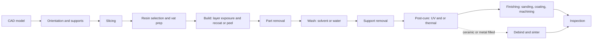

## Vat Photopolymerization Classification

### Introduction

Vat photopolymerization (VPP) is one of the seven additive manufacturing (AM) process categories defined in ISO/ASTM 52900, described as a process in which liquid photopolymer in a vat is selectively cured by light-activated polymerization. It was the first commercialized AM technology (stereolithography, 1980s) and remains the reference category for high-resolution, smooth-surface polymer parts.

Within the category, sub-classification is not formally standardized to the same depth as the top-level seven categories. In practice, the literature and industry classify VPP along several independent axes:

1. **Light delivery and patterning method** (point scanning, mask projection, digital mask, volumetric)
2. **Vat and build orientation** (bottom-up "constrained surface" versus top-down "free surface")
3. **Layer separation and recoating mechanism** (peel, slide, tilt, oxygen-inhibition dead zone, recoater blade)
4. **Photopolymerization chemistry** (free-radical, cationic, hybrid, thiol-ene, and others)
5. **Resin and material type** (unfilled, ceramic-filled, metal-filled, hydrogel, elastomeric, and so on)
6. **Photon absorption mode** (single-photon versus multi-photon)
7. **Scale and resolution class** (macro, micro, nano)

Sub-variant names such as SLA, DLP, and CLIP are widely used, but some are vendor trademarks. The mapping below uses generic descriptions and notes where names are commercial. Readers should verify current standard editions and vendor specifics, since terminology and product lines evolve.

```mermaid
flowchart TD
    A[Vat Photopolymerization - ISO/ASTM 52900] --> B[By light patterning method]
    A --> C[By vat and build orientation]
    A --> D[By layer separation mechanism]
    A --> E[By photopolymerization chemistry]
    A --> F[By material type]
    A --> G[By photon absorption mode]

    B --> B1[Vector scanning - SLA]
    B --> B2[Mask projection - DLP / LCD]
    B --> B3[Continuous exposure - CLIP-type]
    B --> B4[Volumetric - tomographic]

    C --> C1[Bottom-up / constrained surface]
    C --> C2[Top-down / free surface]

    D --> D1[Peel / tilt / slide]
    D --> D2[Oxygen dead zone]
    D --> D3[Recoater blade]

    E --> E1[Free-radical acrylate]
    E --> E2[Cationic epoxy]
    E --> E3[Hybrid systems]

    F --> F1[Unfilled photopolymer]
    F --> F2[Ceramic-filled slurry]
    F --> F3[Metal-filled / hydrogel / elastomer]

    G --> G1[Single-photon]
    G --> G2[Two-photon polymerization]
```

### Fundamental Principle

A photoinitiator absorbs light and generates reactive species (radicals or cations) that initiate chain-growth polymerization of monomers and oligomers, converting liquid resin into a crosslinked solid network. Solidification is confined spatially by the light dose distribution and temporally by the exposure schedule.

**Core physical relationships**

The intensity of light decays with depth $z$ in the resin according to the Beer-Lambert law:

$$I(z) = I_0 \, e^{-z / D_p}$$

where $I_0$ is surface irradiance and $D_p$ is the resin penetration depth (the depth at which intensity falls to $1/e$ of its surface value).

Combining this with a threshold gelation dose gives the **Jacobs working curve** for cure depth $C_d$:

$$C_d = D_p \ln\!\left(\frac{E}{E_c}\right)$$

where $E$ is the exposure dose (energy per unit area) and $E_c$ is the critical exposure at which the resin gels. Cure depth grows logarithmically with exposure, and both $D_p$ and $E_c$ are resin and wavelength specific, so they must be measured for each material and light source.

Layer thickness is typically chosen smaller than $C_d$ so adjacent layers bond (overcure):

$$C_d > t_{\text{layer}}$$

**Example:** For $D_p = 0.12$ mm, $E_c = 8$ mJ/cm², and exposure $E = 32$ mJ/cm²:

$$C_d = 0.12 \times \ln(4) \approx 0.166 \text{ mm}$$

A 0.05 mm layer would be overcured by about 0.116 mm, ensuring interlayer adhesion. Excessive overcure, however, reduces feature accuracy through lateral and vertical light bleed.

### Classification 1: By Light Patterning Method

This is the most common way to divide VPP sub-variants.

#### 1a. Vector Scanning (Stereolithography, SLA)

A focused UV laser spot is steered by galvanometer mirrors (or, in some systems, a motion stage) to trace the cross-section, curing the resin along scan paths.

- Spot size sets the minimum feature width (often tens to a few hundred micrometers, machine-dependent)
- Build time depends on scan path length and speed, so it scales with part cross-sectional area and feature count
- Large build volumes are practical because spot size is decoupled from build area
- Scan strategies (outline plus hatch) influence accuracy and residual stress

**Typical scan-related dose relation.** The exposure delivered at a point by a scanning Gaussian beam depends on power $P$, scan speed $v$, and beam radius $w_0$. The peak exposure along the scan line is often approximated as:

$$E_{\max} = \sqrt{\frac{2}{\pi}} \, \frac{P}{w_0 \, v}$$

Higher speed or lower power reduces dose; the constants in this expression depend on the beam profile model, so it should be treated as a design estimate.

#### 1b. Mask Projection (Digital Light Processing, DLP)

A digital micromirror device (DMD) or similar spatial light modulator projects an entire layer image at once.

- Layer exposure time is largely independent of cross-sectional area within the projection field
- Resolution is set by pixel pitch and optical magnification; pixel size in the build plane is $p = \dfrac{W_{\text{build}}}{N_{\text{pixels}}}$ where $W_{\text{build}}$ is the projected width and $N_{\text{pixels}}$ is the pixel count across that width
- Trade-off: a fixed pixel count means higher resolution reduces the achievable build area unless multiple projectors or stitching are used
- Pixelation produces stair-step edges within a layer, sometimes mitigated by grayscale or anti-aliasing techniques

**Example:** A 1920-pixel-wide projector imaging onto a 96 mm wide build area gives $p = 96 / 1920 = 0.05$ mm (50 µm) pixel size.

#### 1c. LCD Masked Stereolithography (mSLA / LCD-based)

A monochrome LCD panel acts as a mask in front of an LED array (commonly UV, around 405 nm).

- Low cost and full-layer exposure like DLP
- LCD transmittance and heat management limit light throughput and panel lifetime
- Collimated backlighting affects edge sharpness and uniformity

#### 1d. Continuous Exposure and Continuous Liquid Interface Methods

An oxygen-permeable window forms a thin "dead zone" where oxygen inhibits polymerization, keeping a liquid film between the cured part and the window. This removes the peel step and allows continuous rather than layer-by-layer motion. The dead-zone thickness depends on resin chemistry, oxygen supply, and light intensity; commercial implementations (for example CLIP) are vendor-specific. Other continuous approaches use different means (for example, controlled fluid films or moving windows) to reduce separation forces.

#### 1e. Volumetric Additive Manufacturing (Tomographic)

Light patterns are projected from many angles into a rotating volume of photopolymer, so the cumulative 3D dose distribution exceeds the gelation threshold only in the target shape. No layers or recoating are needed.

- Very fast for suitable geometries (seconds to minutes)
- Requires resins with high transparency and appropriate photoinitiation and inhibition characteristics
- Currently an emerging technology, with limits on resolution, material range, and scalability [Inference: future standards may treat it as a distinct VPP subclass or as a separate category, depending on committee decisions]

#### 1f. Two-Photon Polymerization (2PP / Direct Laser Writing)

A femtosecond pulsed near-infrared laser is tightly focused into the resin. Polymerization occurs only where the photon flux is high enough for simultaneous two-photon absorption, giving sub-micron voxels.

The two-photon absorption rate scales with the square of intensity:

$$R_{2\text{PA}} \propto \sigma_2 \, I^2$$

where $\sigma_2$ is the two-photon absorption cross-section. Because of this quadratic dependence, polymerization is confined to the focal volume, enabling true 3D writing inside a resin block without layer-by-layer recoating. Throughput is low compared to single-photon methods, so 2PP is used for micro-optics, photonic structures, microneedles, and scaffolds.

### Classification 2: By Vat and Build Orientation

| Configuration | Description | Advantages | Limitations |
| --- | --- | --- | --- |
| **Bottom-up (constrained surface, "inverted")** | Light enters from below through a transparent vat window; part hangs from a build platform that lifts out of the resin | Small resin volume needed; thin controlled layers set by window gap; no recoating over cured surface | Separation (peel) force between the cured layer and window; supports required; window wear |
| **Top-down (free surface)** | Light enters from above; platform lowers into a resin vat; a recoater or wiper levels the surface | Larger build volumes; no separation from a window; parts are submerged and supported by resin | Large resin volume; layer thickness control depends on surface leveling and viscosity; oxygen and evaporation effects |

**Separation force consideration.** In bottom-up systems, the force needed to detach the newly cured layer from the window scales with contact area and interface adhesion and includes a hydrodynamic (suction) component that grows with viscosity and peel speed. A frequently cited approximate form for the viscous separation contribution between parallel plates separated at velocity $v_s$ is:

$$F_{\text{visc}} \approx \frac{3 \pi \mu R^{4} v_s}{2 h^{3}}$$

where $\mu$ is viscosity, $R$ is the circular contact radius, and $h$ is the gap between surfaces (this Stefan-type squeeze-film relation assumes a circular geometry and Newtonian fluid; actual systems deviate, so it is an order-of-magnitude guide). The strong dependence on $R^4$ and $h^{-3}$ explains why large cross-sections and thin gaps make separation difficult, and why designs use tilting, sliding, flexible films, or oxygen-permeable windows.

### Classification 3: By Layer Separation and Recoating Mechanism

| Mechanism | Principle | Notes |
| --- | --- | --- |
| **Vertical peel** | Platform lifts and pulls the layer straight off a (often silicone or FEP-coated) window | Simple; high peak force for large areas |
| **Tilt peel** | The vat tilts to peel progressively | Reduces peak force; adds mechanical complexity |
| **Slide / lateral shear** | Layer is slid off a film or window | Lowers normal separation force |
| **Flexible film / cyclic vat** | Flexible membrane deforms to release layer | Reduces peak forces; membrane wear |
| **Oxygen dead zone** | Oxygen-permeable window maintains liquid layer | Removes peel; needs oxygen supply |
| **Recoater blade / wiper (top-down)** | Blade levels resin surface before exposure | Layer uniformity depends on resin viscosity and blade gap |
| **Dip-and-level (deep-dip)** | Platform moves down past layer depth, then up to correct thickness | Settling time needed for viscous resins |

### Classification 4: By Photopolymerization Chemistry

The chemical mechanism strongly affects cure speed, shrinkage, oxygen sensitivity, mechanical properties, and post-processing needs.

| Chemistry | Mechanism | Typical Monomers | Key Traits |
| --- | --- | --- | --- |
| **Free-radical** | Radicals from photoinitiator start chain growth | Acrylates, methacrylates | Fast cure; oxygen inhibition at surface; relatively high volumetric shrinkage; wide formulation flexibility |
| **Cationic** | Photoacid generator produces cations that open rings | Epoxides, oxetanes, vinyl ethers | Lower shrinkage; not inhibited by oxygen but sensitive to moisture and basic species; "dark cure" continues after light off; slower than acrylates |
| **Hybrid (radical + cationic)** | Interpenetrating or dual networks | Acrylate-epoxy blends | Balances speed, shrinkage, and toughness; common in engineering resins |
| **Thiol-ene / thiol-yne** | Step-growth radical mechanism | Multifunctional thiols with alkenes or alkynes | Reduced oxygen inhibition and shrinkage stress; more uniform networks |
| **Dual-cure (photo plus thermal or other)** | Light shapes part; second reaction completes network | Polyurethane, epoxy, and other systems | Improved isotropy and mechanical properties; requires a post-bake |
| **Photoinduced click and other emerging chemistries** | Various | Research systems | Tailored network architectures |

**Free-radical kinetics (simplified).** The polymerization rate under steady-state radical conditions is often approximated as:

$$R_p = k_p [M] \left( \frac{\Phi \, I_a}{k_t} \right)^{1/2}$$

where $k_p$ is the propagation rate constant, $[M]$ is monomer concentration, $\Phi$ is initiation quantum yield, $I_a$ is absorbed light intensity, and $k_t$ is the termination rate constant. Rate scales with the square root of absorbed intensity under these assumptions, and oxygen inhibition, gelation-limited diffusion (autoacceleration), and vitrification cause deviations in real resins.

**Volumetric shrinkage** during cure produces residual stress and distortion. The volumetric shrinkage fraction is:

$$S_v = \frac{\rho_{\text{cured}} - \rho_{\text{liquid}}}{\rho_{\text{cured}}}$$

Acrylate resins commonly exhibit several percent volumetric shrinkage (formulation dependent), while ring-opening cationic systems generally show less; precise values depend on the specific resin and conversion.

### Classification 5: By Material Type

| Material Class | Composition | Post-Processing | Applications |
| --- | --- | --- | --- |
| **Standard unfilled photopolymer** | Acrylate or epoxy oligomers, monomers, photoinitiators | Wash, post-cure | Prototypes, visual models |
| **Tough, durable, and engineering resins** | Toughened or hybrid networks | Wash, post-cure (thermal in some) | Functional prototypes, jigs and fixtures |
| **High-temperature resins** | Highly crosslinked or filled networks | Extended post-cure, thermal bake | Tooling, molds |
| **Flexible and elastomeric resins** | Low crosslink density oligomers | Wash, post-cure | Gaskets, wearables |
| **Castable resins** | Low-ash, burnout-friendly formulations | Investment casting burnout | Jewelry, dental patterns |
| **Biocompatible resins** | Formulated for dental, surgical guides, aligner molds | Validated wash and cure protocols | Dental, medical [certification depends on the specific product and regulatory regime] |
| **Ceramic-filled slurry** | Ceramic powder (alumina, zirconia, silica, and others) in photocurable binder | Debinding, sintering | Ceramic parts, cores, biomedical components |
| **Metal-filled resin** | Metal powder in photocurable binder | Debinding, sintering | Small metal parts (research and specialty) |
| **Hydrogels** | Photocrosslinkable water-swollen polymers (for example methacrylated gelatin, PEG-DA) | Rinse, swelling equilibrium | Tissue engineering, soft robotics |
| **Shape-memory and 4D-printed resins** | Networks with programmable thermomechanical response | Post-cure, programming | Actuators, adaptive devices |

**Ceramic VPP note.** For ceramic-filled slurries the cure depth is reduced and scattering matters. The Jacobs relation is modified with an effective penetration depth that depends on particle size, volume fraction, and refractive index mismatch:

$$D_p^{\text{eff}} \propto \frac{d_p}{\phi_s \, Q_{\text{scat}}}$$

where $d_p$ is particle diameter, $\phi_s$ is solids loading, and $Q_{\text{scat}}$ is a scattering efficiency term. Because refractive index contrast strongly influences scattering, resins and powders are matched or the layer thickness is reduced; the exact relation varies with the model used, so this proportionality is a qualitative guide. After printing, debinding (removal of the organic binder) and sintering produce large, often anisotropic shrinkage that must be compensated in design.

### Classification 6: By Photon Absorption Mode

| Mode | Wavelength Range | Spatial Confinement | Resolution | Speed |
| --- | --- | --- | --- | --- |
| **Single-photon** | UV to visible (commonly around 365 to 405 nm, sometimes 450 nm or 100s of nm) | Set by optics and resin absorption; cure depth follows Beer-Lambert | Tens of micrometers to about 1 µm | High |
| **Two-photon** | Near-infrared femtosecond pulses (for example about 780 nm) | Intrinsic 3D confinement from $I^2$ dependence | Sub-micron to ~100 nm | Low |
| **Multi-wavelength / grayscale approaches** | Two or more wavelengths (for example one to initiate and another to inhibit) | Photoinhibition confines the cure zone | Enables thin layers, continuous printing, and volumetric control | Research and emerging commercial |

### Classification 7: By Scale and Resolution Class

| Class | Typical Feature Size (guideline) | Typical Methods |
| --- | --- | --- |
| **Macro-scale** | Tens to hundreds of micrometers features; parts of mm to 100s of mm | SLA, DLP, LCD, large-format top-down SLA |
| **Micro-scale (projection micro-stereolithography, PµSL)** | Around 1 to 10 µm features; parts of mm scale | High-resolution DLP with reduction optics |
| **Nano-scale (two-photon)** | Around 100 nm to 1 µm features | 2PP direct laser writing |

Values are indicative and depend on optics, resin, and calibration.

### Process Workflow Common to All VPP Variants

**Post-cure importance.** Green parts have incomplete conversion. Post-cure raises degree of conversion, glass transition temperature, and strength, but can also increase brittleness and shrinkage. The degree of conversion $\alpha$ is:

$$\alpha = \frac{[C=C]_0 - [C=C]_t}{[C=C]_0}$$

where $[C=C]_0$ and $[C=C]_t$ are the initial and current double-bond concentrations for acrylate systems (measured, for example, by FTIR). Post-cure protocols (wavelength, intensity, temperature, atmosphere, time) are resin specific and set by the manufacturer.

### Comparative Table of Principal VPP Sub-Variants

| Attribute | SLA (laser scanning) | DLP | LCD / mSLA | CLIP-type continuous | Volumetric | 2PP |
| --- | --- | --- | --- | --- | --- | --- |
| Patterning | Point scanning | Full-layer mask (DMD) | Full-layer mask (LCD) | Full-layer mask with dead zone | Multi-angle light patterns | Focused pulsed laser voxel |
| Layer-based | Yes | Yes | Yes | Quasi-continuous | No | Voxel-by-voxel (3D) |
| Build volume | Small to very large | Small to medium | Small to medium | Small to medium | Small | Very small |
| Resolution | Spot-limited (tens to hundreds µm) | Pixel-limited | Pixel-limited (LCD pitch) | Pixel-limited | Moderate | Sub-micron |
| Speed | Scales with area | High (area-independent within field) | High | Very high | Very high (for small parts) | Low |
| Separation mechanism | Peel, top-down recoat | Peel, oxygen zone in some | Peel | Oxygen dead zone | None | None |
| Typical cost class | Medium to high | Medium to high | Low to medium | High | Research or emerging | High (specialized) |
| Maturity | Established | Established | Established (consumer and prosumer) | Commercial | Emerging | Established in research, niche commercial |

### Defects and Process Control by Classification

| Defect | Likely Cause | Mitigation |
| --- | --- | --- |
| Layer delamination | Insufficient overcure, contaminated window | Increase exposure, adjust layer thickness, clean vat |
| Warping and curl | Shrinkage stress, large flat sections | Orientation, supports, lower conversion rate, hybrid chemistry |
| Print failure at peel step | High separation force | Reduce area per layer, tilt orientation, use flexible film or oxygen-permeable window, adjust lift speed |
| Overcure and loss of detail | Excess dose, light scatter, high $D_p$ | Reduce exposure, add light absorbers, calibrate with working curve |
| Undercure and soft or missing features | Low dose, depleted photoinitiator, dirty optics | Recalibrate, replace resin, inspect optics |
| Cracking in ceramic parts | Debinding gas evolution, rapid heating | Slow, staged debinding; adjust part wall thickness |
| Pixelation or "z-banding" | Pixel size, layer height, light non-uniformity | Anti-aliasing, smaller layer height, irradiance mapping |
| Resin trapping in hollow parts | Closed cavities | Add drain and vent holes |
| Surface tackiness | Oxygen inhibition, incomplete cure or wash | Post-cure under inert atmosphere, thorough wash |

### Design and Selection Guidance

**Key Points**

- Choose **SLA** for large-format, high-accuracy parts; choose **DLP/LCD** for high throughput of many small parts.
- Choose **top-down** configurations for very large parts or brittle ceramic-loaded slurries; choose **bottom-up** for compact machines with minimal resin volume.
- Choose **free-radical acrylate** systems for speed and broad property range; choose **cationic or hybrid** systems for lower shrinkage and improved accuracy or toughness.
- Use **2PP** for microscale and nanoscale features where other methods lack resolution.
- Orient parts to minimize cross-sectional area per layer in peel-based systems and to hide support marks on non-critical surfaces.
- Include **drain holes** in hollow parts and design minimum wall thickness and feature sizes according to the resin and machine (manufacturer guidelines vary).
- Account for **shrinkage compensation** and **post-cure dimensional change**, especially for ceramic and dual-cure workflows.
- Handle resins with appropriate personal protective equipment; uncured photopolymers can be skin sensitizers, and waste must be managed according to local regulations.

**Example: selecting a VPP sub-variant.** A dental lab needs 20 aligner mold models per batch with 50 µm accuracy and fast turnaround. Full-layer projection (DLP or LCD-based) is well suited because exposure time per layer does not depend on the number of parts on the platform, so nesting many models on one build keeps throughput high. A large-format laser SLA machine would also work but is less efficient when the platform is densely packed, since scan time grows with the total area to be cured. Actual choice also depends on validated biocompatible resin availability and regulatory requirements.

### Standards and Terminology Context

- **ISO/ASTM 52900** defines vat photopolymerization as a process category and provides the terminology base.
- Terms such as *stereolithography*, *DLP*, and *CLIP* are commonly used in industry; some are trademarks or vendor-specific. In technical documents it is advisable to write "vat photopolymerization (laser scanning)" or "vat photopolymerization (mask projection)" and note the commercial name if needed.
- Related standards address AM design, data formats, qualification, and test methods, and material-specific standards for photopolymer resins are less mature than those for metals [Inference: standardization may expand as industrial adoption grows]. Consult current ISO and ASTM catalogs for the latest editions.

### Conclusion

Vat photopolymerization is classified formally as a single ISO/ASTM 52900 category but is practically subdivided along multiple axes: how light is patterned (laser scanning, mask projection, LCD masking, continuous exposure, volumetric, two-photon), how the vat and build are arranged (bottom-up or top-down), how layers are separated or recoated (peel, tilt, slide, oxygen dead zone, blade), what chemistry cures the resin (free-radical, cationic, hybrid, thiol-ene, dual-cure), what material is being printed (unfilled, ceramic-filled, metal-filled, hydrogel, elastomeric), and how photons are absorbed (single-photon versus multi-photon). Each axis drives specific trade-offs in resolution, speed, accuracy, material range, and post-processing. Understanding these axes allows engineers to map vendor names to underlying physics, select an appropriate sub-variant for an application, and anticipate process-specific defects and controls.

### Next Steps

- Resin formulation fundamentals: photoinitiators, oligomers, diluents, absorbers, and additives
- Working-curve calibration methodology and exposure optimization
- Support strategy and orientation optimization for VPP
- Ceramic VPP: slurry rheology, debinding, and sintering schedules
- Post-processing standardization: wash media, post-cure parameters, and biocompatibility validation
- Volumetric and multi-wavelength VPP: emerging architectures
- Dimensional accuracy, calibration, and quality control for VPP parts
- Comparing VPP with material jetting and powder bed fusion for polymer applications